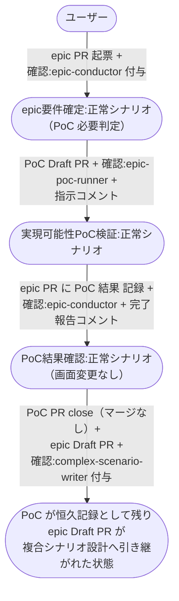

# PoC判定からepic起動まで

epic の成立が未検証の技術機構に依存すると判定されたとき、epic-conductor が PoC を発注し、epic-poc-runner の検証結果を確認してから epic Draft PR を作るまでの複合ユースケース。

**E2E テストの位置付け:** PoC PR 上で検証コードの実装と実行が走る。
PoC PR がマージされずに close され、恒久記録として残ることの確認を含む。

- 対応テストファイル: `tests/e2e/複合ユースケース/test_PoC判定からepic起動まで.py`

## 正常シナリオ

### セットアップ

| セットアップ | 説明 | 補足 |
| --- | --- | --- |
| Mock | なし（実環境で実行） | - |
| sandbox リポ存在 | `shuhei1101/ai-monitor-e2e` が存在 | Pages 有効 |
| ai-monitor プラグイン | marketplace 経由でインストール済みかつ最新版に更新済み | モニターが tmux 内で `claude` を起動するのが前提 |
| ラベル定義 | `AI_MONITOR_LABEL_*` 全て作成済み | - |
| epic PR | `layer:epic` + `確認:epic-conductor` 付きで存在 | 親 intake Issue と 紐づく Issue の記載済み・本文は空 |
| epic PR の題材 | 成立条件が実測でしか決まらない機構を含む題材で書く | PoC 必要判定へ決定的に誘導 |
| ユーザー回答（要件確定） | epic の応答ループで PoC 必要・画面変更なしと回答する | 分岐を決定的に誘発 |
| ユーザー回答（検証構成） | PoC PR の方針固めの応答ループで検証構成を修正なしで確定する | - |
| ユーザー回答（検証結果） | 追加検証を求めず、結果に疑問なしとして承認する | 正常シナリオへ決定的に誘導 |
| ai-monitor 起動 | モニターが sandbox を polling 中 | - |
| ユーザーログイン | write 権限あり | - |

### フロー

### 期待値

- epic PR 本文に `## PoC 結果`（検証構成 / 成功条件 / 結果 / PoC PR リンク）が記録されている
- PoC PR が closed かつ未マージで、PoC のリモートブランチと worktree が削除済み
- PoC PR は 1 件のまま増えていない
- epic Draft PR（base=master・本文は `## 紐づく Issue` のみ）が作成され、`確認:complex-scenario-writer` が付与されている
- epic PR の番号が epic-conductor セッションの監視面（モニターの台帳）に登録され、PoC PR の番号は外れている
- PoC の発注と結果確認を通して epic-conductor の tmux セッションが 1 本のまま（同一セッションが復帰して結果を確認している）
- epic PR の `確認:*` が除去され、自分宛コメントが全て Resolve 済み

## 異常シナリオ

なし
