# エスカレーションのepicレベル解決

subsystem・story のどちらでも解けない論点が epic-conductor まで上がり、epic 要件の変更で解決すると決まって、complex-scenario-writer の修正を経て story → subsystem と決定が降り、設計が再開するまでの複合ユースケース。
エスカレーションが終端まで上がって折り返し、通常の複合シナリオ設計フローに乗ることを確認する。

E2E テストの位置付け: 指揮系統の全段を往復する最長経路で、要件変更が本文・複合シナリオ・下位の設計へ一貫して反映されることの確認。

- 対応テストファイル: `tests/e2e/複合ユースケース/test_エスカレーションのepicレベル解決.py`

## 正常シナリオ

### セットアップ

| セットアップ | 説明 | 補足 |
| --- | --- | --- |
| Mock | なし（実環境で実行） | - |
| sandbox リポ状態 | subsystem PR に `確認:architect` 付与済み・`## タスク一覧` 承認済み | SS設計 の途中 |
| 論点の埋込 | epic の横断要件が外部制約と両立しない状況を仕込む（複数 UC が共有する要件が実現不能） | story レベルでも解決できない論点を誘発 |
| epic PR | 複合 UC シナリオ確定済み・open | 修正対象 |
| ai-monitor 起動 | モニターが polling 中 | - |
| ユーザー役 | 各段でのエスカレーション指示と、epic レベルの解決案の選択を pytest が実施 | 各段で `議論中` 除去 + assignee 外し |

### フロー

```mermaid
flowchart TD
  A0([architect]) -->|subsystem では解決できない論点を検知・<br>確認:architect 除去 +<br>確認:subsystem-conductor +<br>エスカレーション報告| UC1

  subgraph FOCUS1["検証対象 1: 終端までの遡上"]
    UC1([エスカレーション対応:正常シナリオ<br>（方針確認）]) -->|ユーザーが上位中継を選択| UC2([エスカレーション対応:正常シナリオ<br>（上位への中継）])
    UC2 -->|親 story Issue に<br>確認:story-conductor +<br>中継コメント| UC3([エスカレーション対応:正常シナリオ<br>（方針確認）])
    UC3 -->|ユーザーが上位中継を選択| UC4([エスカレーション対応:正常シナリオ<br>（上位への中継）])
    UC4 -->|親 epic Issue に<br>確認:epic-conductor +<br>中継コメント| UC5([エスカレーション対応:正常シナリオ<br>（方針確認）])
  end

  subgraph FOCUS2["検証対象 2: epic の決定 → 複合シナリオ修正 → 下位への伝播"]
    UC5 -->|epic レベルの選択肢提示 + 議論中 →<br>ユーザーが要件変更を選択| UC6([エスカレーション対応:正常シナリオ<br>（シナリオ修正を伴う解決）])
    UC6 -->|epic 本文更新 + epic PR に<br>確認:complex-scenario-writer +<br>修正指示コメント| UC7([複合シナリオ設計:正常シナリオ<br>（エスカレーション由来のシナリオ修正）])
    UC7 -->|シナリオ修正 commit +<br>確認:epic-conductor + 完了報告| UC8([エスカレーション対応:正常シナリオ<br>（シナリオ修正完了後の決定通知）])
    UC8 -->|story Issue に<br>確認:story-conductor +<br>決定通知コメント| UC9([エスカレーション対応:正常シナリオ<br>（上位の決定の受領）])
    UC9 -->|subsystem Issue に<br>確認:subsystem-conductor +<br>決定通知コメント| UC10([エスカレーション対応:正常シナリオ<br>（上位の決定の受領）])
    UC10 -->|subsystem PR に 確認:architect +<br>再開指示コメント| UC11([SS設計:正常シナリオ])
  end

  UC11 -->|設計 Wiki 確定 + タスク一覧チェック +<br>確認:tester 付与| DONE([subsystem PR: 確認:tester 付与済み])

  click UC1 "../単一ユースケース/エスカレーション対応.md#正常シナリオ方針確認"
  click UC2 "../単一ユースケース/エスカレーション対応.md#正常シナリオ上位への中継"
  click UC3 "../単一ユースケース/エスカレーション対応.md#正常シナリオ方針確認"
  click UC4 "../単一ユースケース/エスカレーション対応.md#正常シナリオ上位への中継"
  click UC5 "../単一ユースケース/エスカレーション対応.md#正常シナリオ方針確認"
  click UC6 "../単一ユースケース/エスカレーション対応.md#正常シナリオシナリオ修正を伴う解決"
  click UC7 "../単一ユースケース/複合シナリオ設計.md#正常シナリオエスカレーション由来のシナリオ修正"
  click UC8 "../単一ユースケース/エスカレーション対応.md#正常シナリオシナリオ修正完了後の決定通知"
  click UC9 "../単一ユースケース/エスカレーション対応.md#正常シナリオ上位の決定の受領"
  click UC10 "../単一ユースケース/エスカレーション対応.md#正常シナリオ上位の決定の受領"
  click UC11 "../単一ユースケース/SS設計.md#正常シナリオ"
```

### 期待値

- epic Issue 本文の `## 横断要件` が決定内容で更新されている
- 修正後の複合 UC シナリオの commit が epic ブランチに積まれている
- 決定した方針に沿った設計 Wiki の commit が subsystem ブランチに積まれている
- 各段のエスカレーション関連コメント（報告 / 中継 / 決定通知）が全て Resolve 済み
- subsystem PR に `確認:tester` が付与され、エスカレーションで使った `確認:*`（epic Issue の `確認:epic-conductor` / epic PR の `確認:complex-scenario-writer` / subsystem Issue の `確認:subsystem-conductor`）がどこにも残っていない（設計再開後の通常フローが付ける確認ラベルは対象外）
- 全 3 段の往復（上り 2 回・下り 2 回）でラベル遷移が dead lock していない

## 異常シナリオ

なし
