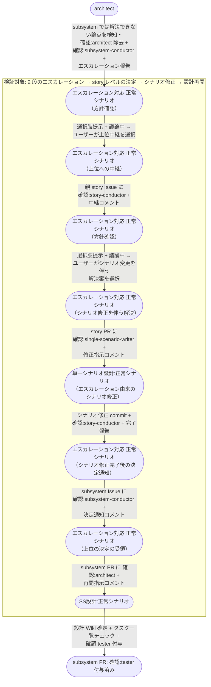

# エスカレーションのstoryレベル解決

subsystem レイヤーで解けない論点が story-conductor まで上がり、単一 UC シナリオの見直しで解決すると決まって、single-scenario-writer の修正を経て subsystem 側の設計が再開するまでの複合ユースケース。

E2E テストの位置付け: 決定が設計成果物の修正を伴う場合に、scenario-writer のシナリオ修正を経てから下位へ降りることの確認。

- 対応テストファイル: `tests/e2e/複合ユースケース/test_エスカレーションのstoryレベル解決.py`

## 正常シナリオ

### セットアップ

| セットアップ | 説明 | 補足 |
| --- | --- | --- |
| Mock | なし（実環境で実行） | - |
| sandbox リポ状態 | subsystem PR に `確認:architect` 付与済み・`## タスク一覧` 承認済み | SS設計 の途中 |
| 論点の埋込 | 単一 UC シナリオの前提が subsystem では満たせない状況を仕込む（シナリオが要求する同期処理を外部制約で実現できない） | subsystem では解決できない論点を誘発 |
| story PR | 単一 UC シナリオ確定済み・open | 修正対象 |
| ai-monitor 起動 | モニターが polling 中 | - |
| ユーザー役 | エスカレーションの指示、subsystem での中継選択、story レベルの解決案の選択を pytest が実施 | 各段で `議論中` 除去 + assignee 外し |

### フロー

### 期待値

- 修正後の単一 UC シナリオの commit が story ブランチに積まれている
- story Issue 本文の `## ユースケース要件` が決定内容で更新されている
- 決定した方針に沿った設計 Wiki の commit が subsystem ブランチに積まれている
- epic Issue へのラベル付与・コメント投稿が一切発生していない（2 段で折り返している）
- 各段のエスカレーション関連コメントが全て Resolve 済み
- subsystem PR に `確認:tester` が付与され、エスカレーションで使った `確認:*`（story PR の `確認:single-scenario-writer` / subsystem Issue の `確認:subsystem-conductor`）がどこにも残っていない（設計再開後の通常フローが付ける確認ラベルは対象外）

## 異常シナリオ

なし
