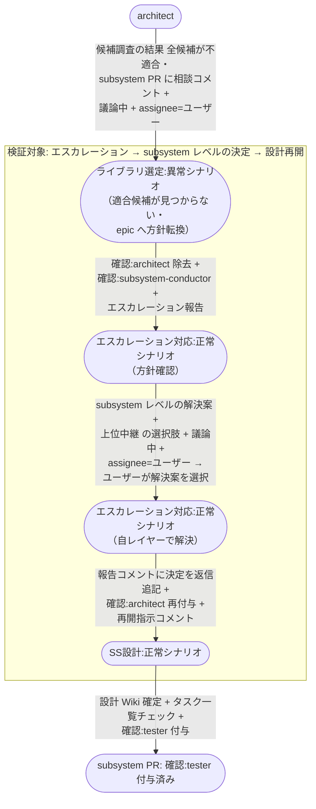

# エスカレーションのsubsystem内解決

architect が subsystem レイヤーで解けない論点を上げ、subsystem-conductor が自レイヤーの解決案をユーザー確認のうえ確定し、architect が設計を再開するまでの複合ユースケース。
エスカレーションが 1 段だけで折り返し、通常の SS設計 フローに戻ることを確認する。

E2E テストの位置付け: エスカレーションが上位に上がりきらずに解決するケースで、確認ラベルの往復が dead lock せず設計工程に復帰することの確認。

- 対応テストファイル: `tests/e2e/複合ユースケース/test_エスカレーションのsubsystem内解決.py`

## 正常シナリオ

### セットアップ

| セットアップ | 説明 | 補足 |
| --- | --- | --- |
| Mock | なし（実環境で実行） | - |
| sandbox リポ状態 | subsystem PR に `確認:architect` 付与済み・`## タスク一覧` 承認済み | SS設計 の途中 |
| ライブラリ選定論点 | 要件を満たす候補が存在しない状況を仕込む（ライセンス不適合の候補のみ） | エスカレーションを誘発 |
| ai-monitor 起動 | モニターが polling 中 | - |
| ユーザー役 | エスカレーションの指示（`議論中` 除去 + assignee 外し）と、subsystem レベルの解決案の選択を pytest が実施 | - |

### フロー

### 期待値

- architect のエスカレーション報告コメントのスレッドに subsystem-conductor の決定内容が返信追記され、Resolve 済み
- 決定した方針に沿った設計 Wiki の commit が subsystem ブランチに積まれている
- 親 story Issue / epic Issue へのラベル付与・コメント投稿が一切発生していない（1 段で折り返している）
- subsystem PR に `確認:tester` が付与され、`確認:architect` / `確認:subsystem-conductor` がどちらも残っていない
- 循環経路（エスカレーション → 方針確認 → 決定 → 設計再開）の全ラベル遷移が完了している

## 異常シナリオ

なし
