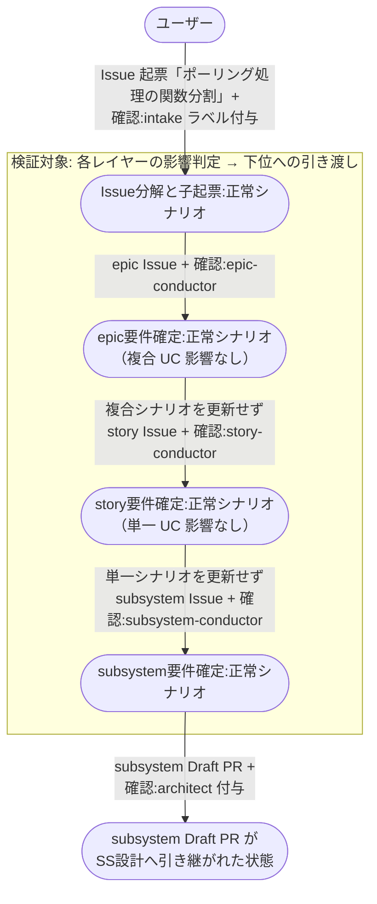
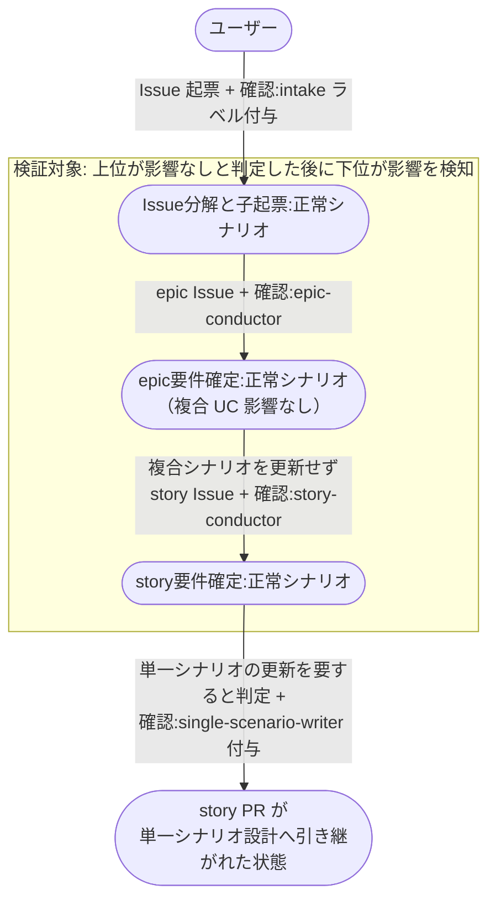

# シナリオ影響なしのレイヤー通過

シナリオに影響しない修正（内部リファクタ・typo・ログ追加 等）でも epic から起票し、各レイヤーが自分の担当シナリオへの影響を判定して下位へ渡し、subsystem へ届くまでの複合ユースケース。

全ての Issue は epic から始める。
「複合ユースケースに影響するか」は epic-conductor が、「単一ユースケースに影響するか」は story-conductor が判定する担当で、レイヤーを飛ばすとこの判定が行われないまま実装に入ることになるため。
影響しないと判定したレイヤーは、自分のシナリオを更新せずに下位レイヤーを起票して渡す。

**E2E テストの位置付け:** 影響なしと判定し続ける経路が最短で通ることを見る。
シナリオ設計・モック・統合テストの各工程が飛ばされることが観測点になる。

- 対応テストファイル: `tests/e2e/複合ユースケース/test_シナリオ影響なしのレイヤー通過.py`

## 正常シナリオ

### セットアップ

| セットアップ | 説明 | 補足 |
| --- | --- | --- |
| Mock | なし（実環境で実行） | - |
| sandbox リポ存在 | `shuhei1101/ai-monitor-e2e` が存在 | Pages 有効 |
| ai-monitor プラグイン | marketplace 経由でインストール済みかつ最新版に更新済み | モニターが tmux 内で `claude` を起動するのが前提 |
| ラベル定義 | `AI_MONITOR_LABEL_*` 全て作成済み | - |
| intake Issue | ユーザー起票の Issue に `確認:intake-issue-triager` 付与済み | 本文は 1 モジュール内のリファクタで書く |
| 既存の設計書 | 対象モジュールのシナリオ・インターフェース定義・モジュール構成が作成済み | 影響判定の材料になる |
| ユーザー回答（分解案） | intake の分解案を修正なしで承認する | epic 1 件に決定的に誘導 |
| ユーザー回答（epic 要件確定） | 複合ユースケースへの影響なしと回答する | 分岐を決定的に誘発 |
| ユーザー回答（story 要件確定） | 単一ユースケースへの影響なしと回答する | 分岐を決定的に誘発 |
| ai-monitor 起動 | モニターが sandbox を polling 中 | - |
| ユーザーログイン | write 権限あり | - |

### フロー

### 期待値

- intake Issue の下に epic / story / subsystem の Issue が親子で連なっている（レイヤーを飛ばした Issue が存在しない）
- epic Issue の `## ユースケース一覧` に、複合ユースケースへの影響なしと判定した旨が記録されている
- `設計図/シナリオ/複合ユースケース/` と `設計図/シナリオ/単一ユースケース/` に commit が発生していない
- 複合シナリオ設計（complex-scenario-writer）とモック設計（mock-designer）が起動していない
- 単一シナリオ設計（single-scenario-writer）が起動していない
- subsystem Draft PR に `確認:architect` が付与され、SS設計へ引き継がれている
- 各レイヤーの Issue が open のまま残り、`確認:*` がいずれにも残っていない

## 異常シナリオ（下位レイヤーで影響を検知）

### セットアップ

| セットアップ | 説明 | 補足 |
| --- | --- | --- |
| Mock | なし（実環境で実行） | - |
| sandbox リポ存在 | `shuhei1101/ai-monitor-e2e` が存在 | Pages 有効 |
| ai-monitor プラグイン | marketplace 経由でインストール済みかつ最新版に更新済み | - |
| ラベル定義 | `AI_MONITOR_LABEL_*` 全て作成済み | - |
| intake Issue | ユーザー起票の Issue に `確認:intake-issue-triager` 付与済み | 本文は 1 モジュール内のリファクタで書く |
| ユーザー回答（epic 要件確定） | 複合ユースケースへの影響なしと回答する | epic は影響なしで通す |
| ユーザー回答（story 要件確定） | 単一ユースケースの挙動が変わると回答する | 下位で影響が見つかる状況を決定的に誘発 |
| ai-monitor 起動 | モニターが sandbox を polling 中 | - |
| ユーザーログイン | write 権限あり | - |

### フロー

### 期待値

- story Issue に単一ユースケースの更新が必要と判定した旨が記録されている
- story PR に `確認:single-scenario-writer` が付与されている
- 上位の epic Issue へ差し戻されていない（下位で見つかった影響は下位のレイヤーで扱う）
- `設計図/シナリオ/複合ユースケース/` に commit が発生していない
