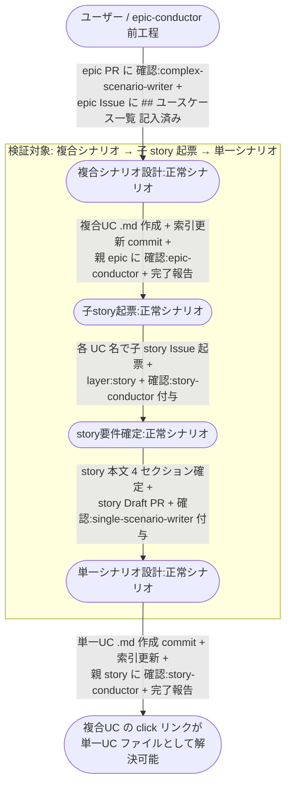

# シナリオ間のリンク成立

複合ユースケースシナリオ設計の直後から、epic-conductor が子 story を起票 → story-conductor が要件確定 → single-scenario-writer が単一ユースケースシナリオを作成するまでの連鎖で、**複合シナリオ内の中間ノードの click リンク（`../単一ユースケース/{UC名}.md#{アンカー}`）が単一UCシナリオファイルとして実在するようになる** ことを検証する複合ユースケース。

**E2E テストの位置付け:** 複合UCシナリオを検証対象とする「1 複合UC = N 単一UC」の同期が成立することの確認。
テストは 1 story = 1 単一UC で最小構成にし、複合UC の click リンクが全て解決可能になることを assert する。

## 正常シナリオ

### セットアップ

| セットアップ | 説明 | 補足 |
| --- | --- | --- |
| Mock | なし（実環境で実行） | - |
| sandbox リポ状態 | epic Issue（`## ユースケース一覧` 記入済み）+ epic Draft PR + `確認:complex-scenario-writer` 付与済み | 複合シナリオ設計 UC の入り口 |
| ai-monitor プラグイン | marketplace 経由でインストール済みかつ最新版 | tmux 内の `claude "/ai-monitor:{skill}"` が前提 |
| ai-monitor 起動 | モニターが polling 中 | - |
| ユーザー役 | 複合シナリオ / story 要件確定 / 単一シナリオの各承認（`議論中` 除去）を pytest が実施 | 分岐を決定的に誘発 |

### フロー

### 期待値

- epic ブランチに複合UC シナリオファイル `docs/wiki/設計図/シナリオ/複合ユースケース/{機能名}.md` が commit されている（複合シナリオ設計の成果物）
- epic Issue の Sub-issue として story Issue が UC 数分起票され、各 story Issue に `layer:story` + 起票直後は `確認:story-conductor` が付与されている
- 各 story ブランチに単一UC シナリオファイル `docs/wiki/設計図/シナリオ/単一ユースケース/{UC名}.md` が commit されている（単一シナリオ設計の成果物）
- 複合UC ファイルの click リンク（`../単一ユースケース/{UC名}.md`）が指すファイルが全て epic ブランチ（story ブランチをマージした後）に実在する
- 単一UC の見出しアンカーが複合UC の click リンクのフラグメントと一致している（例: `#正常シナリオ`）

## 異常シナリオ

なし
