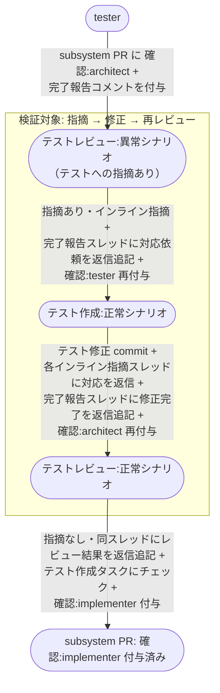
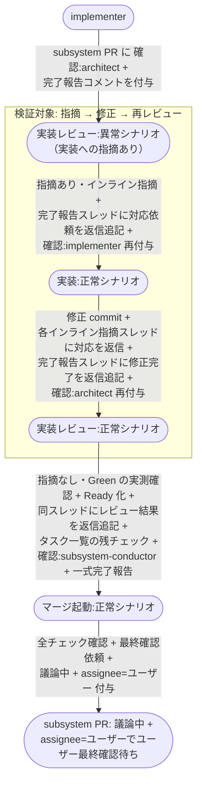
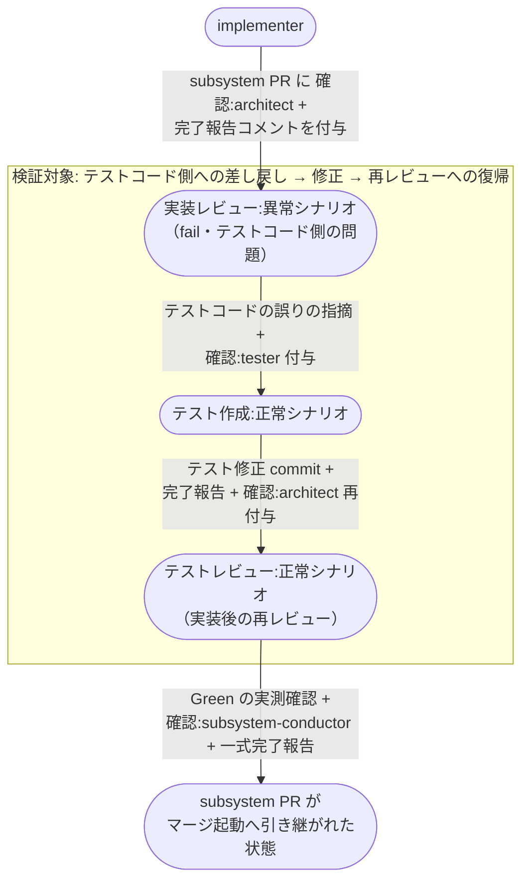

# レビュー指摘からの修正

レビュー担当（architect）の指摘で差し戻された成果物を、指揮役と worker（tester / implementer）の直接ループで修正し、再レビューが指摘なしになるまで回す複合ユースケース。
テストレビュー / 実装レビューの 2 経路を扱う。

**E2E テストの位置付け:** 指揮役と worker の AI 間ループ（指摘 → 差し戻し → 修正 → 再レビュー）がユーザー操作なしで収束することの確認。

- 対応テストファイル: `tests/e2e/複合ユースケース/test_レビュー指摘からの修正.py`

## 正常シナリオ（テストレビュー指摘からのテスト修正）

### セットアップ

| セットアップ | 説明 | 補足 |
| --- | --- | --- |
| Mock | なし（実環境で実行） | - |
| sandbox リポ状態 | subsystem PR に `確認:architect` + tester の完了報告コメント付与済み | テストレビュー開始直前の状態 |
| 指摘の埋込 | テストコードにシナリオ設計書との不整合を仕込む（異常系ケースの欠落） | 指摘 → 差し戻しを誘発 |
| ai-monitor 起動 | モニターが polling 中 | - |

### フロー

### 期待値

- 対応依頼 → 修正完了 → レビュー結果（指摘なし）の往復が tester の完了報告コメントのスレッドに記録され、Resolve 済み
- インライン指摘が subsystem PR に投稿され、各指摘スレッドに tester の対応が返信として並んでいる
- テスト修正 commit が subsystem ブランチに積まれている
- `## タスク一覧` のテスト作成タスクがチェック済み
- subsystem PR に `確認:implementer` が付与されている
- ループ中に `議論中` / `assignee=ユーザー` の設定履歴がない（ユーザー操作なしで収束）

## 正常シナリオ（実装レビュー指摘からの実装修正）

### セットアップ

| セットアップ | 説明 | 補足 |
| --- | --- | --- |
| Mock | なし（実環境で実行） | - |
| sandbox リポ状態 | subsystem PR が Draft + `確認:architect` + implementer の完了報告コメント付与済み | 実装レビュー開始直前の状態 |
| 指摘の埋込 | 実装に設計 Wiki との差異を仕込む（結合ドキュメントにないレスポンス形式） | 指摘 → 差し戻しを誘発。テストは pass する差異にする |
| ai-monitor 起動 | モニターが polling 中 | - |

### フロー

### 期待値

- 対応依頼 → 修正完了 → レビュー結果（テスト実測結果 + 指摘なし）の往復が implementer の完了報告コメントのスレッドに記録され、Resolve 済み
- インライン指摘が subsystem PR に投稿され、各指摘スレッドに implementer の対応が返信として並んでいる
- 修正 commit が subsystem ブランチに積まれ、テスト結果表が全 ✅ のまま
- `## タスク一覧` の全行がチェック済み
- subsystem PR に最終確認の依頼コメント + `議論中` + `assignee=ユーザー` が付与・投稿されている（マージはユーザー最終確認まで実行されない）

## 正常シナリオ（テストコード側の差し戻しからの復帰）

### セットアップ

| セットアップ | 説明 | 補足 |
| --- | --- | --- |
| Mock | なし（実環境で実行） | - |
| subsystem PR | 実装が commit 済みで `## タスク一覧` の実装タスクがチェック済み | 実装レビューまで進んだ状態 |
| テスト結果 | 実装レビューのテスト実行で fail する | トリアージを決定的に誘発 |
| fail の原因 | テストコード側の誤り（実装は設計どおり） | 差し戻し先を tester に決定づける |
| ai-monitor 起動 | モニターが対象リポを polling 中 | - |
| ユーザーログイン | write 権限あり | - |

### フロー

### 期待値

- tester の完了報告で戻ったターンに、初回の テストレビュー ではなく 実装後の再レビュー が選ばれている（Red を期待して失敗しない）
- 実装コードに commit が発生していない（直したのはテストコードだけ）
- `## タスク一覧` の実装タスクがチェック済みのまま変わっていない
- implementer へ再度の実装割り当てが行われていない
- subsystem PR に `確認:subsystem-conductor` と一式完了報告が付与・投稿されている
- ループ中に `議論中` / `assignee=ユーザー` の設定履歴がない（ユーザー操作なしで収束）

## 異常シナリオ

なし
