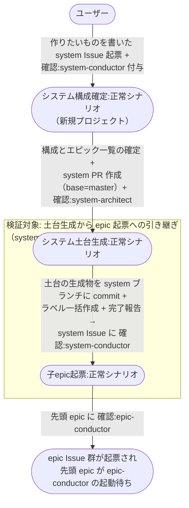

# 新規プロジェクトの立ち上げ

空のリポジトリを ai-monitor に載せ、アーキテクチャ図と設計ドキュメントの土台を作り、最初の epic 群が起票されて epic-conductor に渡るまでの複合ユースケース。

- 対応テストファイル: `tests/e2e/複合ユースケース/test_新規プロジェクトの立ち上げ.py`

## 正常シナリオ

### セットアップ

ユーザーが手作業で行うモニター側の準備までを前提として扱う。

| セットアップ | 説明 | 補足 |
| --- | --- | --- |
| Mock | なし（実環境で実行） | - |
| 対象リポジトリ | 実装コードも `docs/` も無い空のリポジトリ | GitHub リモート（`origin`）を持つ |
| settings.yaml | `projects[]` に対象プロジェクトを登録済み | `name` / `repo` / `local_path` / `wiki_base` |
| .claude/settings.json | 対象プロジェクトに `INJECT_RULES_INDEXES` を宣言済み | my-plugins と対象プロジェクト自身の `rules.yaml` |
| ラベル定義 | `確認:system-conductor` が作成済み | 最初の 1 回だけユーザーが手で作る（残りは土台生成が一括作成する） |
| ai-monitor 起動 | モニターが対象リポを polling 中 | `projects[]` 追加後に再起動済み |
| 過去テスト残骸なし | 対象リポの open Issue / open PR / worktree が全て clean | - |

### フロー

### 期待値

- system ブランチに `README.md`・`docs/rules.yaml`・`docs/wiki/` の骨格と `設計図/アーキテクチャ図.md` が反映され、全ディレクトリに `README.md` が併置されている
- `設計図/アーキテクチャ図.md` が system Issue の `## 構成要件` と対応している
- `constants.env` の全ラベルが対象リポジトリに作成されている
- system PR が open のまま残り、system ブランチが master から分岐した状態で存続している（後続 epic の base）
- master に土台の生成物が入っていない（master へのマージは最上位レイヤーである system の完了時 1 回だけ）
- エピック一覧と同数の epic Issue が system Issue に紐づいて存在し、`layer:epic` + `type:feat` が付与されている
- system Issue の `## エピック一覧` の `対応 Issue` 列が全行 `#N` に更新されている
- `確認:epic-conductor` が着手順の先頭 epic にだけ付いている
- system Issue に `確認:*` が 1 つも残っていない
- `AI_MONITOR_LABEL_PROCESSING_*` ラベルがどの Issue / PR にも残っていない

## 異常シナリオ

なし
