# 既存プロジェクトのリバースエンジニアリング

ソースコードだけが先行していて設計書が無いプロジェクトを ai-monitor に載せ、コードから設計書を起こしながらリファクタし、先頭 epic が master にマージされるまでの複合ユースケース。

各工程の入力源が「要件」ではなく「既存コード」になる点が [Issueから自動マージまで](./Issueから自動マージまで.md) との違いで、要件確定 / 設計 / テスト作成 / 実装の各 UC はリバースエンジニアリング経路のシナリオを通る。
各レイヤーは RE PR から始まる。
conductor がまず `*-reverse-engineer` に現状の設計書を起こさせて通常 PR と同じ base へマージし、その後 conductor 自身が現状の設計書だけを読んで要件を確定する。
実装コードを読むのは `*-reverse-engineer` だけに絞る。
そのため通常 PR の Files changed が「現状 → あるべき姿」の変更範囲そのものになる（`規約/ブランチ戦略.md` の「リバースエンジニアリング時のブランチ」参照）。
intake は経由しない（`docs/wiki/` が未整備の状態で始まるため）。

E2E テストの位置付け: 既存プロジェクト移行の全経路を一気通しで動作確認する最上位シナリオ。
実行時間は数十分〜数時間規模、`pytest -m e2e_full` タグ付きで手動起動のみ。

- 対応テストファイル: `tests/e2e/複合ユースケース/test_既存プロジェクトのリバースエンジニアリング.py`

## 正常シナリオ

### セットアップ

| セットアップ | 説明 | 補足 |
| --- | --- | --- |
| Mock | なし（実環境で実行） | - |
| 対象リポジトリ | 実装コードが存在し `docs/` が無い | GitHub リモート（`origin`）を持つ |
| 対象コードの規模 | 画面 1 枚 + エンドポイント数本に絞った最小構成 | 実行時間を抑えるため sandbox 側で最小化する |
| settings.yaml | `projects[]` に対象プロジェクトを登録済み | `name` / `repo` / `local_path` / `wiki_base` |
| .claude/settings.json | 対象プロジェクトに `INJECT_RULES_INDEXES` を宣言済み | my-plugins と対象プロジェクト自身の `rules.yaml` |
| ラベル定義 | `確認:system-architect` / `layer:system` / `リバースエンジニアリング` が作成済み | 最初の 1 回だけユーザーが手で作る（残りは土台生成が一括作成する） |
| ai-monitor 起動 | モニターが対象リポを polling 中 | `projects[]` 追加後に再起動済み |
| 過去テスト残骸なし | 対象リポの open Issue / open PR / worktree が全て clean | - |

### フロー

```mermaid
flowchart TD
  U0([ユーザー]) -->|移行したい旨を書いた system Issue 起票 +<br>layer:system + リバースエンジニアリング +<br>確認:system-architect の各ラベルを付与| UC1([システム構成確定:正常シナリオ<br>（既存プロジェクトの移行）])

  subgraph FOCUS["検証対象: 分析 → 土台生成 → epic 起票の引き継ぎ"]
    UC2([システム土台生成:正常シナリオ])
    UC3([子epic起票:正常シナリオ])
    UC2 -->|土台 PR を master へマージ +<br>ラベル一括作成| UC3
  end

  UC1 -->|構成とエピック一覧の確定 +<br>確認:system-architect 継続| UC2
  UC3 -->|先頭 epic に 確認:epic-conductor →<br>RE PR 作成 x2| UC4B([現状設計書の起こし:正常シナリオ<br>（現状モック + 複合 UC シナリオ）])
  UC4B -->|完了報告 → epic-conductor が<br>ユーザー確認後に RE PR を master へマージ| UC4([epic要件確定:正常シナリオ<br>（リバースエンジニアリング）])
  UC4 -->|epic Draft PR + 確認:mock-designer| UC5([全体UI設計:正常シナリオ<br>（リバースエンジニアリング）])
  UC5 -->|親 epic に 確認:epic-conductor +<br>完了報告コメント| UC6([モック完了確認:正常シナリオ])
  UC6 -->|epic PR に<br>確認:complex-scenario-writer 付与| UC7([複合シナリオ設計:正常シナリオ<br>（リバースエンジニアリング）])
  UC7 -->|親 epic に 確認:epic-conductor +<br>完了報告コメント| UC8([子story起票:正常シナリオ])
  UC8 -->|story Issue x N + 確認:story-conductor →<br>RE PR 作成| UC9B([現状設計書の起こし:正常シナリオ<br>（単一 UC シナリオ）])
  UC9B -->|完了報告 → story-conductor が<br>ユーザー確認後に RE PR を epic ブランチへマージ| UC9([story要件確定:正常シナリオ<br>（リバースエンジニアリング）])
  UC9 -->|story Draft PR +<br>確認:single-scenario-writer| UC10([単一シナリオ設計:正常シナリオ<br>（リバースエンジニアリング）])
  UC10 -->|親 story に 確認:story-conductor +<br>完了報告コメント| UC11([子subsystem起票:正常シナリオ<br>（初回・依存順の決定と先頭の起票）])
  UC11 -->|subsystem Issue x M +<br>確認:subsystem-conductor →<br>RE PR 作成| UC12B([現状設計書の起こし:正常シナリオ<br>（結合 / モジュール構成）])
  UC12B -->|完了報告 → subsystem-conductor が<br>ユーザー確認後に RE PR を story ブランチへマージ| UC12([subsystem要件確定:正常シナリオ<br>（リバースエンジニアリング）])
  UC12 -->|subsystem Draft PR + 確認:architect| UC13([SS設計:正常シナリオ<br>（リバースエンジニアリング）])
  UC13 -->|設計確定 → architect が 確認:tester 付与| UC14([テスト作成:正常シナリオ<br>（リバースエンジニアリング）])
  UC14 -->|完了報告 → architect が直接レビュー| UC15([テストレビュー:正常シナリオ])
  UC15 -->|指摘なし → architect が<br>確認:implementer 付与| UC16([実装:正常シナリオ<br>（リバースエンジニアリング）])
  UC16 -->|Ready 化 + 完了報告 →<br>architect が直接レビュー| UC17([実装レビュー:正常シナリオ])
  UC17 -->|一式完了報告 +<br>確認:subsystem-conductor| UC18([マージ起動:正常シナリオ])
  UC18 -->|最終確認依頼 + 議論中 +<br>assignee=ユーザー → ユーザー承認| UC19([マージ:正常シナリオ<br>（subsystem レベル・ユーザー承認後）])
  UC19 -->|subsystem-conductor の完了報告<br>（全 subsystem 完了）→ story-conductor が<br>確認:single-scenario-writer 付与| UC20([統合テスト指揮:正常シナリオ<br>（テスト実装の起動）])
  UC20 -->|確認:single-scenario-tester 付与| UC21([統合テスト実装と実行:正常シナリオ<br>（テスト実装）])
  UC21 -->|テスト実装完了報告 →<br>writer が直接レビュー| UC22([統合テストレビュー:正常シナリオ])
  UC22 -->|指摘なし → 確認:single-scenario-tester +<br>実行指示| UC23([統合テスト実装と実行:正常シナリオ<br>（テスト実行・全 pass）])
  UC23 -->|全 pass 報告 → writer| UC24([統合テスト指揮:正常シナリオ<br>（全 pass の完了報告）])
  UC24 -->|story-conductor へ全 pass 報告 →<br>story-conductor がマージ実行| UC25([マージ:正常シナリオ<br>（story レベル・自動）])
  UC25 -->|story-conductor の完了報告（全 story 完了）→<br>epic-conductor が epic PR に<br>確認:complex-scenario-writer 付与| UC26([統合テスト指揮:正常シナリオ<br>（テスト実装の起動）])
  UC26 -->|確認:complex-scenario-tester 付与| UC27([統合テスト実装と実行:正常シナリオ<br>（テスト実装）])
  UC27 -->|テスト実装完了報告 →<br>writer が直接レビュー| UC28([統合テストレビュー:正常シナリオ])
  UC28 -->|指摘なし → 確認:complex-scenario-tester +<br>実行指示| UC29([統合テスト実装と実行:正常シナリオ<br>（テスト実行・全 pass）])
  UC29 -->|全 pass 報告 → writer| UC30([統合テスト指揮:正常シナリオ<br>（全 pass の完了報告）])
  UC30 -->|epic-conductor へ全 pass 報告 →<br>epic-conductor がマージ実行| UC31([マージ:正常シナリオ<br>（epic レベル・終端処理）])
  UC31 -->|先頭 epic が master 反映済み| DONE([先頭 epic の設計書とリファクタが master に入り<br>2 本目以降の epic が着手待ち])

  click UC1 "../単一ユースケース/システム構成確定.md#正常シナリオ既存プロジェクトの移行"
  click UC2 "../単一ユースケース/システム土台生成.md#正常シナリオ"
  click UC3 "../単一ユースケース/子epic起票.md#正常シナリオ"
  click UC4 "../単一ユースケース/epic要件確定.md#正常シナリオリバースエンジニアリング"
  click UC4B "../単一ユースケース/現状設計書の起こし.md#正常シナリオ"
  click UC9B "../単一ユースケース/現状設計書の起こし.md#正常シナリオ"
  click UC12B "../単一ユースケース/現状設計書の起こし.md#正常シナリオ"
  click UC5 "../単一ユースケース/全体UI設計.md#正常シナリオリバースエンジニアリング"
  click UC6 "../単一ユースケース/モック完了確認.md#正常シナリオ"
  click UC7 "../単一ユースケース/複合シナリオ設計.md#正常シナリオリバースエンジニアリング"
  click UC8 "../単一ユースケース/子story起票.md#正常シナリオ"
  click UC9 "../単一ユースケース/story要件確定.md#正常シナリオリバースエンジニアリング"
  click UC10 "../単一ユースケース/単一シナリオ設計.md#正常シナリオリバースエンジニアリング"
  click UC11 "../単一ユースケース/子subsystem起票.md#正常シナリオ初回依存順の決定と先頭の起票"
  click UC12 "../単一ユースケース/subsystem要件確定.md#正常シナリオリバースエンジニアリング"
  click UC13 "../単一ユースケース/SS設計.md#正常シナリオリバースエンジニアリング"
  click UC14 "../単一ユースケース/テスト作成.md#正常シナリオリバースエンジニアリング"
  click UC15 "../単一ユースケース/テストレビュー.md#正常シナリオ"
  click UC16 "../単一ユースケース/実装.md#正常シナリオリバースエンジニアリング"
  click UC17 "../単一ユースケース/実装レビュー.md#正常シナリオ"
  click UC18 "../単一ユースケース/マージ起動.md#正常シナリオ"
  click UC19 "../単一ユースケース/マージ.md#正常シナリオsubsystem-レベルユーザー承認後"
  click UC20 "../単一ユースケース/統合テスト指揮.md#正常シナリオテスト実装の起動"
  click UC21 "../単一ユースケース/統合テスト実装と実行.md#正常シナリオテスト実装"
  click UC22 "../単一ユースケース/統合テストレビュー.md#正常シナリオ"
  click UC23 "../単一ユースケース/統合テスト実装と実行.md#正常シナリオテスト実行全-pass"
  click UC24 "../単一ユースケース/統合テスト指揮.md#正常シナリオ全-pass-の完了報告"
  click UC25 "../単一ユースケース/マージ.md#正常シナリオstory-レベル自動"
  click UC26 "../単一ユースケース/統合テスト指揮.md#正常シナリオテスト実装の起動"
  click UC27 "../単一ユースケース/統合テスト実装と実行.md#正常シナリオテスト実装"
  click UC28 "../単一ユースケース/統合テストレビュー.md#正常シナリオ"
  click UC29 "../単一ユースケース/統合テスト実装と実行.md#正常シナリオテスト実行全-pass"
  click UC30 "../単一ユースケース/統合テスト指揮.md#正常シナリオ全-pass-の完了報告"
  click UC31 "../単一ユースケース/マージ.md#正常シナリオepic-レベル終端処理"
```

### 期待値

- master に `README.md`・`docs/rules.yaml`・`docs/wiki/` の骨格と `設計図/アーキテクチャ図.md` が反映されている
- system Issue の `## エピック一覧` の `対応 Issue` 列が全行 `#N` に更新されている
- 先頭 epic の範囲について、複合ユースケースシナリオ・単一ユースケースシナリオ・結合・モジュール構成が master に存在する
- 各レイヤーの RE PR が通常 PR より先にマージされ、通常 PR の Files changed が現状からあるべき姿への変更範囲になっている
- 各設計書の対応テストファイルが実在し、実行して pass する
- 先頭 epic PR が master へ merge 済み
- 2 本目以降の epic Issue が open のまま残り、`確認:*` が付いていない（ユーザーが順次付与する）
- 全ての中間 Issue / PR が close 済み、対応ブランチが削除済み
- system Issue は open のまま残る（未完了の epic があるため）
- モニタープロセスが稼働継続している
- 先頭 epic の close に伴い、その配下の tmux セッションが全て解放済み
- `AI_MONITOR_LABEL_PROCESSING_*` ラベルがどの Issue / PR にも残っていない

## 異常シナリオ

なし
