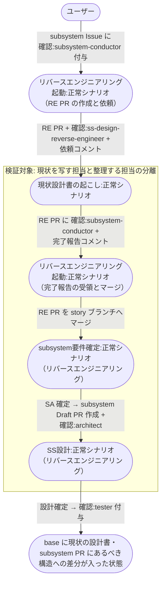

# 現状設計書からの設計整理

conductor が RE PR を起こして現状の設計書を base に入れ、設計担当がそれをあるべき構造へ整理するまでの複合ユースケース。

図と手順は subsystem レイヤーを代表とする。
epic / story / system レイヤーも登場人物と成果物が違うだけで同型（読み替えは [リバースエンジニアリング起動](../単一ユースケース/リバースエンジニアリング起動.md) のレイヤー別対応表）。

- 対応テストファイル: `tests/e2e/複合ユースケース/test_現状設計書からの設計整理.py`

## 正常シナリオ

### セットアップ

| セットアップ | 説明 | 補足 |
| --- | --- | --- |
| Mock | なし（実環境で実行） | - |
| `リバースエンジニアリング` ラベル | subsystem Issue に付与済み | 本経路を通す判定材料 |
| subsystem Issue | `layer:subsystem` + `type:docs` + `scope:*` + `確認:subsystem-conductor` 付き・本文は空 | [子subsystem起票](../単一ユースケース/子subsystem起票.md) の完了状態 |
| assignee | 未設定 | エージェント起動条件 |
| 対象コード | 当該範囲が実装済みで、重複・抽象化の欠如を含む | 整理の余地を決定的に作る |
| story ブランチ | 存在し、当該範囲の設計書がまだ無い | RE PR のマージ先 |
| ai-monitor 起動 | モニターが対象リポを polling 中 | - |

### フロー

### 期待値

- RE PR が merged・RE ブランチが削除済み
- story ブランチに現状の設計書が入っている
- subsystem PR の Files changed が現状からあるべき構造への変更範囲だけになっている
- 変更内容に重複の共通化・外部依存の抽象化のいずれかが含まれている
- 各設計 Wiki の構成要素が実装の物理名と対応づいている
- `ss-design-reverse-engineer` だけが実装コードを読み、subsystem-conductor と architect は読んでいない（3 者のログで読み取り対象が分かれている）
- 現状構造とあるべき構造の差分が提案コメントに一覧化され、リファクタ範囲がユーザーと合意されている
- subsystem PR に `確認:tester` が付与されている
- `AI_MONITOR_LABEL_PROCESSING_*` ラベルがどの Issue / PR にも残っていない

## 異常シナリオ

なし
