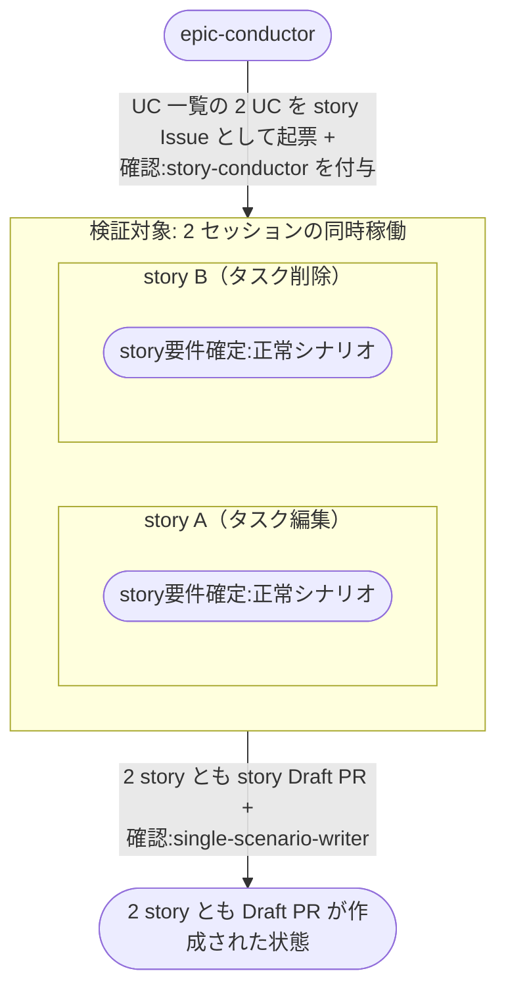

# 複数storyの並列進行

衝突面が重ならない 2 つの story を同時に起票し、2 つの story-conductor セッションが並行に要件確定を進めて、どちらも story Draft PR まで到達する複合ユースケース。

エージェントセッションは常に複数が同時に動く。
MCP サーバーは全セッションの呼び出しを 1 プロセスで受け、セッション台帳も 1 インスタンスを共有するので、同時稼働そのものが工程の前提になる。
本シナリオは、その前提が実環境で成り立つこと（片方の待ち時間でもう片方が止まらないこと）を最小の工程数で確かめる。
呼び出し単位の並行性は [同時呼び出し](../../バックエンド結合/同時呼び出し.py.md) が結合レベルで担保する。

- 対応テストファイル: `tests/e2e/複合ユースケース/test_複数storyの並列進行.py`

## 正常シナリオ

### セットアップ

| セットアップ | 説明 | 補足 |
| --- | --- | --- |
| Mock | なし（実環境で実行） | - |
| epic Issue | ユースケース一覧に 2 UC を記入済み | 衝突面が重ならない 2 UC |
| epic PR | epic ブランチの Draft PR | story PR の base |
| story Issue | 本文空 + `確認:story-conductor` の Issue を 2 件、同じ epic の Sub-issue として同時に作成 | 2 セッションの同時起動を誘発 |

### フロー

### 期待値

- 2 つの story がどちらもユーザー確認の待機（`議論中` + `assignee=ユーザー`）に到達している
- セッション台帳に story-conductor のセッションが 2 件並んでいる（同時稼働）
- 2 つの story とも本文に 4 セクションが揃い、背景に親 epic の番号と対応 UC 名が入っている
- 2 つの story がそれぞれ別の Draft PR を持ち、base が epic ブランチで `確認:single-scenario-writer` が付いている

## 異常シナリオ

なし
