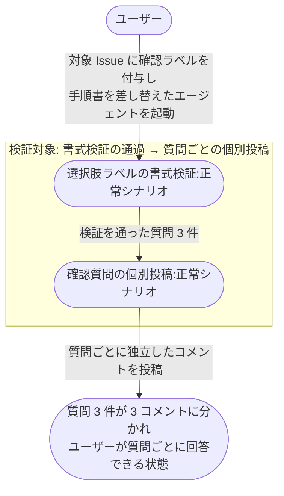
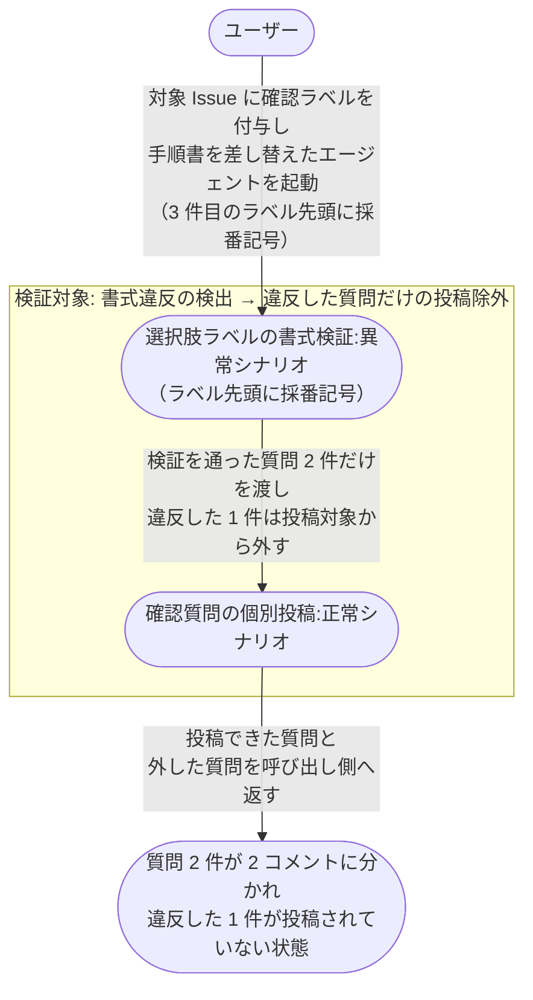

# 選択肢の書式検証から確認質問の投稿まで

エージェントが確認質問を複数まとめて投げたとき、選択肢ラベルの書式検証を通った質問だけが 1 質問 = 1 コメントとして投稿され、ユーザーが質問ごとに回答できる状態になるまでの複合ユースケース。

**E2E テストの位置付け:** 書式検証と個別投稿は 1 回の呼び出しの中で連鎖するため、検証を通らなかった質問だけが投稿から外れるかは 2 UC をまたいで初めて観測できる。
確認するのは 2 UC のつなぎ目までで、コメント本文の組み立て内容そのものは結合ドキュメント側で見る。

- 対応テストファイル: `tests/e2e/複合ユースケース/test_選択肢の書式検証から確認質問の投稿まで.py`

## 正常シナリオ

### セットアップ

| セットアップ | 説明 | 補足 |
| --- | --- | --- |
| Mock | 対象エージェントに注入するフェーズ手順書を、確認質問 3 件を投げる内容に差し替え | 質問件数と選択肢ラベルを決定的に固定する |
| sandbox リポ存在 | `shuhei1101/ai-monitor-e2e` が存在 | - |
| ai-monitor プラグイン | marketplace 経由でインストール済みかつ最新版に更新済み | モニターが tmux 内でエージェントを起動するのが前提 |
| ラベル定義 | `AI_MONITOR_LABEL_*` 全て作成済み | - |
| 対象 Issue | sandbox に open の Issue が 1 件存在し、対象エージェントの確認ラベルが付与済み | コメント 0 件の状態から始める |
| 差し替え後の質問内容 | 確認質問 3 件・全質問のラベル先頭に採番記号を含まない | 検証通過を決定的に誘発 |
| 宛先 | 受信者にユーザーのログイン名を指定 | to 行の付与を観測するため |
| ai-monitor 起動 | モニターが sandbox を polling 中 | - |
| ユーザーログイン | write 権限あり | - |

### フロー

### 期待値

- 対象 Issue のコメントが質問件数と同じ 3 件増えている
- 各コメントが質問 1 件だけを含み、質問文・背景・選択肢・推奨が揃っている
- 各コメントの先頭に引用ヘッダー（送信者の from 行 + 受信者の to 行）が付いている
- 各コメントの選択肢行に採番記号が 1 つだけ付いている
- 各コメントが区切り線と空行で終わっている（ユーザーがそのまま回答を書き足せる状態）
- 各コメントの冒頭に同じ前置き文が繰り返されている

## 異常シナリオ（選択肢ラベルの先頭に採番記号を含む）

### セットアップ

| セットアップ | 説明 | 補足 |
| --- | --- | --- |
| Mock | 対象エージェントに注入するフェーズ手順書を、確認質問 3 件を投げる内容に差し替え | 質問件数と選択肢ラベルを決定的に固定する |
| sandbox リポ存在 | `shuhei1101/ai-monitor-e2e` が存在 | - |
| ai-monitor プラグイン | marketplace 経由でインストール済みかつ最新版に更新済み | モニターが tmux 内でエージェントを起動するのが前提 |
| ラベル定義 | `AI_MONITOR_LABEL_*` 全て作成済み | - |
| 対象 Issue | sandbox に open の Issue が 1 件存在し、対象エージェントの確認ラベルが付与済み | コメント 0 件の状態から始める |
| 差し替え後の質問内容 | 確認質問 3 件・3 件目の質問のラベル先頭にだけ採番記号を含める | 検証エラーを決定的に誘発 |
| 宛先 | 受信者にユーザーのログイン名を指定 | to 行の付与を観測するため |
| ai-monitor 起動 | モニターが sandbox を polling 中 | - |
| ユーザーログイン | write 権限あり | - |

### フロー

### 期待値

- 対象 Issue のコメントが 2 件だけ増えている
- 増えた 2 件が 1 件目・2 件目の質問で、3 件目の質問はどのコメントにも含まれていない
- 呼び出し側にエラーが返り、投稿から外した質問と選択肢を特定できる内容を含んでいる
