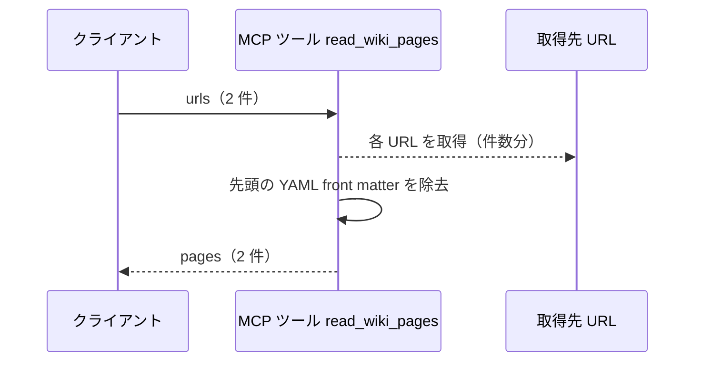
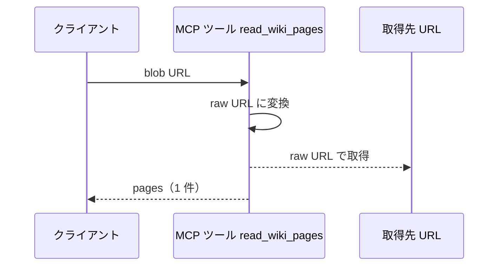
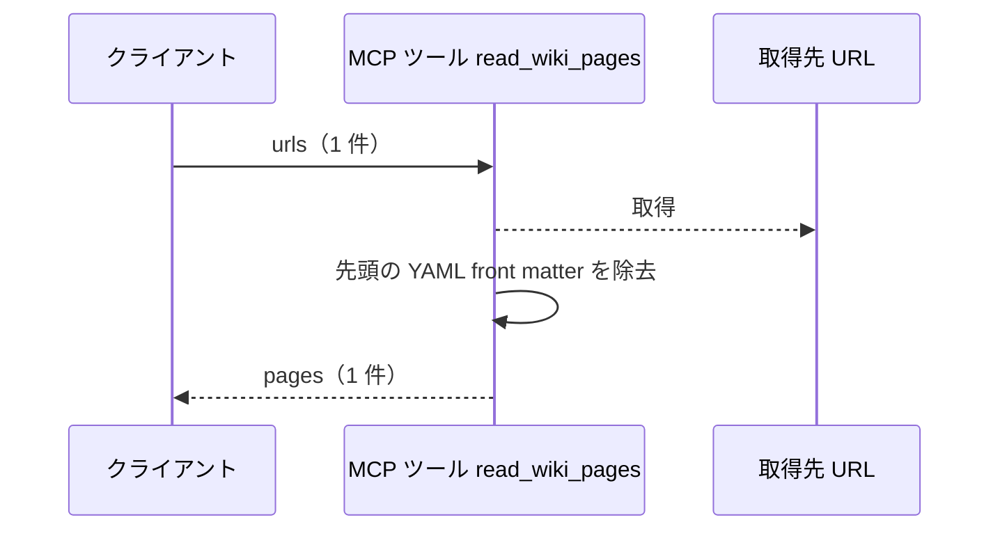
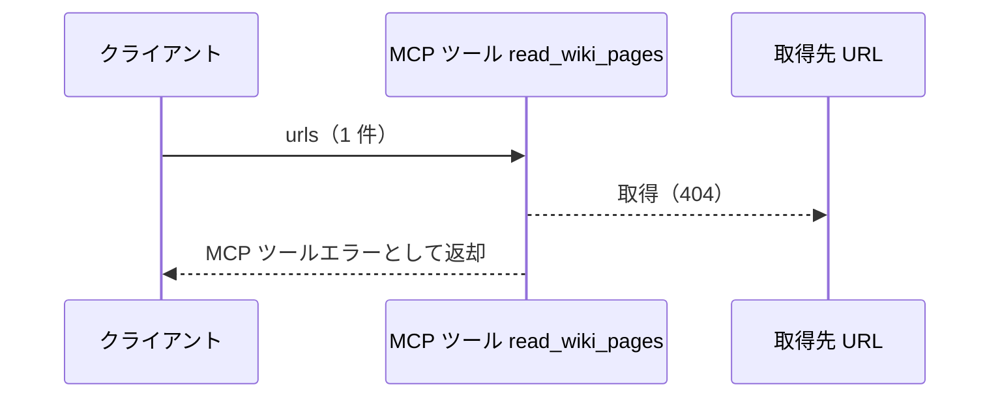

# Wikiページ取得

MCP ツール: `read_wiki_pages`

エージェントが自ターンの実行中に、事前注入されていない Wiki ページを読むための取得口。
注入済みの Wiki 索引にある raw URL、または環境変数のベース URL と相対パスを結合した URL を渡す。

同じ取得処理を持つ [URLドキュメント注入](./URLドキュメント注入.py.md) の CLI は、SKILL.md の動的コンテキスト注入（スキル読み込み時）が使う。
スキル読み込み時点ではツール一覧が未確定で MCP を呼べないため、CLI と MCP ツールの 2 つの入口を残す。

- 対応テストファイル: `tests/integration/mcp/test_read_wiki_pages.py`

## インターフェース

### リクエスト

| パラメータ | 型 | 必須 | デフォルト | 説明 | 制限 | 補足 |
| --- | --- | --- | --- | --- | --- | --- |
| `urls` | list[str] | ✅ | - | 取得対象 URL の配列 | 1 件以上・公開 URL であること | GitHub blob URL は raw URL に変換して取得する |

リクエスト例:

```json
{
  "urls": [
    "https://raw.githubusercontent.com/shuhei1101/ai-monitor/master/docs/wiki/テンプレート/シナリオ.md",
    "https://raw.githubusercontent.com/shuhei1101/ai-monitor/master/docs/wiki/規約/コメント.md"
  ]
}
```

### レスポンス

| フィールド | 型 | 説明 | 制限 | 補足 |
| --- | --- | --- | --- | --- |
| `pages` | object[] | 取得したページの配列 | - | 並びは `urls` の指定順 |
| `pages[].url` | str | 実際に取得した URL | - | blob URL を渡した場合は変換後の raw URL |
| `pages[].body` | str | ページ本文 | - | 先頭の YAML front matter は除去済み |

レスポンス例:

```json
{
  "pages": [
    {
      "url": "https://raw.githubusercontent.com/shuhei1101/ai-monitor/master/docs/wiki/テンプレート/シナリオ.md",
      "body": "# ai-monitor テンプレート: シナリオ\n\nシナリオは ..."
    }
  ]
}
```

**補足:**

- 同じ URL を複数回渡した場合はその回数分の要素を返す（重複除去はしない）

## 制約

| 項目 | 制約 | 補足 |
| --- | --- | --- |
| タイムアウト | 制限なし | - |
| 対象プロジェクト | 参照しない | 取得先は引数の URL だけで決まる |
| 認可 | なし（認証情報を付けない） | 対象は公開 URL のみ |
| フォールバック | なし（1 件でも取得に失敗したらツールエラー） | 注入欠落に気づけるようにする |

## フロー一覧

| 分類 | フロー名 | 概要 | 補足 |
| --- | --- | --- | --- |
| 正常 | 正常系 | 複数 URL の取得 → 本文配列で返却 | - |
| 正常 | 正常系（blob URL） | GitHub blob URL を raw URL に変換して取得 | - |
| 正常 | 正常系（front matter あり） | 本文先頭の YAML front matter を除去して返却 | - |
| 異常 | 異常系（取得失敗） | 存在しない URL でツールエラー | - |

## 正常系

### セットアップ

| セットアップ | 説明 | 補足 |
| --- | --- | --- |
| Mock | HTTP（ページ 2 本の応答を返す） | - |

### フロー



### 期待値

- `pages` が引数順で 2 件返る
- 各要素の `url` が取得先 URL、`body` がページ本文になっている

## 正常系（blob URL）

### セットアップ

| セットアップ | 説明 | 補足 |
| --- | --- | --- |
| Mock | HTTP（raw URL でページ 1 本の応答を返す） | - |
| 入力 | `github.com/{owner}/{repo}/blob/...` 形式の URL を渡す | 変換分岐を決定的に誘発 |

### フロー



### 期待値

- raw URL（`raw.githubusercontent.com`）でリクエストされる
- `pages[0].url` が変換後の raw URL になっている

## 正常系（front matter あり）

### セットアップ

| セットアップ | 説明 | 補足 |
| --- | --- | --- |
| Mock | HTTP（先頭に YAML front matter が付いたページ 1 本の応答を返す） | - |

### フロー



### 期待値

- `pages[0].body` に YAML front matter が含まれない

## 異常系（取得失敗）

### セットアップ

| セットアップ | 説明 | 補足 |
| --- | --- | --- |
| Mock | HTTP（404 エラーを返す） | 異常を決定的に誘発 |

### フロー



### 期待値

- MCP ツールエラー（取得に失敗した URL を含む）が返る
