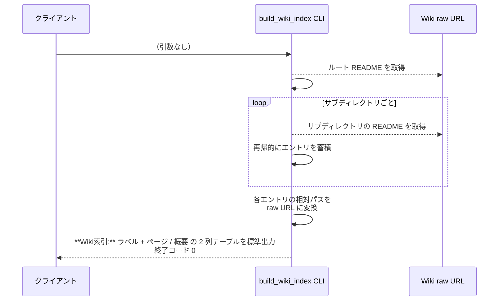
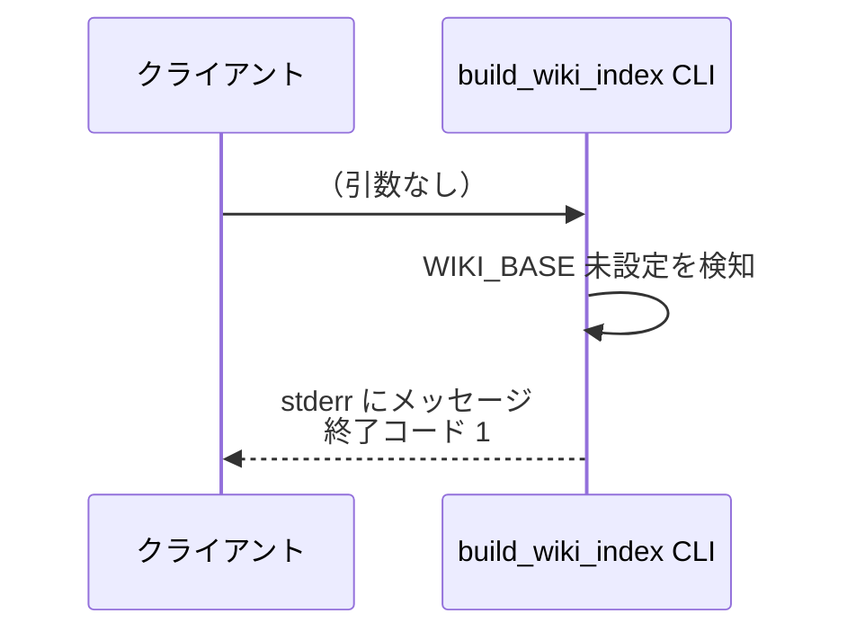
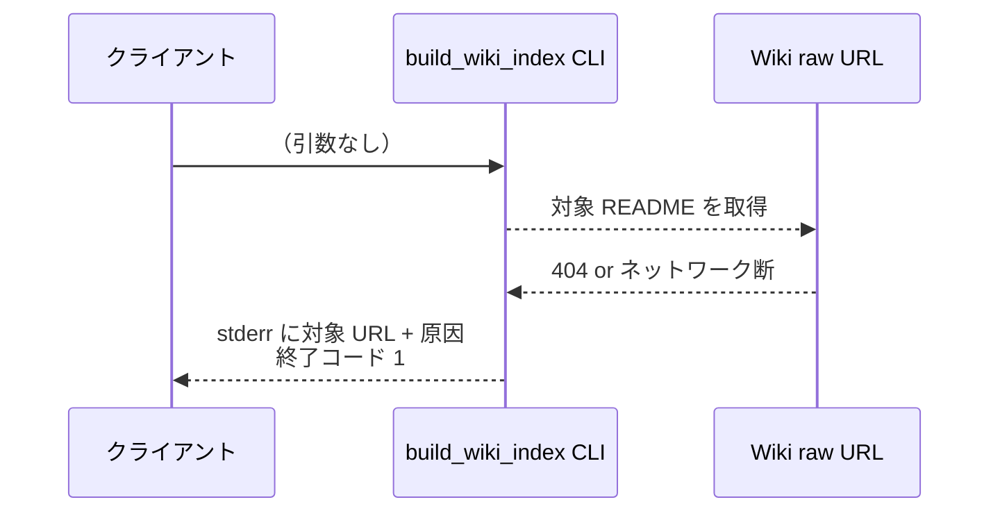
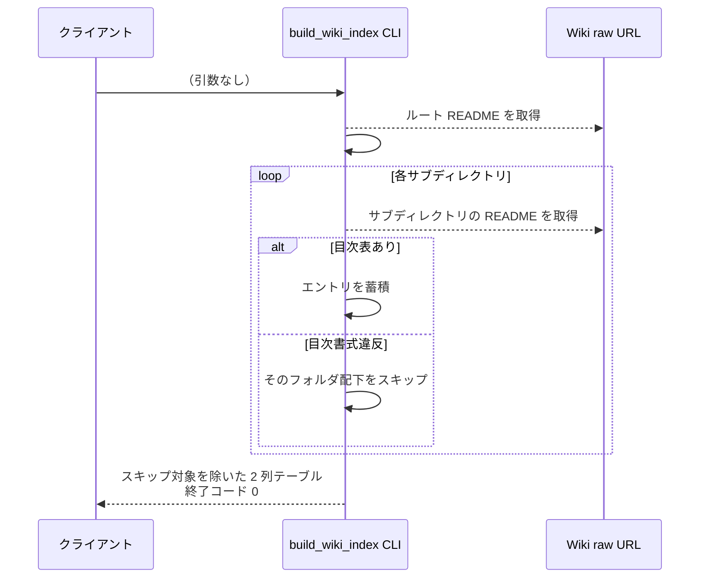

# Wiki索引注入

CLI: `python plugins/ai-monitor/inject/build_wiki_index.py`

SKILL.md の `## 参考資料` から動的コンテキスト注入で呼ばれ、監視対象プロジェクトの Wiki を再帰的に辿って README `## 目次` 表を統合したフラット索引を標準出力に展開する。
出力は `**Wiki索引:**` ラベル + ページの raw URL を「ページ」列にそのまま入れた 2 列表で、エージェントは索引だけで任意の Wiki ページを直接読める（追加の CLI や MCP 呼び出しは不要）。

- 対応テストファイル: `tests/integration/inject/test_build_wiki_index.py`

## インターフェース

### リクエスト

引数なし。

リクエスト例:

```bash
python plugins/ai-monitor/inject/build_wiki_index.py
```

### レスポンス

| フィールド | 型 | 説明 | 制限 | 補足 |
| --- | --- | --- | --- | --- |
| 標準出力 | str | `**Wiki索引:**` ラベル + 空行 + プロジェクト Wiki を統合したフラット索引を md テーブル 1 枚として出力 | - | 表の各行が Wiki ページ 1 件に対応 |

出力される表の列:

| 列 | 内容 |
| --- | --- |
| `ページ` | ページの raw URL（そのままエージェントが Bash / WebFetch で読める形式） |
| `概要` | 各 README の目次表「概要」列の値 |

レスポンス例:

``````text
**Wiki索引:**

| ページ | 概要 |
| --- | --- |
| https://raw.githubusercontent.com/{owner}/{project}/master/docs/wiki/設計図/シナリオ/README.md | 全シナリオの索引 |
| https://raw.githubusercontent.com/{owner}/{project}/master/docs/wiki/設計図/シナリオ/単一ユースケース/実装.md | 実装フェーズの正常系 + 異常系 |
| https://raw.githubusercontent.com/{owner}/{project}/master/docs/wiki/設計図/画面構成/README.md | 画面構成の索引 |
``````

### 終了コード

| 終了コード | 発生条件 | 補足 |
| --- | --- | --- |
| `0` | 正常 | - |
| `1` | `WIKI_BASE` 未設定 / README 取得失敗 | 書式違反はエラーではなくスキップ扱い（詳細は制約表） |

## 制約

| 項目 | 制約 | 補足 |
| --- | --- | --- |
| 実行環境 | 環境変数 `WIKI_BASE`（監視対象プロジェクト Wiki の raw URL ベース）が設定済みであること | SessionStart フックが settings.yaml から展開する |
| 対象ページの列挙 | プロジェクト Wiki のルート `README.md` を起点に、目次表のサブディレクトリリンクを再帰的に辿って全 README を集める | raw URL ではフォルダ一覧を取得できないため README の目次が SoT |
| README 書式 | 索引対象にしたい README には `## 目次` 見出し + 「\| ページ \| 概要 \|」表を置く（他の列があってもよい） | 規約: [Wiki管理](../../規約/Wiki管理.md) |
| 書式違反時の扱い | 該当 README は**スキップ**（そのフォルダ配下は索引に含めない）。**目次を意図的に置かないことで AI に読ませない運用**が成立する | エラーで止めない |
| 取得失敗時の扱い | ネットワーク断 / 404 は**エラー終了**（フォールバックなし） | 到達可能性の問題は明示的に失敗させる |

## フロー一覧

| 分類 | フロー名 | 概要 | 補足 |
| --- | --- | --- | --- |
| 正常 | 正常系 | プロジェクト Wiki のルート README → 目次表抽出 → サブディレクトリを再帰的に辿る → raw URL 化して 2 列表で連結出力 | - |
| 正常 | 正常系（書式違反のスキップ） | 途中の README に `## 目次` が無い or 「ページ / 概要」列が無い場合、そのフォルダ配下を索引から外して残りを出力 | 意図的な非公開運用 |
| 異常 | 異常系（WIKI_BASE 未設定） | `WIKI_BASE` 未設定でエラー終了 | - |
| 異常 | 異常系（README 取得失敗） | 対象 README が 404 / ネットワーク断でエラー終了 | - |

## 正常系

### セットアップ

| セットアップ | 説明 | 補足 |
| --- | --- | --- |
| Mock | HTTP（プロジェクト Wiki のルート README + サブディレクトリの README を返す） | - |
| 環境変数 | `WIKI_BASE` を設定 | - |

### フロー



### 期待値

- 標準出力に `**Wiki索引:**` ラベル + 空行 + 「\| ページ \| 概要 \|」の md テーブル 1 枚が出る
- 「ページ」列の値は `{WIKI_BASE}/{相対パス}` の連結で、そのまま `curl` / `WebFetch` で読める raw URL
- 行数がプロジェクト Wiki の README 目次に登録された全 md ファイル数と一致する
- 終了コードが `0`

## 異常系（WIKI_BASE 未設定）

### セットアップ

| セットアップ | 説明 | 補足 |
| --- | --- | --- |
| Mock | HTTP（呼ばれないことを検証） | - |
| 環境変数 | `WIKI_BASE` を未設定にする | 異常を決定的に誘発 |

### フロー



### 期待値

- stderr に `WIKI_BASE` 未設定のメッセージが出る
- 終了コードが `1`
- HTTP リクエストが発生していない

## 異常系（README 取得失敗）

### セットアップ

| セットアップ | 説明 | 補足 |
| --- | --- | --- |
| Mock | HTTP（対象 README を 404 / ネットワーク断で返す） | - |
| 環境変数 | `WIKI_BASE` を設定 | - |

### フロー



### 期待値

- stderr に取得失敗した URL と原因が出る
- 終了コードが `1`
- 部分的な索引テーブルは標準出力に出ない

## 正常系（書式違反のスキップ）

### セットアップ

| セットアップ | 説明 | 補足 |
| --- | --- | --- |
| Mock | HTTP（ルート README と、サブディレクトリのうち 1 つは `## 目次` が無い README を返す） | - |
| 環境変数 | `WIKI_BASE` を設定 | - |

### フロー



### 期待値

- 標準出力に `**Wiki索引:**` ラベル + 空行 + 「\| ページ \| 概要 \|」のテーブルが出る
- スキップ対象フォルダ配下のエントリは含まれない
- 他のフォルダのエントリは通常通り含まれる
- 終了コードが `0`（エラー扱いにしない）
