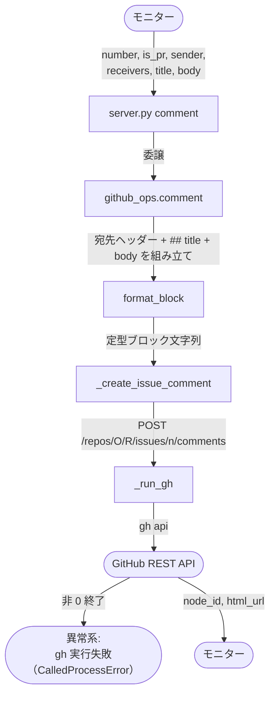
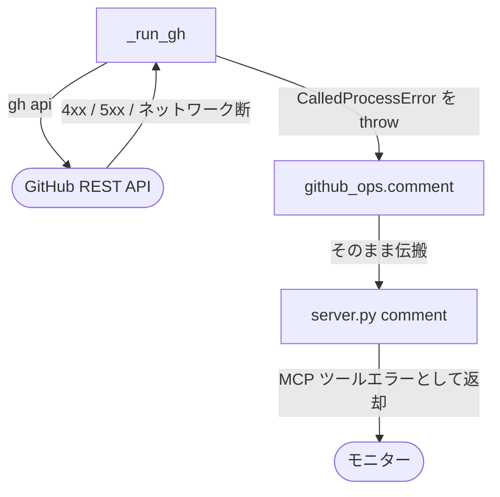

# コメント投稿

MCP ツール: `comment`

Issue / PR に定型フォーマット（`> 🤖 @sender → @receivers` + `## title` + body）でコメントを投稿する。モニターの全コメント投稿はこのツールを通り、書式が強制される。

対応テストファイル: `tests/integration/mcp/test_comment.py`（未作成）
関連実装: `mcp/server.py` / `scripts/gh/github_ops.py` / `scripts/gh/comment_formatter.py`

## 契約

### 引数

| No | 引数 | 型 | 必須 | 説明 | 補足 |
| --- | --- | --- | --- | --- | --- |
| 1 | `number` | int | ✅ | 対象の Issue / PR 番号 | - |
| 2 | `is_pr` | bool | ✅ | PR なら `True` | 投稿 API は Issue / PR 共通 |
| 3 | `sender` | str | ✅ | 送信者名（ヘッダーの `@sender`） | `@` は不要（自動付与） |
| 4 | `receivers` | list[str] | ✅ | 宛先名の配列 | `list_addressed_comments` の宛先判定に使われる |
| 5 | `title` | str | ✅ | `## タイトル` 部分の 1 行 | - |
| 6 | `body` | str | ✅ | タイトル配下の本文 | Markdown 可 |

### 戻り値

| No | フィールド | 型 | 説明 | 補足 |
| --- | --- | --- | --- | --- |
| 1 | `node_id` | str | 投稿コメントの GraphQL node_id | Resolve / 返信の対象指定に使う |
| 2 | `url` | str | コメントの html URL | - |

### 制約

| No | 種別 | 制約 | 補足 |
| --- | --- | --- | --- |
| 1 | 認可 | 全モニター利用可 | - |
| 2 | 書式 | 定型ブロック（宛先ヘッダー + `## title`）が強制される | 自由文はこのツールでは投稿できない = 宛先パースの成立を保証 |
| 3 | 冪等性 | なし（呼ぶたびに新規コメントを作成） | 追記は `reply_comment` を使う |

## フロー一覧

| No | 分類 | フロー名 | 概要 | 補足 |
| --- | --- | --- | --- | --- |
| 1 | 正常 | メイン | 定型ブロック組み立て → REST 投稿 | - |
| 2 | 異常 | gh 実行失敗（CalledProcessError） | 認証切れ / 対象不存在 / ネットワーク断 | - |

## メインフロー

### 図

### 補足

- 投稿先は PR でも `/issues/{n}/comments` エンドポイント（GitHub の仕様で共通）
- 書式の SoT は `規約/コメント.md`

## 条件分岐

なし

## 異常系

### gh 実行失敗（CalledProcessError）

#### 図

- 発生条件: gh CLI の非 0 終了（認証切れ / リポジトリ・番号の不存在 / ネットワーク断）
- 出口: MCP ツールエラー（gh の stderr を含む）。モニター側でリトライ or ユーザー相談の判断をする
