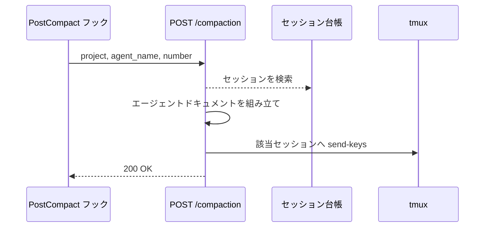
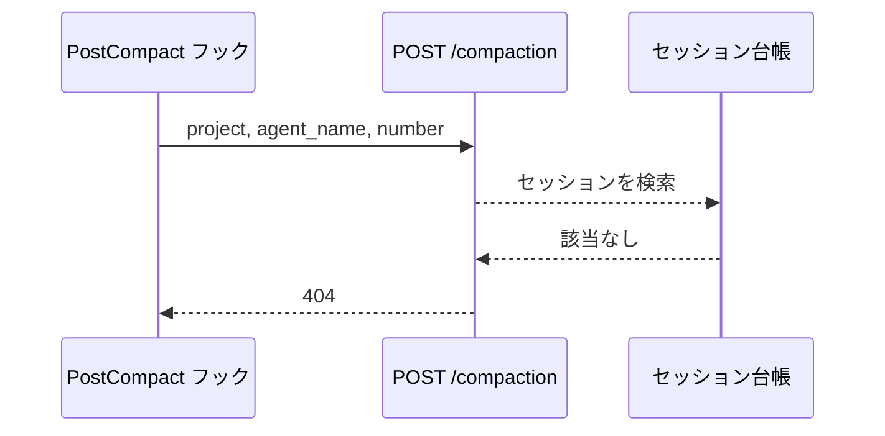

# コンパクト通知

エンドポイント: POST /compaction

エージェントのコンテキストがコンパクトされたことを受け取り、そのセッションへエージェントドキュメント（フェーズ + 参考資料 + Wiki 索引）を再送する。
コンパクトで会話履歴から消えたドキュメントを復元し、エージェントが手順を見失わないようにする。

送信元は Claude Code の `PostCompact` フック。
フックはコンパクト完了時にエージェントのプロセス内で起動し、tmux 起動時に渡された環境変数（`AI_MONITOR_PROJECT` / `AI_MONITOR_AGENT` / `AI_MONITOR_NUMBER` / `AI_MONITOR_PORT`）から自分の素性を組み立てて本エンドポイントを叩く。
フック自身は再送しない（フック出力は 10,000 文字で打ち切られるため、数万文字のドキュメントを載せられない）。

- 対応テストファイル: `tests/integration/monitor/test_コンパクト通知.py`

## インターフェース

### リクエスト

| パラメータ | 型 | 必須 | デフォルト | 説明 | 制限 | 補足 |
| --- | --- | --- | --- | --- | --- | --- |
| `project` | str | ✅ | - | 監視対象プロジェクト名 | 設定に登録済みの名前 | 環境変数 `AI_MONITOR_PROJECT` の値 |
| `agent_name` | str | ✅ | - | エージェント名 | - | 環境変数 `AI_MONITOR_AGENT` の値 |
| `number` | int | ✅ | - | セッションの主番号 | - | 環境変数 `AI_MONITOR_NUMBER` の値 |

リクエスト例:

```json
{
  "project": "sandbox",
  "agent_name": "subsystem-conductor",
  "number": 170
}
```

### レスポンス

| フィールド | 型 | 説明 | 制限 | 補足 |
| --- | --- | --- | --- | --- |
| `ok` | bool | 再送を受理したか | - | 失敗はステータスコードで表現する |

レスポンス例:

```json
{ "ok": true }
```

### ステータスコード

| ステータスコード | 発生条件 | 補足 |
| --- | --- | --- |
| `200` | 再送を受理した | - |
| `404` | 台帳に該当セッションが無い | 解放済みのセッションからの通知 |
| `422` | リクエストの型不一致 | FastAPI のバリデーション |

## 制約

| 項目 | 制約 | 補足 |
| --- | --- | --- |
| 待受 | `127.0.0.1` のみ | ポートは設定 `port` |
| ルーティング | MCP のルートマウントより先に登録する | MCP は `/` にマウントされるため、後だと本エンドポイントに到達しない |
| タイムアウト | 制限なし | フック側の既定は 600 秒 |

## フロー一覧

| 分類 | フロー名 | 概要 | 補足 |
| --- | --- | --- | --- |
| 正常 | 正常系 | 通知の受理 → 該当セッションへドキュメント再送 | - |
| 異常 | 異常系（セッション不明） | 台帳に無いセッションからの通知を拒否 | 解放済みセッションの取りこぼし |

## 正常系

### セットアップ

| セットアップ | 説明 | 補足 |
| --- | --- | --- |
| Mock | tmux を差し替え | 送信内容の検証用 |
| 台帳 | `project` / `agent_name` / `number` のセッションが登録済み | - |
| フェーズ設定 | 当該エージェントのフェーズ一覧が YAML に登録済み | 再送内容の元 |

### フロー



### 期待値

- 該当セッションへ、フェーズ + 参考資料 + Wiki 索引を含む送信が 1 回行われている
- `200` + `{"ok": true}` が返る

## 異常系（セッション不明）

### セットアップ

| セットアップ | 説明 | 補足 |
| --- | --- | --- |
| Mock | tmux を差し替え | 送信の有無の検証用 |
| 台帳 | 該当セッションが未登録 | 拒否を決定的に誘発 |

### フロー



### 期待値

- `404` が返る
- tmux への送信が発生していない
