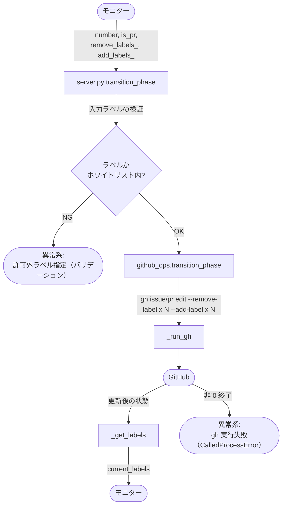
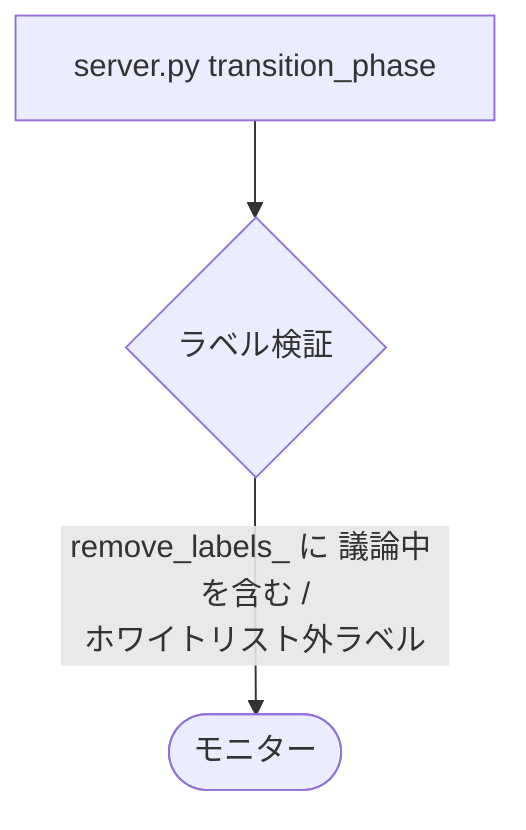
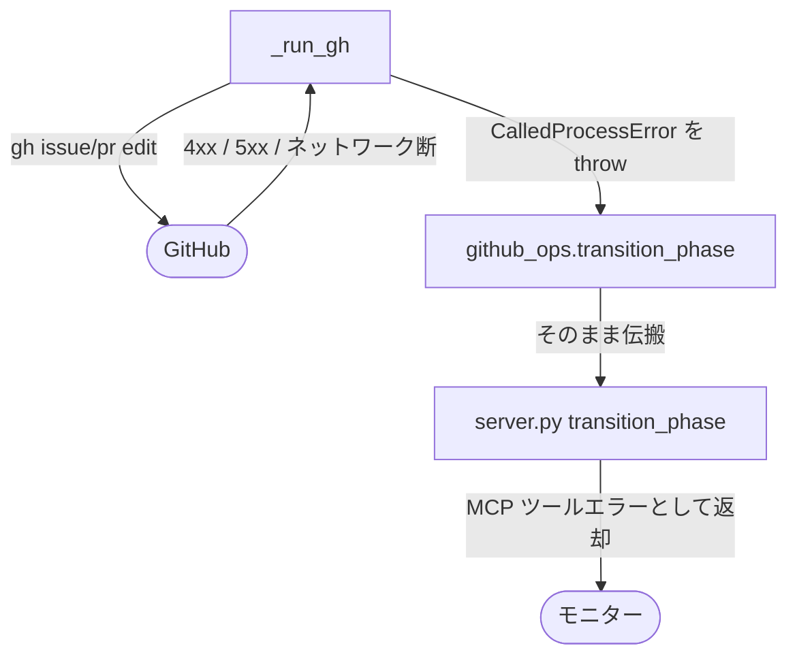

# フェーズ遷移

MCP ツール: `transition_phase`

ラベルの除去と追加を 1 API 呼び出しで行う複合操作。モニターの完了処理（`確認:{自身}` 除去 + 次の `確認:{次モニター}` 付与）で使う。

対応テストファイル: `tests/integration/mcp/test_transition_phase.py`（未作成）
関連実装: `mcp/server.py` / `scripts/gh/github_ops.py`

## 契約

### 引数

| No | 引数 | 型 | 必須 | 説明 | 補足 |
| --- | --- | --- | --- | --- | --- |
| 1 | `number` | int | ✅ | 対象の Issue / PR 番号 | - |
| 2 | `is_pr` | bool | ✅ | PR なら `True` | - |
| 3 | `remove_labels_` | list[str] | - | 除去するラベル配列 | 省略時は追加のみ |
| 4 | `add_labels_` | list[str] | - | 追加するラベル配列 | 省略時は除去のみ |

### 戻り値

| No | フィールド | 型 | 説明 | 補足 |
| --- | --- | --- | --- | --- |
| 1 | `current_labels` | list[str] | 入れ替え後のラベル一覧 | 呼び出し側が遷移結果を検証できる |

### 制約

| No | 種別 | 制約 | 補足 |
| --- | --- | --- | --- |
| 1 | 認可 | `remove_labels_` に `議論中` を指定できない（外せるのはユーザーのみ） | サーバ側バリデーションは未実装（今後の TODO「MCP 権限境界」） |
| 2 | バリデーション | 操作対象は `確認:*` / `layer:*` / `type:*` / `処理中:*` のホワイトリスト | 〃 |
| 3 | 冪等性 | あり（存在しないラベルの除去・付与済みラベルの追加は無視される） | gh CLI の挙動に準拠 |

## フロー一覧

| No | 分類 | フロー名 | 概要 | 補足 |
| --- | --- | --- | --- | --- |
| 1 | 正常 | メイン | 除去 + 追加を 1 コマンドで実行し現況を返す | - |
| 2 | 異常 | 許可外ラベル指定（バリデーション） | `議論中` の除去指定 / ホワイトリスト外 → エラー返却 | バリデーション実装後に有効 |
| 3 | 異常 | gh 実行失敗（CalledProcessError） | 認証切れ / 対象不存在 / ネットワーク断 | - |

## メインフロー

### 図

### 補足

- 除去 → 追加は gh CLI の 1 コマンドにまとめて実行される（中間状態が外部に見える時間を最小化）
- バリデーション（ホワイトリスト）はサーバ側で強制する設計（未実装。実装までは skill 側の記述が防波堤）

## 条件分岐

なし

## 異常系

### 許可外ラベル指定（バリデーション）

#### 図

- 発生条件: `remove_labels_` に `議論中` を含む、またはホワイトリスト外のラベルを指定
- 出口: バリデーションエラー（gh は実行しない）。モニターは指定を修正して再呼び出しする
- サーバ側バリデーションは未実装（今後の TODO「MCP 権限境界」で追加）

### gh 実行失敗（CalledProcessError）

#### 図

- 発生条件: gh CLI の非 0 終了（認証切れ / リポジトリ・番号の不存在 / 未定義ラベルの追加 / ネットワーク断）
- 出口: MCP ツールエラー（gh の stderr を含む）
