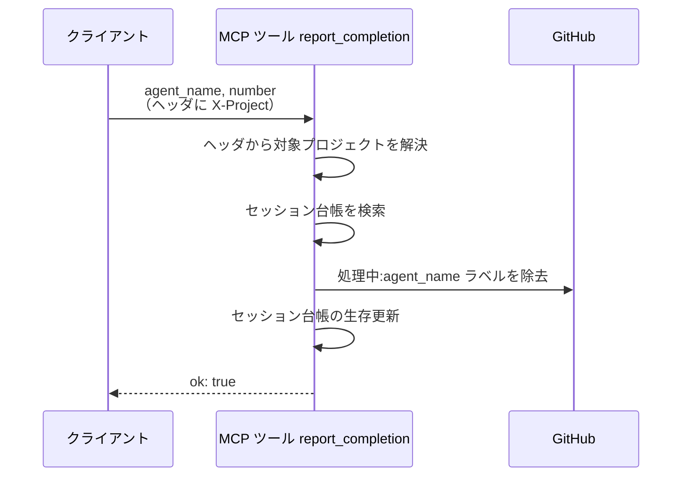
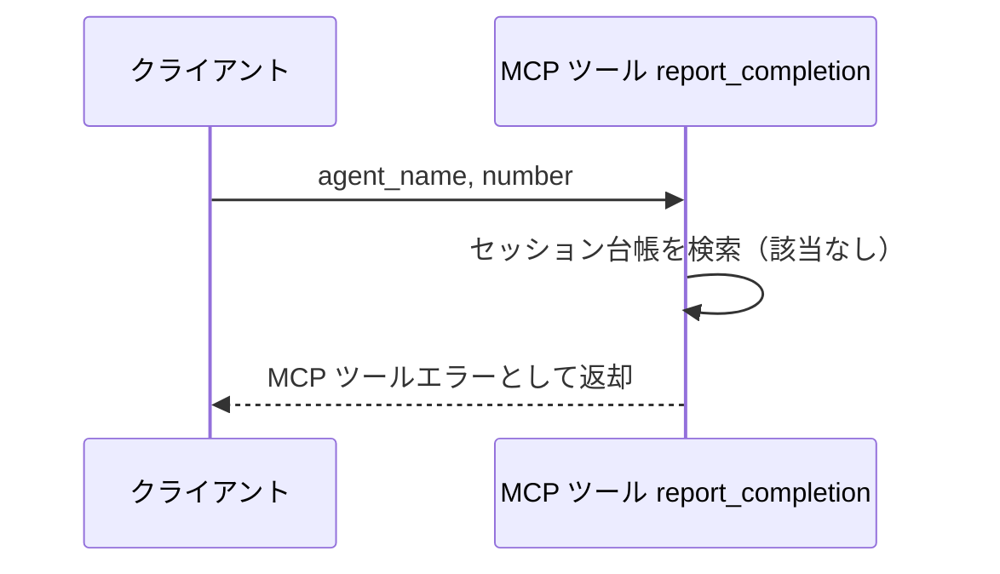
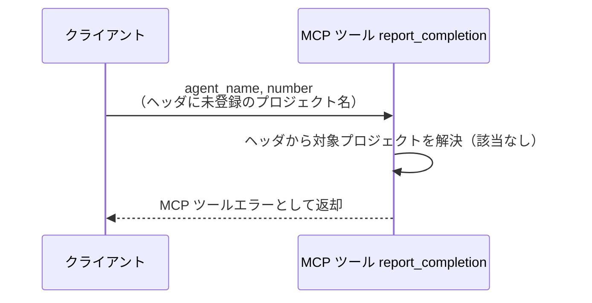

# 作業完了報告

MCP ツール: `report_completion`

エージェントが自分のターン終了（完了処理 or 待機入り）をモニターへ通知する。
MCP サーバーはモニターと同一プロセスに同居するため、ツールがセッション台帳を直接操作する。
セッション台帳の生存時刻を更新し、send-keys 時に付けた `処理中:{エージェント}` ラベルを対で外す（誰が作業中かの管理はこのラベルの対で成立する）。
報告は best-effort で、失敗してもエージェント側の完了処理は続行してよい（ワークフロー状態の SoT は GitHub 側にあり、未報告セッションはタイムアウト検知が回収する）。

- 対応テストファイル: `tests/integration/mcp/test_report_completion.py`

## インターフェース

### リクエスト

| パラメータ | 型 | 必須 | デフォルト | 説明 | 制限 | 補足 |
| --- | --- | --- | --- | --- | --- | --- |
| `agent_name` | str | ✅ | - | 報告するエージェント名 | - | セッションキーの片割れ |
| `number` | int | ✅ | - | セッションの主番号（スキル起動時に渡された Issue / PR 番号） | - | conductor は常に Issue 番号 |

リクエスト例:

```json
{
  "agent_name": "architect",
  "number": 52
}
```

### レスポンス

| フィールド | 型 | 説明 | 制限 | 補足 |
| --- | --- | --- | --- | --- |
| `ok` | bool | 台帳の更新が完了したか | - | 常に `true`（失敗はツールエラーで表現） |

レスポンス例:

```json
{
  "ok": true
}
```

**補足:**

- 同一報告の再送は no-op で `ok: true` を返す（冪等）

## 制約

| 項目 | 制約 | 補足 |
| --- | --- | --- |
| タイムアウト | 制限なし | - |
| 対象プロジェクト | モニターは単一プロセスで複数プロジェクトを監視し、セッションは `project` + `agent_name` + `number` で特定する | `project` はリクエストヘッダ `X-Project` から解決する |
| 認可 | なし | ローカルの常駐サーバを前提にする |

## フロー一覧

| 分類 | フロー名 | 概要 | 補足 |
| --- | --- | --- | --- |
| 正常 | 正常系 | プロジェクト解決 → セッション検索 → `処理中:*` ラベル除去 → 生存更新 | - |
| 異常 | 異常系（セッション不明） | 台帳に該当セッションがない | コールドスタート・台帳喪失 |
| 異常 | 異常系（プロジェクト不明） | ヘッダのプロジェクト名が設定に無い | 起動時の環境変数の設定漏れ |

## 正常系

### セットアップ

| セットアップ | 説明 | 補足 |
| --- | --- | --- |
| Mock | GitHub API を差し替え（正常応答を返す） | - |
| ヘッダ | `X-Project` に登録済みのプロジェクト名を指定 | - |
| セッション | 台帳に該当セッションが登録済みで、対象に `処理中:{agent_name}` が付与済み | send-keys 直後の状態 |

### フロー



### 期待値

- 対象の `処理中:{agent_name}` ラベルが外れている
- セッション台帳の生存時刻（`last_seen_at`）が更新されている
- 戻り値が `ok: true`

## 異常系（セッション不明）

### セットアップ

| セットアップ | 説明 | 補足 |
| --- | --- | --- |
| Mock | GitHub API を差し替え（呼ばれないことを検証する） | - |
| セッション | 台帳から該当セッションを消した状態にする | 検索失敗を決定的に誘発 |

### フロー



### 期待値

- MCP ツールエラー（プロジェクト / エージェント名 / 番号を含む）が返る
- GitHub のラベル操作が発生していない
- エージェントは警告ログのみで続行できる（ワークフロー状態は GitHub 側で完結しており、報告できなくても進行は壊れない）

## 異常系（プロジェクト不明）

### セットアップ

| セットアップ | 説明 | 補足 |
| --- | --- | --- |
| Mock | GitHub API を差し替え（呼ばれないことを検証する） | - |
| ヘッダ | `X-Project` に設定へ未登録の名前を指定 | 解決失敗を決定的に誘発 |

### フロー



### 期待値

- MCP ツールエラー（受け取った名前と設定済みの名前一覧を含む）が返る
- GitHub のラベル操作が発生していない
