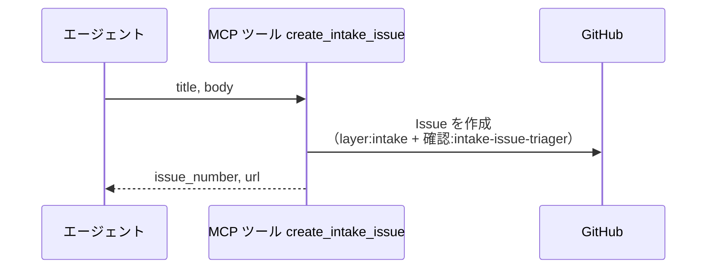
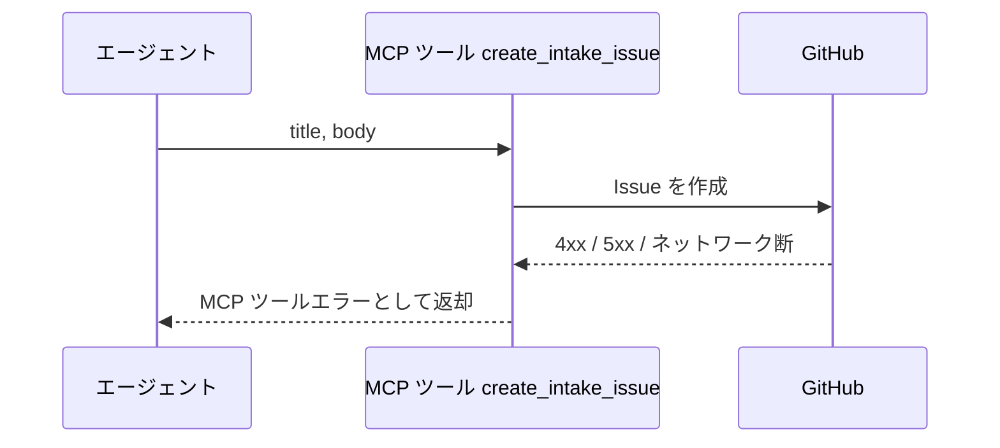

# 新規Issue起票

MCP ツール: `create_intake_issue`

親を持たない intake Issue を作成し、`layer:intake` と `確認:intake-issue-triager` を付けてワークフローの入口へ流す。

応答ループ中にユーザーから「この内容で新規 Issue を立てておいて」と依頼されたときに使う。
依頼はどのエージェントの会話でも起こりうるため、全エージェントが同じ操作で起票できるようにする。

[子Issue作成](./子Issue作成.py.md)との違いは親の有無。
フロー上の分解で生まれる子（story / subsystem 等）は親へ Sub-issue リンクするが、会話から派生した要望は既存ツリーのどこにも属さないため、intake として独立に起票して intake-issue-triager にレイヤー判定からやり直させる。

- 対応テストファイル: `tests/integration/mcp/test_create_intake_issue.py`

## インターフェース

### リクエスト

| パラメータ | 型 | 必須 | デフォルト | 説明 | 制限 | 補足 |
| --- | --- | --- | --- | --- | --- | --- |
| `title` | str | ✅ | - | Issue のタイトル | - | 依頼内容を 1 行で表したもの |
| `body` | str | ✅ | - | Issue の本文 | - | 会話内容の要約。依頼元の Issue / PR 番号を含める運用 |

リクエスト例:

```json
{
  "title": "タスク一覧に並び替えを追加したい",
  "body": "#42 の会話から派生。\n\n- 一覧をドラッグで並び替えたい\n- 並び順はユーザーごとに保持したい\n"
}
```

### レスポンス

| フィールド | 型 | 説明 | 制限 | 補足 |
| --- | --- | --- | --- | --- |
| `issue_number` | int | 作成した Issue 番号 | - | - |
| `url` | str | Issue の html URL | - | 依頼元へ返信するときのリンク |

レスポンス例:

```json
{
  "issue_number": 58,
  "url": "https://github.com/{owner}/{repo}/issues/58"
}
```

## 制約

| 項目 | 制約 | 補足 |
| --- | --- | --- |
| タイムアウト | 制限なし | - |
| 付与ラベル | `layer:intake` + `確認:intake-issue-triager` の 2 つで固定 | 呼び出し側が選べない（入口を 1 つに保つため） |
| 親リンク | 付けない | 既存ツリーに属さない要望を独立に起票する。親が要る場合は[子Issue作成](./子Issue作成.py.md)を使う |
| 対象プロジェクト | 呼び出し元セッションのプロジェクト | ヘッダから解決する |

## フロー一覧

| 分類 | フロー名 | 概要 | 補足 |
| --- | --- | --- | --- |
| 正常 | 正常系 | Issue 作成 → 固定ラベル付与 → 番号と URL の返却 | - |
| 異常 | 異常系（API エラー） | 認証切れ / ネットワーク断 | - |

## 正常系

### セットアップ

| セットアップ | 説明 | 補足 |
| --- | --- | --- |
| Mock | GitHub API を差し替え（正常応答を返す） | - |
| ラベル定義 | `layer:intake` と `確認:intake-issue-triager` がリポジトリに定義済み | - |

### フロー



### 期待値

- Issue が指定のタイトル・本文で作成されている
- `layer:intake` と `確認:intake-issue-triager` が付与されている
- 親 Issue への Sub-issue リンクが作られていない
- 戻り値の `issue_number` / `url` が作成した Issue を指している

## 異常系（API エラー）

### セットアップ

| セットアップ | 説明 | 補足 |
| --- | --- | --- |
| Mock | GitHub API を差し替え（4xx / 5xx を返す） | 異常を決定的に誘発 |

### フロー



### 期待値

- MCP ツールエラーが返る（HTTP ステータスと本文を含む）
- Issue が作成されていない
