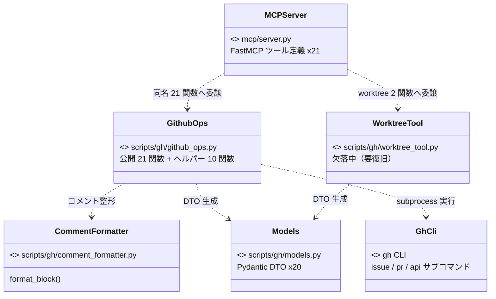

# モジュール構成: MCP

`MCP` ドメイン（モニターが使う GitHub 操作 MCP サーバーと gh 薄ラッパー）に属する構成要素詳細。

索引: [モジュール構成](./README.md)

## MCP サーバー

### 一覧

| No | ユースケース | 役割 | コンテナ | 種別 | 名前 | シグネチャ / 概要 | 補足 |
| --- | --- | --- | --- | --- | --- | --- | --- |
| 1 | 共通 | gh 実行入口 | `scripts/gh/github_ops.py` | 関数 | `_run_gh` | `(args, stdin?) => CompletedProcess`。gh CLI 呼び出しの単一入口 | 失敗時 `CalledProcessError` |
| 2 | 〃 | リポジトリ解決 | 〃 | 関数 | `_get_repo` | `() => str`。カレントリポの `owner/name` | - |
| 3 | 〃 | ログイン解決 | 〃 | 関数 | `_get_current_login` | `() => str`。認証中ユーザーのログイン名 | assignee 省略時の既定値 |
| 4 | 〃 | サブコマンド判定 | 〃 | 関数 | `_issue_or_pr` | `(is_pr) => "issue" \| "pr"` | - |
| 5 | 〃 | ラベル再取得 | 〃 | 関数 | `_get_labels` | `(number, is_pr) => list[str]` | 操作後の現況返却用 |
| 6 | 〃 | assignee 再取得 | 〃 | 関数 | `_get_assignees` | `(number, is_pr) => list[str]` | 〃 |
| 7 | 〃 | Resolve 実行 | 〃 | 関数 | `_minimize_comment` | `(node_id) => None`。GraphQL `minimizeComment` | `classifier=RESOLVED` |
| 8 | 〃 | コメント投稿実体 | 〃 | 関数 | `_create_issue_comment` | `(number, body) => CommentResult`。REST `/issues/{n}/comments` | PR も同エンドポイント |
| 9 | 〃 | コメント解析 | 〃 | 関数 | `_parse_comment_body` | `(body) => ParsedComment \| None`。先頭ブロックの宛先ヘッダーをパース | 定型外は `None` |
| 10 | 〃 | URL・番号抽出 | 〃 | 関数 | `_extract_url_and_number` | `(stdout) => (url, number)` | `gh issue/pr create` の出力用 |
| 11 | 〃 | gh ラッパー関数群 | 〃 | 関数 | （MCP ツールと同名の公開 21 関数） | MCP ツールと 1:1 で gh CLI を叩く実体 | 契約は各ツールの [バックエンド結合](../バックエンド結合/README.md) 参照 |
| 12 | 〃 | 定型ブロック組立 | `scripts/gh/comment_formatter.py` | 関数 | `format_block` | `(sender, receivers, title, body, is_reply?) => str` | 書式は `規約/コメント.md` |
| 13 | 〃 | @ 付与 | 〃 | 関数 | `_ensure_at` | `(name) => str` | - |
| 14 | 〃 | 質問 DTO | `scripts/gh/models.py` | データモデル | `Question` / `Choice` | ask_questions の質問・選択肢 | - |
| 15 | 〃 | コメント解析 DTO | 〃 | データモデル | `ParsedComment` / `AddressedComment` | 宛先ヘッダーのパース結果 | - |
| 16 | 〃 | 操作結果 DTO | 〃 | データモデル | `CommentResult` / `NodeIdResult` / `ResolveResult` / `LabelsResult` / `AssigneesResult` / `EmptyResult` / `CreatedIssueResult` / `CreatedPRResult` | 各ツールの戻り値 | - |
| 17 | 〃 | worktree 結果 DTO | 〃 | データモデル | `WorktreeCreateResult` / `WorktreeRemoveResult` | worktree 操作の戻り値 | 実装 `worktree_tool.py` は欠落中（下記補足） |
| 18 | 〃 | スナップショット DTO | 〃 | データモデル | `IssueSnapshot` / `Label` / `UserRef` / `IssueRef` / `IssueCommentEntry` / `SubIssuesSummary` | get_issue の戻り値ツリー | - |
| 19 | Issue 情報取得 | MCP ツール | `mcp/server.py` | 関数 | `get_issue` | `(number, is_pr, ...フィールドフラグ) => IssueSnapshot` | 読み取り専用 |
| 20 | コメント投稿 | 〃 | 〃 | 関数 | `comment` | `(number, is_pr, sender, receivers, title, body) => CommentResult` | - |
| 21 | 質問投稿 | 〃 | 〃 | 関数 | `ask_questions` | `(number, is_pr, sender, receivers, title, intro, questions) => CommentResult` | 選択肢 + 推奨付き |
| 22 | コメント返信 | 〃 | 〃 | 関数 | `reply_comment` | `(comment_node_id, sender, receivers, title, body) => CommentResult` | `---` 区切りで追記 |
| 23 | 原文履歴保存 | 〃 | 〃 | 関数 | `save_original_body_comment` | `(number, is_pr, original_body) => NodeIdResult` | 投稿後に即 Resolve |
| 24 | コメント一括 Resolve | 〃 | 〃 | 関数 | `resolve_comments` | `(node_ids) => ResolveResult` | - |
| 25 | 宛先コメント一覧 | 〃 | 〃 | 関数 | `list_addressed_comments` | `(number, is_pr, addressee, include_resolved?) => list[AddressedComment]` | 読み取り専用 |
| 26 | ラベル追加 | 〃 | 〃 | 関数 | `add_labels` | `(number, is_pr, labels) => LabelsResult` | 冪等 |
| 27 | ラベル除去 | 〃 | 〃 | 関数 | `remove_labels` | `(number, is_pr, labels) => LabelsResult` | `議論中` は対象外（契約） |
| 28 | フェーズ遷移 | 〃 | 〃 | 関数 | `transition_phase` | `(number, is_pr, remove_labels_, add_labels_) => LabelsResult` | ラベル一括入れ替え |
| 29 | assignee 設定 | 〃 | 〃 | 関数 | `set_assignee` | `(number, is_pr, login?) => AssigneesResult` | 省略時は認証ユーザー |
| 30 | assignee 除去 | 〃 | 〃 | 関数 | `remove_assignee` | `(number, is_pr, login?) => AssigneesResult` | 〃 |
| 31 | 本文更新 | 〃 | 〃 | 関数 | `update_body` | `(number, is_pr, body) => EmptyResult` | 完全置換 |
| 32 | タイトル更新 | 〃 | 〃 | 関数 | `update_title` | `(number, is_pr, title) => EmptyResult` | - |
| 33 | クローズ | 〃 | 〃 | 関数 | `close` | `(number, is_pr, reason?, delete_branch?) => EmptyResult` | - |
| 34 | 子 Issue 作成 | 〃 | 〃 | 関数 | `create_child_issue` | `(parent_issue_number, title, body, labels?) => CreatedIssueResult` | Sub-issue リンク付与 |
| 35 | Draft PR 作成 | 〃 | 〃 | 関数 | `create_draft_pr` | `(head_branch, base_branch, title, body) => CreatedPRResult` | Stacked PR の base 明示 |
| 36 | PR Ready 化 | 〃 | 〃 | 関数 | `mark_pr_ready` | `(pr_number) => EmptyResult` | - |
| 37 | PR マージ | 〃 | 〃 | 関数 | `merge_pr` | `(pr_number, strategy?) => EmptyResult` | 既定 squash + ブランチ削除 |
| 38 | worktree 作成 | 〃 | 〃 | 関数 | `worktree_create` | `(branch_type, title) => WorktreeCreateResult` | 実装 `worktree_tool.py` 欠落中 |
| 39 | worktree 削除 | 〃 | 〃 | 関数 | `worktree_remove` | `(branch) => WorktreeRemoveResult` | 〃 |

### 構成図

### `mcp/server.py`

FastMCP（stdio）で 21 ツールを公開するエントリポイント。各ツールは `github_ops.py` / `worktree_tool.py` の同名関数へ委譲するだけの薄い層。

#### 関数

`### 一覧` の No.19〜39（MCP ツール行）参照。各ツールの契約（引数 / 戻り値 / 制約）は [バックエンド結合](../バックエンド結合/README.md) の詳細ファイルが SoT。

#### 例外

なし（委譲のみ。例外は `github_ops.py` 側で発生する）

#### 単体テスト

なし（未作成）

#### 補足

- `ToolAnnotations` で `readOnlyHint`（get_issue / list_addressed_comments）と `destructiveHint`（remove 系 / close / merge 等）を宣言している
- `from worktree_tool import ...` しているが **`worktree_tool.py` が現在リポジトリに存在しない**（マーケットプレイス再編時の移動漏れ。復旧するまで MCP サーバーは起動時 ImportError で落ちる）

### `scripts/gh/github_ops.py`

gh CLI の薄ラッパー関数群。MCP ツールと 1:1 の公開 21 関数と、それらが共有するヘルパー 10 関数を持つ。

#### 関数

公開 21 関数は MCP ツールと同名・同契約（[バックエンド結合](../バックエンド結合/README.md) 参照）。ヘルパーは以下。

| No | 論理名 | 関数名 | 引数 | 戻り値 | 例外 | 説明 | 補足 |
| --- | --- | --- | --- | --- | --- | --- | --- |
| 1 | gh 実行入口 | `_run_gh` | `args: list[str], stdin: str \| None` | `CompletedProcess[str]` | `CalledProcessError` | `gh` を `check=True` で実行 | 全関数がここを通る |
| 2 | リポジトリ解決 | `_get_repo` | `-` | `str` | 〃 | `gh repo view` で `owner/name` 取得 | - |
| 3 | ログイン解決 | `_get_current_login` | `-` | `str` | 〃 | `gh api user` でログイン名取得 | - |
| 4 | サブコマンド判定 | `_issue_or_pr` | `is_pr: bool` | `str` | `-` | `"pr"` / `"issue"` を返す | - |
| 5 | ラベル再取得 | `_get_labels` | `number: int, is_pr: bool` | `list[str]` | `CalledProcessError` | 現在のラベル名一覧 | - |
| 6 | assignee 再取得 | `_get_assignees` | `number: int, is_pr: bool` | `list[str]` | 〃 | 現在の assignee 一覧 | - |
| 7 | Resolve 実行 | `_minimize_comment` | `node_id: str` | `None` | 〃 | GraphQL `minimizeComment` | - |
| 8 | コメント投稿実体 | `_create_issue_comment` | `number: int, body: str` | `CommentResult` | 〃 | REST でコメント投稿し `node_id` / `url` を返す | - |
| 9 | コメント解析 | `_parse_comment_body` | `body: str` | `ParsedComment \| None` | `-` | `> 🤖 @sender → @receivers` ヘッダーと `## title` を抽出 | 定型外は `None` |
| 10 | URL・番号抽出 | `_extract_url_and_number` | `stdout: str` | `tuple[str, int]` | `-` | create 系出力の最終行から URL と番号を取る | - |

#### 例外

| No | 発生関数名 | 例外名 | 発生条件 | メッセージ | 補足 |
| --- | --- | --- | --- | --- | --- |
| 1 | 全関数（`_run_gh` 経由） | `CalledProcessError` | gh CLI が非 0 で終了（認証切れ / 対象不存在 / ネットワーク断 等） | gh の stderr | MCP がツールエラーとして呼び出し元モニターに返す |

#### 単体テスト

なし（未作成）

#### 補足

- `gh auth login` 済みの環境が前提。対象リポジトリはカレントディレクトリ（worktree）から解決する
- ラベル / assignee 操作は実行後に現況を再取得して返す（呼び出し側が結果を検証できる）

### `scripts/gh/comment_formatter.py`

コメント定型フォーマットの組み立てモジュール。書式の SoT は `規約/コメント.md`。

#### 関数

| No | 論理名 | 関数名 | 引数 | 戻り値 | 例外 | 説明 | 補足 |
| --- | --- | --- | --- | --- | --- | --- | --- |
| 1 | 定型ブロック組立 | `format_block` | `sender, receivers, title, body, is_reply?` | `str` | `-` | `> 🤖 @sender → @receivers` + `## title` + body を組み立て | `is_reply=True` で先頭に `---` |
| 2 | @ 付与 | `_ensure_at` | `name: str` | `str` | `-` | 先頭に `@` がなければ付与 | - |

#### 例外

なし

#### 単体テスト

なし（未作成）

### `scripts/gh/models.py`

MCP サーバー / github_ops / worktree_tool が共有する Pydantic DTO 集約ファイル（`### 一覧` No.14〜18 参照）。

#### 関数

なし（データモデルのみ）

#### 補足

- 各 DTO のフィールド詳細は対応するツールの [バックエンド結合](../バックエンド結合/README.md) `## 契約`（引数 / 戻り値表）が消費者向けの参照先。定義の SoT は本ファイルのコード
- `IssueSnapshot` は `gh issue view --json` の camelCase フィールドを alias で受ける（`populate_by_name` 有効）

### `scripts/gh/worktree_tool.py`（欠落中・要復旧）

`server.py` が `create_worktree` / `remove_worktree` を import しているが、ファイルがリポジトリに存在しない（マーケットプレイス再編時の移動漏れ）。

#### 関数

server.py の import と `models.py` の DTO から期待されるシグネチャ:

| No | 論理名 | 関数名 | 引数 | 戻り値 | 例外 | 説明 | 補足 |
| --- | --- | --- | --- | --- | --- | --- | --- |
| 1 | worktree 作成 | `create_worktree` | `branch_type: str, title: str` | `WorktreeCreateResult` | 未定 | ブランチ `{type}/{title}` + `.claude/worktrees/` 配下に worktree 作成 | 要復旧 |
| 2 | worktree 削除 | `remove_worktree` | `branch: str` | `WorktreeRemoveResult` | 未定 | worktree とブランチを両方削除 | 〃 |
