# モジュール構成: MCP / GitHub操作

`GitHub操作` ドメイン（MCP 側）に属する構成要素詳細。
エージェントが使う GitHub 操作 MCP サーバーを扱う。

## 一覧

| ユースケース | 役割 | コンテナ | 種別 | 名前 | 概要 | 補足 |
| --- | --- | --- | --- | --- | --- | --- |
| 共通 | ツール呼び出しログ | `mcp/server.py` | 関数 | [`_log_tool_call`](#ツール呼び出しログ) | 全 MCP ツールに適用し、実行と失敗をログに出すデコレータ | [モニター連絡](./モニター連絡.py.md)のツールにも適用する |
| 共通 | クライアント生成 | `mcp/server.py` | 関数 | [`_get_client`](#クライアント生成) | 設定の `github_token` から githubkit クライアントを生成・共有 | - |
| 共通 | プロジェクト解決 | `mcp/server.py` | 関数 | [`_resolve_project`](#プロジェクト解決) | リクエストヘッダから対象プロジェクトを解決 | 対象リポジトリの出所 |
| 共通 | 例外 | `mcp/server.py` | クラス | `ProjectNotFoundError` | 対象プロジェクトを解決できない | 仕様は[プロジェクト解決](#プロジェクト解決)の例外表 |
| 共通 | 配線 | `mcp/server.py` | 関数 | [`build_mcp_app`](#アプリ組み立て) | ツールを登録した ASGI アプリを返す | モニターの FastAPI にマウントする |
| 共通 | 依存の束ね | `mcp/server.py` | 関数 | [`_bind`](#依存の束ね) | ツール関数に依存を束ね、公開シグネチャから隠す | 登録時に全ツールへ適用する |
| 共通 | スレッド実行 | `mcp/server.py` | 関数 | [`_to_thread`](#スレッド実行) | 同期のツール関数をワーカースレッドで実行する非同期関数に包む | 登録時に全ツールへ適用する |
| 共通 | ログイン解決 | `mcp/server.py` | 関数 | [`_get_current_login`](#ログイン解決) | 認証中ユーザーのログイン名を返す | assignee 操作の対象解決 |
| 共通 | ラベル再取得 | `mcp/server.py` | 関数 | [`_get_labels`](#ラベル再取得) | 操作後の現在ラベル一覧を返す | - |
| 共通 | assignee 再取得 | `mcp/server.py` | 関数 | [`_get_assignees`](#assignee-再取得) | 操作後の現在 assignee 一覧を返す | - |
| 共通 | Resolve 実行 | `mcp/server.py` | 関数 | [`_minimize_comment`](#resolve-実行) | GraphQL `minimizeComment` を実行 | `classifier=RESOLVED` |
| 共通 | Resolved 状態取得 | `mcp/server.py` | 関数 | [`_is_minimized`](#resolved-状態取得) | コメントの `isMinimized` を GraphQL で取得 | - |
| 共通 | 親PR取得 | `mcp/server.py` | 関数 | [`_fetch_parent_pr`](#親pr取得) | base ブランチを head に持つ PR を親として返す | 見つからなければ `None` |
| 共通 | コメント投稿実体 | `mcp/server.py` | 関数 | [`_create_issue_comment`](#コメント投稿実体) | REST でコメントを投稿 | PR も同エンドポイント |
| 共通 | コメント解析 | `mcp/server.py` | 関数 | [`_parse_comment_blocks`](#コメント解析) | `------` 区切りブロックの from / to と本文をパース | - |
| 共通 | 定型ブロック組立 | `mcp/server.py` | 関数 | [`_format_block`](#定型ブロック組立) | from / to ヘッダー + 本文（会話欄は末尾に区切り線）を組み立てる | 書式は `規約/コメント.md` |
| 共通 | 本文レンダリング | `mcp/server.py` | 関数 | [`_render_format`](#本文レンダリング) | `type` に応じて本文（+ 表）を組み立てる | plain / commit 表 / ページ範囲表 |
| 共通 | 区切り線判定 | `mcp/server.py` | 関数 | [`_ends_with_separator`](#区切り線判定) | 本文の末尾が `------` かを判定する | 返信時の区切り線の重複を防ぐ |
| 共通 | アット付与 | `mcp/server.py` | 関数 | [`_ensure_at`](#アット付与) | 先頭に `@` がなければ付与 | - |
| 共通 | git 実行入口 | `mcp/server.py` | 関数 | [`_run_git`](#git-実行入口) | git CLI 呼び出しの単一入口 | 失敗時 `CalledProcessError` |
| 共通 | リポジトリルート解決 | `mcp/server.py` | 関数 | [`_repo_root`](#リポジトリルート解決) | 共通 `.git` からメインリポジトリのルートを解決 | worktree 内からの呼び出しに対応 |
| 共通 | worktree パス解決 | `mcp/server.py` | 関数 | [`_worktree_path`](#worktree-パス解決) | `.claude/worktrees/` 配下の絶対パスを求める | `/` を `-` に置換 |
| 共通 | ローカルブランチ存在確認 | `mcp/server.py` | 関数 | [`_branch_exists`](#ローカルブランチ存在確認) | ローカルブランチの有無を返す | 非 0 終了を結果として扱う |
| 共通 | マージ可否待ち | `mcp/server.py` | 関数 | [`_wait_mergeable`](#マージ可否待ち) | GitHub のマージ可否計算が終わるまで PR を取り直す | base 更新直後の 405 を避ける |
| 共通 | 質問 DTO | `mcp/models.py` | データモデル | [`Question`](#質問) / [`Choice`](#選択肢) | ask_questions の質問・選択肢 | - |
| 共通 | スタック DTO | `mcp/models.py` | データモデル | [`StackLinkResult`](#スタック接続結果) / [`StackUnlinkResult`](#スタック解除結果) | スタック接続 / 解除の結果 | - |
| 共通 | 定数 | `mcp/server.py` | 定数 | `CHOICE_LETTERS` | 選択肢に振る記号（A / B / C ...） | 採番はコメントごとに先頭から振る |
| 共通 | コメント解析 DTO | `mcp/models.py` | データモデル | [`CommentBlock`](#コメントブロック) / [`Comment`](#コメント) | `------` 区切りブロックのパース結果 | - |
| 共通 | レビュースレッド DTO | `mcp/models.py` | データモデル | [`ReviewThread`](#レビュースレッド) | list_review_threads の戻り値 | - |
| 共通 | 検索結果 DTO | `mcp/models.py` | データモデル | [`SearchResultItem`](#検索結果) | search_issues_and_prs の戻り値要素 | - |
| 共通 | ラベル作成結果 DTO | `mcp/models.py` | データモデル | [`CreatedLabelResult`](#ラベル作成結果) | create_label の戻り値 | - |
| 共通 | 操作結果 DTO | `mcp/models.py` | データモデル | [`CommentResult`](#コメント結果) / [`CommentsResult`](#コメント一覧結果) / [`ResolveResult`](#resolve-結果) / [`LabelsResult`](#ラベル結果) / [`AssigneesResult`](#assignee-結果) / [`EmptyResult`](#空結果) / [`CreatedIssueResult`](#issue-作成結果) / [`CreatedPRResult`](#pr-作成結果) | 各ツールの戻り値 | - |
| 共通 | worktree 結果 DTO | `mcp/models.py` | データモデル | [`WorktreeCreateResult`](#worktree-作成結果) / [`WorktreeRemoveResult`](#worktree-削除結果) | worktree 操作の戻り値 | - |
| 共通 | 本文フォーマット型 | `mcp/models.py` | 型 | [`CommentFormat`](#本文フォーマット) | `type` を判別子とする Annotated Union | `Field(discriminator="type")` |
| 共通 | 本文フォーマット DTO | `mcp/models.py` | データモデル | [`PlainFormat`](#プレーン形式) / [`CommitsFormat`](#commit-表形式) / [`PagesFormat`](#ページ範囲表形式) / [`CommitEntry`](#コミットエントリ) / [`PageRangeEntry`](#ページ範囲エントリ) | 本文構成の入力 | Union の各分岐と行の型 |
| 共通 | スナップショット DTO | `mcp/models.py` | データモデル | [`IssueSnapshot`](#イシュースナップショット) / [`Label`](#ラベル) / [`UserRef`](#ユーザー参照) / [`IssueRef`](#イシュー参照) / [`IssueCommentEntry`](#コメントエントリ) / [`SubIssuesSummary`](#サブイシュー集計) / [`StackInfo`](#スタック情報) | get_issue_or_pr の戻り値ツリー | - |
| Issue・PR情報取得 | MCP ツール | `mcp/server.py` | 関数 | [`get_issue_or_pr`](#issuepr情報取得) | Issue / PR の情報を 1 コマンドで取得 | 読み取り専用 |
| コメント投稿 | MCP ツール | `mcp/server.py` | 関数 | [`comment`](#コメント投稿) | 定型ブロックでコメントを投稿 | - |
| 質問投稿 | MCP ツール | `mcp/server.py` | 関数 | [`ask_questions`](#質問投稿) | 選択肢 + 推奨付きの質問を 1 質問 1 コメントで投稿 | - |
| コメント返信 | MCP ツール | `mcp/server.py` | 関数 | [`reply_comment`](#コメント返信) | 既存コメントに `------` 区切りで追記 | - |
| コメント一括Resolve | MCP ツール | `mcp/server.py` | 関数 | [`resolve_comments`](#コメント一括resolve) | 複数コメントを一括 Resolve | - |
| コメント一覧 | MCP ツール | `mcp/server.py` | 関数 | [`list_comments`](#コメント一覧) | 全コメントをブロック配列 + 自分宛判定付きで返す | 読み取り専用 |
| Issue・PR検索 | MCP ツール | `mcp/server.py` | 関数 | [`search_issues_and_prs`](#issuepr検索) | キーワードで Issue / PR を横断検索 | 読み取り専用 |
| インラインコメント投稿 | MCP ツール | `mcp/server.py` | 関数 | [`create_review_comment`](#インラインコメント投稿) | PR の特定ファイル・行に紐づくレビューコメントを投稿 | - |
| レビュースレッド一覧 | MCP ツール | `mcp/server.py` | 関数 | [`list_review_threads`](#レビュースレッド一覧) | インライン指摘のスレッドを自分宛判定付きで取得 | 読み取り専用 |
| レビュースレッド返信 | MCP ツール | `mcp/server.py` | 関数 | [`reply_review_thread`](#レビュースレッド返信) | インライン指摘のスレッドに返信を投稿 | - |
| レビュースレッド一括Resolve | MCP ツール | `mcp/server.py` | 関数 | [`resolve_review_threads`](#レビュースレッド一括resolve) | レビュースレッドを一括で解決 | - |
| ラベル作成 | MCP ツール | `mcp/server.py` | 関数 | [`create_label`](#ラベル作成) | リポジトリにラベル定義を作る | 既存なら何もしない |
| ラベル追加 | MCP ツール | `mcp/server.py` | 関数 | [`add_labels`](#ラベル追加) | ラベルを追加して現況を返す | 冪等 |
| ラベル除去 | MCP ツール | `mcp/server.py` | 関数 | [`remove_labels`](#ラベル除去) | ラベルを除去して現況を返す | `議論中` は対象外 |
| フェーズ遷移 | MCP ツール | `mcp/server.py` | 関数 | [`transition_phase`](#フェーズ遷移) | ラベルの除去 + 追加を 1 呼び出しで実行 | - |
| assignee 設定 | MCP ツール | `mcp/server.py` | 関数 | [`set_assignee`](#assignee設定) | 認証ユーザーを assignee に設定して現況を返す | - |
| assignee 除去 | MCP ツール | `mcp/server.py` | 関数 | [`remove_assignee`](#assignee除去) | 認証ユーザーの assignee を除去して現況を返す | - |
| 本文更新 | MCP ツール | `mcp/server.py` | 関数 | [`update_body`](#本文更新) | 本文を完全置換で更新 | - |
| タイトル更新 | MCP ツール | `mcp/server.py` | 関数 | [`update_title`](#タイトル更新) | タイトルを更新 | - |
| クローズ | MCP ツール | `mcp/server.py` | 関数 | [`close`](#クローズ) | Issue / PR をクローズ | - |
| Issue 再オープン | MCP ツール | `mcp/server.py` | 関数 | [`reopen_issue`](#issue再オープン) | クローズ済み Issue を再オープン | バグ差し戻し用 |
| 子 Issue 作成 | MCP ツール | `mcp/server.py` | 関数 | [`create_child_issue`](#子issue作成) | Sub-issue リンク付きで子 Issue を作成 | - |
| 新規 Issue 起票 | MCP ツール | `mcp/server.py` | 関数 | [`create_intake_issue`](#新規issue起票) | 親を持たない intake Issue を作成 | 全エージェントが使う。ラベルは固定 |
| 不具合 Issue 起票 | MCP ツール | `mcp/server.py` | 関数 | [`create_defect_issue`](#不具合issue起票) | ai-monitor 自身のリポジトリへ不具合 Issue を作成 | 全エージェントが使う。assignee = 認証ユーザー・ラベルは `AI不具合報告` のみ |
| ルール改修 Issue 起票 | MCP ツール | `mcp/server.py` | 関数 | [`create_plugin_rule_issue`](#ルール改修issue起票プラグイン) | my-plugins へルール改修 Issue を作成 | 言語 / フレームワークの規約が対象 |
| ルール改修 Issue 起票 | MCP ツール | `mcp/server.py` | 関数 | [`create_monitor_rule_issue`](#ルール改修issue起票モニター) | ai-monitor へルール改修 Issue を作成 | 手順書 / 規約 / テンプレートが対象 |
| ルール改修 Issue 起票 | 内部処理 | `mcp/server.py` | 関数 | [`_create_rule_issue`](#ルール改修issue起票実体) | 起票先を受け取って Issue を作成する共通処理 | 上記 2 ツールが起票先だけを変えて呼ぶ |
| 不具合本文組立 | 内部処理 | `mcp/server.py` | 関数 | [`_build_defect_body`](#不具合本文組立) | 報告元 / 該当ページ / 事象 / 回避策を定型セクションに組み立てる | 不具合 Issue 起票からのみ使う |
| ルール改修本文組立 | 内部処理 | `mcp/server.py` | 関数 | [`_build_rule_issue_body`](#ルール改修本文組立) | 報告元 / 対象ルール / 指摘の内容を定型セクションに組み立てる | ルール改修 Issue 起票からのみ使う |
| Draft PR 作成 | MCP ツール | `mcp/server.py` | 関数 | [`create_draft_pr`](#draftpr作成) | base 明示で Draft PR を作成 | Stacked PR 対応。`layer:*` は作成時に付与する |
| PR Ready 化 | MCP ツール | `mcp/server.py` | 関数 | [`mark_pr_ready`](#pr_ready化) | Draft を解除 | Ready 済みなら何もしない（冪等） |
| PR マージ | MCP ツール | `mcp/server.py` | 関数 | [`merge_pr`](#prマージ) | 既定 squash + ブランチ削除でマージ | - |
| スタック接続 | MCP ツール | `mcp/server.py` | 関数 | [`link_stack`](#スタック接続) | 複数の PR を Stacked Pull Requests として繋ぐ | 繋げない場合も例外にせず結果で返す |
| スタック解除 | MCP ツール | `mcp/server.py` | 関数 | [`unlink_stack`](#スタック解除) | マージ前に PR をスタックから外し残りを組み直す | マージ手順から無条件に呼べる |
| worktree 作成 | MCP ツール | `mcp/server.py` | 関数 | [`worktree_create`](#worktree作成) | ブランチと worktree を作成 | 命名は `規約/ブランチ戦略.md` |
| worktree 削除 | MCP ツール | `mcp/server.py` | 関数 | [`worktree_remove`](#worktree削除) | worktree とブランチを削除 | - |

## ディレクトリ構成

```
src/ai_monitor/mcp/
├── server.py    # FastMCP ツール定義 + 内部ヘルパー（githubkit / git CLI 呼び出し）+ build_mcp_app
└── models.py    # Pydantic DTO 集約
```

接続先の宣言はプラグインに同梱せず、モニターがエージェントを起動するときに引数で渡す（[起動コマンド組み立て](../モニター/エージェント管理.py.md#起動コマンド組み立て)）。

```json
{
  "mcpServers": {
    "ai-monitor-tools": {
      "type": "http",
      "url": "http://localhost:8765/mcp",
      "headers": { "X-Project": "{プロジェクト名}" },
      "alwaysLoad": true
    }
  }
}
```

`alwaysLoad` はツール一覧が確定するまでセッション開始を待たせる指定で、接続完了前にツールを引けなくなるのを防ぐ。
`X-Project` にはモニターが対象のプロジェクト名を埋め込み、[プロジェクト解決](#プロジェクト解決)が読む。

プラグインに同梱しないのは、プラグインを読み込んだ全セッションへ宣言が渡ってしまうため。
ユーザーが手動で開いたセッションは対象プロジェクトが決まらないので、宣言だけを受け取っても対象リポジトリを名乗れずツールを使えない。
モニターが起動したセッションにだけ宣言を渡すことで、使える相手と使えない相手が起動経路で分かれる。

## 構成図

### 全体

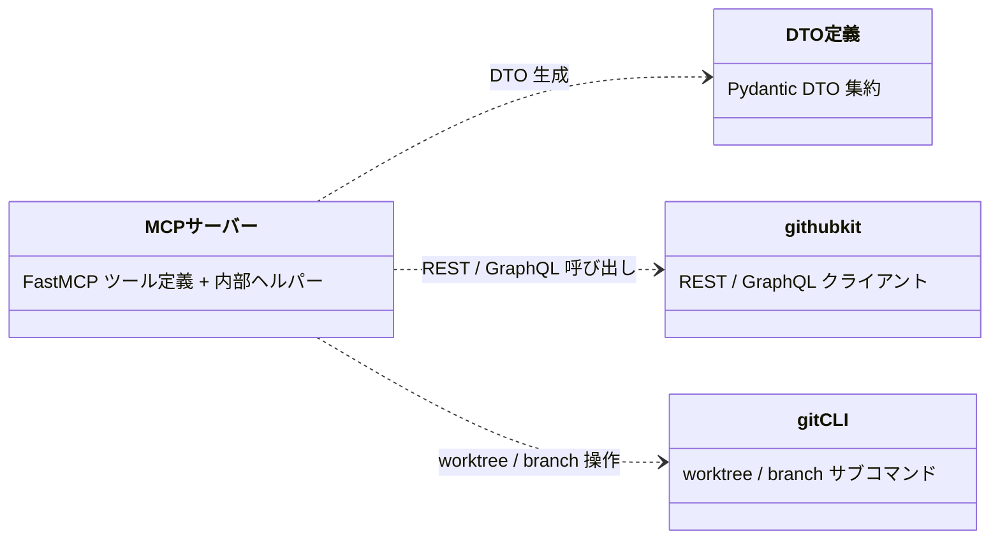

---

### スナップショット

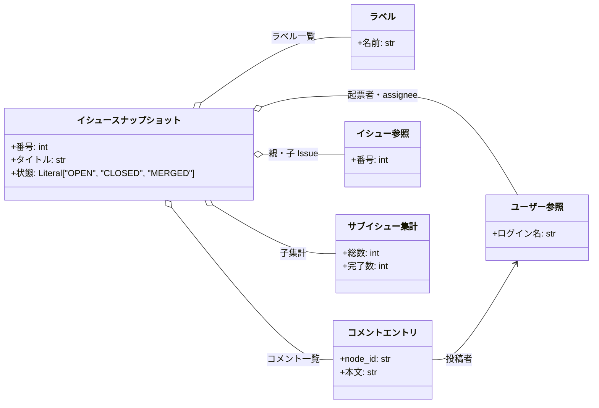

---

### コメント

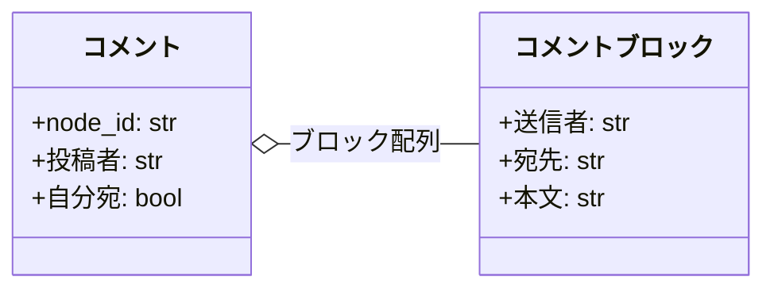

---

### レビュースレッド

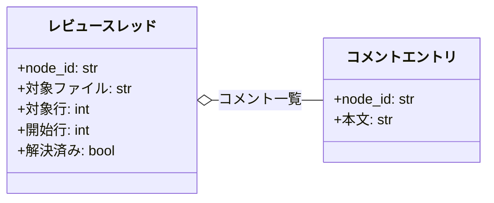

---

### 質問

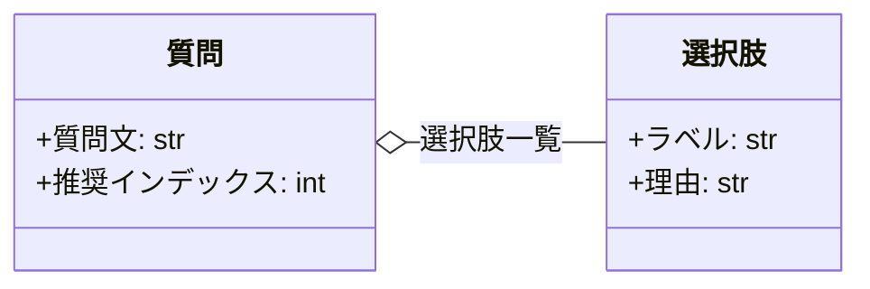

---

### 基盤

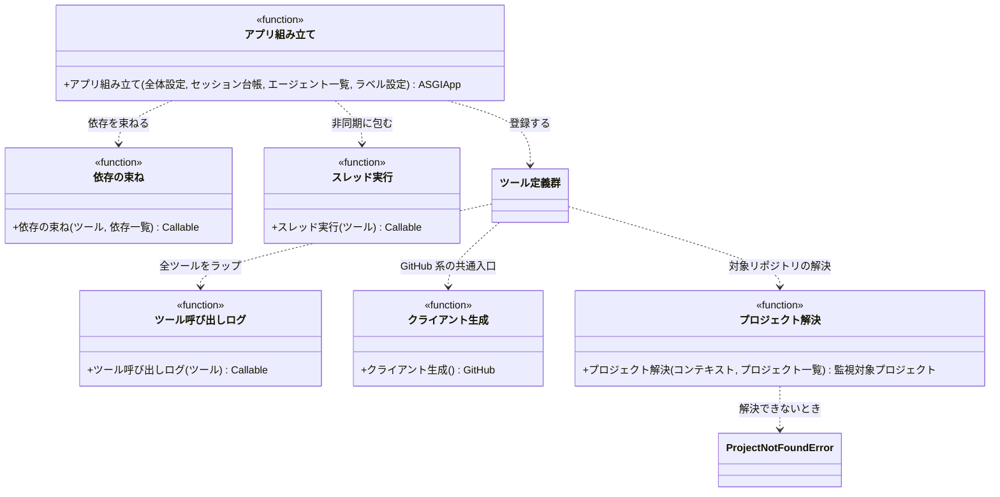

---

### コメントの組み立てと投稿

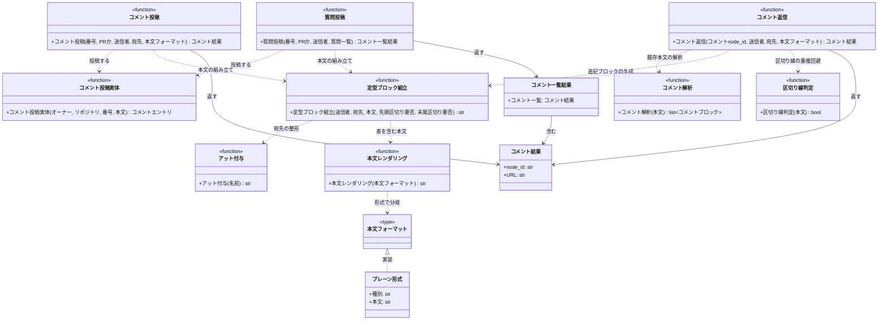

---

### Resolve とレビュースレッド

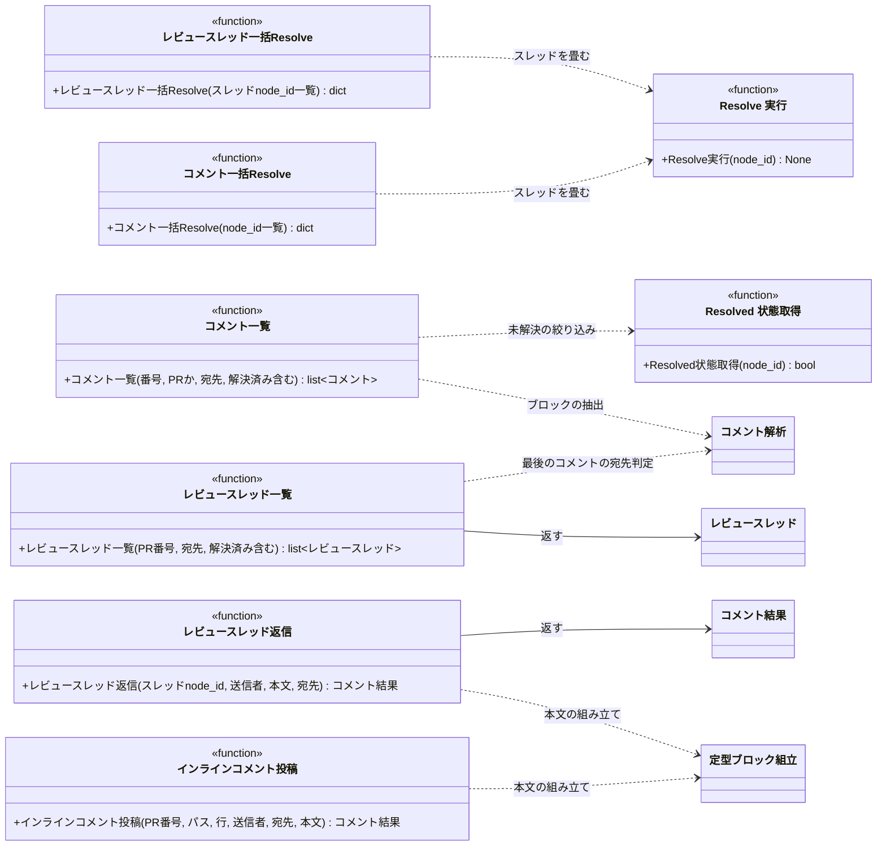

---

### ラベルと assignee

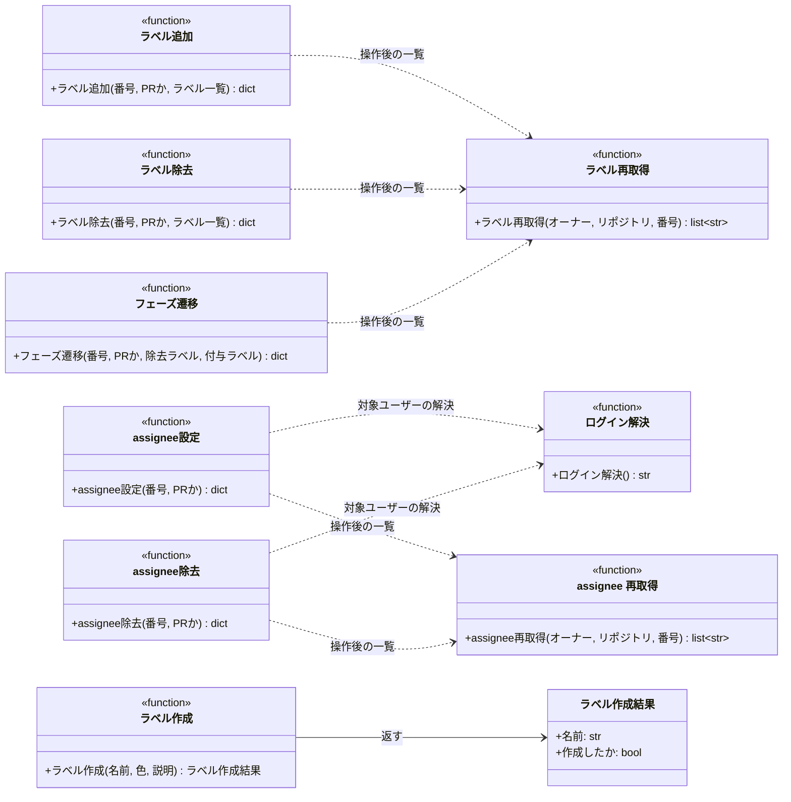

---

### Issue / PR の取得と更新

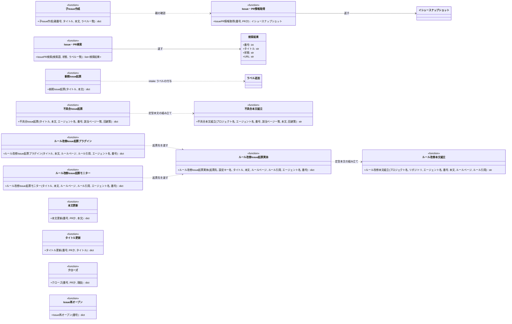

---

### PR の作成とマージ

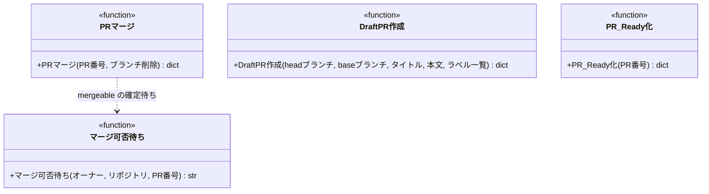

---

### worktree 操作

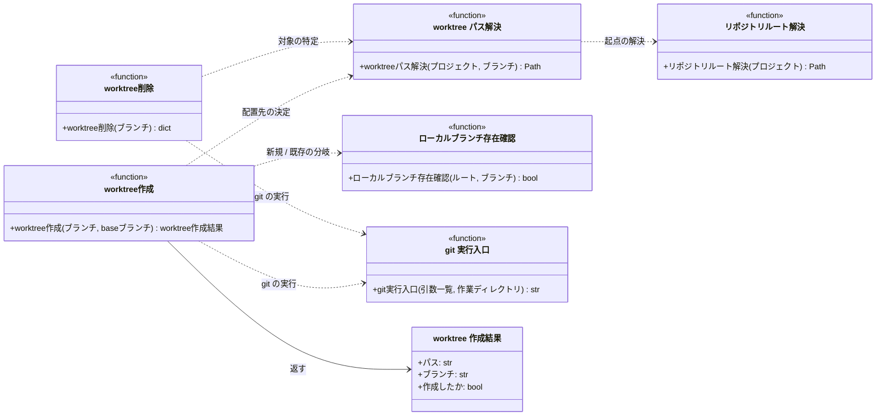

## `mcp/server.py`
> 種別: ファイル

FastMCP でツールを定義するファイル。
各ツール関数が githubkit / git CLI を直接呼ぶ（委譲層は持たない）。
GitHub 系の全ツールは[クライアント生成](#クライアント生成)と[プロジェクト解決](#プロジェクト解決)を、worktree 系の全ツールは[プロジェクト解決](#プロジェクト解決)と [git 実行入口](#git-実行入口)を共通で通る。
worktree 系が[プロジェクト解決](#プロジェクト解決)を通るのは、操作対象のリポジトリをプロセスの作業ディレクトリではなく監視対象プロジェクトの `local_path` に固定するため。
全ツールは[ツール呼び出しログ](#ツール呼び出しログ)でラップし、ログ出力を個々のツールに書かない。
各ツールのインターフェース（リクエスト / レスポンス / 制約）は [インターフェース定義（バックエンド）](../../インターフェース定義/README.md) の詳細ファイルが SoT。
疎通テストは sandbox（`shuhei1101/ai-monitor-e2e`）を対象に手動実行する（[プロジェクト解決](#プロジェクト解決)が読むヘッダに sandbox を指定する。手順は `テスト/テスト実行方法.md`）。

---

### ツール定義群
> 物理名: `get_issue_or_pr` ほか（`一覧` の MCP ツール行と 1:1）<br>
> 種別: 関数

#### 単体テスト

| テスト名 | 正常/異常 | 概要 | 条件 | Mock | 期待値 | 補足 |
| --- | --- | --- | --- | --- | --- | --- |
| `test_registered_tools` | 正常 | 全ツールの登録 | FastMCP サーバー生成 | なし | ツール名一覧がインターフェース定義（バックエンド）の索引と一致 | - |
| `test_tool_annotations` | 正常 | ヒント宣言 | FastMCP サーバー生成 | なし | `get_issue_or_pr` / `list_comments` / `list_review_threads` / `search_issues_and_prs` が readOnlyHint・remove 系 / close / merge が destructiveHint | - |

---

### ツール呼び出しログ
> 物理名: `_log_tool_call`<br>
> 種別: 関数

全 MCP ツールに適用して、実行と失敗をログに出すデコレータ。
ログ出力を 1 箇所に集約し、個々のツールの処理からログを外す。

#### 引数

| 論理名 | 引数名 | 型 | 必須 | デフォルト | 説明 | 補足 |
| --- | --- | --- | --- | --- | --- | --- |
| ツール関数 | `func` | `Callable` | ✅ | - | ラップする MCP ツール関数 | `@mcp.tool()` の内側に適用する |

引数例:

```python
@mcp.tool(title="ラベル追加")
@_log_tool_call
def add_labels(number: int, labels: list[str]) -> LabelsResult: ...
```

#### 戻り値

| 型 | 説明 | 補足 |
| --- | --- | --- |
| `Callable` | ログ出力を挟んだツール関数 | 戻り値・例外はそのまま通す |

#### 処理

1. ラップしたツール関数を実行して戻り値をそのまま返す
   - `[INFO]` MCP ツールを実行した（ツール名 / `number`（受け取っている場合）/ 所要ミリ秒）
2. ツール関数が例外を投げた場合は、そのまま再送出する
   - `[WARNING]` MCP ツールが失敗した（ツール名 / `number`（受け取っている場合）/ 例外）

#### 例外

なし（ツール関数の例外をそのまま再送出する）

#### 単体テスト

| テスト名 | 正常/異常 | 概要 | 条件 | Mock | 期待値 | 補足 |
| --- | --- | --- | --- | --- | --- | --- |
| `test_log_tool_call` | 正常 | 戻り値の素通しと実行ログ | 正常終了するツール関数をラップして呼ぶ | なし | 戻り値がそのまま返り、ツール名を含む INFO ログが出る | - |
| `test_log_tool_call_when_tool_raises` | 異常 | 例外の再送出と失敗ログ | 例外を投げるツール関数をラップして呼ぶ | なし | 同じ例外が再送出され、ツール名を含む WARNING ログが出る | - |

---

### Issue・PR情報取得
> 物理名: `get_issue_or_pr`<br>
> 種別: 関数

Issue / PR の情報を取得し[イシュースナップショット](#イシュースナップショット)に変換する。

#### 引数

| 論理名 | 引数名 | 型 | 必須 | デフォルト | 説明 | 補足 |
| --- | --- | --- | --- | --- | --- | --- |
| 番号 | `number` | `int` | ✅ | - | 対象の Issue / PR 番号 | - |
| PR フラグ | `is_pr` | `bool` | ✅ | - | PR なら `True` | - |
| タイトル取得 | `title` | `bool` | - | `True` | タイトルを取得するか | - |
| 本文取得 | `body` | `bool` | - | `True` | 本文を取得するか | - |
| URL取得 | `url` | `bool` | - | `True` | URLを取得するか | - |
| 状態取得 | `state` | `bool` | - | `True` | 状態を取得するか | - |
| クローズ済み取得 | `closed` | `bool` | - | `True` | クローズ済みを取得するか | - |
| クローズ日時取得 | `closed_at` | `bool` | - | `True` | クローズ日時を取得するか | - |
| 作成日時取得 | `created_at` | `bool` | - | `True` | 作成日時を取得するか | - |
| 更新日時取得 | `updated_at` | `bool` | - | `True` | 更新日時を取得するか | - |
| ラベル取得 | `labels` | `bool` | - | `True` | ラベルを取得するか | - |
| コメント取得 | `comments` | `bool` | - | `True` | コメントを取得するか | - |
| 担当者取得 | `assignees` | `bool` | - | `True` | 担当者を取得するか | - |
| 起票者取得 | `author` | `bool` | - | `True` | 起票者を取得するか | - |
| headブランチ取得 | `head_ref` | `bool` | - | `True` | head ブランチ名を取得するか | PR のみ有効 |
| baseブランチ取得 | `base_ref` | `bool` | - | `True` | base ブランチ名を取得するか | PR のみ有効 |
| 親取得 | `parent` | `bool` | - | `True` | 親を取得するか | Issue は Sub-issue リンクの親、PR は base ブランチを head に持つ PR |
| 子 Issue取得 | `sub_issues` | `bool` | - | `True` | 子 Issueを取得するか | Issue のみ有効 |
| 子集計取得 | `sub_issues_summary` | `bool` | - | `True` | 子集計を取得するか | Issue のみ有効 |
| スタック取得 | `stack` | `bool` | - | `True` | スタック所属を取得するか | PR のみ有効 |

引数例:

```python
get_issue_or_pr(35, is_pr=False, comments=False)
```

#### 戻り値

| 型 | 説明 | 補足 |
| --- | --- | --- |
| [`IssueSnapshot`](#イシュースナップショット) | Issue / PR のスナップショット | `False` のフィールドは `None` |

戻り値例:

```python
IssueSnapshot(number=35, title="プロフィール編集機能", state="OPEN", labels=[Label(name="layer:epic")], comments=None, ...)
```

#### 処理

1. REST で Issue / PR の基本情報を取得する（PR は `is_pr` でエンドポイントを切り替え）
2. 取得フラグが `True` のフィールド（コメント / 子 Issue / 子集計 等）を追加取得する（コメントの `isMinimized` は GraphQL）
3. 親を確定する
   - `is_pr` が `True` の場合、base ブランチを head に持つ PR を head 検索で引く（[親PR取得](#親pr取得)）
   - `is_pr` が `False` の場合、Sub-issue リンクの親を取得する（親なしの 404 は `None`）
4. `is_pr` が `True` の場合、スタック所属を取得する（[スタック所属取得](./../モニター/GitHub連携.py.md#スタック所属取得)。未所属は `None`）
5. head / base ブランチ名を確定する
   - `is_pr` が `True` の場合、手順 1 の応答から取り出す（追加の API 呼び出しはしない）
   - `is_pr` が `False` の場合、`None` にする（Issue はブランチを持たない）
6. 結果を[イシュースナップショット](#イシュースナップショット)に変換して返す（取得しなかったフィールドは `None`）

#### 例外

| 例外名 | 発生条件 | メッセージ | 補足 |
| --- | --- | --- | --- |
| `RequestFailed` | API 応答が 4xx / 5xx（対象不存在・認証エラー 等） | HTTP ステータスと本文 | MCP がツールエラーとして呼び出し元エージェントに返す |
| `GraphQLFailed` | GraphQL がエラーを返す（node_id 不正 等） | `errors[].message` | - |

#### 単体テスト

| テスト名 | 正常/異常 | 概要 | 条件 | Mock | 期待値 | 補足 |
| --- | --- | --- | --- | --- | --- | --- |
| `test_get_issue_or_pr` | 正常 | スナップショット組み立て | REST 応答をモック | githubkit | `IssueSnapshot` の各フィールドが対応・`head_ref` / `base_ref` が `None` | Issue はブランチを持たない |
| `test_get_issue_or_pr_when_pr` | 正常 | PR のブランチ名の取り込み | `is_pr=True` で PR 応答をモック | githubkit | `head_ref` / `base_ref` に PR のブランチ名が入る | 追加の API 呼び出しなし |
| `test_get_issue_or_pr_when_pr_parent` | 正常 | PR の親の解決 | `is_pr=True` で head 検索が親 PR を返す | githubkit | `parent` に親 PR が入り、Sub-issue の親取得を呼ばない | base ブランチを head に持つ PR |
| `test_get_issue_or_pr_when_pr_parent_missing` | 正常 | 最上位 PR の親なし | head 検索が空を返す | githubkit | `parent` が `None` | base が `master` の PR |
| `test_get_issue_or_pr_when_stack` | 正常 | スタック所属の取り込み | `is_pr=True` でスタックの上端に属する | githubkit | `stack` に番号・位置・下位の open PR が入る | - |
| `test_get_issue_or_pr_when_flags_false` | 正常 | 取得フラグ `False` の除外 | `comments=False` / `base_ref=False` / `stack=False` で呼び出し | githubkit | `comments` / `base_ref` / `stack` が `None` で返る | - |
| `test_get_issue_or_pr_when_api_error` | 異常 | API エラーの伝播 | REST が 404 を返す | githubkit | `RequestFailed` がそのまま伝播 | 代表 1 ツールで共通経路を確認 |

#### 疎通テスト

| テスト名 | 対象 API | 概要 | 確認内容 | 補足 |
| --- | --- | --- | --- | --- |
| `test_ext_get_issue_or_pr_when_issue` | GitHub | Issue を全フィールドで取得 | 認証 / 親子 Issue の解決 / `IssueSnapshot` 構造 | 副作用: なし（読み取りのみ） |
| `test_ext_get_issue_or_pr_when_pr` | GitHub | `is_pr=True` で PR を取得 | state=`MERGED` 判定 / コメントの `isMinimized` | 副作用: なし（読み取りのみ） |

---

### コメント投稿
> 物理名: `comment`<br>
> 種別: 関数

定型ブロック（from / to ヘッダー + 本文）のコメントを PR の特定行に投稿する。
応答はスレッド返信で積むため、末尾に区切り線を付けない。

#### 引数

| 論理名 | 引数名 | 型 | 必須 | デフォルト | 説明 | 補足 |
| --- | --- | --- | --- | --- | --- | --- |
| 番号 | `number` | `int` | ✅ | - | 対象の Issue / PR 番号 | - |
| PR フラグ | `is_pr` | `bool` | ✅ | - | PR なら `True` | - |
| 送信者 | `sender` | `str` | ✅ | - | 送信者のエージェント名 | `@` は不要（自動付与） |
| 宛先 | `receiver` | `str \| None` | - | `None`（to 行なし = 現担当宛） | 宛先名 | - |
| 本文構成 | `format` | [`CommentFormat`](#本文フォーマット) | ✅ | - | `type` で判別される本文の構成 | 本文は `format.body` |

引数例:

```python
comment(35, is_pr=False, sender="architect", format=PlainFormat(body="設計 Wiki を更新しました。"))
```

#### 戻り値

| 型 | 説明 | 補足 |
| --- | --- | --- |
| [`CommentResult`](#コメント結果) | 投稿コメントの node_id / url | - |

戻り値例:

```python
CommentResult(node_id="IC_kwDO...", url="https://github.com/.../issues/35#issuecomment-1")
```

#### 処理

1. `format` の `type` に応じて本文（表を含む場合は表も）を組み立てる（[本文レンダリング](#本文レンダリング)）
2. from / to ヘッダー + 本文を組み立てる（[定型ブロック組立](#定型ブロック組立)）
3. 投稿して `CommentResult` を返す（[コメント投稿実体](#コメント投稿実体)）

#### 例外

| 例外名 | 発生条件 | メッセージ | 補足 |
| --- | --- | --- | --- |
| `RequestFailed` | API 応答が 4xx / 5xx（対象不存在・認証エラー 等） | HTTP ステータスと本文 | MCP がツールエラーとして呼び出し元エージェントに返す |

#### 単体テスト

| テスト名 | 正常/異常 | 概要 | 条件 | Mock | 期待値 | 補足 |
| --- | --- | --- | --- | --- | --- | --- |
| `test_comment` | 正常 | 定型ブロックで投稿 | sender / receiver / body | githubkit | `_format_block` の出力（末尾が `------`）で投稿され `CommentResult` を返す | - |
| `test_comment_when_commits_format` | 正常 | commit 表付きの投稿 | `format` が `CommitsFormat` | githubkit | 本文末尾（区切り線の手前）に `\| commit \| 内容 \|` の表が入る | - |
| `test_comment_when_pages_format` | 正常 | ページ範囲表付きの投稿 | `format` が `PagesFormat` | githubkit | 本文末尾に `\| 対象ページ \| commit 範囲 \|` の表が入る | - |

#### 疎通テスト

| テスト名 | 対象 API | 概要 | 確認内容 | 補足 |
| --- | --- | --- | --- | --- |
| `test_ext_comment` | GitHub | 定型ブロックでコメント投稿 | `node_id` / `url` の返却 / 本文書式 | 副作用: sandbox にコメント投稿 |

---

### 質問投稿
> 物理名: `ask_questions`<br>
> 種別: 関数

選択肢 + 推奨付きの質問を、質問 1 件ごとに独立したコメントとして投稿する。

#### 引数

| 論理名 | 引数名 | 型 | 必須 | デフォルト | 説明 | 補足 |
| --- | --- | --- | --- | --- | --- | --- |
| 番号 | `number` | `int` | ✅ | - | 対象の Issue / PR 番号 | - |
| PR フラグ | `is_pr` | `bool` | ✅ | - | PR なら `True` | - |
| 送信者 | `sender` | `str` | ✅ | - | 送信者のエージェント名 | `@` は不要 |
| 宛先 | `receiver` | `str \| None` | - | `None`（to 行なし = 現担当宛） | 宛先名 | 通常はユーザーのログイン名 |
| 質問一覧 | `questions` | [`list[Question]`](#質問) | ✅ | - | 質問の配列 | 1 要素がコメント 1 件になる |

引数例:

```python
ask_questions(35, is_pr=False, sender="epic-conductor", questions=[Question(question="レスポンス形式は？", background="...", choices=[Choice(label="案 A", reason="...")])])
```

#### 戻り値

| 型 | 説明 | 補足 |
| --- | --- | --- |
| [`CommentsResult`](#コメント一覧結果) | 投稿したコメントの一覧 | `questions` と同じ順序・同じ件数 |

戻り値例:

```python
CommentsResult(comments=[CommentResult(node_id="IC_kwDO...", url="https://github.com/.../issues/35#issuecomment-2")])
```

#### 処理

1. 質問を 1 件ずつ処理し、投稿結果を順に集める
   - 本文を組み立てる（質問見出し + 背景 + 選択肢 + 推奨。空文字の背景・`recommended_index=-1` の推奨行は省略）
   - 選択肢の採番は `CHOICE_LETTERS` からその質問の中で先頭から振る
   - ヘッダーを付ける（[定型ブロック組立](#定型ブロック組立)）
   - 投稿する（[コメント投稿実体](#コメント投稿実体)）
   - 投稿が失敗した場合、そこまでに投稿できた件数を添えて `RuntimeError` を投げる（投稿済みのコメントは取り消さない）
     - `[ERROR]` 確認質問の投稿に失敗した（`number` / 投稿できた件数 / 全件数）
2. 集めた結果を `CommentsResult` にして返す

#### 例外

| 例外名 | 発生条件 | メッセージ | 補足 |
| --- | --- | --- | --- |
| `RuntimeError` | いずれかのコメントの投稿で API 応答が 4xx / 5xx（対象不存在・認証エラー 等） | `"確認質問の投稿に失敗しました（{投稿済み} / {全件} 件目まで投稿済み）: {原因}"` | `RequestFailed` を `raise from` で連鎖する。MCP がツールエラーとして呼び出し元エージェントに返す |

#### 単体テスト

| テスト名 | 正常/異常 | 概要 | 条件 | Mock | 期待値 | 補足 |
| --- | --- | --- | --- | --- | --- | --- |
| `test_ask_questions` | 正常 | 質問件数分の個別投稿 | `Question` x3 + recommended_index | githubkit | 投稿が 3 回呼ばれ、各本文が 1 質問だけを含み `------` で終わる。`CommentsResult.comments` が 3 件 | - |
| `test_ask_questions_when_single` | 正常 | 質問 1 件 | `Question` x1 | githubkit | 投稿が 1 回だけ呼ばれ、`comments` が 1 件 | - |
| `test_ask_questions_when_no_recommendation` | 正常 | 推奨なしの省略 | `recommended_index=-1` | githubkit | 推奨行を含まない本文で投稿 | - |
| `test_ask_questions_when_empty_background` | 正常 | 空文字セクションの省略 | `background` が空文字 | githubkit | 背景を含まない本文で投稿 | - |
| `test_ask_questions_when_choices_renumbered` | 正常 | 質問ごとの採番リセット | `Question` x2（各 2 選択肢） | githubkit | 2 件目の本文の選択肢も `A` から始まる | - |
| `test_ask_questions_when_api_error` | 異常 | 1 件目の投稿で失敗 | 投稿が 1 回目で `RequestFailed` | githubkit | `RuntimeError` を投げ、投稿は 1 回しか呼ばれない | 例外表「いずれかのコメントの投稿で 4xx / 5xx」に対応 |
| `test_ask_questions_when_partial_failure` | 異常 | 2 件目の投稿で失敗 | 投稿が 2 回目で `RequestFailed` | githubkit | `RuntimeError` を投げ、メッセージに投稿できた件数を含み、3 件目の投稿が呼ばれない | 例外表と同上・投稿済みは取り消さない |

#### 疎通テスト

| テスト名 | 対象 API | 概要 | 確認内容 | 補足 |
| --- | --- | --- | --- | --- |
| `test_ext_ask_questions` | GitHub | 選択肢 + 推奨付きの質問投稿 | 選択肢・推奨マークの書式 | 副作用: sandbox にコメント投稿 |

---

### コメント返信
> 物理名: `reply_comment`<br>
> 種別: 関数

既存コメントに `------` 区切りで定型ブロックを追記する。

#### 引数

| 論理名 | 引数名 | 型 | 必須 | デフォルト | 説明 | 補足 |
| --- | --- | --- | --- | --- | --- | --- |
| 返信先 | `comment_node_id` | `str` | ✅ | - | 追記対象コメントの GraphQL node_id | `get_issue_or_pr` / `list_comments` で取得 |
| 送信者 | `sender` | `str` | ✅ | - | 送信者のエージェント名 | `@` は不要 |
| 宛先 | `receiver` | `str \| None` | - | `None`（to 行なし = 現担当宛） | 宛先名 | - |
| 本文構成 | `format` | [`CommentFormat`](#本文フォーマット) | ✅ | - | `type` で判別される追記ブロックの構成 | コメント投稿と共通 |

引数例:

```python
reply_comment("IC_kwDO...", sender="tester", body="修正しました。")
```

#### 戻り値

| 型 | 説明 | 補足 |
| --- | --- | --- |
| [`CommentResult`](#コメント結果) | 追記したコメントの node_id / url | - |

戻り値例:

```python
CommentResult(node_id="IC_kwDO...", url="https://github.com/.../issues/35#issuecomment-1")
```

#### 処理

1. `comment_node_id` から既存コメントの現在本文を取得する
   - 本文を取れない場合、`ValueError` を投げる（追記対象が会話欄のコメントでない）
2. `format` の `type` に応じて本文（表を含む場合は表も）を組み立てる（[本文レンダリング](#本文レンダリング)）
3. 既存本文の末尾が区切り線かを判定する（[区切り線判定](#区切り線判定)）
4. 追記ブロックを組み立てる（[定型ブロック組立](#定型ブロック組立)・`needs_separator` は 3 の判定の否定）
5. 既存本文の末尾に連結してコメントを更新し、`CommentResult` を返す

#### 例外

| 例外名 | 発生条件 | メッセージ | 補足 |
| --- | --- | --- | --- |
| `RequestFailed` | API 応答が 4xx / 5xx（対象不存在・認証エラー 等） | HTTP ステータスと本文 | MCP がツールエラーとして呼び出し元エージェントに返す |
| `GraphQLFailed` | GraphQL がエラーを返す（node_id 不正 等） | `errors[].message` | - |
| `ValueError` | 照会は成功したが本文を取れない（インライン指摘等、会話欄のコメント以外の node_id） | 対象の node_id + インライン指摘は新規投稿で行う旨 | 照会クエリが `IssueComment` だけを対象にしているため空の node が返る |

#### 単体テスト

| テスト名 | 正常/異常 | 概要 | 条件 | Mock | 期待値 | 補足 |
| --- | --- | --- | --- | --- | --- | --- |
| `test_reply_comment` | 正常 | 末尾が区切り線でない本文への追記 | 末尾が通常の文の既存コメント | githubkit | 先頭 `------` + 宛先ヘッダー付きで追記され、末尾が `------` で終わる | ユーザーが書き足した後 |
| `test_reply_comment_when_ends_with_separator` | 正常 | 末尾が区切り線の本文への追記 | 末尾が `------` の既存コメント | githubkit | 先頭に `------` を足さずに追記され、境目の `------` が 1 本だけになる | 本ツールが投稿した後 |
| `test_reply_comment_when_commits_format` | 正常 | 表付きの追記 | `format` が `CommitsFormat` | githubkit | 追記ブロックの末尾（区切り線の手前）に表が入る | コメント投稿と同じ書式 |
| `test_reply_comment_when_not_issue_comment` | 異常 | 会話欄のコメント以外の node_id | 照会が本文を含まない node を返す | githubkit | `ValueError` が送出され、コメント更新 API が呼ばれない | 例外表「照会は成功したが本文を取れない」に対応 |

#### 疎通テスト

| テスト名 | 対象 API | 概要 | 確認内容 | 補足 |
| --- | --- | --- | --- | --- |
| `test_ext_reply_comment` | GitHub | 既存コメントへ `------` 区切りで追記 | コメント更新 API / 追記後の本文 | 副作用: sandbox のコメント更新 |

---

### コメント一括Resolve
> 物理名: `resolve_comments`<br>
> 種別: 関数

複数コメントの Resolve をまとめて実行する。

#### 引数

| 論理名 | 引数名 | 型 | 必須 | デフォルト | 説明 | 補足 |
| --- | --- | --- | --- | --- | --- | --- |
| 対象一覧 | `node_ids` | `list[str]` | ✅ | - | Resolve 対象コメントの node_id 配列 | 1 件以上 |

引数例:

```python
resolve_comments(["IC_kwDO...", "IC_kwDP..."])
```

#### 戻り値

| 型 | 説明 | 補足 |
| --- | --- | --- |
| [`ResolveResult`](#resolve-結果) | Resolve した件数 | - |

戻り値例:

```python
ResolveResult(resolved_count=2)
```

#### 処理

1. `node_ids` を 1 件ずつ Resolve する（[Resolve 実行](#resolve-実行)）
2. 実行件数を `ResolveResult` で返す

#### 例外

| 例外名 | 発生条件 | メッセージ | 補足 |
| --- | --- | --- | --- |
| `GraphQLFailed` | GraphQL がエラーを返す（node_id 不正 等） | `errors[].message` | - |

#### 単体テスト

| テスト名 | 正常/異常 | 概要 | 条件 | Mock | 期待値 | 補足 |
| --- | --- | --- | --- | --- | --- | --- |
| `test_resolve_comments` | 正常 | 一括 Resolve | node_id x3 | githubkit | 3 件とも minimizeComment が実行される | - |

#### 疎通テスト

| テスト名 | 対象 API | 概要 | 確認内容 | 補足 |
| --- | --- | --- | --- | --- |
| `test_ext_resolve_comments` | GitHub | minimizeComment の実行 | `classifier=RESOLVED` で `isMinimized` が true になる | 副作用: sandbox のコメントを Resolve |

---

### コメント一覧
> 物理名: `list_comments`<br>
> 種別: 関数

対象の全コメントをブロック配列 + 自分宛判定付きで返す。

#### 引数

| 論理名 | 引数名 | 型 | 必須 | デフォルト | 説明 | 補足 |
| --- | --- | --- | --- | --- | --- | --- |
| 番号 | `number` | `int` | ✅ | - | 対象の Issue / PR 番号 | - |
| PR フラグ | `is_pr` | `bool` | ✅ | - | PR なら `True` | - |
| 宛先名 | `addressee` | `str` | ✅ | - | 自分宛判定に使う名前。最後のブロックの to または from がこの名前なら自分宛 | `@` は不要 |
| Resolved 込み | `include_resolved` | `bool` | - | `False` | Resolved 済みも含めるか | - |

引数例:

```python
list_comments(52, is_pr=True, addressee="architect")
```

#### 戻り値

| 型 | 説明 | 補足 |
| --- | --- | --- |
| [`list[Comment]`](#コメント) | コメントの配列（投稿順） | 自分宛かは `is_addressed` で判別する |

戻り値例:

```python
[Comment(node_id="IC_kwDO...", blocks=[CommentBlock(sender="tester", receiver="architect", body="テスト作成が完了しました。")], author="shuhei1101", url="...", is_resolved=False, is_addressed=True)]
```

#### 処理

1. コメント一覧と各コメントの `isMinimized` を取得する（REST + GraphQL）
2. 各コメント本文をブロック配列にパースする（[コメント解析](#コメント解析)）
3. 最後のブロックの to が `addressee` のもの・to なしのユーザー投稿・from が `addressee` のもの（自身の投稿）を自分宛と判定する
4. `include_resolved` が `False` なら Resolved 済みを除外し、判定結果を `is_addressed` に入れた `Comment` の配列で返す

#### 例外

| 例外名 | 発生条件 | メッセージ | 補足 |
| --- | --- | --- | --- |
| `RequestFailed` | API 応答が 4xx / 5xx（対象不存在・認証エラー 等） | HTTP ステータスと本文 | MCP がツールエラーとして呼び出し元エージェントに返す |
| `GraphQLFailed` | GraphQL がエラーを返す（node_id 不正 等） | `errors[].message` | - |

#### 単体テスト

| テスト名 | 正常/異常 | 概要 | 条件 | Mock | 期待値 | 補足 |
| --- | --- | --- | --- | --- | --- | --- |
| `test_list_comments` | 正常 | 最終ブロックの宛先で自分宛判定 | 宛先違い・宛先なしのコメント混在 | githubkit | 全件が blocks 付きで返り、自分宛 + to なしユーザーコメントだけ `is_addressed=True` になる | 宛先違いは `is_addressed=False` で返る |
| `test_list_comments_when_own_comment` | 正常 | 自身投稿の自分宛判定 | 最後のブロックの from が `addressee`（to はユーザー）のコメント | githubkit | 自身の投稿が `is_addressed=True` で返る | 完了処理の一括 Resolve 対象 |
| `test_list_comments_when_include_resolved` | 正常 | Resolved 込みの取得 | `include_resolved=True` で Resolved 済みが混在 | githubkit | Resolved 済みも `is_resolved=True` で返る | 省略時は除外される |

#### 疎通テスト

| テスト名 | 対象 API | 概要 | 確認内容 | 補足 |
| --- | --- | --- | --- | --- |
| `test_ext_list_comments` | GitHub | コメントの取得と宛先判定 | to / from 行の宛先判定 / `isMinimized` の取得 | 副作用: なし（事前投稿は fixture） |

---

### Issue・PR検索
> 物理名: `search_issues_and_prs`<br>
> 種別: 関数

キーワードでリポジトリ内の Issue / PR を横断検索して一覧を返す。

#### 引数

| 論理名 | 引数名 | 型 | 必須 | デフォルト | 説明 | 補足 |
| --- | --- | --- | --- | --- | --- | --- |
| 検索キーワード | `query` | `str` | ✅ | - | 検索キーワード（GitHub search 構文可） | 対象リポジトリの絞り込みは自動付与 |
| 並び順 | `sort` | `Literal["comments", "reactions", "reactions-+1", "reactions--1", "reactions-smile", "reactions-thinking_face", "reactions-heart", "reactions-tada", "interactions", "created", "updated"] \| None` | - | `None`（関連度順） | 並び順 | - |
| 昇順 / 降順 | `order` | `Literal["desc", "asc"]` | - | `"desc"` | 並びの向き | `sort` 指定時のみ有効 |
| 件数 | `limit` | `int` | - | `10` | 最大取得件数（1〜100） | 検索 API の `per_page` に渡す |
| ページ | `page` | `int` | - | `1` | ページ番号 | - |

引数例:

```python
search_issues_and_prs('"プロフィール編集" in:title is:issue', sort="created", limit=10)
```

#### 戻り値

| 型 | 説明 | 補足 |
| --- | --- | --- |
| [`list[SearchResultItem]`](#検索結果) | 検索結果の配列（並びは `sort` 指定に従う） | - |

戻り値例:

```python
[SearchResultItem(number=35, is_pr=False, title="プロフィール編集機能", state="open", url="https://github.com/{owner}/{repo}/issues/35")]
```

#### 処理

1. 対象リポジトリを解決し、検索クエリに `repo:{owner}/{repo}` を付与する（[プロジェクト解決](#プロジェクト解決)）
2. 検索 API を `sort` / `order` / `per_page` / `page` 付きで呼ぶ（REST）
3. 各要素を番号・PR 判定（`pull_request` の有無）・タイトル・状態・URL の `SearchResultItem` に変換して配列で返す

#### 例外

| 例外名 | 発生条件 | メッセージ | 補足 |
| --- | --- | --- | --- |
| `RequestFailed` | API 応答が 4xx / 5xx（検索レートリミット・クエリ構文エラー 等） | HTTP ステータスと本文 | MCP がツールエラーとして呼び出し元エージェントに返す |

#### 単体テスト

| テスト名 | 正常/異常 | 概要 | 条件 | Mock | 期待値 | 補足 |
| --- | --- | --- | --- | --- | --- | --- |
| `test_search_issues_and_prs` | 正常 | 検索結果の変換とリポジトリ絞り込み | Issue 1 件 + PR 1 件の検索応答 | githubkit | クエリに `repo:` が付与され、`SearchResultItem` の配列（PR は `is_pr=True`）で返る | - |
| `test_search_issues_and_prs_when_sort` | 正常 | 並び順指定の受け渡し | `sort="created"` で呼び出し | githubkit | 検索 API に `sort=created` / `order=desc` が渡る | - |
| `test_search_issues_and_prs_when_no_hit` | 正常 | ヒットなしは空配列 | 0 件の検索応答 | githubkit | `[]` | - |

#### 疎通テスト

| テスト名 | 対象 API | 概要 | 確認内容 | 補足 |
| --- | --- | --- | --- | --- |
| `test_ext_search_issues_and_prs` | GitHub | キーワード検索の実行 | 認証 / リポジトリ絞り込み / `SearchResultItem` 構造 | 副作用: なし（読み取りのみ） |

---

### インラインコメント投稿
> 物理名: `create_review_comment`<br>
> 種別: 関数

PR の特定ファイル・特定行に紐づくレビューコメント（インライン指摘）を定型ブロックで投稿する。

#### 引数

| 論理名 | 引数名 | 型 | 必須 | デフォルト | 説明 | 補足 |
| --- | --- | --- | --- | --- | --- | --- |
| PR 番号 | `pr_number` | `int` | ✅ | - | 対象の PR 番号 | - |
| 対象ファイル | `path` | `str` | ✅ | - | 対象ファイルパス（リポジトリルート相対） | - |
| 対象行 | `line` | `int` | ✅ | - | 対象行番号（範囲指定時は終端行） | PR の diff に含まれる行のみ |
| 対象側 | `side` | `"RIGHT"` \| `"LEFT"` | - | `"RIGHT"` | diff のどちら側の行か | 追加・文脈行は RIGHT / 削除行は LEFT |
| 開始行 | `start_line` | `int \| None` | - | `None`（単一行コメント） | 範囲コメントの開始行 | `line` より小さい行。side は `side` を両端に適用 |
| 送信者 | `sender` | `str` | ✅ | - | 送信者のエージェント名 | `@` は不要（自動付与） |
| 宛先 | `receiver` | `str \| None` | - | `None`（to 行なし = 現担当宛） | 宛先名 | - |
| 本文 | `body` | `str` | ✅ | - | 指摘本文 | Markdown 可 |

引数例:

```python
create_review_comment(52, path="src/ai_monitor/features/agents/service.py", line=42, sender="architect", receiver="implementer", body="null チェックを追加してください。")
```

#### 戻り値

| 型 | 説明 | 補足 |
| --- | --- | --- |
| [`CommentResult`](#コメント結果) | 投稿コメントの node_id / url | node_id は `PRRC_` 始まり |

戻り値例:

```python
CommentResult(node_id="PRRC_kwDO...", url="https://github.com/.../pull/52#discussion_r987654321")
```

#### 処理

1. from / to ヘッダー + 本文を組み立てる（[定型ブロック組立](#定型ブロック組立)・`trailing_separator=False`）
2. PR の head commit SHA を取得する（`rest.pulls.get`）
3. REST でレビューコメントを投稿し、`CommentResult` を返す（`path` / `line` / `side` / `commit_id`、範囲指定時は `start_line` も指定）

#### 例外

| 例外名 | 発生条件 | メッセージ | 補足 |
| --- | --- | --- | --- |
| `RequestFailed` | API 応答が 4xx / 5xx（`line` が diff に含まれない 422 等） | HTTP ステータスと本文 | MCP がツールエラーとして呼び出し元エージェントに返す |

#### 単体テスト

| テスト名 | 正常/異常 | 概要 | 条件 | Mock | 期待値 | 補足 |
| --- | --- | --- | --- | --- | --- | --- |
| `test_create_review_comment` | 正常 | インライン投稿 | path / line / sender / body | githubkit | head SHA + 定型ブロック（末尾に `------` を付けない）で投稿 API が呼ばれ `CommentResult` を返す | - |
| `test_create_review_comment_when_multi_line` | 正常 | 範囲指定の投稿 | `start_line=42`・`line=48` | githubkit | `start_line` 付きで投稿 API が呼ばれる | - |
| `test_create_review_comment_when_out_of_diff` | 異常 | diff 外の行 | REST が 422 を返す | githubkit | `RequestFailed` がそのまま伝播 | 例外表「422 等」に対応 |

#### 疎通テスト

| テスト名 | 対象 API | 概要 | 確認内容 | 補足 |
| --- | --- | --- | --- | --- |
| `test_ext_create_review_comment_when_single_line` | GitHub | 単一行のインライン投稿 | `path` / `line` / `side=RIGHT` / head SHA | 副作用: sandbox の PR にレビューコメント投稿 |
| `test_ext_create_review_comment_when_multi_line` | GitHub | 範囲（`start_line`〜`line`）の投稿 | `start_line` の実挙動 | 副作用: sandbox の PR にレビューコメント投稿 |

---

### レビュースレッド一覧
> 物理名: `list_review_threads`<br>
> 種別: 関数

PR のレビュースレッド（インライン指摘のスレッド）を、各コメントの指摘箇所の周辺 diff と自分宛判定付きで取得する。

#### 引数

| 論理名 | 引数名 | 型 | 必須 | デフォルト | 説明 | 補足 |
| --- | --- | --- | --- | --- | --- | --- |
| PR 番号 | `pr_number` | `int` | ✅ | - | 対象の PR 番号 | - |
| 宛先名 | `addressee` | `str` | ✅ | - | 自分宛判定に使う名前 | スレッドの最後のコメントで判定する |
| Resolved 込み | `include_resolved` | `bool` | - | `False` | 解決済みスレッドも含めるか | - |

引数例:

```python
list_review_threads(52, addressee="implementer")
```

#### 戻り値

| 型 | 説明 | 補足 |
| --- | --- | --- |
| [`list[ReviewThread]`](#レビュースレッド) | レビュースレッドの配列 | 返信すべきスレッドは `is_addressed` で判別する |

戻り値例:

```python
[ReviewThread(node_id="PRRT_kwDO...", path="src/ai_monitor/features/agents/service.py", line=48, start_line=42, is_resolved=False, is_addressed=True, comments=[...])]
```

#### 処理

1. GraphQL で PR のレビュースレッド一覧（path / startLine / line / isResolved / コメント群 + diffHunk + 👍 リアクション）を取得する
2. `include_resolved` が `False` の場合、解決済みスレッドを除外する
3. スレッドの最後のコメントをブロックに分け、最終ブロックの to / from で自分宛かを判定する（[コメント解析](#コメント解析)）
4. 判定結果を `is_addressed` に入れた [レビュースレッド](#レビュースレッド)の配列に変換して返す

#### 例外

| 例外名 | 発生条件 | メッセージ | 補足 |
| --- | --- | --- | --- |
| `GraphQLFailed` | GraphQL がエラーを返す（PR 不存在 等） | `errors[].message` | MCP がツールエラーとして呼び出し元エージェントに返す |

#### 単体テスト

| テスト名 | 正常/異常 | 概要 | 条件 | Mock | 期待値 | 補足 |
| --- | --- | --- | --- | --- | --- | --- |
| `test_list_review_threads` | 正常 | スレッドの変換 | 単一行 + 範囲コメントが混在する GraphQL 応答 | githubkit | `node_id` / `path` / `start_line` / `line` / コメント群（投稿順）/ `diff_hunk` が対応する | - |
| `test_list_review_threads_when_resolved_mixed` | 正常 | 解決済みの除外 | 未解決 + 解決済みが混在する応答 | githubkit | 未解決スレッドだけが返る | - |
| `test_list_review_threads_when_include_resolved` | 正常 | Resolved 込みの取得 | `include_resolved=True` | githubkit | 解決済みも `is_resolved=True` で返る | - |
| `test_list_review_threads_when_diff_hunk_missing` | 正常 | diffHunk 欠落時の既定 | `diffHunk` を含まない GraphQL 応答 | githubkit | コメントの `diff_hunk` が `None` になる | - |
| `test_list_review_threads_when_addressed_mixed` | 正常 | 最後のコメントでの自分宛判定 | 自分宛・他エージェント宛・自分が最後に返信したスレッドが混在 | githubkit | 全スレッドが返り、自分宛だけ `is_addressed=True` になる | 宛先違いも落とさない |
| `test_list_review_threads_when_thumbs_up` | 正常 | 👍 の取得 | コメントに 👍 が付いた GraphQL 応答 | githubkit | `thumbs_up_by` に付けたユーザーのログイン名が入る | 👍 が無いコメントは空配列 |

#### 疎通テスト

| テスト名 | 対象 API | 概要 | 確認内容 | 補足 |
| --- | --- | --- | --- | --- |
| `test_ext_list_review_threads` | GitHub | レビュースレッドの取得 | `startLine` / `line` / `isResolved` / コメント群 / `diffHunk` / 👍 の `thumbs_up_by` | 副作用: sandbox の PR コメントに 👍 を付与 |

---

### レビュースレッド返信
> 物理名: `reply_review_thread`<br>
> 種別: 関数

インライン指摘のスレッドに、GitHub ネイティブの返信としてコメントを投稿する。

#### 引数

| 論理名 | 引数名 | 型 | 必須 | デフォルト | 説明 | 補足 |
| --- | --- | --- | --- | --- | --- | --- |
| スレッド node_id | `thread_node_id` | `str` | ✅ | - | 返信先スレッドの GraphQL node_id | [レビュースレッド一覧](#レビュースレッド一覧) で取得（`PRRT_` 始まり） |
| 送信者 | `sender` | `str` | ✅ | - | 送信者のエージェント名 | `@` は不要 |
| 本文 | `body` | `str` | ✅ | - | 返信本文 | ヘッダーはツールが付ける |
| 宛先 | `receiver` | `str \| None` | - | `None`（to 行なし = 現担当宛） | 宛先名 | 指摘した相手を指定する |

引数例:

```python
reply_review_thread("PRRT_kwDO...", sender="implementer", receiver="architect", body="commit abc1234 で修正しました。")
```

#### 戻り値

| 型 | 説明 | 補足 |
| --- | --- | --- |
| [`CommentResult`](#コメント結果) | 投稿した返信の node_id / url | `PRRC_` 始まり |

戻り値例:

```python
CommentResult(node_id="PRRC_kwDO...", url="https://github.com/.../pull/52#discussion_r123456")
```

#### 処理

1. from / to ヘッダー + 本文を組み立てる（[定型ブロック組立](#定型ブロック組立)）
   - 会話欄と違い 1 返信 = 1 コメントなので、末尾の区切り線は付けない
2. GraphQL `addPullRequestReviewThreadReply` でスレッドへ返信を投稿する
3. 投稿した返信の node_id / url を `CommentResult` で返す

#### 例外

| 例外名 | 発生条件 | メッセージ | 補足 |
| --- | --- | --- | --- |
| `GraphQLFailed` | GraphQL がエラーを返す（スレッド不存在・権限不足 等） | `errors[].message` | MCP がツールエラーとして呼び出し元エージェントに返す |

#### 単体テスト

| テスト名 | 正常/異常 | 概要 | 条件 | Mock | 期待値 | 補足 |
| --- | --- | --- | --- | --- | --- | --- |
| `test_reply_review_thread` | 正常 | スレッドへの返信投稿 | sender / receiver / body | githubkit | 引用ヘッダー付き本文で `addPullRequestReviewThreadReply` が呼ばれ `CommentResult` を返す | 末尾に区切り線を付けない |
| `test_reply_review_thread_when_no_receiver` | 正常 | 宛先なしの投稿 | `receiver=None` | githubkit | to 行を含まない本文で投稿される | 現担当宛の扱い |

#### 疎通テスト

| テスト名 | 対象 API | 概要 | 確認内容 | 補足 |
| --- | --- | --- | --- | --- |
| `test_ext_reply_review_thread` | GitHub | スレッドへの返信投稿 | スレッド内に返信が並ぶこと / 返信の node_id | 副作用: sandbox の PR に返信投稿 |

---

### レビュースレッド一括Resolve
> 物理名: `resolve_review_threads`<br>
> 種別: 関数

レビュースレッドを一括で解決する。

#### 引数

| 論理名 | 引数名 | 型 | 必須 | デフォルト | 説明 | 補足 |
| --- | --- | --- | --- | --- | --- | --- |
| 対象一覧 | `thread_node_ids` | `list[str]` | ✅ | - | 解決対象スレッドの node_id 配列 | 1 件以上（`PRRT_` 始まり） |

引数例:

```python
resolve_review_threads(["PRRT_kwDO...", "PRRT_kwDP..."])
```

#### 戻り値

| 型 | 説明 | 補足 |
| --- | --- | --- |
| [`ResolveResult`](#resolve-結果) | 解決した件数 | - |

戻り値例:

```python
ResolveResult(resolved_count=2)
```

#### 処理

1. `thread_node_ids` を 1 件ずつ `resolveReviewThread` mutation で解決する
2. 件数を `ResolveResult` で返す

#### 例外

| 例外名 | 発生条件 | メッセージ | 補足 |
| --- | --- | --- | --- |
| `GraphQLFailed` | GraphQL がエラーを返す（node_id 不正 等） | `errors[].message` | MCP がツールエラーとして呼び出し元エージェントに返す |

#### 単体テスト

| テスト名 | 正常/異常 | 概要 | 条件 | Mock | 期待値 | 補足 |
| --- | --- | --- | --- | --- | --- | --- |
| `test_resolve_review_threads` | 正常 | 一括解決 | node_id x2 | githubkit | 2 件とも `resolveReviewThread` が実行され件数が返る | - |

#### 疎通テスト

| テスト名 | 対象 API | 概要 | 確認内容 | 補足 |
| --- | --- | --- | --- | --- |
| `test_ext_resolve_review_threads` | GitHub | resolveReviewThread の実行 | スレッドが `isResolved: true` になる | 副作用: sandbox のスレッドを解決 |

---

### ラベル作成
> 物理名: `create_label`<br>
> 種別: 関数

リポジトリにラベル定義を作る。
`constants.env` に載らないプロジェクト固有のラベルを、必要になったエージェントがその場で用意するために使う。

#### 引数

| 論理名 | 引数名 | 型 | 必須 | デフォルト | 説明 | 補足 |
| --- | --- | --- | --- | --- | --- | --- |
| ラベル名 | `name` | `str` | ✅ | - | 作成するラベル名 | 大文字小文字を区別する |
| 色 | `color` | `str` | ✅ | - | 6 桁の 16 進カラーコード | `#` は含めない |
| 説明 | `description` | `str` | - | `""` | ラベルの説明 | - |

引数例:

```python
create_label("scope:backend", color="c2e0c6", description="担当サブシステム")
```

#### 戻り値

| 型 | 説明 | 補足 |
| --- | --- | --- |
| [`CreatedLabelResult`](#ラベル作成結果) | ラベル名と新規作成したかの真偽 | 既存なら `created=False` |

戻り値例:

```python
CreatedLabelResult(name="scope:backend", created=True)
```

#### 処理

1. ラベル作成 API を名前・色・説明で呼ぶ
2. 応答で戻り値を決める
   - 成功した場合、`created=True` の `CreatedLabelResult` を返す
     - `[INFO]` ラベルを作成した（`name`）
   - 同名が既に存在して 422 が返った場合、`created=False` の `CreatedLabelResult` を返す（既存の色と説明は変えない）

#### 例外

| 例外名 | 発生条件 | メッセージ | 補足 |
| --- | --- | --- | --- |
| `RequestFailed` | API 応答が 422 以外の 4xx / 5xx（権限不足 等） | HTTP ステータスと本文 | MCP がツールエラーとして呼び出し元エージェントに返す |

#### 単体テスト

| テスト名 | 正常/異常 | 概要 | 条件 | Mock | 期待値 | 補足 |
| --- | --- | --- | --- | --- | --- | --- |
| `test_create_label` | 正常 | 未作成のラベルを作成 | 作成 API が正常応答 | githubkit | 名前・色・説明が API に渡り `created=True` を返す | - |
| `test_create_label_when_exists` | 正常 | 同名が既に存在 | 作成 API が 422 を返す | githubkit | `created=False` を返し例外にしない | 冪等 |
| `test_create_label_when_forbidden` | 異常 | 権限不足 | 作成 API が 403 を返す | githubkit | `RequestFailed` を伝播する | 422 以外は握りつぶさない |

#### 疎通テスト

| テスト名 | 対象 API | 概要 | 確認内容 | 補足 |
| --- | --- | --- | --- | --- |
| `test_ext_create_label` | GitHub | ラベル定義の作成 | 名前・色・説明の反映 / 再実行時の `created=False` | 副作用: sandbox にラベル作成 |

---

### ラベル追加
> 物理名: `add_labels`<br>
> 種別: 関数

ラベルを追加して付与後の一覧を返す。

#### 引数

| 論理名 | 引数名 | 型 | 必須 | デフォルト | 説明 | 補足 |
| --- | --- | --- | --- | --- | --- | --- |
| 番号 | `number` | `int` | ✅ | - | 対象の Issue / PR 番号 | - |
| PR フラグ | `is_pr` | `bool` | ✅ | - | PR なら `True` | - |
| ラベル一覧 | `labels` | `list[str]` | ✅ | - | 追加するラベル名の配列 | 未定義のラベルは GitHub 側で自動作成されるため、`constants.env` 定義のラベルのみ使う |

引数例:

```python
add_labels(35, is_pr=False, labels=["確認:tester"])
```

#### 戻り値

| 型 | 説明 | 補足 |
| --- | --- | --- |
| [`LabelsResult`](#ラベル結果) | 付与後のラベル一覧 | - |

戻り値例:

```python
LabelsResult(current_labels=["layer:epic", "確認:tester"])
```

#### 処理

1. REST でラベルを追加する
2. 現在一覧を取り直して `LabelsResult` で返す（[ラベル再取得](#ラベル再取得)）

#### 例外

| 例外名 | 発生条件 | メッセージ | 補足 |
| --- | --- | --- | --- |
| `RequestFailed` | API 応答が 4xx / 5xx（対象不存在・認証エラー 等） | HTTP ステータスと本文 | MCP がツールエラーとして呼び出し元エージェントに返す |

#### 単体テスト

| テスト名 | 正常/異常 | 概要 | 条件 | Mock | 期待値 | 補足 |
| --- | --- | --- | --- | --- | --- | --- |
| `test_add_labels` | 正常 | 付与と現況返却 | ラベル 2 つ付与 | githubkit | ラベル追加 API の実行 + 付与後の `LabelsResult` | - |

#### 疎通テスト

| テスト名 | 対象 API | 概要 | 確認内容 | 補足 |
| --- | --- | --- | --- | --- |
| `test_ext_add_labels` | GitHub | 定義済みラベルの付与 | 付与後の現況返却 | 副作用: sandbox にラベル付与（テスト後除去） |

---

### ラベル除去
> 物理名: `remove_labels`<br>
> 種別: 関数

ラベルを除去して除去後の一覧を返す（`議論中` の指定はバリデーションで拒否）。

#### 引数

| 論理名 | 引数名 | 型 | 必須 | デフォルト | 説明 | 補足 |
| --- | --- | --- | --- | --- | --- | --- |
| 番号 | `number` | `int` | ✅ | - | 対象の Issue / PR 番号 | - |
| PR フラグ | `is_pr` | `bool` | ✅ | - | PR なら `True` | - |
| ラベル一覧 | `labels` | `list[str]` | ✅ | - | 除去するラベル名の配列 | 付与されていないラベルは無視される |

引数例:

```python
remove_labels(35, is_pr=False, labels=["確認:architect"])
```

#### 戻り値

| 型 | 説明 | 補足 |
| --- | --- | --- |
| [`LabelsResult`](#ラベル結果) | 除去後のラベル一覧 | - |

戻り値例:

```python
LabelsResult(current_labels=["layer:epic"])
```

#### 処理

1. `labels` に `議論中` が含まれていれば `ValueError` を投げる（API は呼ばない）
2. REST でラベルを 1 件ずつ除去する（付与されていないラベルは無視）
3. 現在一覧を取り直して `LabelsResult` で返す（[ラベル再取得](#ラベル再取得)）

#### 例外

| 例外名 | 発生条件 | メッセージ | 補足 |
| --- | --- | --- | --- |
| `ValueError` | `labels` に `議論中` を含む | 対象外ラベルの内容 | 外せるのはユーザーのみ・API は呼ばれない |
| `RequestFailed` | API 応答が 4xx / 5xx（対象不存在・認証エラー 等） | HTTP ステータスと本文 | MCP がツールエラーとして呼び出し元エージェントに返す |

#### 単体テスト

| テスト名 | 正常/異常 | 概要 | 条件 | Mock | 期待値 | 補足 |
| --- | --- | --- | --- | --- | --- | --- |
| `test_remove_labels` | 正常 | 確認ラベルの除去 | `確認:architect` を除去 | githubkit | 除去後の `LabelsResult` | - |
| `test_remove_labels_when_in_discussion` | 異常 | `議論中` の除去は拒否 | labels に `議論中` を含む | githubkit | エラー（対象外ラベル）<br>githubkit は呼び出されない | 権限制約 |

#### 疎通テスト

| テスト名 | 対象 API | 概要 | 確認内容 | 補足 |
| --- | --- | --- | --- | --- |
| `test_ext_remove_labels` | GitHub | ラベルの除去 | 除去後の現況返却 | 副作用: sandbox のラベル除去 |

---

### フェーズ遷移
> 物理名: `transition_phase`<br>
> 種別: 関数

ラベルの除去 + 追加を 1 呼び出しで実行し、入れ替え後の一覧を返す。

#### 引数

| 論理名 | 引数名 | 型 | 必須 | デフォルト | 説明 | 補足 |
| --- | --- | --- | --- | --- | --- | --- |
| 番号 | `number` | `int` | ✅ | - | 対象の Issue / PR 番号 | - |
| PR フラグ | `is_pr` | `bool` | ✅ | - | PR なら `True` | - |
| 除去ラベル | `remove_labels_` | `list[str]` | - | `[]` | 除去するラベル配列 | 省略時は追加のみ |
| 追加ラベル | `add_labels_` | `list[str]` | - | `[]` | 追加するラベル配列 | 省略時は除去のみ |

引数例:

```python
transition_phase(52, is_pr=True, remove_labels_=["確認:architect"], add_labels_=["確認:tester"])
```

#### 戻り値

| 型 | 説明 | 補足 |
| --- | --- | --- |
| [`LabelsResult`](#ラベル結果) | 入れ替え後のラベル一覧 | - |

戻り値例:

```python
LabelsResult(current_labels=["layer:subsystem", "確認:tester"])
```

#### 処理

1. `remove_labels_` に `議論中` が含まれていれば `ValueError` を投げる（API は呼ばない）
2. `remove_labels_` の除去 → `add_labels_` の追加の順で実行する
3. 現在一覧を取り直して `LabelsResult` で返す（[ラベル再取得](#ラベル再取得)）

#### 例外

| 例外名 | 発生条件 | メッセージ | 補足 |
| --- | --- | --- | --- |
| `ValueError` | `remove_labels_` に `議論中` を含む | 対象外ラベルの内容 | 外せるのはユーザーのみ・API は呼ばれない |
| `RequestFailed` | API 応答が 4xx / 5xx（対象不存在・認証エラー 等） | HTTP ステータスと本文 | MCP がツールエラーとして呼び出し元エージェントに返す |

#### 単体テスト

| テスト名 | 正常/異常 | 概要 | 条件 | Mock | 期待値 | 補足 |
| --- | --- | --- | --- | --- | --- | --- |
| `test_transition_phase` | 正常 | ラベル一括入れ替え | remove + add の指定 | githubkit | 除去 → 付与の順で実行され現況返却 | - |
| `test_transition_phase_when_in_discussion` | 異常 | `議論中` の除去は拒否 | `remove_labels_` に `議論中` を含む | githubkit | `ValueError`<br>githubkit は呼び出されない | 例外表「`議論中` を含む」に対応 |

#### 疎通テスト

| テスト名 | 対象 API | 概要 | 確認内容 | 補足 |
| --- | --- | --- | --- | --- |
| `test_ext_transition_phase` | GitHub | 確認ラベルの入れ替え | 除去 → 付与の順序 / 現況返却 | 副作用: sandbox のラベル入れ替え |

---

### assignee設定
> 物理名: `set_assignee`<br>
> 種別: 関数

現在の認証ユーザーを assignee に設定し、設定後の一覧を返す。

#### 引数

| 論理名 | 引数名 | 型 | 必須 | デフォルト | 説明 | 補足 |
| --- | --- | --- | --- | --- | --- | --- |
| 番号 | `number` | `int` | ✅ | - | 対象の Issue / PR 番号 | - |
| PR フラグ | `is_pr` | `bool` | ✅ | - | PR なら `True` | - |

引数例:

```python
set_assignee(35, is_pr=False)
```

#### 戻り値

| 型 | 説明 | 補足 |
| --- | --- | --- |
| [`AssigneesResult`](#assignee-結果) | 設定後の assignee 一覧 | - |

戻り値例:

```python
AssigneesResult(assignees=["shuhei1101"])
```

#### 処理

1. 認証ユーザーのログイン名を求める（[ログイン解決](#ログイン解決)）
2. REST で assignee に追加する
3. 現在一覧を取り直して `AssigneesResult` で返す（[assignee 再取得](#assignee-再取得)）

#### 例外

| 例外名 | 発生条件 | メッセージ | 補足 |
| --- | --- | --- | --- |
| `RequestFailed` | API 応答が 4xx / 5xx（対象不存在・認証エラー 等） | HTTP ステータスと本文 | MCP がツールエラーとして呼び出し元エージェントに返す |

#### 単体テスト

| テスト名 | 正常/異常 | 概要 | 条件 | Mock | 期待値 | 補足 |
| --- | --- | --- | --- | --- | --- | --- |
| `test_set_assignee` | 正常 | 認証ユーザーの設定 | assignee 未設定の対象 | githubkit | `_get_current_login` の値で設定され `AssigneesResult` を返す | - |

#### 疎通テスト

| テスト名 | 対象 API | 概要 | 確認内容 | 補足 |
| --- | --- | --- | --- | --- |
| `test_ext_set_assignee` | GitHub | 認証ユーザーの assignee 設定 | 認証ユーザーの解決 / 設定後の現況 | 副作用: sandbox の assignee 設定（テスト後除去） |

---

### assignee除去
> 物理名: `remove_assignee`<br>
> 種別: 関数

現在の認証ユーザーの assignee を除去し、除去後の一覧を返す。

#### 引数

| 論理名 | 引数名 | 型 | 必須 | デフォルト | 説明 | 補足 |
| --- | --- | --- | --- | --- | --- | --- |
| 番号 | `number` | `int` | ✅ | - | 対象の Issue / PR 番号 | - |
| PR フラグ | `is_pr` | `bool` | ✅ | - | PR なら `True` | - |

引数例:

```python
remove_assignee(35, is_pr=False)
```

#### 戻り値

| 型 | 説明 | 補足 |
| --- | --- | --- |
| [`AssigneesResult`](#assignee-結果) | 除去後の assignee 一覧 | - |

戻り値例:

```python
AssigneesResult(assignees=[])
```

#### 処理

1. 認証ユーザーのログイン名を求める（[ログイン解決](#ログイン解決)）
2. REST で assignee から除去する
3. 現在一覧を取り直して `AssigneesResult` で返す（[assignee 再取得](#assignee-再取得)）

#### 例外

| 例外名 | 発生条件 | メッセージ | 補足 |
| --- | --- | --- | --- |
| `RequestFailed` | API 応答が 4xx / 5xx（対象不存在・認証エラー 等） | HTTP ステータスと本文 | MCP がツールエラーとして呼び出し元エージェントに返す |

#### 単体テスト

| テスト名 | 正常/異常 | 概要 | 条件 | Mock | 期待値 | 補足 |
| --- | --- | --- | --- | --- | --- | --- |
| `test_remove_assignee` | 正常 | 認証ユーザーの除去 | 認証ユーザーが assignee 設定済み | githubkit | `_get_current_login` の値で除去され `AssigneesResult` を返す | - |

#### 疎通テスト

| テスト名 | 対象 API | 概要 | 確認内容 | 補足 |
| --- | --- | --- | --- | --- |
| `test_ext_remove_assignee` | GitHub | 認証ユーザーの assignee 除去 | 除去後の現況 | 副作用: sandbox の assignee 除去 |

---

### 本文更新
> 物理名: `update_body`<br>
> 種別: 関数

本文を完全置換で更新する。

#### 引数

| 論理名 | 引数名 | 型 | 必須 | デフォルト | 説明 | 補足 |
| --- | --- | --- | --- | --- | --- | --- |
| 番号 | `number` | `int` | ✅ | - | 対象の Issue / PR 番号 | - |
| PR フラグ | `is_pr` | `bool` | ✅ | - | PR なら `True` | - |
| 本文 | `body` | `str` | ✅ | - | 上書き後の本文 | 既存本文を完全置換 |

引数例:

```python
update_body(35, is_pr=False, body="## 前提条件\n\nなし")
```

#### 戻り値

| 型 | 説明 | 補足 |
| --- | --- | --- |
| [`EmptyResult`](#空結果) | なし（副作用のみ） | - |

戻り値例:

```python
EmptyResult()
```

#### 処理

1. REST の更新（PATCH）で `body` を完全置換し、`EmptyResult` を返す

#### 例外

| 例外名 | 発生条件 | メッセージ | 補足 |
| --- | --- | --- | --- |
| `RequestFailed` | API 応答が 4xx / 5xx（対象不存在・認証エラー 等） | HTTP ステータスと本文 | MCP がツールエラーとして呼び出し元エージェントに返す |

#### 単体テスト

| テスト名 | 正常/異常 | 概要 | 条件 | Mock | 期待値 | 補足 |
| --- | --- | --- | --- | --- | --- | --- |
| `test_update_body` | 正常 | 本文の完全置換 | 新本文 | githubkit | `body` を完全置換で送信 | - |

#### 疎通テスト

| テスト名 | 対象 API | 概要 | 確認内容 | 補足 |
| --- | --- | --- | --- | --- |
| `test_ext_update_body` | GitHub | 本文の完全置換 | Markdown 本文の反映 | 副作用: sandbox の本文更新 |

---

### タイトル更新
> 物理名: `update_title`<br>
> 種別: 関数

タイトルを更新する。

#### 引数

| 論理名 | 引数名 | 型 | 必須 | デフォルト | 説明 | 補足 |
| --- | --- | --- | --- | --- | --- | --- |
| 番号 | `number` | `int` | ✅ | - | 対象の Issue / PR 番号 | - |
| PR フラグ | `is_pr` | `bool` | ✅ | - | PR なら `True` | - |
| タイトル | `title` | `str` | ✅ | - | 新しいタイトル | - |

引数例:

```python
update_title(35, is_pr=False, title="プロフィール編集機能")
```

#### 戻り値

| 型 | 説明 | 補足 |
| --- | --- | --- |
| [`EmptyResult`](#空結果) | なし（副作用のみ） | - |

戻り値例:

```python
EmptyResult()
```

#### 処理

1. REST の更新（PATCH）で `title` を更新し、`EmptyResult` を返す

#### 例外

| 例外名 | 発生条件 | メッセージ | 補足 |
| --- | --- | --- | --- |
| `RequestFailed` | API 応答が 4xx / 5xx（対象不存在・認証エラー 等） | HTTP ステータスと本文 | MCP がツールエラーとして呼び出し元エージェントに返す |

#### 単体テスト

| テスト名 | 正常/異常 | 概要 | 条件 | Mock | 期待値 | 補足 |
| --- | --- | --- | --- | --- | --- | --- |
| `test_update_title` | 正常 | タイトル更新 | 新タイトル | githubkit | `title` を更新で送信 | - |

#### 疎通テスト

| テスト名 | 対象 API | 概要 | 確認内容 | 補足 |
| --- | --- | --- | --- | --- |
| `test_ext_update_title` | GitHub | タイトル更新 | タイトルの反映 | 副作用: sandbox のタイトル更新 |

---

### クローズ
> 物理名: `close`<br>
> 種別: 関数

Issue / PR をクローズする（Issue は `reason`・PR は `delete_branch` に対応）。

#### 引数

| 論理名 | 引数名 | 型 | 必須 | デフォルト | 説明 | 補足 |
| --- | --- | --- | --- | --- | --- | --- |
| 番号 | `number` | `int` | ✅ | - | 対象の Issue / PR 番号 | - |
| PR フラグ | `is_pr` | `bool` | ✅ | - | PR なら `True` | - |
| 理由 | `reason` | `"completed"` \| `"not_planned"` \| `"duplicate"` \| `None` | - | `None`（理由なしクローズ） | Issue のクローズ理由 | Issue のみ有効（PR では無視） |
| ブランチ削除 | `delete_branch` | `bool` | - | `False` | クローズと同時に head ブランチも削除するか | PR のみ有効（Issue では無視） |

引数例:

```python
close(60, is_pr=True, delete_branch=True)
```

#### 戻り値

| 型 | 説明 | 補足 |
| --- | --- | --- |
| [`EmptyResult`](#空結果) | なし（副作用のみ） | - |

戻り値例:

```python
EmptyResult()
```

#### 処理

1. 対象の種類に応じてクローズの更新を実行する
   - Issue（`is_pr=False`）の場合、`state=closed` + `reason` で更新する（`delete_branch` は無視）
   - PR の場合、`state=closed` で更新し、`delete_branch=True` なら head のリモートブランチも削除する
2. `EmptyResult` を返す

#### 例外

| 例外名 | 発生条件 | メッセージ | 補足 |
| --- | --- | --- | --- |
| `RequestFailed` | API 応答が 4xx / 5xx（対象不存在・認証エラー 等） | HTTP ステータスと本文 | MCP がツールエラーとして呼び出し元エージェントに返す |

#### 単体テスト

| テスト名 | 正常/異常 | 概要 | 条件 | Mock | 期待値 | 補足 |
| --- | --- | --- | --- | --- | --- | --- |
| `test_close_when_reason_and_delete_branch` | 正常 | reason / ブランチ削除付き close | `reason=not_planned`・`delete_branch=True` | githubkit | `state=closed` + `state_reason` で更新し、head ブランチも削除 | - |
| `test_close_when_issue_with_delete_branch` | 正常 | Issue 側の分岐 | `is_pr=False`・`delete_branch=True` | githubkit | `state=closed` で更新・ブランチ削除は呼ばれない | - |

#### 疎通テスト

| テスト名 | 対象 API | 概要 | 確認内容 | 補足 |
| --- | --- | --- | --- | --- |
| `test_ext_close_when_issue_not_planned` | GitHub | `reason=not_planned` での Issue クローズ | `state_reason` の反映 | 副作用: sandbox の Issue クローズ |
| `test_ext_close_when_pr_delete_branch` | GitHub | `delete_branch=True` での PR クローズ | head ブランチの削除 | 副作用: sandbox の PR クローズ + ブランチ削除 |

---

### Issue再オープン
> 物理名: `reopen_issue`<br>
> 種別: 関数

クローズ済み Issue を `state=open` + `state_reason=reopened` で再オープンする。

#### 引数

| 論理名 | 引数名 | 型 | 必須 | デフォルト | 説明 | 補足 |
| --- | --- | --- | --- | --- | --- | --- |
| 番号 | `number` | `int` | ✅ | - | 対象の Issue 番号 | Issue のみ対象 |

引数例:

```python
reopen_issue(50)
```

#### 戻り値

| 型 | 説明 | 補足 |
| --- | --- | --- |
| [`EmptyResult`](#空結果) | なし（副作用のみ） | - |

戻り値例:

```python
EmptyResult()
```

#### 処理

1. REST の更新で `state=open` + `state_reason=reopened` にし、`EmptyResult` を返す

#### 例外

| 例外名 | 発生条件 | メッセージ | 補足 |
| --- | --- | --- | --- |
| `RequestFailed` | API 応答が 4xx / 5xx（対象不存在・認証エラー 等） | HTTP ステータスと本文 | MCP がツールエラーとして呼び出し元エージェントに返す |

#### 単体テスト

| テスト名 | 正常/異常 | 概要 | 条件 | Mock | 期待値 | 補足 |
| --- | --- | --- | --- | --- | --- | --- |
| `test_reopen_issue` | 正常 | 再オープン | closed の Issue 番号 | githubkit | `state=open` + `state_reason=reopened` で更新し `EmptyResult` | - |

#### 疎通テスト

| テスト名 | 対象 API | 概要 | 確認内容 | 補足 |
| --- | --- | --- | --- | --- |
| `test_ext_reopen_issue` | GitHub | クローズ済み Issue の再オープン | `state_reason=reopened` の反映 | 副作用: sandbox の Issue 再オープン（テスト後クローズ） |

---

### 子Issue作成
> 物理名: `create_child_issue`<br>
> 種別: 関数

子 Issue を作成し、親へ Sub-issue リンクを付与する。

#### 引数

| 論理名 | 引数名 | 型 | 必須 | デフォルト | 説明 | 補足 |
| --- | --- | --- | --- | --- | --- | --- |
| 親番号 | `parent_issue_number` | `int` | ✅ | - | 親 Issue 番号 | Sub-issue リンクの親 |
| タイトル | `title` | `str` | ✅ | - | 子 Issue のタイトル | - |
| 本文 | `body` | `str` | ✅ | - | 子 Issue の本文 | - |
| ラベル一覧 | `labels` | `list[str]` | - | `[]` | 子 Issue に付与するラベル配列 | `layer:*` + `確認:*` を付ける運用 |

引数例:

```python
create_child_issue(35, title="プロフィールを編集する", body="...", labels=["layer:story", "確認:story-conductor"])
```

#### 戻り値

| 型 | 説明 | 補足 |
| --- | --- | --- |
| [`CreatedIssueResult`](#issue-作成結果) | 作成した Issue の番号 / URL | - |

戻り値例:

```python
CreatedIssueResult(issue_number=36, url="https://github.com/.../issues/36", parent_issue_number=35)
```

#### 処理

1. REST でタイトル / 本文 / ラベル付きの Issue を作成する
2. 作成した Issue の REST ID で親 `parent_issue_number` へ Sub-issue リンクを付与する
3. `CreatedIssueResult` を返す

#### 例外

| 例外名 | 発生条件 | メッセージ | 補足 |
| --- | --- | --- | --- |
| `RequestFailed` | API 応答が 4xx / 5xx（対象不存在・認証エラー 等） | HTTP ステータスと本文 | MCP がツールエラーとして呼び出し元エージェントに返す |

#### 単体テスト

| テスト名 | 正常/異常 | 概要 | 条件 | Mock | 期待値 | 補足 |
| --- | --- | --- | --- | --- | --- | --- |
| `test_create_child_issue` | 正常 | Sub-issue リンク付き起票 | 親番号 + タイトル + ラベル | githubkit | 起票 + 親への Sub-issue リンク + `CreatedIssueResult` | - |

#### 疎通テスト

| テスト名 | 対象 API | 概要 | 確認内容 | 補足 |
| --- | --- | --- | --- | --- |
| `test_ext_create_child_issue` | GitHub | Sub-issue リンク付き起票 | 子 Issue の REST ID での親リンク | 副作用: sandbox に Issue 作成（テスト後クローズ） |

---

### 新規Issue起票
> 物理名: `create_intake_issue`<br>
> 種別: 関数

親を持たない intake Issue を作成する。

会話から派生した要望をワークフローの入口へ流すためのもので、付与するラベルは固定にする。
親へリンクする起票は[子Issue作成](#子issue作成)を使う。

#### 引数

| 論理名 | 引数名 | 型 | 必須 | デフォルト | 説明 | 補足 |
| --- | --- | --- | --- | --- | --- | --- |
| タイトル | `title` | `str` | ✅ | - | Issue のタイトル | 依頼内容を 1 行で表したもの |
| 本文 | `body` | `str` | ✅ | - | Issue の本文 | 会話内容の要約 |
| ラベル設定 | `label_settings` | [`LabelSettings`](../モニター/エージェント管理.py.md#ラベル設定) | ✅ | - | 付与するラベルの値 | キーワード引数。[アプリ組み立て](#アプリ組み立て)が束ねるため公開シグネチャには出ない |

引数例:

```python
create_intake_issue(title="タスク一覧に並び替えを追加したい", body="#42 の会話から派生。...")
```

#### 戻り値

| 型 | 説明 | 補足 |
| --- | --- | --- |
| [`CreatedIssueResult`](#issue-作成結果) | 作成した Issue の番号 / URL | `parent_issue_number` は `None` |

戻り値例:

```python
CreatedIssueResult(issue_number=58, url="https://github.com/.../issues/58", parent_issue_number=None)
```

#### 処理

1. REST でタイトル / 本文と固定ラベル（[ラベル設定](../モニター/エージェント管理.py.md#ラベル設定)の `layer_intake` + `confirm_intake_issue_triager`）付きの Issue を作成する
   - ラベル値は `constants.env` が SoT。呼び出し側には選ばせない
2. Sub-issue リンクを付けずに `CreatedIssueResult` を返す

#### 例外

| 例外名 | 発生条件 | メッセージ | 補足 |
| --- | --- | --- | --- |
| `RequestFailed` | API 応答が 4xx / 5xx（認証エラー・未定義ラベル 等） | HTTP ステータスと本文 | MCP がツールエラーとして呼び出し元エージェントに返す |

#### 単体テスト

| テスト名 | 正常/異常 | 概要 | 条件 | Mock | 期待値 | 補足 |
| --- | --- | --- | --- | --- | --- | --- |
| `test_create_intake_issue` | 正常 | 固定ラベル付き起票 | タイトル + 本文 | githubkit | `layer:intake` + `確認:intake-issue-triager` 付きで起票され、Sub-issue リンクが呼ばれない | - |

#### 疎通テスト

| テスト名 | 対象 API | 概要 | 確認内容 | 補足 |
| --- | --- | --- | --- | --- |
| `test_ext_create_intake_issue` | GitHub | 親なし起票 | 固定ラベルの付与 | 副作用: sandbox に Issue 作成（テスト後クローズ） |

---

### 不具合Issue起票
> 物理名: `create_defect_issue`<br>
> 種別: 関数

ai-monitor 自身のリポジトリへ不具合 Issue を作成する。

エージェントが手順書どおりに進められなかった事象を、ユーザーの承認待ちの状態で残すためのもの。
起票先は呼び出し元セッションのプロジェクトではなく、[全体設定](../モニター/エージェント管理.py.md#全体設定)の `ai_monitor_repo` で解決する。

#### 引数

| 論理名 | 引数名 | 型 | 必須 | デフォルト | 説明 | 補足 |
| --- | --- | --- | --- | --- | --- | --- |
| タイトル | `title` | `str` | ✅ | - | 不具合の要約 | 1 行で事象が分かるもの |
| 本文 | `body` | `str` | ✅ | - | 事象と再現の経緯 | 定型セクションは本関数が組み立てる |
| エージェント名 | `agent_name` | `str` | ✅ | - | 報告元のエージェント名 | `@` は不要 |
| 番号 | `number` | `int` | ✅ | - | 報告元の Issue / PR 番号 | 担当プロジェクト側の番号 |
| 該当ページ一覧 | `source_pages` | `list[str]` | - | `[]` | 該当する Wiki ページのパス | 1 事象が複数ページにまたがる場合に並べる |
| 回避策 | `workaround` | `str \| None` | - | `None` | 取った回避策 | `None` = そのターンで作業を続けられなかった |

引数例:

```python
create_defect_issue(
    title="subsystemマージ の作業完了報告が監視面除去の後で失敗する",
    body="監視面除去を先に実行すると、処理中ラベルの付いた PR 番号で台帳を解決できず失敗する。",
    agent_name="subsystem-conductor",
    number=1179,
    source_pages=["Claudeハーネス/共通ルール/最終マージの判定.md"],
    workaround="主番号で作業完了報告を出し、PR の処理中ラベルは フェーズ遷移 で除去した。",
)
```

#### 戻り値

| 型 | 説明 | 補足 |
| --- | --- | --- |
| [`CreatedIssueResult`](#issue-作成結果) | 作成した Issue の番号 / URL | `parent_issue_number` は `None` |

戻り値例:

```python
CreatedIssueResult(issue_number=214, url="https://github.com/.../issues/214", parent_issue_number=None)
```

#### 処理

1. [全体設定](../モニター/エージェント管理.py.md#全体設定)の `ai_monitor_repo` から起票先の owner / repo を求める
   - 未設定の場合、`ValueError` を投げる（設定キー名をメッセージに含める）
2. 認証ユーザーのログイン名を求める（[ログイン解決](#ログイン解決)）
3. 報告元・該当ページ・事象・回避策を定型セクションに組み立てる（[不具合本文組立](#不具合本文組立)）
4. REST で Issue を作成する
   - assignee は 2 のログイン名 1 件のみ・ラベルは[ラベル設定](../モニター/エージェント管理.py.md#ラベル設定)の `ai_defect_report` 1 件のみ
   - 確認ラベルは付けない（ユーザーが承認して付けるまで改修フローに乗せない）
   - `[WARNING]` 不具合が報告された（`project` / `agent_name` / `number` / `issue_number` / `source_pages` / 回避策の有無）
5. 契機 `defect_report` で通知を送る（[契機通知](../モニター/通知.py.md#契機通知)）
   - 承認するまで Issue が動かないため、溜めずにその場で知らせる
   - 送出に失敗しても起票は成功として扱う（通知は副次的な経路）
6. `CreatedIssueResult` を返す

#### 例外

| 例外名 | 発生条件 | メッセージ | 補足 |
| --- | --- | --- | --- |
| `ValueError` | 全体設定に起票先のリポジトリが無い | 必要な設定キー名 | Issue の作成 API は呼ばない |
| `RequestFailed` | API 応答が 4xx / 5xx（認証エラー 等） | HTTP ステータスと本文 | MCP がツールエラーとして呼び出し元エージェントに返す |

#### 単体テスト

| テスト名 | 正常/異常 | 概要 | 条件 | Mock | 期待値 | 補足 |
| --- | --- | --- | --- | --- | --- | --- |
| `test_create_defect_issue` | 正常 | 起票先と assignee / ラベル | `ai_monitor_repo` 設定あり + 呼び出し元は別プロジェクト | githubkit | `ai_monitor_repo` の owner / repo で起票され、assignee が認証ユーザー 1 名・ラベルが `AI不具合報告` 1 件 | 起票先の取り違えを検出する |
| `test_create_defect_issue_when_notified` | 正常 | 契機通知の送出 | 送出先を 1 件設定 | githubkit / Webhook 送出 | 契機 `defect_report` で通知が送られ、本文に起票した Issue 番号が入る | - |
| `test_create_defect_issue_when_notify_failed` | 正常 | 通知の失敗 | 送出が失敗を返す | githubkit / Webhook 送出 | 起票は成功として `CreatedIssueResult` を返す | 通知は副次的な経路 |
| `test_create_defect_issue_when_repo_unset` | 異常 | 起票先の未設定 | `ai_monitor_repo` を設定しない | githubkit | `ValueError` が送出され、Issue 作成 API が呼ばれない | 例外表「全体設定に起票先のリポジトリが無い」に対応 |

#### 疎通テスト

| テスト名 | 対象 API | 概要 | 確認内容 | 補足 |
| --- | --- | --- | --- | --- |
| `test_ext_create_defect_issue` | GitHub | assignee + ラベル付きの起票 | Issue 作成 API / assignee とラベルの設定 | 副作用: sandbox に Issue 作成（テスト後クローズ） |

---

### ルール改修Issue起票（プラグイン）
> 物理名: `create_plugin_rule_issue`<br>
> 種別: 関数

言語 / フレームワークの規約に起因する指摘を my-plugins へルール改修 Issue として起票する。

#### 引数

| 論理名 | 引数名 | 型 | 必須 | デフォルト | 説明 | 補足 |
| --- | --- | --- | --- | --- | --- | --- |
| タイトル | `title` | `str` | ✅ | - | ルール改修の要約 | - |
| 本文 | `body` | `str` | ✅ | - | 指摘内容と経緯 | 定型セクションは本関数が組み立てる |
| ルールページ | `rule_page` | `str` | ✅ | - | 対象ルールのページパス | 起票先リポジトリ内の相対パス |
| ルール引用 | `rule_excerpt` | `str` | ✅ | - | 指摘の元になったルールの記述 | 記述が無い場合はその旨を書く |
| エージェント名 | `agent_name` | `str` | ✅ | - | 報告元のエージェント名 | - |
| 番号 | `number` | `int` | ✅ | - | 報告元の Issue / PR 番号 | - |

引数例:

```python
create_plugin_rule_issue(
    title="関数ファースト規約が DTO のファクトリ関数を禁止しているように読める",
    body="規約どおりに書いた箇所への指摘を受けた。",
    rule_page="docs/rules/python/architecture/TypeScriptスタイル適用.md",
    rule_excerpt="クラスを書いてよいのは: DTO / ライブラリ要求 / 長期保持のランタイム状態 のみ",
    agent_name="architect",
    number=152,
)
```

#### 戻り値

| 型 | 説明 | 補足 |
| --- | --- | --- |
| [`CreatedIssueResult`](#issue-作成結果) | 作成した Issue の番号と URL | `parent_issue_number` は `None` |

戻り値例:

```python
CreatedIssueResult(issue_number=87, url="https://github.com/shuhei1101/my-plugins/issues/87")
```

#### 処理

1. 設定の `my_plugins_repo` を起票先として[ルール改修Issue起票実体](#ルール改修issue起票実体)へ委譲する

#### 例外

| 例外名 | 発生条件 | メッセージ | 補足 |
| --- | --- | --- | --- |
| `ValueError` | 全体設定に `my_plugins_repo` が無い | 必要な設定キー名 | Issue の作成 API は呼ばない |
| `RequestFailed` | API 応答が 4xx / 5xx（認証エラー 等） | HTTP ステータスと本文 | MCP がツールエラーとして呼び出し元エージェントに返す |

#### 単体テスト

| テスト名 | 正常/異常 | 概要 | 条件 | Mock | 期待値 | 補足 |
| --- | --- | --- | --- | --- | --- | --- |
| `test_create_plugin_rule_issue` | 正常 | 起票先と assignee / ラベル | `my_plugins_repo` 設定あり + 呼び出し元は別プロジェクト | githubkit | `my_plugins_repo` の owner / repo で起票され、assignee が認証ユーザー 1 名・ラベルが `AI不具合報告` 1 件 | 起票先の取り違えを検出する |
| `test_create_plugin_rule_issue_when_repo_unset` | 異常 | 起票先の未設定 | `my_plugins_repo` を設定しない | githubkit | `ValueError` が送出され、Issue 作成 API が呼ばれない | 例外表「`my_plugins_repo` が無い」に対応 |

#### 疎通テスト

| テスト名 | 対象 API | 概要 | 確認内容 | 補足 |
| --- | --- | --- | --- | --- |
| `test_ext_create_plugin_rule_issue` | GitHub | assignee + ラベル付きの起票 | Issue 作成 API / assignee とラベルの設定 | 副作用: sandbox に Issue 作成（テスト後クローズ） |

---

### ルール改修Issue起票（モニター）
> 物理名: `create_monitor_rule_issue`<br>
> 種別: 関数

手順書 / 規約 / テンプレートに起因する指摘を ai-monitor へルール改修 Issue として起票する。

#### 引数

| 論理名 | 引数名 | 型 | 必須 | デフォルト | 説明 | 補足 |
| --- | --- | --- | --- | --- | --- | --- |
| タイトル | `title` | `str` | ✅ | - | ルール改修の要約 | - |
| 本文 | `body` | `str` | ✅ | - | 指摘内容と経緯 | 定型セクションは本関数が組み立てる |
| ルールページ | `rule_page` | `str` | ✅ | - | 対象ルールのページパス | 起票先リポジトリ内の相対パス |
| ルール引用 | `rule_excerpt` | `str` | ✅ | - | 指摘の元になったルールの記述 | 記述が無い場合はその旨を書く |
| エージェント名 | `agent_name` | `str` | ✅ | - | 報告元のエージェント名 | - |
| 番号 | `number` | `int` | ✅ | - | 報告元の Issue / PR 番号 | - |

引数例:

```python
create_monitor_rule_issue(
    title="PR 本文テンプレート（エピック）に変更種別の記入例が無い",
    body="テンプレートに記入例が無く、列の要否を読み取れなかった。",
    rule_page="docs/wiki/テンプレート/PR本文/エピック.md",
    rule_excerpt="（`## ユースケース一覧` の記述例に変更種別の列が無い）",
    agent_name="epic-conductor",
    number=90,
)
```

#### 戻り値

| 型 | 説明 | 補足 |
| --- | --- | --- |
| [`CreatedIssueResult`](#issue-作成結果) | 作成した Issue の番号と URL | `parent_issue_number` は `None` |

戻り値例:

```python
CreatedIssueResult(issue_number=214, url="https://github.com/shuhei1101/ai-monitor/issues/214")
```

#### 処理

1. 設定の `ai_monitor_repo` を起票先として[ルール改修Issue起票実体](#ルール改修issue起票実体)へ委譲する

#### 例外

| 例外名 | 発生条件 | メッセージ | 補足 |
| --- | --- | --- | --- |
| `ValueError` | 全体設定に `ai_monitor_repo` が無い | 必要な設定キー名 | Issue の作成 API は呼ばない |
| `RequestFailed` | API 応答が 4xx / 5xx（認証エラー 等） | HTTP ステータスと本文 | MCP がツールエラーとして呼び出し元エージェントに返す |

#### 単体テスト

| テスト名 | 正常/異常 | 概要 | 条件 | Mock | 期待値 | 補足 |
| --- | --- | --- | --- | --- | --- | --- |
| `test_create_monitor_rule_issue` | 正常 | 起票先の切り替え | `ai_monitor_repo` 設定あり | githubkit | `ai_monitor_repo` の owner / repo で起票され、ラベルが `AI不具合報告` 1 件 | プラグイン側との違いは起票先だけ |
| `test_create_monitor_rule_issue_when_repo_unset` | 異常 | 起票先の未設定 | `ai_monitor_repo` を設定しない | githubkit | `ValueError` が送出され、Issue 作成 API が呼ばれない | 例外表「`ai_monitor_repo` が無い」に対応 |

#### 疎通テスト

| テスト名 | 対象 API | 概要 | 確認内容 | 補足 |
| --- | --- | --- | --- | --- |
| `test_ext_create_monitor_rule_issue` | GitHub | assignee + ラベル付きの起票 | Issue 作成 API / assignee とラベルの設定 | 副作用: sandbox に Issue 作成（テスト後クローズ） |

---

### ルール改修Issue起票実体
> 物理名: `_create_rule_issue`<br>
> 種別: 関数

起票先を受け取ってルール改修 Issue を作成する。
起票先ごとのツールはこの関数に起票先と設定キー名を渡すだけで、以降の処理を共通にする。

#### 引数

| 論理名 | 引数名 | 型 | 必須 | デフォルト | 説明 | 補足 |
| --- | --- | --- | --- | --- | --- | --- |
| 起票先 | `target_repo` | `str \| None` | ✅ | - | 起票先リポジトリ（`owner/name`） | `None` なら `ValueError` |
| 設定キー名 | `setting_name` | `str` | ✅ | - | 起票先を持つ設定キーの名前 | 未設定時のメッセージに入れる |
| タイトル | `title` | `str` | ✅ | - | ルール改修の要約 | - |
| 本文 | `body` | `str` | ✅ | - | 指摘内容と経緯 | - |
| ルールページ | `rule_page` | `str` | ✅ | - | 対象ルールのページパス | - |
| ルール引用 | `rule_excerpt` | `str` | ✅ | - | 指摘の元になったルールの記述 | - |
| エージェント名 | `agent_name` | `str` | ✅ | - | 報告元のエージェント名 | - |
| 番号 | `number` | `int` | ✅ | - | 報告元の Issue / PR 番号 | - |

#### 戻り値

| 型 | 説明 | 補足 |
| --- | --- | --- |
| [`CreatedIssueResult`](#issue-作成結果) | 作成した Issue の番号と URL | - |

#### 処理

1. 起票先が未設定なら設定キー名を添えて `ValueError` を投げる（GitHub は呼ばない）
2. ヘッダから呼び出し元のプロジェクトを解決する（[プロジェクト解決](#プロジェクト解決)）
3. 認証ユーザーのログイン名を取得する（[認証ユーザー取得](#認証ユーザー取得)。承認する相手が常にユーザーなので assignee は 1 名で固定）
4. 報告元・対象ルール・指摘の内容を定型セクションに組み立てる（[ルール改修本文組立](#ルール改修本文組立)）
5. `AI不具合報告` ラベルと assignee を付けて Issue を作成する（確認ラベルは付けない = ユーザーが承認するまで改修フローに乗せない）
   - `[WARNING]` ルール改修が報告された（`project` / `agent_name` / `number` / `target_repo` / `issue_number` / `rule_page`）
6. 作成した番号と URL を返す

#### 例外

| 例外名 | 発生条件 | メッセージ | 補足 |
| --- | --- | --- | --- |
| `ValueError` | `target_repo` が `None` | 必要な設定キー名 | Issue の作成 API は呼ばない |
| `RequestFailed` | API 応答が 4xx / 5xx | HTTP ステータスと本文 | githubkit から伝播 |

#### 単体テスト

なし（同一ファイルの[ルール改修Issue起票（プラグイン）](#ルール改修issue起票プラグイン) / [（モニター）](#ルール改修issue起票モニター)の単体テストで実物のまま検証する）

---

### ルール改修本文組立
> 物理名: `_build_rule_issue_body`<br>
> 種別: 関数

ルール改修 Issue の本文を定型セクションに組み立てる。

#### 引数

| 論理名 | 引数名 | 型 | 必須 | デフォルト | 説明 | 補足 |
| --- | --- | --- | --- | --- | --- | --- |
| プロジェクト名 | `project_name` | `str` | ✅ | - | 報告元のプロジェクト名 | 呼び出し元セッションのプロジェクト |
| リポジトリ | `repo` | `str` | ✅ | - | 報告元のリポジトリ（`owner/name`） | 対象行のリンク表記に使う |
| エージェント名 | `agent_name` | `str` | ✅ | - | 報告元のエージェント名 | - |
| 番号 | `number` | `int` | ✅ | - | 報告元の Issue / PR 番号 | - |
| 本文 | `body` | `str` | ✅ | - | 指摘内容と経緯 | そのまま指摘の内容のセクションに入る |
| ルールページ | `rule_page` | `str` | ✅ | - | 対象ルールのページパス | - |
| ルール引用 | `rule_excerpt` | `str` | ✅ | - | 指摘の元になったルールの記述 | 引用行として出す |

#### 戻り値

| 型 | 説明 | 補足 |
| --- | --- | --- |
| `str` | 定型セクションに整形した本文 | 末尾に改行を 1 つ付ける |

#### 処理

1. 報告元（プロジェクト名 / エージェント名 / 対象）の表を組み立てる
2. 対象ルール（ページパスの箇条書き + 記述の引用）を組み立てる
3. 指摘の内容に `body` をそのまま入れる
4. 3 セクションを空行 2 つで連結して返す

#### 例外

なし

#### 単体テスト

| テスト名 | 正常/異常 | 概要 | 条件 | Mock | 期待値 | 補足 |
| --- | --- | --- | --- | --- | --- | --- |
| `test_build_rule_issue_body` | 正常 | 定型セクションの組み立て | 全引数を指定 | なし | 報告元・対象ルール・指摘の内容の 3 セクションが揃い、ルールの記述が引用行になる | - |

---

### 不具合本文組立
> 物理名: `_build_defect_body`<br>
> 種別: 関数

不具合 Issue の本文を定型セクションに組み立てる。

#### 引数

| 論理名 | 引数名 | 型 | 必須 | デフォルト | 説明 | 補足 |
| --- | --- | --- | --- | --- | --- | --- |
| プロジェクト名 | `project_name` | `str` | ✅ | - | 報告元のプロジェクト名 | 呼び出し元セッションのプロジェクト |
| リポジトリ | `repo` | `str` | ✅ | - | 報告元のリポジトリ（`owner/name`） | 対象行のリンク表記に使う |
| エージェント名 | `agent_name` | `str` | ✅ | - | 報告元のエージェント名 | - |
| 番号 | `number` | `int` | ✅ | - | 報告元の Issue / PR 番号 | - |
| 本文 | `body` | `str` | ✅ | - | 事象と再現の経緯 | そのまま事象のセクションに入る |
| 該当ページ一覧 | `source_pages` | `list[str]` | ✅ | - | 該当する Wiki ページのパス | 空なら該当ページのセクションを出さない |
| 回避策 | `workaround` | `str \| None` | ✅ | - | 取った回避策 | `None` なら中断した旨を出す |

引数例:

```python
_build_defect_body(
    "sandbox", "shuhei1101/ai-monitor-e2e", "subsystem-conductor", 1179,
    "監視面除去を先に実行すると失敗する。", ["Claudeハーネス/共通ルール/最終マージの判定.md"], None,
)
```

#### 戻り値

| 型 | 説明 | 補足 |
| --- | --- | --- |
| `str` | 組み立てた Issue 本文 | 報告元 → 該当ページ → 事象 → 回避策 の順 |

戻り値例:

```python
"## 報告元\n\n| 項目 | 値 |\n| --- | --- |\n| プロジェクト | sandbox |\n...\n## 回避策\n\nなし（作業を中断した）\n"
```

#### 処理

1. 報告元のセクションを作る（プロジェクト名 / エージェント名 / `{repo}#{番号}` の 3 行表）
2. 該当ページのセクションを作る
   - 該当ページ一覧が空の場合、セクションごと出さない
   - 空でない場合、各パスをコード書式の箇条書きで並べる
3. 事象のセクションに本文をそのまま入れる
4. 回避策のセクションを作る
   - 回避策がある場合、その内容を入れる
   - `None` の場合、回避できず作業を中断した旨を入れる
5. 各セクションを空行で連結して返す

#### 例外

なし

#### 単体テスト

| テスト名 | 正常/異常 | 概要 | 条件 | Mock | 期待値 | 補足 |
| --- | --- | --- | --- | --- | --- | --- |
| `test_build_defect_body` | 正常 | 全セクションの組み立て | 該当ページ 2 件 + 回避策あり | なし | 報告元 / 該当ページ / 事象 / 回避策 が順に並び、該当ページが箇条書きになる | - |
| `test_build_defect_body_when_no_source_pages` | 正常 | 該当ページなし | 該当ページ一覧が空 | なし | 該当ページのセクションが出ず、他のセクションは変わらない | - |
| `test_build_defect_body_when_no_workaround` | 正常 | 回避策なし | 回避策が `None` | なし | 回避策のセクションに作業を中断した旨が入る | - |

---

### DraftPR作成
> 物理名: `create_draft_pr`<br>
> 種別: 関数

base 明示で Draft PR を作成する（Stacked PR 対応）。

#### 引数

| 論理名 | 引数名 | 型 | 必須 | デフォルト | 説明 | 補足 |
| --- | --- | --- | --- | --- | --- | --- |
| head ブランチ | `head_branch` | `str` | ✅ | - | head ブランチ名 | リモート push 済みが前提 |
| base ブランチ | `base_branch` | `str` | ✅ | - | base ブランチ名 | Stacked PR 用 |
| タイトル | `title` | `str` | ✅ | - | PR タイトル | - |
| 本文 | `body` | `str` | ✅ | - | PR 本文 | 作成時は `## 紐づく Issue` のみの運用 |
| ラベル | `labels` | `list[str] \| None` | - | `None`（付与しない） | 作成直後に付与するラベル | 紐づく Issue と同じ `layer:*` を渡す |

引数例:

```python
create_draft_pr(head_branch="feat/backend/profile/edit/edit-api", base_branch="feat/story/profile/edit", title="プロフィール編集 API", body="## 紐づく Issue\n\n- #50", labels=["layer:subsystem"])
```

#### 戻り値

| 型 | 説明 | 補足 |
| --- | --- | --- |
| [`CreatedPRResult`](#pr-作成結果) | 作成した PR の番号 / URL | - |

戻り値例:

```python
CreatedPRResult(pr_number=52, url="https://github.com/.../pull/52")
```

#### 処理

1. REST で `draft=true`・`base` 明示の PR を作成する
2. `labels` がある場合、作成した PR に Issue としてラベルを付与する
   - PR 作成 API はラベルを受け取らないため、付与は別リクエストになる
3. `CreatedPRResult` を返す

#### 例外

| 例外名 | 発生条件 | メッセージ | 補足 |
| --- | --- | --- | --- |
| `RequestFailed` | API 応答が 4xx / 5xx（対象不存在・認証エラー 等） | HTTP ステータスと本文 | MCP がツールエラーとして呼び出し元エージェントに返す |

#### 単体テスト

| テスト名 | 正常/異常 | 概要 | 条件 | Mock | 期待値 | 補足 |
| --- | --- | --- | --- | --- | --- | --- |
| `test_create_draft_pr` | 正常 | base 明示の Draft PR 作成 + ラベル付与 | head / base / title / body / labels | githubkit | `draft=true`・`base` 指定で作成され、指定ラベルが付与される | - |
| `test_create_draft_pr_when_no_labels` | 正常 | ラベルなしでの作成 | `labels` を省略 | githubkit | ラベル付与 API が呼ばれない | 省略時の分岐 |

#### 疎通テスト

| テスト名 | 対象 API | 概要 | 確認内容 | 補足 |
| --- | --- | --- | --- | --- |
| `test_ext_create_draft_pr` | GitHub | base 明示の Draft PR 作成 | `draft=true` / base 指定 / ラベル付与 | 副作用: sandbox に PR 作成（テスト後クローズ + ブランチ削除） |

---

### PR_Ready化
> 物理名: `mark_pr_ready`<br>
> 種別: 関数

Draft を解除して Ready 状態にする。

#### 引数

| 論理名 | 引数名 | 型 | 必須 | デフォルト | 説明 | 補足 |
| --- | --- | --- | --- | --- | --- | --- |
| PR 番号 | `pr_number` | `int` | ✅ | - | 対象 PR 番号 | - |

引数例:

```python
mark_pr_ready(52)
```

#### 戻り値

| 型 | 説明 | 補足 |
| --- | --- | --- |
| [`EmptyResult`](#空結果) | なし（副作用のみ） | - |

戻り値例:

```python
EmptyResult()
```

#### 処理

1. PR の GraphQL node_id と Draft 状態を取得する
2. Draft でない場合、mutation を実行せず `EmptyResult` を返す
   - Ready 済みへの mutation はエラーになるため、マージ直前の呼び出しを安全にする
3. `markPullRequestReadyForReview` mutation を実行し、`EmptyResult` を返す

#### 例外

| 例外名 | 発生条件 | メッセージ | 補足 |
| --- | --- | --- | --- |
| `RequestFailed` | API 応答が 4xx / 5xx（対象不存在・認証エラー 等） | HTTP ステータスと本文 | MCP がツールエラーとして呼び出し元エージェントに返す |
| `GraphQLFailed` | GraphQL がエラーを返す（node_id 不正 等） | `errors[].message` | - |

#### 単体テスト

| テスト名 | 正常/異常 | 概要 | 条件 | Mock | 期待値 | 補足 |
| --- | --- | --- | --- | --- | --- | --- |
| `test_mark_pr_ready` | 正常 | Draft 解除 | 対象 PR が Draft | githubkit | `markPullRequestReadyForReview` mutation が実行される | - |
| `test_mark_pr_ready_when_already_ready` | 正常 | Ready 済みの素通し | 対象 PR が Ready | githubkit | mutation が実行されない | マージ直前の呼び出しを冪等にする分岐 |

#### 疎通テスト

| テスト名 | 対象 API | 概要 | 確認内容 | 補足 |
| --- | --- | --- | --- | --- |
| `test_ext_mark_pr_ready` | GitHub | Draft 解除 | `markPullRequestReadyForReview` mutation で `isDraft: false` になる | 副作用: sandbox の PR を Ready 化 |

---

### PRマージ
> 物理名: `merge_pr`<br>
> 種別: 関数

既定 squash + ブランチ削除で PR をマージする。

#### 引数

| 論理名 | 引数名 | 型 | 必須 | デフォルト | 説明 | 補足 |
| --- | --- | --- | --- | --- | --- | --- |
| PR 番号 | `pr_number` | `int` | ✅ | - | 対象 PR 番号 | - |
| 戦略 | `strategy` | `"squash"` \| `"merge"` \| `"rebase"` \| `None` | - | `None`（`squash` で実行） | マージ戦略 | 全ブランチ squash 短命運用が既定 |

引数例:

```python
merge_pr(52)
```

#### 戻り値

| 型 | 説明 | 補足 |
| --- | --- | --- |
| [`EmptyResult`](#空結果) | なし（副作用のみ） | - |

戻り値例:

```python
EmptyResult()
```

#### 処理

1. マージ可否の計算が終わるのを待って PR を取得する（[マージ可否待ち](#マージ可否待ち)）
2. `strategy`（省略時 `squash`）で REST マージを実行する
3. head のリモートブランチを削除し、`EmptyResult` を返す

#### 例外

| 例外名 | 発生条件 | メッセージ | 補足 |
| --- | --- | --- | --- |
| `RequestFailed` | API 応答が 4xx / 5xx（対象不存在・認証エラー・コンフリクトで実際にマージ不能 等） | HTTP ステータスと本文 | MCP がツールエラーとして呼び出し元エージェントに返す |

#### 単体テスト

| テスト名 | 正常/異常 | 概要 | 条件 | Mock | 期待値 | 補足 |
| --- | --- | --- | --- | --- | --- | --- |
| `test_merge_pr` | 正常 | 既定戦略でのマージ | strategy 省略 | githubkit | `merge_method=squash` でマージし、head ブランチを削除 | - |
| `test_merge_pr_when_strategy_given` | 正常 | 戦略指定でのマージ | `strategy="rebase"` | githubkit | `merge_method=rebase` でマージされる | - |
| `test_merge_pr_when_mergeable_pending` | 正常 | 計算中からの再取得 | 1 回目の取得で `mergeable` が `None`・2 回目で確定 | githubkit / `time.sleep` | 確定後にマージが実行される | 待たずに投げると 405 になる経路 |

#### 疎通テスト

| テスト名 | 対象 API | 概要 | 確認内容 | 補足 |
| --- | --- | --- | --- | --- |
| `test_ext_merge_pr_when_squash` | GitHub | squash マージ + ブランチ削除 | `merge_method=squash` / head ブランチ削除 | 副作用: sandbox にマージコミット |

---

### スタック接続
> 物理名: `link_stack`<br>
> 種別: 関数

複数の PR を Stacked Pull Requests として繋ぐ。

#### 引数

| 論理名 | 引数名 | 型 | 必須 | デフォルト | 説明 | 補足 |
| --- | --- | --- | --- | --- | --- | --- |
| PR 番号一覧 | `pull_requests` | `list[int]` | ✅ | - | 下から上の順に並べた PR 番号 | 2 件以上 |

引数例:

```python
link_stack([120, 121, 122])
```

#### 戻り値

| 型 | 説明 | 補足 |
| --- | --- | --- |
| [`StackLinkResult`](#スタック接続結果) | 接続の可否とスタック番号 | 繋げなくても例外にしない |

戻り値例:

```python
StackLinkResult(linked=True, stack_number=123, reason=None)
```

#### 処理

1. 各 PR のスタック所属を GraphQL で取得する（[スタック所属取得](./../モニター/GitHub連携.py.md#スタック所属取得)）
2. 別々のスタックに属する PR が混ざる場合、`linked=False` と理由を返して終える
3. いずれも未所属なら `POST /repos/{owner}/{repo}/stacks` でスタックを作る
4. 先頭が既存スタックに属する場合、`POST /repos/{owner}/{repo}/stacks/{stack_number}/add` で上端へ積む
5. 接続後のスタック番号を返す

`gh stack link` は底の PR の base をデフォルトブランチへ書き換えるため使わない（外部ライブラリ『gh』）。

#### 例外

| 例外名 | 発生条件 | メッセージ | 補足 |
| --- | --- | --- | --- |
| `RequestFailed` | API 応答が 4xx / 5xx（base ref の連鎖が繋がっていない 等） | HTTP ステータスと本文 | MCP がツールエラーとして呼び出し元エージェントに返す |

#### 単体テスト

| テスト名 | 正常/異常 | 概要 | 条件 | Mock | 期待値 | 補足 |
| --- | --- | --- | --- | --- | --- | --- |
| `test_link_stack` | 正常 | 新規スタックの作成 | 全 PR が未所属 | stacks.py の 4 関数 | [スタック作成](./../モニター/GitHub連携.py.md#スタック作成)が渡した並びで呼ばれ、`linked=True` とスタック番号が返る | - |
| `test_link_stack_when_existing` | 正常 | 既存スタックへの追加 | 先頭が既存スタックに属する | stacks.py の 4 関数 | [スタック追加](./../モニター/GitHub連携.py.md#スタック追加)が未所属分だけで呼ばれ、既存のスタック番号が返る | - |
| `test_link_stack_when_other_stack` | 正常 | 別スタック所属で見送り | 1 件が別スタックに属する | stacks.py の 4 関数 | 作成も追加も呼ばれず `linked=False` と理由が返る | 例外にしない |
| `test_link_stack_when_base_broken` | 異常 | base 連鎖の不整合 | [スタック作成](./../モニター/GitHub連携.py.md#スタック作成)が `RequestFailed` を送出 | stacks.py の 4 関数 | `RequestFailed` がそのまま伝播する | - |

#### 疎通テスト

| テスト名 | 対象 API | 概要 | 確認内容 | 補足 |
| --- | --- | --- | --- | --- |
| `test_ext_link_stack` | GitHub | スタック作成 | 作成後に各 PR の base ref が変わっていない | 副作用: sandbox にスタック |

---

### スタック解除
> 物理名: `unlink_stack`<br>
> 種別: 関数

マージ前の PR をスタックから外し、残りを元の並びで組み直す。

#### 引数

| 論理名 | 引数名 | 型 | 必須 | デフォルト | 説明 | 補足 |
| --- | --- | --- | --- | --- | --- | --- |
| PR 番号 | `pr_number` | `int` | ✅ | - | スタックから外す PR 番号 | 未所属でもエラーにしない |

引数例:

```python
unlink_stack(122)
```

#### 戻り値

| 型 | 説明 | 補足 |
| --- | --- | --- |
| [`StackUnlinkResult`](#スタック解除結果) | 解除の可否と組み直し後の構成 | - |

戻り値例:

```python
StackUnlinkResult(unlinked=True, restacked=[120, 121], stack_number=124)
```

#### 処理

1. 対象 PR のスタック所属と構成を GraphQL で取得する（[スタック所属取得](./../モニター/GitHub連携.py.md#スタック所属取得)）
2. 未所属なら何もせず `unlinked=False` を返す
3. `POST /repos/{owner}/{repo}/stacks/{stack_number}/unstack` でスタックを解除する
4. 対象を除いた残りが 2 件以上なら、元の並びで `POST /repos/{owner}/{repo}/stacks` を呼んで組み直す
5. 組み直し後の構成とスタック番号を返す

GitHub の unstack は 1 件指定でもスタック全体が解散するため、組み直しをこの関数の中で完結させる（外部API『GitHub』）。

#### 例外

| 例外名 | 発生条件 | メッセージ | 補足 |
| --- | --- | --- | --- |
| `RequestFailed` | API 応答が 4xx / 5xx（解散済みのスタック番号 等） | HTTP ステータスと本文 | MCP がツールエラーとして呼び出し元エージェントに返す |

#### 単体テスト

| テスト名 | 正常/異常 | 概要 | 条件 | Mock | 期待値 | 補足 |
| --- | --- | --- | --- | --- | --- | --- |
| `test_unlink_stack` | 正常 | 解除と組み直し | 3 件のスタックの上端を指定 | stacks.py の 4 関数 | 解除後に残り 2 件でスタックが作られる | - |
| `test_unlink_stack_when_one_left` | 正常 | 組み直しなし | 2 件のスタックの上端を指定 | stacks.py の 4 関数 | 解除だけ行い、作成は呼ばれず `restacked=[]` | スタックは 2 件以上必要 |
| `test_unlink_stack_when_not_stacked` | 正常 | 未所属の読み飛ばし | どのスタックにも属さない | stacks.py の 4 関数 | 解除も作成も呼ばれず `unlinked=False` | 例外にしない |
| `test_unlink_stack_when_dissolved` | 異常 | 解散済みスタック | [スタック解散](./../モニター/GitHub連携.py.md#スタック解散)が `RequestFailed` を送出 | stacks.py の 4 関数 | `RequestFailed` がそのまま伝播し、組み直しは呼ばれない | - |

#### 疎通テスト

| テスト名 | 対象 API | 概要 | 確認内容 | 補足 |
| --- | --- | --- | --- | --- |
| `test_ext_unlink_stack` | GitHub | 解除と組み直し | 解除後も各 PR の base ref が変わっていない | 副作用: sandbox のスタック再構成 |

---

### worktree作成
> 物理名: `worktree_create`<br>
> 種別: 関数

ブランチと worktree を `.claude/worktrees/` 配下に作成する（worktree フォルダが無ければパスごと作成）。

#### 引数

| 論理名 | 引数名 | 型 | 必須 | デフォルト | 説明 | 補足 |
| --- | --- | --- | --- | --- | --- | --- |
| ブランチ名 | `branch` | `str` | ✅ | - | 作成するフルブランチ名 | 命名は `規約/ブランチ戦略.md` |
| 分岐元 | `base_ref` | `str` | ✅ | - | ブランチを生やす起点の ref | 作成する PR の base と同じブランチを指定する |

引数例:

```python
worktree_create("feat/backend/profile/edit/edit-api", "origin/feat/story/profile/edit")
```

#### 戻り値

| 型 | 説明 | 補足 |
| --- | --- | --- |
| [`WorktreeCreateResult`](#worktree-作成結果) | 作成したブランチ / worktree パス / base ref | - |

戻り値例:

```python
WorktreeCreateResult(branch="feat/backend/profile/edit/edit-api", worktree_path="/home/user/repo/monitored-project/.claude/worktrees/feat-backend-profile-edit-edit-api", base_ref="origin/feat/story/profile/edit")
```

#### 処理

1. 対象プロジェクトを解決する（[プロジェクト解決](#プロジェクト解決)）
2. 配置先の worktree パスを求める（[worktree パス解決](#worktree-パス解決)）。
   `.claude/worktrees/` が無ければパスごと作成する
3. 実体の消えた worktree の登録を掃除する（[git 実行入口](#git-実行入口)。残骸が溜まると worktree の追加が遅くなる）
4. `base_ref` からブランチと worktree を作成し、`WorktreeCreateResult` を返す（[git 実行入口](#git-実行入口)）

#### 例外

| 例外名 | 発生条件 | メッセージ | 補足 |
| --- | --- | --- | --- |
| `ProjectNotFoundError` | ヘッダのプロジェクトが設定に無い | プロジェクト名 | git を実行する前に落とす |
| `CalledProcessError` | git が非 0 で終了（既存ブランチ名 / base ref 不存在 等） | git の stderr | MCP がツールエラーとして呼び出し元エージェントに返す |
| `TimeoutExpired` | git が設定の上限秒を超えても終わらない | 実行したコマンド | push のネットワーク待ちが代表（[git 実行入口](#git-実行入口)） |

#### 単体テスト

セットアップ:

| セットアップ | 説明 | 補足 |
| --- | --- | --- |
| 一時 git リポジトリ | 一時フォルダに git init + 初期 commit した使い捨てリポジトリ | fixture 名 `tmp_git_repo` |
| 監視対象プロジェクト | `tmp_git_repo` を `local_path` に持つ設定 | プロセスの作業ディレクトリとは別の場所 |

| テスト名 | 正常/異常 | 概要 | 条件 | Mock | 期待値 | 補足 |
| --- | --- | --- | --- | --- | --- | --- |
| `test_worktree_create` | 正常 | ブランチ + worktree の作成 | 未使用のフルブランチ名 | なし | ブランチと `.claude/worktrees/` 配下の worktree が作られ、戻り値が実体と一致 | - |
| `test_worktree_create_when_dirs_missing` | 正常 | worktree フォルダ未作成時のパス作成 | `.claude/worktrees/` が存在しない | なし | パスが作成されてから worktree が作られる | - |
| `test_worktree_create_when_stale_worktree` | 正常 | 残骸の掃除 | 実体を消した worktree の登録が残っている | なし | 作成後に残骸の登録が消えている | 溜まると worktree の追加が遅くなる |
| `test_worktree_create_when_project_repo_differs` | 正常 | 対象リポジトリの選択 | プロセスの作業ディレクトリとは別の `local_path` を持つプロジェクト | なし | `local_path` 側にブランチと worktree が作られ、作業ディレクトリ側には作られない | 常駐プロセス化で壊れた前提の回帰確認 |
| `test_worktree_create_when_branch_exists` | 異常 | 既存ブランチ名 | 既存のブランチ名を指定 | なし | `CalledProcessError` | 例外表「git が非 0 で終了」に対応 |
| `test_worktree_create_when_project_unknown` | 異常 | プロジェクト不明 | 設定に無いプロジェクト名をヘッダに指定 | なし | `ProjectNotFoundError`・git 実行なし | 例外表「ヘッダのプロジェクトが設定に無い」に対応 |

---

### worktree削除
> 物理名: `worktree_remove`<br>
> 種別: 関数

worktree とローカルブランチを削除する（ブランチは強制削除）。
残っているものだけを消すので、既に片付いたブランチや worktree を作らずに終わったブランチにも呼べる。

#### 引数

| 論理名 | 引数名 | 型 | 必須 | デフォルト | 説明 | 補足 |
| --- | --- | --- | --- | --- | --- | --- |
| ブランチ名 | `branch` | `str` | ✅ | - | 削除対象のブランチ名 | 対応する worktree も削除される |

引数例:

```python
worktree_remove("feat/backend/profile/edit/edit-api")
```

#### 戻り値

| 型 | 説明 | 補足 |
| --- | --- | --- |
| [`WorktreeRemoveResult`](#worktree-削除結果) | 削除したブランチ / worktree パス | - |

戻り値例:

```python
WorktreeRemoveResult(branch="feat/backend/profile/edit/edit-api", worktree_path="/home/user/repo/monitored-project/.claude/worktrees/feat-backend-profile-edit-edit-api")
```

#### 処理

1. 対象プロジェクトを解決する（[プロジェクト解決](#プロジェクト解決)）
2. 対象の worktree パスを求める（[worktree パス解決](#worktree-パス解決)）
3. worktree パスがファイルシステム上に存在する場合のみ worktree を削除する（[git 実行入口](#git-実行入口)）
4. ローカルブランチが存在する場合（[ローカルブランチ存在確認](#ローカルブランチ存在確認)）のみ強制削除（`-D`）する（[git 実行入口](#git-実行入口)）
5. `WorktreeRemoveResult` を返す

#### 例外

| 例外名 | 発生条件 | メッセージ | 補足 |
| --- | --- | --- | --- |
| `ProjectNotFoundError` | ヘッダのプロジェクトが設定に無い | プロジェクト名 | git を実行する前に落とす |
| `CalledProcessError` | 削除の git が非 0 で終了（他プロセスによるロック 等） | git の stderr | MCP がツールエラーとして呼び出し元エージェントに返す。削除対象が無いだけの場合は削除を実行しないので発生しない |

#### 単体テスト

セットアップ:

| セットアップ | 説明 | 補足 |
| --- | --- | --- |
| 一時 git リポジトリ | 一時フォルダに git init + 初期 commit した使い捨てリポジトリ | fixture 名 `tmp_git_repo` |
| 監視対象プロジェクト | `tmp_git_repo` を `local_path` に持つ設定 | プロセスの作業ディレクトリとは別の場所 |

| テスト名 | 正常/異常 | 概要 | 条件 | Mock | 期待値 | 補足 |
| --- | --- | --- | --- | --- | --- | --- |
| `test_worktree_remove` | 正常 | worktree + ブランチの強制削除 | 未マージ commit を持つブランチと worktree | なし | 両方削除され、戻り値が実体と一致 | squash マージ運用の再現 |
| `test_worktree_remove_when_project_repo_differs` | 正常 | 対象リポジトリの選択 | プロセスの作業ディレクトリとは別の `local_path` を持つプロジェクト | なし | `local_path` 側の worktree とブランチが削除される | 常駐プロセス化で壊れた前提の回帰確認 |
| `test_worktree_remove_when_worktree_missing` | 正常 | worktree だけ不存在 | worktree は無いがローカルブランチはあるブランチ名 | なし | エラーにならず、ローカルブランチだけ削除される | 巻き戻しで worktree 未作成のブランチを渡す経路 |
| `test_worktree_remove_when_branch_missing` | 正常 | ローカルブランチだけ不存在 | ブランチを持たない（detached）worktree だけがあるブランチ名 | なし | エラーにならず、worktree だけ削除される | 途中まで片付いた状態からの再実行 |
| `test_worktree_remove_when_nothing_left` | 正常 | 削除対象なし | worktree もローカルブランチも無いブランチ名 | なし | エラーにならず戻り値が返り、削除の git が実行されない | 何度呼んでも同じ結果になる |
| `test_worktree_remove_when_project_unknown` | 異常 | プロジェクト不明 | 設定に無いプロジェクト名をヘッダに指定 | なし | `ProjectNotFoundError`・git 実行なし | 例外表「ヘッダのプロジェクトが設定に無い」に対応 |

---

### クライアント生成
> 物理名: `_get_client`<br>
> 種別: 関数

設定（`~/.config/ai-monitor/settings.yaml`）の `github_token` から githubkit クライアントを生成し、モジュール内で 1 インスタンスを共有する。

#### 引数

なし

引数例:

```python
_get_client()
```

#### 戻り値

| 型 | 説明 | 補足 |
| --- | --- | --- |
| `GitHub` | githubkit クライアント | 2 回目以降は同一インスタンス |

戻り値例:

```python
GitHub(auth="github_pat_...")
```

#### 処理

1. 初回呼び出し時に設定ファイルを読み込む（ファイルが無ければ `FileNotFoundError`・`github_token` キーが無ければ `KeyError`）
2. `github_token` で `GitHub` クライアントを生成してモジュール内に保持する
3. 2 回目以降は保持済みの同一インスタンスを返す

#### 例外

| 例外名 | 発生条件 | メッセージ | 補足 |
| --- | --- | --- | --- |
| `FileNotFoundError` | 設定ファイルが無い | `~/.config/ai-monitor/settings.yaml` のパス | - |
| `KeyError` | 設定に `github_token` が未設定 | `'github_token'` | - |

#### 単体テスト

セットアップ:

| セットアップ | 説明 | 補足 |
| --- | --- | --- |
| 一時設定ファイル | 一時フォルダに settings.yaml を作成して読み込ませる | fixture 名 `tmp_settings` |

| テスト名 | 正常/異常 | 概要 | 条件 | Mock | 期待値 | 補足 |
| --- | --- | --- | --- | --- | --- | --- |
| `test_get_client` | 正常 | インスタンスの共有 | 2 回呼び出し | なし | 同一インスタンスが返る | - |
| `test_get_client_when_settings_missing` | 異常 | 設定ファイル不在 | 設定ファイルが無い環境 | なし | `FileNotFoundError` | 例外表「設定ファイルが無い」に対応 |
| `test_get_client_when_token_missing` | 異常 | トークン未設定 | `github_token` を消した設定 | なし | `KeyError` | 例外表「`github_token` が未設定」に対応 |

---

### アプリ組み立て
> 物理名: `build_mcp_app`<br>
> 種別: 関数

全ツールを登録した ASGI アプリを返す。
モニターの [アプリ生成](../モニター/HTTP受信.py.md#アプリ生成) が `/mcp` にマウントする。

#### 引数

| 論理名 | 引数名 | 型 | 必須 | デフォルト | 説明 | 補足 |
| --- | --- | --- | --- | --- | --- | --- |
| 全体設定 | `settings` | [`Settings`](../モニター/エージェント管理.py.md#全体設定) | ✅ | - | GitHub Token・プロジェクト一覧の出所 | - |
| セッション台帳 | `registry` | [`SessionRegistry`](../モニター/エージェント管理.py.md#セッション台帳) | ✅ | - | [モニター連絡](./モニター連絡.py.md)のツールが操作する台帳 | キーワード引数 |
| エージェント一覧 | `agents` | [`list[Agent]`](../モニター/エージェント管理.py.md#エージェント定義) | ✅ | - | 処理中ラベルの解決に使う | キーワード引数 |
| ラベル設定 | `label_settings` | [`LabelSettings`](../モニター/エージェント管理.py.md#ラベル設定) | ✅ | - | ラベル値の出所 | キーワード引数。各ツールへ束ねる |

引数例:

```python
build_mcp_app(settings, registry=registry, agents=agents)
```

#### 戻り値

| 型 | 説明 | 補足 |
| --- | --- | --- |
| `ASGIApp` | Streamable HTTP の ASGI アプリ | マウント先で `/mcp` を待ち受ける |

#### 処理

1. MCP サーバーのインスタンスを作る
2. 全ツールに設定・台帳・エージェント一覧・ラベル設定を束ねる（[依存の束ね](#依存の束ね)）
3. 登録するのはツールそのものではなく、ワーカースレッドで実行する非同期の包み（[スレッド実行](#スレッド実行)）
4. Streamable HTTP の ASGI アプリを生成して返す

#### 例外

なし

#### 単体テスト

| テスト名 | 正常/異常 | 概要 | 条件 | Mock | 期待値 | 補足 |
| --- | --- | --- | --- | --- | --- | --- |
| `test_build_mcp_app` | 正常 | ツールの登録 | 設定・台帳・エージェント一覧を渡す | なし | 全ツールが登録された ASGI アプリが返る | 名前と個数を確認する |
| `test_build_mcp_app_when_signature` | 正常 | 内部引数の除去 | 同上 | なし | 公開シグネチャに `settings` / `registry` / `agents` が無い | MCP のスキーマ生成に効く |
| `test_build_mcp_app_when_async` | 正常 | 非同期での登録 | 登録呼び出しを記録に差し替える | `FastMCP.add_tool` | 登録された全ツールが非同期関数 | イベントループを塞がないことの担保 |

---

### 依存の束ね
> 物理名: `_bind`<br>
> 種別: 関数

ツール関数に設定・台帳などの依存を束ね、公開シグネチャからその引数を隠す。

MCP はツールのシグネチャから引数スキーマを作るため、束ねた依存が残っているとエージェントに渡す引数として見えてしまう。
そのツールが実際に受け取る依存だけを束ね、残りの引数だけを公開する。

#### 引数

| 論理名 | 引数名 | 型 | 必須 | デフォルト | 説明 | 補足 |
| --- | --- | --- | --- | --- | --- | --- |
| ツール | `tool` | `Callable[..., Any]` | ✅ | - | 束ねる対象のツール関数 | - |
| 依存一覧 | `deps` | `Any` | ✅ | - | 束ねる依存（設定・台帳・エージェント一覧・ラベル設定） | 可変キーワード引数 |

引数例:

```python
_bind(get_issue_or_pr, settings=settings, registry=registry)
```

#### 戻り値

| 型 | 説明 | 補足 |
| --- | --- | --- |
| `Callable[..., Any]` | 依存を束ねたツール関数 | 名前・docstring は `tool` のものを引き継ぐ |

#### 処理

1. ツールのシグネチャを読み、`deps` のうちそのツールが受け取るものだけを選ぶ
2. 選んだ依存を渡して呼び出す包みを作る
3. 公開シグネチャから束ねた引数を取り除いて返す

#### 例外

なし

#### 単体テスト

なし（同一ファイルの[アプリ組み立て](#アプリ組み立て)の単体テストで公開シグネチャの結果を検証する）

---

### スレッド実行
> 物理名: `_to_thread`<br>
> 種別: 関数

同期のツール関数を、ワーカースレッドで実行する非同期関数に包む。

MCP サーバーは 1 本のイベントループで全セッションのリクエストを捌く。
FastMCP は同期のツール関数をイベントループ上でそのまま呼ぶため、GitHub API や git CLI の応答を待つ間ループが止まり、他セッションのツール呼び出しが待たされてタイムアウトする。
ツール本体は同期のまま書き、登録時（[アプリ組み立て](#アプリ組み立て)）に本関数で包んでこの経路を消す。

#### 引数

| 論理名 | 引数名 | 型 | 必須 | デフォルト | 説明 | 補足 |
| --- | --- | --- | --- | --- | --- | --- |
| ツール | `tool` | `Callable[..., Any]` | ✅ | - | 包む対象の同期ツール関数 | 依存を束ねた後のものを渡す |

引数例:

```python
_to_thread(_bind(get_issue_or_pr, settings=settings))
```

#### 戻り値

| 型 | 説明 | 補足 |
| --- | --- | --- |
| `Callable[..., Awaitable[Any]]` | ワーカースレッドで `tool` を実行する非同期関数 | 名前・docstring・公開シグネチャは `tool` のものを引き継ぐ |

戻り値例:

```python
<function get_issue_or_pr>
```

#### 処理

1. 受け取った引数のまま `tool` を呼ぶ非同期の包みを定義する
   - 呼び出しは `anyio.to_thread.run_sync` へ渡してワーカースレッドで実行する
   - `abandon_on_cancel` を有効にし、キャンセル時はスレッドの完了を待たずに戻す（待つと、クライアントが切断して置き去りになった呼び出し 1 件が、同じセッションの後続ツール呼び出しまで巻き込んで止める）
2. `tool` の名前・docstring・公開シグネチャを包みへ引き継いで返す（MCP は引き継いだシグネチャから引数スキーマを作る）

#### 例外

なし

#### 単体テスト

| テスト名 | 正常/異常 | 概要 | 条件 | Mock | 期待値 | 補足 |
| --- | --- | --- | --- | --- | --- | --- |
| `test_to_thread` | 正常 | 別スレッドでの実行 | 実行スレッドを記録する同期関数を包む | なし | 戻り値が素通しされ、呼び出し元と別のスレッドで実行される | - |
| `test_to_thread_when_cancelled` | 正常 | キャンセル時の指定 | `anyio.to_thread.run_sync` を差し替えて引数を記録 | anyio | `abandon_on_cancel` が有効で渡る | 切断した呼び出しが後続を止めない |
| `test_to_thread_when_signature` | 正常 | シグネチャの引き継ぎ | 公開シグネチャを差し替えた関数を包む | なし | 名前と公開シグネチャが元のまま | MCP のスキーマ生成に効く |

---

### プロジェクト解決
> 物理名: `_resolve_project`<br>
> 種別: 関数

リクエストヘッダ `X-Project` から対象の[監視対象プロジェクト](../モニター/エージェント管理.py.md#監視対象プロジェクト)を解決する。

モニターがエージェントを起動するときに接続先宣言の `headers` へ埋め込んだ値がヘッダに載る（[MCP接続先](../モニター/エージェント管理.py.md#mcp接続先)）。
常駐サーバは複数プロジェクトのセッションから同時に叩かれるため、作業ディレクトリではなく呼び出し元が名乗った値で対象を決める。

#### 引数

| 論理名 | 引数名 | 型 | 必須 | デフォルト | 説明 | 補足 |
| --- | --- | --- | --- | --- | --- | --- |
| コンテキスト | `ctx` | `Context` | ✅ | - | MCP のリクエストコンテキスト | ヘッダの取得元 |
| プロジェクト一覧 | `projects` | [`list[MonitoredProject]`](../モニター/エージェント管理.py.md#監視対象プロジェクト) | ✅ | - | 設定の監視対象プロジェクト | キーワード引数 |

引数例:

```python
_resolve_project(ctx, projects=settings.projects)
```

#### 戻り値

| 型 | 説明 | 補足 |
| --- | --- | --- |
| [`MonitoredProject`](../モニター/エージェント管理.py.md#監視対象プロジェクト) | 対象プロジェクトの設定 | `repo` から `(owner, repo)` を得る |

戻り値例:

```python
MonitoredProject(name="sandbox", repo="shuhei1101/ai-monitor-e2e", local_path="/home/user/repo/ai-monitor-e2e", wiki_base="https://...")
```

#### 処理

1. リクエストコンテキストから `X-Project` ヘッダを取り出す（無ければ `ProjectNotFoundError` を投げる）
   - `[WARNING]` プロジェクト名の指定が無い呼び出しを拒否した
2. `projects` から名前が一致する設定を探して返す（無ければ `ProjectNotFoundError` を投げる）
   - `[WARNING]` 未登録のプロジェクト名を拒否した（受け取った名前）

#### 例外

| 例外名 | 発生条件 | メッセージ | 補足 |
| --- | --- | --- | --- |
| `ProjectNotFoundError` | `X-Project` ヘッダが無い | 期待するヘッダ名 | 設定漏れ。MCP がツールエラーとして返す |
| `ProjectNotFoundError` | 設定に無いプロジェクト名 | 受け取った名前と設定済みの名前一覧 | 同じ例外の別発生箇所 |

#### 単体テスト

| テスト名 | 正常/異常 | 概要 | 条件 | Mock | 期待値 | 補足 |
| --- | --- | --- | --- | --- | --- | --- |
| `test_resolve_project` | 正常 | ヘッダからの解決 | `X-Project` に登録済みの名前 | MCP コンテキスト | 対応する設定が返る | - |
| `test_resolve_project_when_header_missing` | 異常 | ヘッダなし | `X-Project` を送らない | MCP コンテキスト | `ProjectNotFoundError` | 例外表「ヘッダが無い」に対応 |
| `test_resolve_project_when_unknown_name` | 異常 | 未登録の名前 | 設定に無い名前を送る | MCP コンテキスト | `ProjectNotFoundError`（設定済みの名前一覧を含む） | 例外表「設定に無いプロジェクト名」に対応 |

---

### ログイン解決
> 物理名: `_get_current_login`<br>
> 種別: 関数

`rest.users.get_authenticated` で認証中ユーザーのログイン名を返す（assignee 操作・コメント宛先判定の対象解決）。

#### 引数

なし

引数例:

```python
_get_current_login()
```

#### 戻り値

| 型 | 説明 | 補足 |
| --- | --- | --- |
| `str` | ログイン名 | - |

戻り値例:

```python
"shuhei1101"
```

#### 処理

1. `rest.users.get_authenticated` で認証中ユーザーを取得し、ログイン名を返す

#### 例外

| 例外名 | 発生条件 | メッセージ | 補足 |
| --- | --- | --- | --- |
| `RequestFailed` | API 応答が 4xx / 5xx | HTTP ステータスと本文 | MCP がツールエラーとして呼び出し元エージェントに返す |

#### 単体テスト

| テスト名 | 正常/異常 | 概要 | 条件 | Mock | 期待値 | 補足 |
| --- | --- | --- | --- | --- | --- | --- |
| `test_get_current_login` | 正常 | 認証ユーザーの解決 | REST 応答をモック | githubkit | ログイン名を返す | - |

---

### ラベル再取得
> 物理名: `_get_labels`<br>
> 種別: 関数

`rest.issues.get` で操作後の現在ラベル名一覧を返す（呼び出し側の結果検証用。Issue / PR 共通）。

#### 引数

| 論理名 | 引数名 | 型 | 必須 | デフォルト | 説明 | 補足 |
| --- | --- | --- | --- | --- | --- | --- |
| 番号 | `number` | `int` | ✅ | - | 対象の Issue / PR 番号 | - |
| オーナー | `owner` | `str` | ✅ | - | 対象リポジトリのオーナー | キーワード引数。[プロジェクト解決](#プロジェクト解決)の結果から得る |
| リポジトリ | `repo` | `str` | ✅ | - | 対象リポジトリ名 | キーワード引数。同上 |

引数例:

```python
_get_labels(35, owner="shuhei1101", repo="ai-monitor-e2e")
```

#### 戻り値

| 型 | 説明 | 補足 |
| --- | --- | --- |
| `list[str]` | 現在のラベル名一覧 | - |

戻り値例:

```python
["layer:epic", "確認:epic-conductor"]
```

#### 処理

1. `rest.issues.get` で対象を取得し、ラベル名の一覧を返す

#### 例外

| 例外名 | 発生条件 | メッセージ | 補足 |
| --- | --- | --- | --- |
| `RequestFailed` | API 応答が 4xx / 5xx | HTTP ステータスと本文 | - |

#### 単体テスト

| テスト名 | 正常/異常 | 概要 | 条件 | Mock | 期待値 | 補足 |
| --- | --- | --- | --- | --- | --- | --- |
| `test_get_labels` | 正常 | ラベル名一覧の取得 | REST 応答をモック | githubkit | 現在のラベル名一覧を返す | - |

---

### assignee 再取得
> 物理名: `_get_assignees`<br>
> 種別: 関数

`rest.issues.get` で操作後の現在 assignee 一覧を返す（呼び出し側の結果検証用。Issue / PR 共通）。

#### 引数

| 論理名 | 引数名 | 型 | 必須 | デフォルト | 説明 | 補足 |
| --- | --- | --- | --- | --- | --- | --- |
| 番号 | `number` | `int` | ✅ | - | 対象の Issue / PR 番号 | - |
| オーナー | `owner` | `str` | ✅ | - | 対象リポジトリのオーナー | キーワード引数。[プロジェクト解決](#プロジェクト解決)の結果から得る |
| リポジトリ | `repo` | `str` | ✅ | - | 対象リポジトリ名 | キーワード引数。同上 |

引数例:

```python
_get_assignees(35, owner="shuhei1101", repo="ai-monitor-e2e")
```

#### 戻り値

| 型 | 説明 | 補足 |
| --- | --- | --- |
| `list[str]` | 現在の assignee ログイン名一覧 | - |

戻り値例:

```python
["shuhei1101"]
```

#### 処理

1. `rest.issues.get` で対象を取得し、assignee のログイン名一覧を返す

#### 例外

| 例外名 | 発生条件 | メッセージ | 補足 |
| --- | --- | --- | --- |
| `RequestFailed` | API 応答が 4xx / 5xx | HTTP ステータスと本文 | - |

#### 単体テスト

| テスト名 | 正常/異常 | 概要 | 条件 | Mock | 期待値 | 補足 |
| --- | --- | --- | --- | --- | --- | --- |
| `test_get_assignees` | 正常 | assignee 一覧の取得 | REST 応答をモック | githubkit | 現在のログイン名一覧を返す | - |

---

### Resolve 実行
> 物理名: `_minimize_comment`<br>
> 種別: 関数

GraphQL `minimizeComment` mutation（`classifier=RESOLVED`）を実行する。

#### 引数

| 論理名 | 引数名 | 型 | 必須 | デフォルト | 説明 | 補足 |
| --- | --- | --- | --- | --- | --- | --- |
| node_id | `node_id` | `str` | ✅ | - | 対象コメントの GraphQL node_id | - |

引数例:

```python
_minimize_comment("IC_kwDO...")
```

#### 戻り値

| 型 | 説明 | 補足 |
| --- | --- | --- |
| `None` | なし | - |

#### 処理

1. `minimizeComment` mutation（`classifier=RESOLVED`）を実行する

#### 例外

| 例外名 | 発生条件 | メッセージ | 補足 |
| --- | --- | --- | --- |
| `GraphQLFailed` | GraphQL がエラーを返す（node_id 不正 等） | `errors[].message` | - |

#### 単体テスト

| テスト名 | 正常/異常 | 概要 | 条件 | Mock | 期待値 | 補足 |
| --- | --- | --- | --- | --- | --- | --- |
| `test_minimize_comment` | 正常 | minimize の実行 | GraphQL をモック | githubkit | `classifier=RESOLVED` で mutation が実行される | - |

---

### Resolved 状態取得
> 物理名: `_is_minimized`<br>
> 種別: 関数

コメントの Resolved（minimize）状態を GraphQL で取得する。

#### 引数

| 論理名 | 引数名 | 型 | 必須 | デフォルト | 説明 | 補足 |
| --- | --- | --- | --- | --- | --- | --- |
| node_id | `node_id` | `str` | ✅ | - | 対象コメントの GraphQL node_id | - |

引数例:

```python
_is_minimized("IC_kwDO...")
```

#### 戻り値

| 型 | 説明 | 補足 |
| --- | --- | --- |
| `bool` | Resolved（minimize）済みか | - |

戻り値例:

```python
False
```

#### 処理

1. `node(id)` の `isMinimized` を GraphQL で取得して返す

#### 例外

| 例外名 | 発生条件 | メッセージ | 補足 |
| --- | --- | --- | --- |
| `GraphQLFailed` | GraphQL がエラーを返す（node_id 不正 等） | `errors[].message` | - |

#### 単体テスト

| テスト名 | 正常/異常 | 概要 | 条件 | Mock | 期待値 | 補足 |
| --- | --- | --- | --- | --- | --- | --- |
| `test_is_minimized` | 正常 | isMinimized の取得 | GraphQL が `isMinimized: true` を返す | githubkit | `True` を返す | - |

---

### 親PR取得
> 物理名: `_fetch_parent_pr`<br>
> 種別: 関数

base ブランチを head に持つ PR を親として返す。

#### 引数

| 論理名 | 引数名 | 型 | 必須 | デフォルト | 説明 | 補足 |
| --- | --- | --- | --- | --- | --- | --- |
| base ブランチ | `base_ref` | `str` | ✅ | - | 子 PR の base ブランチ名 | - |
| オーナー | `owner` | `str` | ✅ | - | リポジトリオーナー | キーワード引数 |
| リポジトリ | `repo` | `str` | ✅ | - | リポジトリ名 | キーワード引数 |

引数例:

```python
_fetch_parent_pr("feat/story/profile/edit", owner="shuhei1101", repo="ai-monitor")
```

#### 戻り値

| 型 | 説明 | 補足 |
| --- | --- | --- |
| [`IssueRef \| None`](#イシュー参照) | 親 PR の参照 | 見つからなければ `None`（最上位 PR） |

戻り値例:

```python
IssueRef(number=50, title="プロフィール編集", url="http://p/50", state="OPEN")
```

#### 処理

1. `head` に `{owner}:{base_ref}` を指定して PR を検索する（マージ済みの親も引けるよう `state=all`）
2. 見つかった先頭の PR を[イシュー参照](#イシュー参照)にして返す（`merged_at` があれば state は `MERGED`）
3. 見つからなければ `None` を返す（base が `master` の最上位 PR）

#### 例外

| 例外名 | 発生条件 | メッセージ | 補足 |
| --- | --- | --- | --- |
| `RequestFailed` | API 応答が 4xx / 5xx | HTTP ステータスと本文 | githubkit から伝播 |

#### 単体テスト

なし（同一ファイルの[Issue・PR情報取得](#issue-pr情報取得)の単体テストで実物のまま検証する）

---

### コメント投稿実体
> 物理名: `_create_issue_comment`<br>
> 種別: 関数

`rest.issues.create_comment` でコメントを投稿し `node_id` / `url` を返す（PR も同エンドポイント）。

#### 引数

| 論理名 | 引数名 | 型 | 必須 | デフォルト | 説明 | 補足 |
| --- | --- | --- | --- | --- | --- | --- |
| 番号 | `number` | `int` | ✅ | - | 対象の Issue / PR 番号 | - |
| 本文 | `body` | `str` | ✅ | - | 投稿するコメント本文 | - |
| オーナー | `owner` | `str` | ✅ | - | 対象リポジトリのオーナー | キーワード引数。[プロジェクト解決](#プロジェクト解決)の結果から得る |
| リポジトリ | `repo` | `str` | ✅ | - | 対象リポジトリ名 | キーワード引数。同上 |

引数例:

```python
_create_issue_comment(35, "> from: @architect\n\n設計 Wiki を更新しました。", owner="shuhei1101", repo="ai-monitor-e2e")
```

#### 戻り値

| 型 | 説明 | 補足 |
| --- | --- | --- |
| [`CommentResult`](#コメント結果) | 投稿コメントの node_id / url | - |

戻り値例:

```python
CommentResult(node_id="IC_kwDO...", url="https://github.com/.../issues/35#issuecomment-1")
```

#### 処理

1. `rest.issues.create_comment` で本文を投稿する
2. 応答の node_id / url を `CommentResult` で返す

#### 例外

| 例外名 | 発生条件 | メッセージ | 補足 |
| --- | --- | --- | --- |
| `RequestFailed` | API 応答が 4xx / 5xx | HTTP ステータスと本文 | - |

#### 単体テスト

| テスト名 | 正常/異常 | 概要 | 条件 | Mock | 期待値 | 補足 |
| --- | --- | --- | --- | --- | --- | --- |
| `test_create_issue_comment` | 正常 | コメント投稿の実行 | REST 応答をモック | githubkit | node_id / url 入りの `CommentResult` を返す | - |

---

### コメント解析
> 物理名: `_parse_comment_blocks`<br>
> 種別: 関数

コメント本文を `------` 区切りごとに分割し、各ブロックの `> from:` / `> to:` 行と本文を抽出する。
ヘッダーなしは sender / receiver とも `None`。

エージェントのブロックは末尾が `------` で終わるため、ユーザーが続きに書いたコメントは「末尾が `------` の本文」にも「末尾が `------` でない本文」にもなる。
どちらも同じ数のブロックとして取れるよう、区切り線で生じる空要素は捨てる。

#### 引数

| 論理名 | 引数名 | 型 | 必須 | デフォルト | 説明 | 補足 |
| --- | --- | --- | --- | --- | --- | --- |
| 本文 | `body` | `str` | ✅ | - | コメント本文 | - |

引数例:

```python
_parse_comment_blocks(body)
```

#### 戻り値

| 型 | 説明 | 補足 |
| --- | --- | --- |
| [`list[CommentBlock]`](#コメントブロック) | ブロックの配列（投稿順） | - |

戻り値例:

```python
[CommentBlock(sender="architect", receiver="implementer", body="L42 に null チェックを追加してください。")]
```

#### 処理

1. 本文を `------` 区切りでブロックに分割する
2. 空白・改行だけのブロックを捨てる（先頭 / 末尾の区切り線で生じる空要素）
3. 各ブロック先頭の `> from:` / `> to:` 行を抽出して取り除く（無ければ sender / receiver とも `None`）
4. 残りを本文とした `CommentBlock` の配列（投稿順）を返す

#### 例外

なし

#### 単体テスト

| テスト名 | 正常/異常 | 概要 | 条件 | Mock | 期待値 | 補足 |
| --- | --- | --- | --- | --- | --- | --- |
| `test_parse_comment_blocks` | 正常 | from / to ヘッダーと本文の抽出 | `------` 区切り 3 ブロックのコメント本文 | なし | 各ブロックの sender / receiver / body が取れる | - |
| `test_parse_comment_blocks_when_plain_user_comment` | 正常 | ヘッダーなしは宛先なしユーザー投稿 | 素のコメント | なし | sender / receiver とも `None`・本文がそのまま入る | - |
| `test_parse_comment_blocks_when_user_appended_without_separator` | 正常 | ユーザーが区切り線を置かずに書き足した | エージェントブロック（末尾 `------`）+ ユーザーコメントで終わる本文 | なし | 2 ブロックが取れ、2 番目が sender `None` のユーザーコメント | 空要素が混じらない |
| `test_parse_comment_blocks_when_user_appended_with_separator` | 正常 | ユーザーが末尾に区切り線を置いた | 同上 + 末尾が `------` の本文 | なし | 同じく 2 ブロックが取れる（末尾の空要素を捨てる） | 区切り線の有無で結果が変わらない |

---

### 定型ブロック組立
> 物理名: `_format_block`<br>
> 種別: 関数

`> from: @sender` + `> to: @receiver` + 本文を組み立てる。
書式の SoT は `規約/コメント.md`。

会話欄のコメントは末尾に `------` と空行を置く。
ユーザーがそのコメントの続きに書き足して、そのまま次のブロックにできるようにするため。

インライン指摘とスレッド返信は末尾の区切り線を付けない。
応答は本文への書き足しではなくスレッドへの返信で積むため、書き足し用の区切りが要らない。

#### 引数

| 論理名 | 引数名 | 型 | 必須 | デフォルト | 説明 | 補足 |
| --- | --- | --- | --- | --- | --- | --- |
| 送信者 | `sender` | `str` | ✅ | - | from 行の送信者名 | - |
| 宛先 | `receiver` | `str \| None` | ✅ | - | to 行の宛先名 | `None` で to 行を省略 |
| 本文 | `body` | `str` | ✅ | - | ブロック本文 | - |
| 先頭区切りフラグ | `needs_separator` | `bool` | - | `False` | `True` で先頭に `------` を付ける | 追記先が区切り線で終わっていない場合に `True` |
| 末尾区切りフラグ | `trailing_separator` | `bool` | - | `True` | `False` で末尾の `------` を省く | インライン指摘・スレッド返信で `False` |

引数例:

```python
_format_block("architect", "implementer", "L42 に null チェックを追加してください。")
```

#### 戻り値

| 型 | 説明 | 補足 |
| --- | --- | --- |
| `str` | 定型ブロック文字列 | `trailing_separator=True` のときだけ `------` + 改行で終わる |

戻り値例:

```python
"> from: @architect\n> to: @implementer\n\nL42 に null チェックを追加してください。\n\n---\n"
```

#### 処理

1. `> from:` 行（`receiver` があれば `> to:` 行も）を組み立てる（[アット付与](#アット付与)で `@` を補完）
2. ヘッダーと本文を連結する（`needs_separator=True` なら先頭に `------` を付ける）
3. `trailing_separator` で末尾を決めて返す
   - `True` の場合、末尾に `------` と改行を足す
   - `False` の場合、本文のまま返す

#### 例外

なし

#### 単体テスト

| テスト名 | 正常/異常 | 概要 | 条件 | Mock | 期待値 | 補足 |
| --- | --- | --- | --- | --- | --- | --- |
| `test_format_block` | 正常 | 定型ブロックの組み立て | sender / receiver / body | なし | `> from: @sender` + `> to: @receiver` + 本文 + 末尾の `------` | - |
| `test_format_block_when_needs_separator` | 正常 | 先頭にも `------` を付ける | `needs_separator=True` | なし | 先頭が `------` で始まり末尾も `------` で終わる | - |
| `test_format_block_when_receiver_none` | 正常 | receiver 省略時は to 行なし | `receiver=None` | なし | from 行 + 本文 + 末尾の `------` | - |

---

### 本文レンダリング
> 物理名: `_render_format`<br>
> 種別: 関数

本文フォーマット（`type` 判別の Union）を受け取り、コメントに載せる本文を組み立てる。
本文と表の並べ方・表の書式はこの関数が持つ（呼び出し元は素の値を渡し、Markdown を書かない）。

#### 引数

| 論理名 | 引数名 | 型 | 必須 | デフォルト | 説明 | 補足 |
| --- | --- | --- | --- | --- | --- | --- |
| 本文構成 | `format` | [`CommentFormat`](#本文フォーマット) | ✅ | - | `type` で判別される本文の構成 | `PlainFormat` / `CommitsFormat` / `PagesFormat` |

引数例:

```python
_render_format(CommitsFormat(body="テスト作成が完了しました。", entries=[CommitEntry(commit="a1b2c3d", summary="結合テストを追加")]))
```

#### 戻り値

| 型 | 説明 | 補足 |
| --- | --- | --- |
| `str` | 組み立てた本文 | 表を持つ `type` では本文の後ろに表が続く |

戻り値例:

```python
"テスト作成が完了しました。\n\n| commit | 内容 |\n| --- | --- |\n| `a1b2c3d` | 結合テストを追加 |\n"
```

#### 処理

1. `type` が `plain` なら `body` をそのまま返す
2. 表を持つ `type` で `entries` が空なら `ValueError` を送出する
3. `type` で列見出しを決める（`commits` = `commit` / `内容`、`pages` = `対象ページ` / `commit 範囲`）
4. `commits` は commit ID をバッククォートで囲んだ行を並べる
5. `pages` は `start_commit` があれば `start_commit..commit`、無ければ `commit` 単体を範囲セルにして、ページとともにバッククォートで囲んだ行を並べる
6. `body` + 空行 + 表 を連結して返す

#### 例外

| 例外名 | 発生条件 | メッセージ | 補足 |
| --- | --- | --- | --- |
| `ValueError` | 表を持つ `type` で `entries` が空 | 1 件以上必要である旨 | MCP がツールエラーとして呼び出し元エージェントに返す |

#### 単体テスト

| テスト名 | 正常/異常 | 概要 | 条件 | Mock | 期待値 | 補足 |
| --- | --- | --- | --- | --- | --- | --- |
| `test_render_format_when_plain` | 正常 | 本文のみ | `PlainFormat` | なし | `body` がそのまま返る | 表を付けない |
| `test_render_format_when_commits` | 正常 | commit 表の組み立て | `CommitsFormat` に 2 件 | なし | 本文の後ろに `\| commit \| 内容 \|` の表・入力順 | - |
| `test_render_format_when_pages_single` | 正常 | 単一 commit のページ行 | `start_commit` なし | なし | 範囲セルが commit 単体 | - |
| `test_render_format_when_pages_range` | 正常 | 範囲指定のページ行 | `start_commit` あり | なし | 範囲セルが `start_commit..commit` | `..` の組み立ては本関数の責務 |
| `test_render_format_when_empty_entries` | 異常 | 空入力 | `CommitsFormat` の `entries=[]` | なし | `ValueError` | 例外表に対応 |

---

### 区切り線判定
> 物理名: `_ends_with_separator`<br>
> 種別: 関数

本文の末尾（末尾の空白・改行を除く）が `------` かを判定する。
返信時に区切り線を重複させないための判定に使う。

#### 引数

| 論理名 | 引数名 | 型 | 必須 | デフォルト | 説明 | 補足 |
| --- | --- | --- | --- | --- | --- | --- |
| 本文 | `body` | `str` | ✅ | - | 判定対象の本文 | 既存コメントの本文 |

引数例:

```python
_ends_with_separator("> from: @architect\n\n設計を更新しました。\n\n---\n")
```

#### 戻り値

| 型 | 説明 | 補足 |
| --- | --- | --- |
| `bool` | 末尾が `------` なら `True` | - |

戻り値例:

```python
True
```

#### 処理

1. 末尾の空白・改行を除いた文字列を取り出す
2. その末尾行が `------` と一致するかを返す

#### 例外

なし

#### 単体テスト

| テスト名 | 正常/異常 | 概要 | 条件 | Mock | 期待値 | 補足 |
| --- | --- | --- | --- | --- | --- | --- |
| `test_ends_with_separator` | 正常 | 末尾が区切り線 | 末尾が `---\n` の本文 | なし | `True` | 本ツールが投稿したコメント |
| `test_ends_with_separator_when_trailing_blank` | 正常 | 区切り線の後に空行がある | 末尾が `---\n\n\n` の本文 | なし | `True` | 空白・改行は無視する |
| `test_ends_with_separator_when_user_appended` | 正常 | 区切り線の後にユーザーが書き足した | 末尾が通常の文の本文 | なし | `False` | 区切り線を足す条件 |
| `test_ends_with_separator_when_empty` | 正常 | 空文字 | `""` | なし | `False` | - |

---

### アット付与
> 物理名: `_ensure_at`<br>
> 種別: 関数

先頭に `@` がなければ付与する。

#### 引数

| 論理名 | 引数名 | 型 | 必須 | デフォルト | 説明 | 補足 |
| --- | --- | --- | --- | --- | --- | --- |
| 名前 | `name` | `str` | ✅ | - | エージェント名 / ログイン名 | - |

引数例:

```python
_ensure_at("architect")
```

#### 戻り値

| 型 | 説明 | 補足 |
| --- | --- | --- |
| `str` | `@` 付きの名前 | - |

戻り値例:

```python
"@architect"
```

#### 処理

1. 先頭が `@` でなければ付与して返す（既に付いていればそのまま返す）

#### 例外

なし

#### 単体テスト

| テスト名 | 正常/異常 | 概要 | 条件 | Mock | 期待値 | 補足 |
| --- | --- | --- | --- | --- | --- | --- |
| `test_ensure_at` | 正常 | `@` の付与 | `"architect"` | なし | `"@architect"` | - |
| `test_ensure_at_when_already_prefixed` | 正常 | 既に `@` ありは冪等 | `"@architect"` | なし | `"@architect"` | - |

---

### git 実行入口
> 物理名: `_run_git`<br>
> 種別: 関数

指定したリポジトリで `git` を `check=True` で実行する。
worktree 系ツールは全てここを通る。

MCP はモニターと同一プロセスに常駐するため、プロセスの作業ディレクトリは ai-monitor のクローンで固定される。
操作対象は呼び出しごとに異なるので、リポジトリを引数で受けて `git -C` に渡す（プロセスの作業ディレクトリには依存しない）。

#### 引数

| 論理名 | 引数名 | 型 | 必須 | デフォルト | 説明 | 補足 |
| --- | --- | --- | --- | --- | --- | --- |
| コマンド引数 | `args` | `list[str]` | ✅ | - | git に渡す引数列 | - |
| 対象リポジトリ | `cwd` | `str` | ✅ | - | git を実行するリポジトリの絶対パス | 監視対象プロジェクトの `local_path` |
| 上限秒 | `timeout` | `int` | ✅ | - | 1 回の実行を打ち切るまでの秒数 | キーワード引数。設定の `git_timeout_sec` |

引数例:

```python
_run_git(["branch", "-D", "feat/backend/profile/edit/edit-api"], cwd="/home/user/repo/monitored-project", timeout=120)
```

#### 戻り値

| 型 | 説明 | 補足 |
| --- | --- | --- |
| `CompletedProcess[str]` | 実行結果 | - |

戻り値例:

```python
CompletedProcess(returncode=0, stdout="")
```

#### 処理

1. `cwd` のリポジトリを対象に `git -C` を `check=True` で実行し、`CompletedProcess` を返す
   - stdin を塞ぎ、`GIT_TERMINAL_PROMPT=0` を渡して非対話で走らせる（常駐プロセスには認証情報を答えられる人が居ないため、聞かれると stdin を読んだまま戻らない）
   - `timeout` を必ず付ける（push / fetch のネットワーク待ちで戻らない呼び出しを作らない）

#### 例外

| 例外名 | 発生条件 | メッセージ | 補足 |
| --- | --- | --- | --- |
| `CalledProcessError` | git が非 0 で終了（既存ブランチ名 / worktree 不存在 / 認証不可 等） | git の stderr | MCP がツールエラーとして呼び出し元エージェントに返す |
| `TimeoutExpired` | `timeout` 秒を超えても終わらない | 実行したコマンド | 同上。呼び出しを永久に残さないための打ち切り |

#### 単体テスト

セットアップ:

| セットアップ | 説明 | 補足 |
| --- | --- | --- |
| 一時 git リポジトリ | 一時フォルダに git init + 初期 commit した使い捨てリポジトリ | fixture 名 `tmp_git_repo` |

| テスト名 | 正常/異常 | 概要 | 条件 | Mock | 期待値 | 補足 |
| --- | --- | --- | --- | --- | --- | --- |
| `test_run_git` | 正常 | git の実行 | tmp の git リポジトリを `cwd` に指定 | なし | 正常終了の `CompletedProcess` が返る | - |
| `test_run_git_when_timeout` | 異常 | 上限超過の打ち切り | 上限 0 秒で終わらないコマンドを実行 | なし | `TimeoutExpired` が送出される | 例外表「`timeout` 秒を超えても終わらない」に対応 |
| `test_run_git_when_non_interactive` | 正常 | 非対話の指定 | subprocess を差し替えて引数を記録 | subprocess | stdin が `DEVNULL`・`GIT_TERMINAL_PROMPT=0`・`timeout` が渡る | 対話待ちで戻らない呼び出しを作らない |
| `test_run_git_when_cwd_differs_from_process` | 正常 | プロセスの作業ディレクトリからの独立 | プロセスの作業ディレクトリとは別の git リポジトリを `cwd` に指定 | なし | `cwd` 側のリポジトリの状態が返る | 常駐プロセス化で壊れた前提の回帰確認 |

---

### リポジトリルート解決
> 物理名: `_repo_root`<br>
> 種別: 関数

対象リポジトリの共通 `.git` からメインリポジトリのルートを解決する（worktree 内からの呼び出しに対応）。

#### 引数

| 論理名 | 引数名 | 型 | 必須 | デフォルト | 説明 | 補足 |
| --- | --- | --- | --- | --- | --- | --- |
| 対象リポジトリ | `cwd` | `str` | ✅ | - | 解決の起点となるリポジトリの絶対パス | 監視対象プロジェクトの `local_path` |

引数例:

```python
_repo_root(cwd="/home/user/repo/monitored-project")
```

#### 戻り値

| 型 | 説明 | 補足 |
| --- | --- | --- |
| `Path` | メインリポジトリのルート絶対パス | - |

戻り値例:

```python
Path("/home/user/repo/monitored-project")
```

#### 処理

1. `cwd` のリポジトリで共通 `.git` の場所を git から取得し、その親ディレクトリをメインリポジトリのルートとして返す（[git 実行入口](#git-実行入口)）

#### 例外

| 例外名 | 発生条件 | メッセージ | 補足 |
| --- | --- | --- | --- |
| `CalledProcessError` | git が非 0 で終了 | git の stderr | - |

#### 単体テスト

セットアップ:

| セットアップ | 説明 | 補足 |
| --- | --- | --- |
| 一時 git リポジトリ | 一時フォルダに git init + 初期 commit した使い捨てリポジトリ | fixture 名 `tmp_git_repo` |

| テスト名 | 正常/異常 | 概要 | 条件 | Mock | 期待値 | 補足 |
| --- | --- | --- | --- | --- | --- | --- |
| `test_repo_root_when_in_worktree` | 正常 | worktree 内からのルート解決 | tmp リポジトリの worktree を `cwd` に指定 | なし | メインリポジトリのルートを返す | - |

---

### worktree パス解決
> 物理名: `_worktree_path`<br>
> 種別: 関数

ブランチ名から `.claude/worktrees/` 配下の絶対パスを求める（`/` を `-` に置換）。

#### 引数

| 論理名 | 引数名 | 型 | 必須 | デフォルト | 説明 | 補足 |
| --- | --- | --- | --- | --- | --- | --- |
| ブランチ名 | `branch` | `str` | ✅ | - | フルブランチ名 | - |
| 対象リポジトリ | `cwd` | `str` | ✅ | - | 解決の起点となるリポジトリの絶対パス | 監視対象プロジェクトの `local_path` |

引数例:

```python
_worktree_path("feat/backend/profile/edit/edit-api", cwd="/home/user/repo/monitored-project")
```

#### 戻り値

| 型 | 説明 | 補足 |
| --- | --- | --- |
| `Path` | worktree の絶対パス | - |

戻り値例:

```python
Path("/home/user/repo/monitored-project/.claude/worktrees/feat-backend-profile-edit-edit-api")
```

#### 処理

1. メインリポジトリのルートを求める（[リポジトリルート解決](#リポジトリルート解決)）
2. ブランチ名の `/` を `-` に置換し、`{ルート}/.claude/worktrees/{変換後}` の絶対パスを返す

#### 例外

| 例外名 | 発生条件 | メッセージ | 補足 |
| --- | --- | --- | --- |
| `CalledProcessError` | git が非 0 で終了 | git の stderr | `_repo_root` 経由 |

#### 単体テスト

| テスト名 | 正常/異常 | 概要 | 条件 | Mock | 期待値 | 補足 |
| --- | --- | --- | --- | --- | --- | --- |
| `test_worktree_path` | 正常 | パス変換 | スラッシュ入りのブランチ名と tmp リポジトリの `cwd` | なし | `cwd` のリポジトリ配下で `/` が `-` に置換された `.claude/worktrees/` の絶対パス | - |

---

### ローカルブランチ存在確認
> 物理名: `_branch_exists`<br>
> 種別: 関数

指定リポジトリにローカルブランチがあるかを返す。
後片付けで「残っているものだけ消す」判定に使う（無いことは失敗ではないので、非 0 終了を結果として扱う）。

#### 引数

| 論理名 | 引数名 | 型 | 必須 | デフォルト | 説明 | 補足 |
| --- | --- | --- | --- | --- | --- | --- |
| ブランチ名 | `branch` | `str` | ✅ | - | 確認するブランチ名 | - |
| 対象リポジトリ | `cwd` | `str` | ✅ | - | git を実行するリポジトリの絶対パス | 監視対象プロジェクトの `local_path` |

引数例:

```python
_branch_exists("feat/backend/profile/edit/edit-api", cwd="/home/user/repo/monitored-project")
```

#### 戻り値

| 型 | 説明 | 補足 |
| --- | --- | --- |
| `bool` | ローカルブランチが存在するか | - |

戻り値例:

```python
True
```

#### 処理

1. `cwd` のリポジトリで `git show-ref --verify --quiet refs/heads/{branch}` を非 0 終了を許容して実行する
2. 終了コードが 0 なら `True`、それ以外は `False` を返す

#### 例外

なし

#### 単体テスト

| テスト名 | 正常/異常 | 概要 | 条件 | Mock | 期待値 | 補足 |
| --- | --- | --- | --- | --- | --- | --- |
| `test_branch_exists` | 正常 | 存在するブランチ | tmp リポジトリに作成済みのブランチ名 | なし | `True` | - |
| `test_branch_exists_when_missing` | 正常 | 存在しないブランチ | 未作成のブランチ名 | なし | `False`・例外にならない | 後片付けの判定に使うため落とさない |

---

### マージ可否待ち
> 物理名: `_wait_mergeable`<br>
> 種別: 関数

GitHub のマージ可否計算が終わるまで PR を取り直し、確定後のスナップショットを返す。

GitHub は base ブランチが更新されるたびにマージ可否を非同期で計算し、確定するまで `mergeable` に `null` を返す。
この状態でマージを投げると `405 Method Not Allowed` になるため、確定を待ってから実行する。
待ち時間の上限まで確定しなければ、そのまま最後のスナップショットを返す（マージ実行の応答でエラーになるので握りつぶさない）。

#### 引数

| 論理名 | 引数名 | 型 | 必須 | デフォルト | 説明 | 補足 |
| --- | --- | --- | --- | --- | --- | --- |
| PR 番号 | `pr_number` | `int` | ✅ | - | 対象 PR 番号 | - |
| オーナー | `owner` | `str` | ✅ | - | 対象リポジトリのオーナー | キーワード引数 |
| リポジトリ | `repo` | `str` | ✅ | - | 対象リポジトリ名 | キーワード引数 |

引数例:

```python
_wait_mergeable(52, owner="shuhei1101", repo="ai-monitor")
```

#### 戻り値

| 型 | 説明 | 補足 |
| --- | --- | --- |
| `PullRequest` | 最後に取得した PR のスナップショット | `head.ref` の解決にも使う |

戻り値例:

```python
PullRequest(number=52, mergeable=True, head=Head(ref="feat/backend/profile/edit/edit-api"))
```

#### 処理

1. 上限回数まで、間隔を空けながら PR を取得し直す
   - `mergeable` が確定していれば、その時点のスナップショットを返す
   - `[WARNING]` 上限まで確定しなかった（`pr_number` / 試行回数）

#### 例外

| 例外名 | 発生条件 | メッセージ | 補足 |
| --- | --- | --- | --- |
| `RequestFailed` | API 応答が 4xx / 5xx（対象不存在・認証エラー 等） | HTTP ステータスと本文 | 呼び出し元へそのまま伝播する |

#### 単体テスト

| テスト名 | 正常/異常 | 概要 | 条件 | Mock | 期待値 | 補足 |
| --- | --- | --- | --- | --- | --- | --- |
| `test_wait_mergeable` | 正常 | 確定済みの即時返却 | 1 回目の取得で `mergeable` が確定 | githubkit | 取得は 1 回でスナップショットを返す | - |
| `test_wait_mergeable_when_pending` | 正常 | 計算中の再取得 | 1 回目が `None`・2 回目で確定 | githubkit / `time.sleep` | 2 回目のスナップショットを返す | - |
| `test_wait_mergeable_when_never_settles` | 正常 | 上限まで未確定 | 常に `None` を返す | githubkit / `time.sleep` | 上限回数だけ取得して最後のスナップショットを返す | 判断は呼び出し元のマージ実行に委ねる |

---

### 補足

- ラベル / assignee 操作は実行後に現況を再取得して返す（呼び出し側が結果を検証できる）

## 質問
> 物理名: `Question`<br>
> 種別: データモデル<br>
> コンテナ: `mcp/models.py`

ask_questions の質問 1 件（Pydantic `BaseModel`）。
選択肢は `Choice` のネストで持つ。

### プロパティ

| 論理名 | プロパティ名 | 型 | 可視性 | デフォルト | 説明 | 例 | 補足 |
| --- | --- | --- | --- | --- | --- | --- | --- |
| 質問文 | `question` | `str` | 公開 | - | 質問文 | `"レスポンス形式は？"` | 各質問の `##` 見出しになる |
| 背景 | `background` | `str` | 公開 | - | 質問の背景説明 | - | 空文字なら省略される |
| 選択肢一覧 | `choices` | [`list[Choice]`](#選択肢) | 公開 | - | 選択肢の配列 | - | - |
| 推奨インデックス | `recommended_index` | `int` | 公開 | `-1` | 推奨する選択肢の 0-indexed | `0` | `-1` で推奨なし |
| 推奨理由 | `recommended_reason` | `str` | 公開 | `""` | 推奨の理由 | - | - |

### メソッド

なし

### 単体テスト

なし

## 選択肢
> 物理名: `Choice`<br>
> 種別: データモデル<br>
> コンテナ: `mcp/models.py`

質問の選択肢 1 件（Pydantic `BaseModel`）。

### プロパティ

| 論理名 | プロパティ名 | 型 | 可視性 | デフォルト | 説明 | 例 | 補足 |
| --- | --- | --- | --- | --- | --- | --- | --- |
| ラベル | `label` | `str` | 公開 | - | 選択肢の要約ラベル（1〜数語） | `"400 系詳細分け"` | 採番記号を付けない旨を `Field(description=...)` で呼び出し側に伝える |
| 理由 | `reason` | `str` | 公開 | - | この選択肢を選ぶ理由・説明 | - | - |

### メソッド

なし

### 単体テスト

なし

## コメントブロック
> 物理名: `CommentBlock`<br>
> 種別: データモデル<br>
> コンテナ: `mcp/models.py`

コメント本文の `------` 区切りブロック 1 件のパース結果（Pydantic `BaseModel`）。

### プロパティ

| 論理名 | プロパティ名 | 型 | 可視性 | デフォルト | 説明 | 例 | 補足 |
| --- | --- | --- | --- | --- | --- | --- | --- |
| 送信者 | `sender` | `str \| None` | 公開 | `None` | `> from:` 行の送信者名 | `"architect"` | `None` = ユーザー投稿 |
| 宛先 | `receiver` | `str \| None` | 公開 | `None` | `> to:` 行の宛先名 | `"implementer"` | `None` = 現担当宛 |
| 本文 | `body` | `str` | 公開 | - | ヘッダー行を除いた本文 | - | - |

### メソッド

なし

### 単体テスト

なし

## コメント
> 物理名: `Comment`<br>
> 種別: データモデル<br>
> コンテナ: `mcp/models.py`

list_comments が返すコメント 1 件（Pydantic `BaseModel`）。
会話の往復は `CommentBlock` の配列で持つ。

### プロパティ

| 論理名 | プロパティ名 | 型 | 可視性 | デフォルト | 説明 | 例 | 補足 |
| --- | --- | --- | --- | --- | --- | --- | --- |
| node_id | `node_id` | `str` | 公開 | - | コメントの GraphQL node_id | `"IC_kwDO..."` | Resolve / 返信の対象指定に使う |
| ブロック配列 | `blocks` | [`list[CommentBlock]`](#コメントブロック) | 公開 | - | `------` 区切りのブロック配列（投稿順） | - | - |
| 投稿者 | `author` | `str \| None` | 公開 | `None` | 投稿者の GitHub ログイン名 | `"shuhei1101"` | 欠落時 `None` |
| URL | `url` | `str` | 公開 | - | コメントの html URL | - | - |
| Resolved 済み | `is_resolved` | `bool` | 公開 | `False` | Resolved 済みか | `false` | `include_resolved=True` のときのみ `true` があり得る |
| 自分宛 | `is_addressed` | `bool` | 公開 | `False` | `addressee` 宛か | `true` | 応答・一括 Resolve の対象判定に使う |

### メソッド

なし

### 単体テスト

なし

## レビュースレッド
> 物理名: `ReviewThread`<br>
> 種別: データモデル<br>
> コンテナ: `mcp/models.py`

list_review_threads が返すレビュースレッド 1 件（Pydantic `BaseModel`）。
スレッド内のコメントは [`IssueCommentEntry`](#コメントエントリ) の配列で持つ。

### プロパティ

| 論理名 | プロパティ名 | 型 | 可視性 | デフォルト | 説明 | 例 | 補足 |
| --- | --- | --- | --- | --- | --- | --- | --- |
| node_id | `node_id` | `str` | 公開 | - | スレッドの GraphQL node_id | `"PRRT_kwDO..."` | レビュースレッド一括Resolve・レビュースレッド返信の対象指定に使う |
| 対象ファイル | `path` | `str` | 公開 | - | 対象ファイルパス（リポジトリルート相対） | `"src/ai_monitor/features/agents/service.py"` | - |
| 対象行 | `line` | `int \| None` | 公開 | `None` | 対象行番号（範囲コメントは終端行） | `48` | diff の変化で outdated になった場合 `None` |
| 開始行 | `start_line` | `int \| None` | 公開 | `None` | 範囲コメントの開始行 | `42` | 単一行コメントは `None` |
| 解決済み | `is_resolved` | `bool` | 公開 | `False` | 解決済みか | `false` | `include_resolved=True` のときのみ `true` があり得る |
| 自分宛 | `is_addressed` | `bool` | 公開 | `False` | `addressee` 宛か | `true` | 返信すべきスレッドの判定に使う |
| コメント | `comments` | [`list[IssueCommentEntry]`](#コメントエントリ) | 公開 | `[]` | スレッド内のコメント（投稿順） | - | - |

### メソッド

なし

### 単体テスト

なし

## 検索結果
> 物理名: `SearchResultItem`<br>
> 種別: データモデル<br>
> コンテナ: `mcp/models.py`

search_issues_and_prs が返す検索結果 1 件（Pydantic `BaseModel`）。

### プロパティ

| 論理名 | プロパティ名 | 型 | 可視性 | デフォルト | 説明 | 例 | 補足 |
| --- | --- | --- | --- | --- | --- | --- | --- |
| 番号 | `number` | `int` | 公開 | - | Issue / PR 番号 | `35` | - |
| PR フラグ | `is_pr` | `bool` | 公開 | - | PR なら `True` | `false` | 検索応答の `pull_request` の有無で判定 |
| タイトル | `title` | `str` | 公開 | - | タイトル | `"プロフィール編集機能"` | - |
| 状態 | `state` | `str` | 公開 | - | `"open"` / `"closed"` | `"open"` | - |
| URL | `url` | `str` | 公開 | - | html URL | - | - |

### メソッド

なし

### 単体テスト

なし

## コメント結果
> 物理名: `CommentResult`<br>
> 種別: データモデル<br>
> コンテナ: `mcp/models.py`

コメント投稿・返信の結果（Pydantic `BaseModel`）。

### プロパティ

| 論理名 | プロパティ名 | 型 | 可視性 | デフォルト | 説明 | 例 | 補足 |
| --- | --- | --- | --- | --- | --- | --- | --- |
| node_id | `node_id` | `str` | 公開 | - | 投稿コメントの GraphQL node_id | `"IC_kwDO..."` | - |
| URL | `url` | `str` | 公開 | - | コメントの html URL | - | - |

### メソッド

なし

### 単体テスト

なし

## コメント一覧結果
> 物理名: `CommentsResult`<br>
> 種別: データモデル<br>
> コンテナ: `mcp/models.py`

1 回の呼び出しで複数コメントを投稿するツールの結果（Pydantic `BaseModel`）。

### プロパティ

| 論理名 | プロパティ名 | 型 | 可視性 | デフォルト | 説明 | 例 | 補足 |
| --- | --- | --- | --- | --- | --- | --- | --- |
| コメント一覧 | `comments` | [`list[CommentResult]`](#コメント結果) | 公開 | - | 投稿したコメントの一覧 | - | 入力と同じ順序 |

### メソッド

なし

### 単体テスト

なし

## Resolve 結果
> 物理名: `ResolveResult`<br>
> 種別: データモデル<br>
> コンテナ: `mcp/models.py`

コメント一括 Resolve の結果（Pydantic `BaseModel`）。

### プロパティ

| 論理名 | プロパティ名 | 型 | 可視性 | デフォルト | 説明 | 例 | 補足 |
| --- | --- | --- | --- | --- | --- | --- | --- |
| Resolve 件数 | `resolved_count` | `int` | 公開 | - | Resolve した件数 | `3` | `node_ids` の件数と一致 |

### メソッド

なし

### 単体テスト

なし

## ラベル作成結果
> 物理名: `CreatedLabelResult`<br>
> 種別: データモデル<br>
> コンテナ: `mcp/models.py`

ラベル作成の結果。

### プロパティ

| 論理名 | プロパティ名 | 型 | 可視性 | デフォルト | 説明 | 例 | 補足 |
| --- | --- | --- | --- | --- | --- | --- | --- |
| ラベル名 | `name` | `str` | 公開 | - | 対象のラベル名 | `"scope:backend"` | 既存だった場合も同じ名前 |
| 新規作成 | `created` | `bool` | 公開 | - | 本呼び出しで作成したか | `True` | 既存なら `False` |

### メソッド

なし

### 単体テスト

なし

## ラベル結果
> 物理名: `LabelsResult`<br>
> 種別: データモデル<br>
> コンテナ: `mcp/models.py`

ラベル追加・除去・フェーズ遷移の結果（Pydantic `BaseModel`）。

### プロパティ

| 論理名 | プロパティ名 | 型 | 可視性 | デフォルト | 説明 | 例 | 補足 |
| --- | --- | --- | --- | --- | --- | --- | --- |
| 現在ラベル | `current_labels` | `list[str]` | 公開 | - | 操作後のラベル一覧 | `["layer:epic"]` | 呼び出し側が結果を検証できる |

### メソッド

なし

### 単体テスト

なし

## assignee 結果
> 物理名: `AssigneesResult`<br>
> 種別: データモデル<br>
> コンテナ: `mcp/models.py`

assignee 設定・除去の結果（Pydantic `BaseModel`）。

### プロパティ

| 論理名 | プロパティ名 | 型 | 可視性 | デフォルト | 説明 | 例 | 補足 |
| --- | --- | --- | --- | --- | --- | --- | --- |
| 現在 assignee | `assignees` | `list[str]` | 公開 | - | 操作後の assignee ログイン名一覧 | `["shuhei1101"]` | 呼び出し側が結果を検証できる |

### メソッド

なし

### 単体テスト

なし

## 空結果
> 物理名: `EmptyResult`<br>
> 種別: データモデル<br>
> コンテナ: `mcp/models.py`

副作用のみで返すフィールドを持たないツール（本文更新・クローズ・PR Ready 化・PR マージ 等)の結果（Pydantic `BaseModel`）。

### プロパティ

なし

### メソッド

なし

### 単体テスト

なし

## スタック接続結果
> 物理名: `StackLinkResult`<br>
> 種別: データモデル<br>
> コンテナ: `mcp/models.py`

[スタック接続](#スタック接続)の結果（Pydantic `BaseModel`）。

### プロパティ

| 論理名 | プロパティ名 | 型 | 可視性 | デフォルト | 説明 | 例 | 補足 |
| --- | --- | --- | --- | --- | --- | --- | --- |
| 接続可否 | `linked` | `bool` | 公開 | - | スタックに繋がったか | `True` | 制約で繋げなかった場合は `False` |
| スタック番号 | `stack_number` | `int \| None` | 公開 | `None` | 接続後のスタック番号 | `123` | 繋がらなかった場合は `None` |
| 理由 | `reason` | `str \| None` | 公開 | `None` | 繋げなかった理由 | `"別のスタックに属する PR が含まれる"` | 繋がった場合は `None` |

### メソッド

なし

### 単体テスト

なし

## スタック解除結果
> 物理名: `StackUnlinkResult`<br>
> 種別: データモデル<br>
> コンテナ: `mcp/models.py`

[スタック解除](#スタック解除)の結果（Pydantic `BaseModel`）。

### プロパティ

| 論理名 | プロパティ名 | 型 | 可視性 | デフォルト | 説明 | 例 | 補足 |
| --- | --- | --- | --- | --- | --- | --- | --- |
| 解除可否 | `unlinked` | `bool` | 公開 | - | スタックから外したか | `True` | 未所属だった場合は `False` |
| 組み直し後の構成 | `restacked` | `list[int]` | 公開 | `[]` | 組み直したスタックの PR 番号 | `[120, 121]` | 残りが 1 件以下なら空 |
| スタック番号 | `stack_number` | `int \| None` | 公開 | `None` | 組み直し後のスタック番号 | `124` | 組み直さなかった場合は `None` |

### メソッド

なし

### 単体テスト

なし

## Issue 作成結果
> 物理名: `CreatedIssueResult`<br>
> 種別: データモデル<br>
> コンテナ: `mcp/models.py`

Issue 作成の結果（Pydantic `BaseModel`）。
[子Issue作成](#子issue作成)と[新規Issue起票](#新規issue起票)で共有する。

### プロパティ

| 論理名 | プロパティ名 | 型 | 可視性 | デフォルト | 説明 | 例 | 補足 |
| --- | --- | --- | --- | --- | --- | --- | --- |
| Issue 番号 | `issue_number` | `int` | 公開 | - | 作成した Issue 番号 | `36` | - |
| URL | `url` | `str` | 公開 | - | Issue の html URL | - | - |
| 親 Issue 番号 | `parent_issue_number` | `int \| None` | 公開 | `None` | Sub-issue リンクの親 Issue 番号 | `35` | 参照用。親を持たない起票では `None` |

### メソッド

なし

### 単体テスト

なし

## PR 作成結果
> 物理名: `CreatedPRResult`<br>
> 種別: データモデル<br>
> コンテナ: `mcp/models.py`

Draft PR 作成の結果（Pydantic `BaseModel`）。

### プロパティ

| 論理名 | プロパティ名 | 型 | 可視性 | デフォルト | 説明 | 例 | 補足 |
| --- | --- | --- | --- | --- | --- | --- | --- |
| PR 番号 | `pr_number` | `int` | 公開 | - | 作成した PR 番号 | `52` | - |
| URL | `url` | `str` | 公開 | - | PR の html URL | - | - |

### メソッド

なし

### 単体テスト

なし

## worktree 作成結果
> 物理名: `WorktreeCreateResult`<br>
> 種別: データモデル<br>
> コンテナ: `mcp/models.py`

worktree 作成の結果（Pydantic `BaseModel`）。

### プロパティ

| 論理名 | プロパティ名 | 型 | 可視性 | デフォルト | 説明 | 例 | 補足 |
| --- | --- | --- | --- | --- | --- | --- | --- |
| ブランチ名 | `branch` | `str` | 公開 | - | 作成したブランチ名 | `"feat/backend/profile/edit/edit-api"` | - |
| worktree パス | `worktree_path` | `str` | 公開 | - | worktree の絶対パス | - | 以降の作業 CWD |
| base ref | `base_ref` | `str` | 公開 | - | 分岐元の base ref | `"origin/feat/story/profile/edit"` | `origin/{current}` or `HEAD` |

### メソッド

なし

### 単体テスト

なし

## worktree 削除結果
> 物理名: `WorktreeRemoveResult`<br>
> 種別: データモデル<br>
> コンテナ: `mcp/models.py`

worktree 削除の結果（Pydantic `BaseModel`）。

### プロパティ

| 論理名 | プロパティ名 | 型 | 可視性 | デフォルト | 説明 | 例 | 補足 |
| --- | --- | --- | --- | --- | --- | --- | --- |
| ブランチ名 | `branch` | `str` | 公開 | - | 削除対象のブランチ名 | - | - |
| worktree パス | `worktree_path` | `str` | 公開 | - | 削除した worktree の絶対パス | - | - |

### メソッド

なし

### 単体テスト

なし

## 本文フォーマット
> 物理名: `CommentFormat`<br>
> 種別: 型<br>
> コンテナ: `mcp/models.py`

[`PlainFormat`](#プレーン形式) | [`CommitsFormat`](#commit-表形式) | [`PagesFormat`](#ページ範囲表形式) の判別可能ユニオン。
`Annotated[PlainFormat | CommitsFormat | PagesFormat, Field(discriminator="type")]` として定義し、`type` の値で入力スキーマを切り替える。

本文（`body`）を各分岐が持つことで、形式ごとに必要なフィールドの組み合わせが型で決まる。
本文が 2 つ必要・表が 2 つ必要 といった構成が出てきた場合も、新しい `type` を足して表現する。

## プレーン形式
> 物理名: `PlainFormat`<br>
> 種別: データモデル<br>
> コンテナ: `mcp/models.py`

本文だけのコメント（Pydantic `BaseModel`）。

### プロパティ

| 論理名 | プロパティ名 | 型 | 可視性 | デフォルト | 説明 | 例 | 補足 |
| --- | --- | --- | --- | --- | --- | --- | --- |
| 種別 | `type` | `Literal["plain"]` | 公開 | `"plain"` | 判別子 | `plain` | Union の分岐に使う |
| 本文 | `body` | `str` | 公開 | - | 本文 | - | Markdown 可 |

### メソッド

なし

### 単体テスト

なし

## commit 表形式
> 物理名: `CommitsFormat`<br>
> 種別: データモデル<br>
> コンテナ: `mcp/models.py`

本文 + commit 表のコメント（Pydantic `BaseModel`）。
完了報告で使う。

### プロパティ

| 論理名 | プロパティ名 | 型 | 可視性 | デフォルト | 説明 | 例 | 補足 |
| --- | --- | --- | --- | --- | --- | --- | --- |
| 種別 | `type` | `Literal["commits"]` | 公開 | `"commits"` | 判別子 | `commits` | Union の分岐に使う |
| 本文 | `body` | `str` | 公開 | - | 表の前に置く本文 | - | - |
| 行 | `entries` | [`list[CommitEntry]`](#コミットエントリ) | 公開 | - | 表の行 | - | 積んだ順に並べる |

### メソッド

なし

### 単体テスト

なし

## ページ範囲表形式
> 物理名: `PagesFormat`<br>
> 種別: データモデル<br>
> コンテナ: `mcp/models.py`

本文 + ページ範囲表のコメント（Pydantic `BaseModel`）。
配下の worker への割り当てで使う。

### プロパティ

| 論理名 | プロパティ名 | 型 | 可視性 | デフォルト | 説明 | 例 | 補足 |
| --- | --- | --- | --- | --- | --- | --- | --- |
| 種別 | `type` | `Literal["pages"]` | 公開 | `"pages"` | 判別子 | `pages` | Union の分岐に使う |
| 本文 | `body` | `str` | 公開 | - | 表の前に置く本文 | - | - |
| 行 | `entries` | [`list[PageRangeEntry]`](#ページ範囲エントリ) | 公開 | - | 表の行 | - | 読ませたい順に並べる |

### メソッド

なし

### 単体テスト

なし

## コミットエントリ
> 物理名: `CommitEntry`<br>
> 種別: データモデル<br>
> コンテナ: `mcp/models.py`

コミット表 1 行分の入力（Pydantic `BaseModel`）。

### プロパティ

| 論理名 | プロパティ名 | 型 | 可視性 | デフォルト | 説明 | 例 | 補足 |
| --- | --- | --- | --- | --- | --- | --- | --- |
| commit ID | `commit` | `str` | 公開 | - | 短縮 SHA | `a1b2c3d` | バッククォートは付けずに渡す |
| 内容 | `summary` | `str` | 公開 | - | その commit で何をしたか | `ユーザー編集 API を追加` | 1 行 |

### メソッド

なし

### 単体テスト

なし

## ページ範囲エントリ
> 物理名: `PageRangeEntry`<br>
> 種別: データモデル<br>
> コンテナ: `mcp/models.py`

ページ範囲表 1 行分の入力（Pydantic `BaseModel`）。

### プロパティ

| 論理名 | プロパティ名 | 型 | 可視性 | デフォルト | 説明 | 例 | 補足 |
| --- | --- | --- | --- | --- | --- | --- | --- |
| 対象ページ | `page` | `str` | 公開 | - | ページのパス | `docs/wiki/設計図/インターフェース定義/バックエンド/ユーザー登録.py.md` | リポジトリルートからの相対パス |
| 起点 commit | `start_commit` | `str \| None` | 公開 | `None` | 範囲の起点になる commit ID | `e4f5g6h` | 単一 commit のときは `None` |
| commit | `commit` | `str` | 公開 | - | 最後に更新した commit ID | `i7j8k9l` | 単一 commit のときはこれだけ |

### メソッド

なし

### 単体テスト

なし

## イシュースナップショット
> 物理名: `IssueSnapshot`<br>
> 種別: データモデル<br>
> コンテナ: `mcp/models.py`

get_issue_or_pr が返す Issue / PR のスナップショット（Pydantic `BaseModel`）。
ネスト構造は `Label` / `UserRef` / `IssueRef` / `IssueCommentEntry` / `SubIssuesSummary` に分割して持ち、取得しなかった / GitHub 側で欠落しているフィールドは `None`。

### プロパティ

| 論理名 | プロパティ名 | 型 | 可視性 | デフォルト | 説明 | 例 | 補足 |
| --- | --- | --- | --- | --- | --- | --- | --- |
| 番号 | `number` | `int` | 公開 | - | Issue / PR 番号 | `35` | - |
| タイトル | `title` | `str \| None` | 公開 | `None` | タイトル | `"プロフィール編集機能"` | - |
| 本文 | `body` | `str \| None` | 公開 | `None` | 本文（Markdown） | - | - |
| URL | `url` | `str \| None` | 公開 | `None` | html URL | - | - |
| 状態 | `state` | `Literal["OPEN", "CLOSED", "MERGED"] \| None` | 公開 | `None` | 開閉状態 | `"OPEN"` | `MERGED` は PR のみ |
| クローズ済み | `closed` | `bool \| None` | 公開 | `None` | クローズ済みか | `false` | - |
| クローズ日時 | `closed_at` | `str \| None` | 公開 | `None` | クローズ日時（ISO 8601） | - | open の間は `None` |
| 作成日時 | `created_at` | `str \| None` | 公開 | `None` | 作成日時（ISO 8601） | - | - |
| 更新日時 | `updated_at` | `str \| None` | 公開 | `None` | 更新日時（ISO 8601） | - | - |
| ラベル | `labels` | [`list[Label]`](#ラベル) | 公開 | `[]` | 付与中のラベル | - | - |
| コメント | `comments` | [`list[IssueCommentEntry]`](#コメントエントリ) | 公開 | `[]` | コメント一覧（投稿順） | - | - |
| 担当者 | `assignees` | [`list[UserRef]`](#ユーザー参照) | 公開 | `[]` | assignee 一覧 | - | 空 = 未設定 |
| 起票者 | `author` | `UserRef \| None` | 公開 | `None` | 起票者 | - | - |
| head ブランチ | `head_ref` | `str \| None` | 公開 | `None` | PR の head ブランチ名 | `"feat/backend/profile/edit/edit-api"` | Issue では `None` |
| base ブランチ | `base_ref` | `str \| None` | 公開 | `None` | PR の base ブランチ名 | `"feat/story/profile/edit"` | Issue では `None` |
| 親 | `parent` | `IssueRef \| None` | 公開 | `None` | Issue は Sub-issue リンクの親、PR は base ブランチを head に持つ PR | - | 親なしは `None` |
| 子 Issue | `sub_issues` | [`list[IssueRef]`](#イシュー参照) | 公開 | `[]` | Sub-issue リンクの子 | - | Issue のみ |
| 子集計 | `sub_issues_summary` | `SubIssuesSummary \| None` | 公開 | `None` | 子 Issue の集計 | - | Issue のみ |
| スタック | `stack` | [`StackInfo \| None`](#スタック情報) | 公開 | `None` | 所属している PR スタック | - | PR のみ。未所属は `None` |

### メソッド

なし

### 単体テスト

なし

## ラベル
> 物理名: `Label`<br>
> 種別: データモデル<br>
> コンテナ: `mcp/models.py`

ラベル 1 件（Pydantic `BaseModel`）。

### プロパティ

| 論理名 | プロパティ名 | 型 | 可視性 | デフォルト | 説明 | 例 | 補足 |
| --- | --- | --- | --- | --- | --- | --- | --- |
| 名前 | `name` | `str` | 公開 | - | ラベル名 | `"layer:epic"` | - |
| ID | `id` | `int \| None` | 公開 | `None` | ラベルの REST ID | - | - |
| 色 | `color` | `str \| None` | 公開 | `None` | カラーコード | `"1d76db"` | - |
| 説明 | `description` | `str \| None` | 公開 | `None` | ラベルの説明 | - | - |

### メソッド

なし

### 単体テスト

なし

## ユーザー参照
> 物理名: `UserRef`<br>
> 種別: データモデル<br>
> コンテナ: `mcp/models.py`

ユーザーへの参照（Pydantic `BaseModel`）。

### プロパティ

| 論理名 | プロパティ名 | 型 | 可視性 | デフォルト | 説明 | 例 | 補足 |
| --- | --- | --- | --- | --- | --- | --- | --- |
| ログイン名 | `login` | `str` | 公開 | - | GitHub ログイン名 | `"shuhei1101"` | - |

### メソッド

なし

### 単体テスト

なし

## イシュー参照
> 物理名: `IssueRef`<br>
> 種別: データモデル<br>
> コンテナ: `mcp/models.py`

親・子 Issue への参照（Pydantic `BaseModel`）。

### プロパティ

| 論理名 | プロパティ名 | 型 | 可視性 | デフォルト | 説明 | 例 | 補足 |
| --- | --- | --- | --- | --- | --- | --- | --- |
| 番号 | `number` | `int` | 公開 | - | Issue 番号 | `36` | - |
| タイトル | `title` | `str \| None` | 公開 | `None` | タイトル | - | - |
| URL | `url` | `str \| None` | 公開 | `None` | html URL | - | - |
| 状態 | `state` | `Literal["OPEN", "CLOSED", "MERGED"] \| None` | 公開 | `None` | 開閉状態 | `"OPEN"` | - |

### メソッド

なし

### 単体テスト

なし

## コメントエントリ
> 物理名: `IssueCommentEntry`<br>
> 種別: データモデル<br>
> コンテナ: `mcp/models.py`

スナップショット内のコメント 1 件（Pydantic `BaseModel`）。

### プロパティ

| 論理名 | プロパティ名 | 型 | 可視性 | デフォルト | 説明 | 例 | 補足 |
| --- | --- | --- | --- | --- | --- | --- | --- |
| node_id | `id` | `str` | 公開 | - | コメントの GraphQL node_id | `"IC_kwDO..."` | Resolve / 返信の対象指定に使う |
| 本文 | `body` | `str` | 公開 | - | コメント本文 | - | - |
| 投稿日時 | `created_at` | `str \| None` | 公開 | `None` | 投稿日時（ISO 8601） | - | - |
| 投稿者 | `author` | `UserRef \| None` | 公開 | `None` | 投稿者 | - | - |
| URL | `url` | `str \| None` | 公開 | `None` | コメントの html URL | - | - |
| Resolved 済み | `is_minimized` | `bool` | 公開 | `False` | Resolved（minimize）済みか | `false` | - |
| 👍 を付けた人 | `thumbs_up_by` | `list[str]` | 公開 | `[]` | 👍 を付けたユーザーのログイン名 | `["shuhei1101"]` | 確認事項への「推奨で OK」の回答として読む |
| 周辺 diff | `diff_hunk` | `str \| None` | 公開 | `None` | 指摘箇所の周辺 diff | `"@@ -40,6 +40,8 @@ ..."` | インラインコメントのみ設定される（通常コメントは `None`） |

### メソッド

なし

### 単体テスト

なし

## サブイシュー集計
> 物理名: `SubIssuesSummary`<br>
> 種別: データモデル<br>
> コンテナ: `mcp/models.py`

子 Issue の集計（Pydantic `BaseModel`）。

### プロパティ

| 論理名 | プロパティ名 | 型 | 可視性 | デフォルト | 説明 | 例 | 補足 |
| --- | --- | --- | --- | --- | --- | --- | --- |
| 総数 | `total` | `int` | 公開 | - | 子 Issue の総数 | `2` | - |
| 完了数 | `completed` | `int` | 公開 | - | クローズ済みの子 Issue 数 | `1` | - |
| 完了率 | `percent_completed` | `float` | 公開 | - | 完了率 | `50.0` | - |

### メソッド

なし

### 単体テスト

なし

## スタック情報
> 物理名: `StackInfo`<br>
> 種別: データモデル<br>
> コンテナ: `mcp/models.py`

PR が属するスタックの情報（Pydantic `BaseModel`）。

### プロパティ

| 論理名 | プロパティ名 | 型 | 可視性 | デフォルト | 説明 | 例 | 補足 |
| --- | --- | --- | --- | --- | --- | --- | --- |
| スタック番号 | `number` | `int` | 公開 | - | スタック番号 | `123` | - |
| 位置 | `position` | `int` | 公開 | - | スタック内の自分の位置 | `3` | 1 が最も base に近い |
| 下位の open PR | `below_open` | `list[int]` | 公開 | `[]` | 自分より下でまだ open な PR 番号 | `[120]` | 空でない間は着手できない |

### メソッド

なし

### 単体テスト

なし
