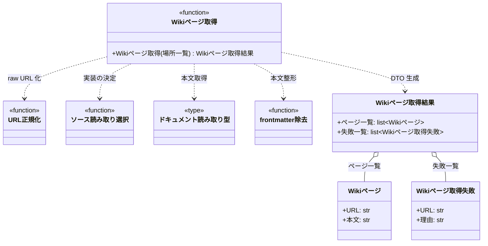

# モジュール構成: MCP / Wiki参照

`Wiki参照` ドメイン（MCP 側）に属する構成要素詳細。
エージェントが自ターンの実行中に Wiki ページを読むためのツールを扱う。

本ドメインのツールも [GitHub操作](./GitHub操作.py.md) と同じ [`_log_tool_call`](./GitHub操作.py.md#ツール呼び出しログ) でラップし、ログ出力を個々のツールに書かない。
デコレータは [アプリ組み立て](./GitHub操作.py.md#アプリ組み立て) の登録時に適用する（`mcp/wiki.py` から `mcp/server.py` を import しないため）。

場所の正規化・取得・front matter 除去は [URLドキュメント注入](../注入/URLドキュメント.py.md) の関数をそのまま使う。
取得手段は場所の形から選ぶため、raw URL とローカル絶対パスの両方を受けられる（[ソース読み取り選択](../注入/URLドキュメント.py.md#ソース読み取り選択)）。
実体をプラグイン配下に置くのは、注入 CLI がプラグインのインストール先から起動されて `src/` を参照できないため。
モニターは ai-monitor のクローンから動くので、リポジトリルートからの相対パスで `plugins/ai-monitor/inject` を `sys.path` に追加して読み込む（`constants.env` の参照と同じ向き）。

## 一覧

| ユースケース | 役割 | コンテナ | 種別 | 名前 | 概要 | 補足 |
| --- | --- | --- | --- | --- | --- | --- |
| 共通 | 取得結果 DTO | `mcp/models.py` | データモデル | [`WikiPage`](#wikiページ) / [`WikiPageFailure`](#wikiページ取得失敗) / [`WikiPagesResult`](#wikiページ取得結果) | 取得したページ本文と失敗した URL | - |
| Wikiページ取得 | MCP ツール | `mcp/wiki.py` | 関数 | [`read_wiki_pages`](#wikiページ取得) | 指定した場所の本文を配列で返す | 読み取り専用。raw URL / ローカルパスの両対応 |

## ディレクトリ構成

```
src/ai_monitor/mcp/
├── wiki.py      # read_wiki_pages
└── models.py    # WikiPage / WikiPageFailure / WikiPagesResult
```

## 構成図



## Wikiページ
> 物理名: `WikiPage`<br>
> 種別: データモデル<br>
> コンテナ: `mcp/models.py`

取得した Wiki ページ 1 件（Pydantic `BaseModel`）。

### プロパティ

| 論理名 | プロパティ名 | 型 | 可視性 | デフォルト | 説明 | 例 | 補足 |
| --- | --- | --- | --- | --- | --- | --- | --- |
| 場所 | `url` | `str` | 公開 | - | 実際に取得した場所 | `"https://raw.githubusercontent.com/o/r/master/docs/wiki/規約/コメント.md"` | blob URL を渡した場合は変換後の raw URL。ローカルはパスのまま |
| 本文 | `body` | `str` | 公開 | - | ページ本文 | `"# 規約: コメント\n..."` | 先頭の YAML front matter は除去済み |

### メソッド

なし

### 単体テスト

なし

## Wikiページ取得失敗
> 物理名: `WikiPageFailure`<br>
> 種別: データモデル<br>
> コンテナ: `mcp/models.py`

取得できなかった Wiki ページ 1 件（Pydantic `BaseModel`）。

### プロパティ

| 論理名 | プロパティ名 | 型 | 可視性 | デフォルト | 説明 | 例 | 補足 |
| --- | --- | --- | --- | --- | --- | --- | --- |
| 場所 | `url` | `str` | 公開 | - | 取得に失敗した場所 | `"https://raw.githubusercontent.com/o/r/master/docs/wiki/設計図/README.md"` | 正規化後の値 |
| 理由 | `reason` | `str` | 公開 | - | 失敗の理由 | `"HTTP Error 404: Not Found"` | HTTP ステータス・接続エラー・ファイル不在の内容 |

### メソッド

なし

### 単体テスト

なし

## Wikiページ取得結果
> 物理名: `WikiPagesResult`<br>
> 種別: データモデル<br>
> コンテナ: `mcp/models.py`

[Wikiページ取得](#wikiページ取得)の戻り値（Pydantic `BaseModel`）。

### プロパティ

| 論理名 | プロパティ名 | 型 | 可視性 | デフォルト | 説明 | 例 | 補足 |
| --- | --- | --- | --- | --- | --- | --- | --- |
| ページ一覧 | `pages` | [`list[WikiPage]`](#wikiページ) | 公開 | - | 取得できたページの配列 | `[WikiPage(url="...", body="...")]` | 並びは引数の指定順 |
| 失敗一覧 | `failures` | [`list[WikiPageFailure]`](#wikiページ取得失敗) | 公開 | `[]` | 取得できなかったページの配列 | `[WikiPageFailure(url="...", reason="HTTP Error 404: Not Found")]` | 全件成功なら空配列 |

### メソッド

なし

### 単体テスト

なし

## `mcp/wiki.py`
> 種別: ファイル

Wiki ページ取得ツールを定義するファイル。

---

### Wikiページ取得
> 物理名: `read_wiki_pages`<br>
> 種別: 関数

指定 URL の本文を取得して配列で返す。
取得できなかった URL は失敗一覧に載せ、取得できた分はそのまま返す。

#### 引数

| 論理名 | 引数名 | 型 | 必須 | デフォルト | 説明 | 補足 |
| --- | --- | --- | --- | --- | --- | --- |
| 場所一覧 | `locations` | `list[str]` | ✅ | - | 取得対象の場所の配列 | 1 件以上。raw URL / blob URL / ローカル絶対パス |

引数例:

```python
read_wiki_pages(["/home/user/repo/ai-monitor/docs/wiki/テンプレート/シナリオ.md"])
```

#### 戻り値

| 型 | 説明 | 補足 |
| --- | --- | --- |
| [`WikiPagesResult`](#wikiページ取得結果) | 取得できたページと失敗した URL | - |

戻り値例:

```python
WikiPagesResult(
    pages=[WikiPage(url="https://raw.githubusercontent.com/.../シナリオ.md", body="# ai-monitor テンプレート: シナリオ\n...")],
    failures=[WikiPageFailure(url="https://raw.githubusercontent.com/.../設計図/README.md", reason="HTTP Error 404: Not Found")],
)
```

#### 処理

1. `locations` を 1 件ずつ正規化する（GitHub blob URL は raw URL 化・[URL 正規化](../注入/URLドキュメント.py.md#url-正規化)。ローカル絶対パスはそのまま）
2. 場所の形から取得手段を選ぶ（[ソース読み取り選択](../注入/URLドキュメント.py.md#ソース読み取り選択)）
3. 選んだ [`ReadDoc`](../注入/URLドキュメント.py.md#ドキュメント読み取り型) で本文を取得する
   - 成功した場合、本文先頭の YAML front matter を除去して [Wikiページ](#wikiページ) に詰める（[front matter 除去](../注入/URLドキュメント.py.md#front-matter-除去)）
   - 失敗した場合、場所と理由を [Wikiページ取得失敗](#wikiページ取得失敗) に詰めて次の場所へ進む
     - `[WARNING]` Wiki ページの取得に失敗した（対象の場所 / 理由）
4. 指定順に並べたページ一覧と失敗一覧を [Wikiページ取得結果](#wikiページ取得結果) で返す

#### 例外

なし

#### 単体テスト

| テスト名 | 正常/異常 | 概要 | 条件 | Mock | 期待値 | 補足 |
| --- | --- | --- | --- | --- | --- | --- |
| `test_read_wiki_pages` | 正常 | 複数ページの取得 | URL 2 件 | HTTP | 指定順に 2 件の `WikiPage` が返り `failures` が空 | - |
| `test_read_wiki_pages_when_blob_url` | 正常 | blob URL の変換 | blob 形式の URL を渡す | HTTP | raw URL で取得され `url` が raw URL になる | - |
| `test_read_wiki_pages_when_frontmatter` | 正常 | front matter の除去 | 先頭に front matter があるページ | HTTP | `body` に front matter が含まれない | - |
| `test_read_wiki_pages_when_local_path` | 正常 | ローカルパスの読み取り | 一時ファイルの絶対パスを渡す | なし | ファイル本文が返り `url` がパスのまま・HTTP を呼ばない | 索引がローカルベースのとき |
| `test_read_wiki_pages_when_partial_failure` | 正常 | 一部の取得失敗 | 1 件目は成功・2 件目が 404 | HTTP | `pages` に 1 件・`failures` に場所と理由が入る | 残りの取得は継続する |
| `test_read_wiki_pages_when_all_failed` | 正常 | 全件の取得失敗 | 全ての場所が 404 | HTTP | `pages` が空・`failures` に全件が入る | 例外にはしない |
