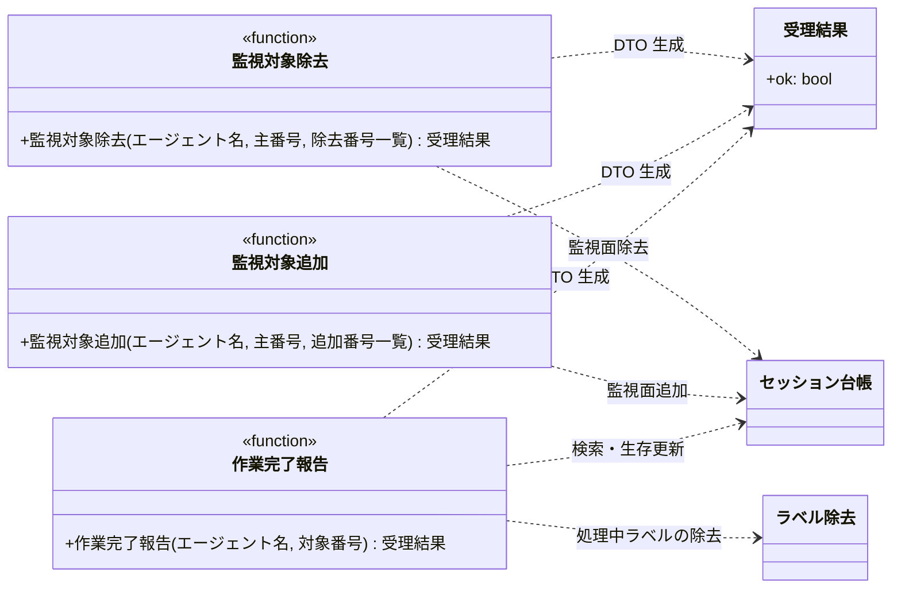

# モジュール構成: MCP / モニター連絡

`モニター連絡` ドメイン（MCP 側）に属する構成要素詳細。
エージェント → モニターの連絡（作業完了報告・監視対象の追加 / 除去）を扱う。

MCP サーバーはモニターと同一プロセスに同居するため、各ツールが[セッション台帳](../モニター/エージェント管理.py.md#セッション台帳)を直接操作する。
本ドメインのツールも [GitHub操作](./GitHub操作.py.md) と同じ [`_log_tool_call`](./GitHub操作.py.md#ツール呼び出しログ) でラップし、ログ出力を個々のツールに書かない。
登録時に[スレッド実行](./GitHub操作.py.md#スレッド実行)で包むのも同じなので、台帳の操作はポーリングとは別のワーカースレッドから走る。

## 一覧

| ユースケース | 役割 | コンテナ | 種別 | 名前 | 概要 | 補足 |
| --- | --- | --- | --- | --- | --- | --- |
| 共通 | 受理結果 DTO | `mcp/models.py` | データモデル | [`MonitorAck`](#受理結果) | 台帳操作の受理結果 | - |
| 共通 | 例外 | `mcp/server.py` | クラス | `SessionNotFoundError` | セッション台帳に対象セッションが無い | 仕様は各ツールの例外表 |
| 作業完了報告 | MCP ツール | `mcp/server.py` | 関数 | [`report_completion`](#作業完了報告) | 自ターン終了を通知して処理中ラベルを外す | - |
| 監視対象追加 | MCP ツール | `mcp/server.py` | 関数 | [`add_watch_targets`](#監視対象追加) | 作成した派生 PR を自セッションの監視面として登録 | - |
| 監視対象除去 | MCP ツール | `mcp/server.py` | 関数 | [`remove_watch_targets`](#監視対象除去) | 監視面から番号を除去 | - |
| 通知送出 | MCP ツール | `mcp/server.py` | 関数 | [`notify`](#通知送出) | 設定した Webhook へメッセージを送る | 送出の実体は [通知](../モニター/通知.py.md) |

## ディレクトリ構成

```
src/ai_monitor/mcp/
├── server.py    # report_completion / add_watch_targets / remove_watch_targets
└── models.py    # MonitorAck
```

## 構成図



## 受理結果
> 物理名: `MonitorAck`<br>
> 種別: データモデル<br>
> コンテナ: `mcp/models.py`

台帳操作の受理結果（Pydantic `BaseModel`）。

### プロパティ

| 論理名 | プロパティ名 | 型 | 可視性 | デフォルト | 説明 | 例 | 補足 |
| --- | --- | --- | --- | --- | --- | --- | --- |
| 受理 | `ok` | `bool` | 公開 | - | 台帳の更新が完了したか | `true` | 失敗は例外で表現する |

### メソッド

なし

### 単体テスト

なし

## `mcp/server.py`
> 種別: ファイル

セッション台帳を操作するツール定義。
台帳とプロジェクト設定は[アプリ組み立て](./GitHub操作.py.md#アプリ組み立て)が各ツールへ束ねる。
対象プロジェクトは全ツール共通で[プロジェクト解決](./GitHub操作.py.md#プロジェクト解決)から得る。

---

### 作業完了報告
> 物理名: `report_completion`<br>
> 種別: 関数

自ターンの終了を通知し、処理中ラベルの除去とセッションの生存更新を行う。

#### 引数

| 論理名 | 引数名 | 型 | 必須 | デフォルト | 説明 | 補足 |
| --- | --- | --- | --- | --- | --- | --- |
| エージェント名 | `agent_name` | `str` | ✅ | - | 報告するエージェント名 | セッションキーの片割れ |
| 対象番号 | `number` | `int` | ✅ | - | `処理中:{agent_name}` が付いている面の Issue / PR 番号 | 主番号または監視面番号一覧のいずれか |

引数例:

```python
report_completion("architect", 52)
```

#### 戻り値

| 型 | 説明 | 補足 |
| --- | --- | --- |
| [`MonitorAck`](#受理結果) | 受理結果 | - |

戻り値例:

```python
MonitorAck(ok=True)
```

#### 処理

1. 対象プロジェクトを解決する（[プロジェクト解決](./GitHub操作.py.md#プロジェクト解決)）
2. `project` / `agent_name` / `number` でセッションを検索する（[検索](../モニター/エージェント管理.py.md#検索)。無ければ `SessionNotFoundError` を投げる）
   - `[WARNING]` 台帳に無いセッションからの完了報告を拒否した（`project` / `agent_name` / `number`）
3. 対象から `処理中:{agent_name}` を除去する（[ラベル除去](../モニター/GitHub連携.py.md#ラベル除去)。未付与は無視される冪等操作）
4. セッションの生存時刻を更新して受理結果を返す（[生存更新](../モニター/エージェント管理.py.md#生存更新)）
   - `[INFO]` 作業完了報告を受信した（`project` / `agent_name` / `number`）

#### 例外

| 例外名 | 発生条件 | メッセージ | 補足 |
| --- | --- | --- | --- |
| `SessionNotFoundError` | セッションが台帳にない | プロジェクト / エージェント名 / 番号 | MCP がツールエラーとして返す。エージェントは無視して続行できる |

#### 単体テスト

| テスト名 | 正常/異常 | 概要 | 条件 | Mock | 期待値 | 補足 |
| --- | --- | --- | --- | --- | --- | --- |
| `test_report_completion` | 正常 | ラベル除去 + 生存更新 | 台帳に該当セッションあり | GitHub API | 処理中ラベルが除去され `last_seen_at` が更新され `ok: true` | - |
| `test_report_completion_when_unknown_session` | 異常 | セッション不明 | 台帳に該当なし | GitHub API | `SessionNotFoundError`・ラベル操作なし | 例外表「セッションが台帳にない」に対応 |

---

### 監視対象追加
> 物理名: `add_watch_targets`<br>
> 種別: 関数

作成した派生 PR の番号を自セッションの監視面として台帳に登録する。

#### 引数

| 論理名 | 引数名 | 型 | 必須 | デフォルト | 説明 | 補足 |
| --- | --- | --- | --- | --- | --- | --- |
| エージェント名 | `agent_name` | `str` | ✅ | - | 報告するエージェント名 | セッションキーの片割れ |
| 主番号 | `number` | `int` | ✅ | - | 自セッションの主番号 | - |
| 追加番号一覧 | `watch_numbers` | `list[int]` | ✅ | - | 監視面に追加する Issue / PR 番号 | 1 件以上 |

引数例:

```python
add_watch_targets("architect", 52, [60, 61])
```

#### 戻り値

| 型 | 説明 | 補足 |
| --- | --- | --- |
| [`MonitorAck`](#受理結果) | 受理結果 | - |

戻り値例:

```python
MonitorAck(ok=True)
```

#### 処理

1. 対象プロジェクトを解決する（[プロジェクト解決](./GitHub操作.py.md#プロジェクト解決)）
2. 監視面へ番号を追加して受理結果を返す（[監視面追加](../モニター/エージェント管理.py.md#監視面追加)。`KeyError` は `SessionNotFoundError` に変換する）
   - `[WARNING]` 台帳に無いセッションへの監視面追加を拒否した（`project` / `agent_name` / `number`）
   - `[INFO]` 監視面へ番号を追加した（`project` / `agent_name` / `number` / 追加した番号）

#### 例外

| 例外名 | 発生条件 | メッセージ | 補足 |
| --- | --- | --- | --- |
| `SessionNotFoundError` | セッションが台帳にない | プロジェクト / エージェント名 / 番号 | MCP がツールエラーとして返す |

#### 単体テスト

| テスト名 | 正常/異常 | 概要 | 条件 | Mock | 期待値 | 補足 |
| --- | --- | --- | --- | --- | --- | --- |
| `test_add_watch_targets` | 正常 | 監視面の追加 | 台帳に該当セッションあり | なし | 監視面に追加され `ok: true` | - |
| `test_add_watch_targets_when_unknown_session` | 異常 | セッション不明 | 台帳に該当なし | なし | `SessionNotFoundError` | 例外表「セッションが台帳にない」に対応 |

---

### 監視対象除去
> 物理名: `remove_watch_targets`<br>
> 種別: 関数

自セッションの監視面から番号を取り除く。

#### 引数

| 論理名 | 引数名 | 型 | 必須 | デフォルト | 説明 | 補足 |
| --- | --- | --- | --- | --- | --- | --- |
| エージェント名 | `agent_name` | `str` | ✅ | - | 報告するエージェント名 | セッションキーの片割れ |
| 主番号 | `number` | `int` | ✅ | - | 自セッションの主番号 | - |
| 除去番号一覧 | `watch_numbers` | `list[int]` | ✅ | - | 監視面から取り除く Issue / PR 番号 | 1 件以上 |

引数例:

```python
remove_watch_targets("architect", 52, [60])
```

#### 戻り値

| 型 | 説明 | 補足 |
| --- | --- | --- |
| [`MonitorAck`](#受理結果) | 受理結果 | - |

戻り値例:

```python
MonitorAck(ok=True)
```

#### 処理

1. 対象プロジェクトを解決する（[プロジェクト解決](./GitHub操作.py.md#プロジェクト解決)）
2. 監視面から番号を取り除いて受理結果を返す（[監視面除去](../モニター/エージェント管理.py.md#監視面除去)。`KeyError` は `SessionNotFoundError` に変換する）
   - `[WARNING]` 台帳に無いセッションへの監視面除去を拒否した（`project` / `agent_name` / `number`）
   - `[INFO]` 監視面から番号を除去した（`project` / `agent_name` / `number` / 除去した番号）

#### 例外

| 例外名 | 発生条件 | メッセージ | 補足 |
| --- | --- | --- | --- |
| `SessionNotFoundError` | セッションが台帳にない | プロジェクト / エージェント名 / 番号 | MCP がツールエラーとして返す |

#### 単体テスト

| テスト名 | 正常/異常 | 概要 | 条件 | Mock | 期待値 | 補足 |
| --- | --- | --- | --- | --- | --- | --- |
| `test_remove_watch_targets` | 正常 | 監視面の除去 | 監視面に番号あり | なし | 監視面から除去され `ok: true` | - |
| `test_remove_watch_targets_when_unknown_session` | 異常 | セッション不明 | 台帳に該当なし | なし | `SessionNotFoundError` | 例外表「セッションが台帳にない」に対応 |

---

### 通知送出
> 物理名: `notify`<br>
> 種別: 関数

設定した Webhook へエージェントの言葉でメッセージを送る。
送出の実体はモニター側が持ち、本ツールは対象プロジェクトの設定を解決して渡すだけ。

#### 引数

| 論理名 | 引数名 | 型 | 必須 | デフォルト | 説明 | 補足 |
| --- | --- | --- | --- | --- | --- | --- |
| 送信元 | `sender` | `str` | ✅ | - | 送信元のエージェント名 | 本文の先頭に付く |
| 見出し | `title` | `str` | ✅ | - | 1 行の見出し | 100 文字以内 |
| 本文 | `body` | `str` | ✅ | - | 本文 | 1500 文字以内 |
| 番号 | `number` | `int \| None` | - | `None` | 関連する Issue / PR 番号 | 指定時に対象へのリンクが付く |

引数例:

```python
notify(sender="architect", title="ライブラリ選定の判断をお願いします", body="候補 3 件の PoC が全て成立しました。", number=1069)
```

#### 戻り値

| 型 | 説明 | 補足 |
| --- | --- | --- |
| [`SendResult`](../モニター/通知.py.md#送出結果) | 送ったかと理由 | Webhook 未設定なら `sent=False` |

戻り値例:

```python
{"sent": True, "reason": ""}
```

#### 処理

1. CWD のリポジトリから対象プロジェクトを解決する（[プロジェクト解決](./GitHub操作.py.md#プロジェクト解決)。対象へのリンク生成に使う）
2. 通知設定から送出関数を組み立てる（[送出関数の組み立て](../モニター/通知.py.md#送出関数の組み立て)。未設定の場合は組み立てない）
3. 送出する（[通知送出](../モニター/通知.py.md#通知送出)）

#### 例外

なし

#### 単体テスト

| テスト名 | 正常/異常 | 概要 | 条件 | Mock | 期待値 | 補足 |
| --- | --- | --- | --- | --- | --- | --- |
| `test_notify` | 正常 | 送信成功 | 通知設定ありのプロジェクト | 送出関数 | `sent=True`・送出に送信元と見出しを含む本文が渡る | - |
| `test_notify_when_settings_missing` | 正常 | 設定なし | 通知設定の無いプロジェクト | 送出関数 | `sent=False`・送出が呼ばれない | 分岐の確認 |
