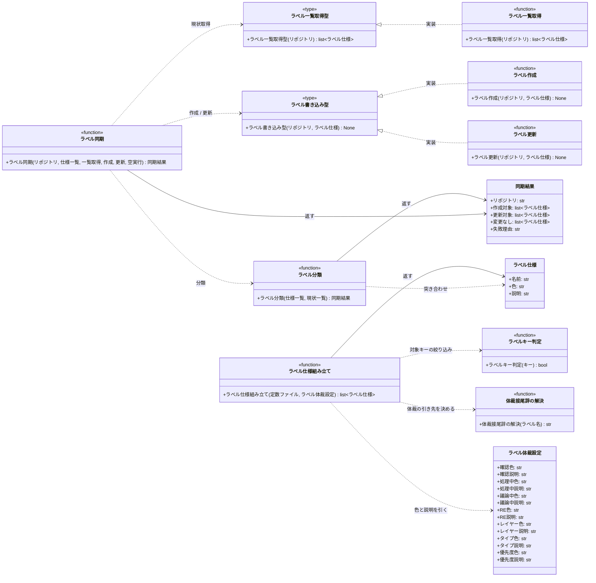

# モジュール構成: セットアップ / ラベル同期

`ラベル同期` ドメイン（セットアップ側）に属する構成要素詳細。
`constants.env` が持つラベル定数を「あるべきラベル一覧」に変換し、GitHub リポジトリの現状と突き合わせて作成 / 更新する。
GitHub への書き込みは関数型で注入するため、分類ロジックは API なしで検証できる。

## 一覧

| ユースケース | 役割 | コンテナ | 種別 | 名前 | 概要 | 補足 |
| --- | --- | --- | --- | --- | --- | --- |
| ラベル一括作成 | 設定 | `setup_labels/sync.py` | データモデル | [`LabelStyleSettings`](#ラベル体裁設定) | 接頭辞ごとの色と説明 | `constants.env` の `AI_MONITOR_LABEL_COLOR_*` / `AI_MONITOR_LABEL_DESC_*` |
| ラベル一括作成 | ドメインモデル | `setup_labels/sync.py` | データモデル | [`LabelSpec`](#ラベル仕様) | あるべきラベル 1 件 | GitHub 側の現状表現にも使う |
| ラベル一括作成 | ドメインモデル | `setup_labels/sync.py` | データモデル | [`SyncResult`](#同期結果) | 1 リポジトリ分の同期結果 | 作成 / 更新 / 変更なし の 3 分類 |
| ラベル一括作成 | ファクトリ | `setup_labels/sync.py` | 関数 | [`build_label_specs`](#ラベル仕様組み立て) | `constants.env` からラベル仕様一覧を作る | `LabelSettings` は経由しない（未定義のラベルが漏れるため） |
| ラベル一括作成 | 内部処理 | `setup_labels/sync.py` | 関数 | [`_is_label_key`](#ラベルキー判定) | 定数のキーがラベル名を持つものかを判定 | 体裁・接頭辞・非ラベルを除く |
| ラベル一括作成 | 内部処理 | `setup_labels/sync.py` | 関数 | [`_resolve_style_suffix`](#体裁接尾辞の解決) | ラベル名から体裁設定のフィールド接尾辞を解決 | 未知のラベル名は `ValueError` |
| ラベル一括作成 | 分類 | `setup_labels/sync.py` | 関数 | [`classify_labels`](#ラベル分類) | 仕様と現状を突き合わせて 3 分類に分ける | 純粋関数（API 呼び出しなし） |
| ラベル一括作成 | サービス | `setup_labels/sync.py` | 関数 | [`sync_labels`](#ラベル同期) | 分類結果に沿って作成 / 更新を実行 | GitHub 操作は関数型で注入 |
| ラベル一括作成 | サービス型（DI） | `setup_labels/sync.py` | 関数型 | [`ListLabelsFn`](#ラベル一覧取得型) | 既存ラベル一覧取得のシグネチャ | - |
| ラベル一括作成 | サービス型（DI） | `setup_labels/sync.py` | 関数型 | [`WriteLabelFn`](#ラベル書き込み型) | ラベル 1 件を書き込むシグネチャ | 作成 / 更新で同一形 |
| ラベル一括作成 | GitHub 操作 | `setup_labels/github.py` | 関数 | [`list_labels`](#ラベル一覧取得) | リポジトリの既存ラベルを全件取得 | ページングを解決する |
| ラベル一括作成 | GitHub 操作 | `setup_labels/github.py` | 関数 | [`create_label`](#ラベル作成) | ラベルを 1 件作成 | - |
| ラベル一括作成 | GitHub 操作 | `setup_labels/github.py` | 関数 | [`update_label`](#ラベル更新) | ラベルの色と説明を更新 | 名前は変更しない |

## ディレクトリ構成

```
src/ai_monitor/setup_labels/
├── sync.py      # LabelStyleSettings / LabelSpec / SyncResult / build_label_specs / classify_labels / sync_labels
└── github.py    # list_labels / create_label / update_label
```

## 構成図



## ラベル体裁設定
> 物理名: `LabelStyleSettings`<br>
> 種別: データモデル<br>
> コンテナ: `setup_labels/sync.py`

ラベル名の接頭辞ごとに引く色と説明を `constants.env` から読む Pydantic Settings。
既存の `LabelSettings` と同じローダーで `constants.env` を読み、`AI_MONITOR_LABEL_` 接頭辞を除いたキー名でマッピングする。

### プロパティ

| 論理名 | プロパティ名 | 型 | 可視性 | デフォルト | 説明 | 例 | 補足 |
| --- | --- | --- | --- | --- | --- | --- | --- |
| 確認色 | `color_confirm` | `str` | 公開 | - | `確認:` 接頭辞のラベルの色 | `"0e8a16"` | `AI_MONITOR_LABEL_COLOR_CONFIRM` |
| 確認説明 | `desc_confirm` | `str` | 公開 | - | `確認:` 接頭辞のラベルの説明 | `"担当エージェントの作業待ち"` | `AI_MONITOR_LABEL_DESC_CONFIRM` |
| 処理中色 | `color_processing` | `str` | 公開 | - | `処理中:` 接頭辞のラベルの色 | `"fbca04"` | `AI_MONITOR_LABEL_COLOR_PROCESSING` |
| 処理中説明 | `desc_processing` | `str` | 公開 | - | `処理中:` 接頭辞のラベルの説明 | `"担当エージェントが処理中"` | `AI_MONITOR_LABEL_DESC_PROCESSING` |
| 議論中色 | `color_in_discussion` | `str` | 公開 | - | `議論中` の色 | `"d93f0b"` | `AI_MONITOR_LABEL_COLOR_IN_DISCUSSION` |
| 議論中説明 | `desc_in_discussion` | `str` | 公開 | - | `議論中` の説明 | `"ユーザーとの議論が開いている（外せるのはユーザーのみ）"` | `AI_MONITOR_LABEL_DESC_IN_DISCUSSION` |
| RE 色 | `color_reverse_engineering` | `str` | 公開 | - | `リバースエンジニアリング` の色 | `"0052cc"` | `AI_MONITOR_LABEL_COLOR_REVERSE_ENGINEERING` |
| RE 説明 | `desc_reverse_engineering` | `str` | 公開 | - | `リバースエンジニアリング` の説明 | `"入力源が既存コードのタスク（各工程がリバースエンジニアリング経路を通る）"` | `AI_MONITOR_LABEL_DESC_REVERSE_ENGINEERING` |
| AI 不具合報告色 | `color_ai_defect_report` | `str` | 公開 | - | `AI不具合報告` の色 | `"e99695"` | `AI_MONITOR_LABEL_COLOR_AI_DEFECT_REPORT` |
| AI 不具合報告説明 | `desc_ai_defect_report` | `str` | 公開 | - | `AI不具合報告` の説明 | `"エージェントが手順どおり進められずに起票した不具合（ユーザーの確認待ち）"` | `AI_MONITOR_LABEL_DESC_AI_DEFECT_REPORT` |
| レイヤー色 | `color_layer` | `str` | 公開 | - | `layer:` 接頭辞のラベルの色 | `"1d76db"` | `AI_MONITOR_LABEL_COLOR_LAYER` |
| レイヤー説明 | `desc_layer` | `str` | 公開 | - | `layer:` 接頭辞のラベルの説明 | `"Issue のレイヤー"` | `AI_MONITOR_LABEL_DESC_LAYER` |
| タイプ色 | `color_type` | `str` | 公開 | - | `type:` 接頭辞のラベルの色 | `"5319e7"` | `AI_MONITOR_LABEL_COLOR_TYPE` |
| タイプ説明 | `desc_type` | `str` | 公開 | - | `type:` 接頭辞のラベルの説明 | `"変更の種別"` | `AI_MONITOR_LABEL_DESC_TYPE` |
| 優先度色 | `color_priority` | `str` | 公開 | - | `優先度:` 接頭辞のラベルの色 | `"b60205"` | `AI_MONITOR_LABEL_COLOR_PRIORITY` |
| 優先度説明 | `desc_priority` | `str` | 公開 | - | `優先度:` 接頭辞のラベルの説明 | `"優先度（ユーザーが付与）"` | `AI_MONITOR_LABEL_DESC_PRIORITY` |

### メソッド

なし

### 単体テスト

なし

## ラベル仕様
> 物理名: `LabelSpec`<br>
> 種別: データモデル<br>
> コンテナ: `setup_labels/sync.py`

ラベル 1 件の名前・色・説明。
`constants.env` から組み立てた「あるべき姿」にも、GitHub から取得した「現状」にも同じ型を使い、等値比較で差分を判定する。

### プロパティ

| 論理名 | プロパティ名 | 型 | 可視性 | デフォルト | 説明 | 例 | 補足 |
| --- | --- | --- | --- | --- | --- | --- | --- |
| 名前 | `name` | `str` | 公開 | - | ラベル名 | `"確認:architect"` | 同期のキー。大文字小文字を区別する |
| 色 | `color` | `str` | 公開 | - | 6 桁の 16 進カラーコード | `"0e8a16"` | `#` は含めない |
| 説明 | `description` | `str` | 公開 | - | ラベルの説明 | `"担当エージェントの作業待ち"` | - |

### メソッド

なし

### 単体テスト

なし

## 同期結果
> 物理名: `SyncResult`<br>
> 種別: データモデル<br>
> コンテナ: `setup_labels/sync.py`

1 リポジトリ分の同期内容。
[ラベル分類](#ラベル分類) が組み立て、[ラベル同期](#ラベル同期) がそのまま返す。

### プロパティ

| 論理名 | プロパティ名 | 型 | 可視性 | デフォルト | 説明 | 例 | 補足 |
| --- | --- | --- | --- | --- | --- | --- | --- |
| リポジトリ | `repo` | `str` | 公開 | - | 対象リポジトリ（`owner/name`） | `"shuhei1101/ai-monitor"` | - |
| 作成対象 | `created` | [`list[LabelSpec]`](#ラベル仕様) | 公開 | `[]` | GitHub 側に存在しなかったラベル | - | - |
| 更新対象 | `updated` | [`list[LabelSpec]`](#ラベル仕様) | 公開 | `[]` | 名前は一致するが色 / 説明が異なるラベル | - | 値は更新後のもの |
| 変更なし | `unchanged` | [`list[LabelSpec]`](#ラベル仕様) | 公開 | `[]` | 名前・色・説明が完全一致したラベル | - | - |
| 失敗理由 | `error` | `str \| None` | 公開 | `None` | GitHub API が失敗したときの理由 | `"403 Forbidden"` | `None` 以外のとき 3 つのリストは空。他リポジトリの処理は継続する |

### メソッド

なし

### 単体テスト

なし

## `setup_labels/sync.py`
> 種別: ファイル

ラベル定数を「あるべき一覧」に変換し、GitHub の現状と突き合わせて反映する関数ファイル。
GitHub 操作は全て関数型で受け取り、本ファイル自体は API を知らない。

---

### ラベル仕様組み立て
> 物理名: `build_label_specs`<br>
> 種別: 関数

`constants.env` を直接パースして [`LabelSpec`](#ラベル仕様) の一覧に変換する。

`LabelSettings` は経由しない。
`LabelSettings` はモニターが実際に使うラベルだけを型安全に読むためのもので、`layer:story` / `type:*` など未定義のラベルがあり、逆に `確認:` / `処理中:` の接頭辞そのものをフィールドとして持つため、ラベル一覧の出所には使えない。

#### 引数

| 論理名 | 引数名 | 型 | 必須 | デフォルト | 説明 | 補足 |
| --- | --- | --- | --- | --- | --- | --- |
| 定数ファイル | `constants_path` | `Path` | - | `CONSTANTS_ENV` | `constants.env` のパス | テストで差し替える |
| ラベル体裁設定 | `styles` | [`LabelStyleSettings`](#ラベル体裁設定) | ✅ | - | 接頭辞ごとの色と説明 | キーワード引数 |

引数例:

```python
build_label_specs(styles=LabelStyleSettings())
```

#### 戻り値

| 型 | 説明 | 補足 |
| --- | --- | --- |
| [`list[LabelSpec]`](#ラベル仕様) | あるべきラベルの一覧 | 名前の昇順で返す |

戻り値例:

```python
[
    LabelSpec(name="layer:epic", color="1d76db", description="Issue のレイヤー"),
    LabelSpec(name="確認:architect", color="0e8a16", description="担当エージェントの作業待ち"),
]
```

#### 処理

1. `constants_path` からコメント行・空行を除いた `KEY="値"` を読む
2. ラベル名になるキーだけを残す（[ラベルキー判定](#ラベルキー判定)）
3. 残ったキーの値をラベル名として、体裁設定から色と説明を決める（[体裁接尾辞の解決](#体裁接尾辞の解決)）
4. 名前の昇順に並べた [`LabelSpec`](#ラベル仕様) の一覧を返す

#### 例外

| 例外名 | 発生条件 | メッセージ | 補足 |
| --- | --- | --- | --- |
| `ValueError` | 既知の接頭辞にも単独ラベル名にも当てはまらないラベル名がある | `"体裁を解決できないラベル名です: {name}"` | ラベル追加時に体裁定数の追加を強制する |

#### 単体テスト

セットアップ:

| セットアップ | 説明 | 補足 |
| --- | --- | --- |
| 一時 `constants.env` | 検証用のキーだけを書いた一時ファイルを作る | `tmp_constants` fixture |

| テスト名 | 正常/異常 | 概要 | 条件 | Mock | 期待値 | 補足 |
| --- | --- | --- | --- | --- | --- | --- |
| `test_build_label_specs` | 正常 | 全接頭辞と単独ラベルの色と説明が引ける | 各接頭辞と `議論中` / `リバースエンジニアリング` / `AI不具合報告` を 1 件ずつ含む定数を渡す | なし | 接頭辞ごとに対応する色と説明が入り、名前の昇順で返る | 8 分岐すべてを 1 ケースで通す |
| `test_build_label_specs_when_excluded_keys` | 正常 | 対象外キーを除く | `_COLOR_` / `_DESC_` / `_PREFIX` と `AI_MONITOR_TEMPLATE_*` を含む定数を渡す | なし | それらがラベル一覧に現れない | 除外 3 分岐の確認 |
| `test_build_label_specs_when_unknown_prefix` | 異常 | 未知の接頭辞 | `"未知:foo"` を含む定数を渡す | なし | `ValueError` を投げる | 例外表「既知の接頭辞にも当てはまらない」に対応 |

---

### ラベルキー判定
> 物理名: `_is_label_key`<br>
> 種別: 関数

`constants.env` のキーがラベル名を持つものかを返す。

#### 引数

| 論理名 | 引数名 | 型 | 必須 | デフォルト | 説明 | 補足 |
| --- | --- | --- | --- | --- | --- | --- |
| キー | `key` | `str` | ✅ | - | `constants.env` の 1 キー | - |

引数例:

```python
_is_label_key("AI_MONITOR_LABEL_CONFIRM_ARCHITECT")
```

#### 戻り値

| 型 | 説明 | 補足 |
| --- | --- | --- |
| `bool` | ラベル名を持つキーかどうか | - |

戻り値例:

```python
True
```

#### 処理

1. `AI_MONITOR_LABEL_` で始まらないキーを除く（テンプレートパス等）
2. `_COLOR_` / `_DESC_` を含むキーを除く（体裁の定義）
3. `_PREFIX` で終わるキーを除く（`確認:` / `処理中:` の接頭辞そのものでラベルではない）

#### 例外

なし

#### 単体テスト

なし（同一ファイルの[ラベル仕様組み立て](#ラベル仕様組み立て)の単体テストで実物のまま検証する）

---

### 体裁接尾辞の解決
> 物理名: `_resolve_style_suffix`<br>
> 種別: 関数

ラベル名から、[ラベル体裁設定](#ラベル体裁設定)のフィールド接尾辞を解決する。

ラベルを追加したときに体裁定数の追加を忘れると `ValueError` で止まるので、色と説明のない新ラベルが GitHub に作られない。

#### 引数

| 論理名 | 引数名 | 型 | 必須 | デフォルト | 説明 | 補足 |
| --- | --- | --- | --- | --- | --- | --- |
| ラベル名 | `name` | `str` | ✅ | - | 体裁を引く対象のラベル名 | - |

引数例:

```python
_resolve_style_suffix("確認:architect")
```

#### 戻り値

| 型 | 説明 | 補足 |
| --- | --- | --- |
| `str` | 体裁設定のフィールド接尾辞 | `"confirm"` / `"layer"` 等 |

戻り値例:

```python
"confirm"
```

#### 処理

1. 既知の接頭辞（`確認:` / `処理中:` / `layer:` / `type:` / `優先度:`）で始まる場合、その接頭辞に対応する接尾辞を返す
2. 接頭辞を持たない単独ラベル（`議論中` / `リバースエンジニアリング` / `AI不具合報告`）は名前の完全一致で引いて返す
3. どれにも当てはまらない場合、体裁定数の追加を促して `ValueError` を投げる

#### 例外

| 例外名 | 発生条件 | メッセージ | 補足 |
| --- | --- | --- | --- |
| `ValueError` | 既知の接頭辞にも単独ラベル名にも当てはまらない | `"体裁を解決できないラベル名です: {name}"` | [ラベル仕様組み立て](#ラベル仕様組み立て)へ伝播する |

#### 単体テスト

なし（同一ファイルの[ラベル仕様組み立て](#ラベル仕様組み立て)の単体テストで実物のまま検証する）

---

### ラベル分類
> 物理名: `classify_labels`<br>
> 種別: 関数

あるべき仕様と GitHub 上の現状を突き合わせ、作成 / 更新 / 変更なし に分ける。

#### 引数

| 論理名 | 引数名 | 型 | 必須 | デフォルト | 説明 | 補足 |
| --- | --- | --- | --- | --- | --- | --- |
| リポジトリ | `repo` | `str` | ✅ | - | 対象リポジトリ（`owner/name`） | 結果に載せるだけで判定には使わない |
| 仕様一覧 | `specs` | [`list[LabelSpec]`](#ラベル仕様) | ✅ | - | あるべきラベル一覧 | - |
| 現状一覧 | `existing` | [`list[LabelSpec]`](#ラベル仕様) | ✅ | - | GitHub 上の既存ラベル一覧 | 仕様にない既存ラベルは無視する |

引数例:

```python
classify_labels("shuhei1101/ai-monitor", specs, existing)
```

#### 戻り値

| 型 | 説明 | 補足 |
| --- | --- | --- |
| [`SyncResult`](#同期結果) | 3 分類した結果 | 各リストは仕様一覧の順序を保つ |

戻り値例:

```python
SyncResult(
    repo="shuhei1101/ai-monitor",
    created=[LabelSpec(name="確認:reverse-architect", color="0e8a16", description="担当エージェントの作業待ち")],
    updated=[LabelSpec(name="議論中", color="d93f0b", description="ユーザーとの議論が開いている（外せるのはユーザーのみ）")],
    unchanged=[LabelSpec(name="layer:epic", color="1d76db", description="Issue のレイヤー")],
)
```

#### 処理

1. `existing` を名前をキーにした辞書に変換する
2. `specs` を 1 件ずつ見て振り分ける
   - 名前が辞書にない場合、作成対象に入れる
   - 名前があり色と説明が一致する場合、変更なしに入れる
   - 名前があり色または説明が異なる場合、更新対象に入れる
3. 3 つのリストを持つ [`SyncResult`](#同期結果) を返す

#### 例外

なし

#### 単体テスト

| テスト名 | 正常/異常 | 概要 | 条件 | Mock | 期待値 | 補足 |
| --- | --- | --- | --- | --- | --- | --- |
| `test_classify_labels` | 正常 | 3 分類すべてに振り分ける | 未存在 1 件・色違い 1 件・完全一致 1 件を渡す | なし | 作成 / 更新 / 変更なし に 1 件ずつ入る | 3 分岐を 1 ケースで通す |
| `test_classify_labels_when_description_differs` | 正常 | 説明だけ違う | 色は一致・説明のみ異なるラベルを渡す | なし | 更新対象に入る | 色一致でも説明差分を拾うことの確認 |
| `test_classify_labels_when_extra_existing` | 正常 | 仕様にない既存ラベル | `existing` にだけ存在するラベルを含める | なし | どの分類にも現れない | 削除しない制約の確認 |

---

### ラベル同期
> 物理名: `sync_labels`<br>
> 種別: 関数

1 リポジトリ分のラベルを GitHub に反映する。

#### 引数

| 論理名 | 引数名 | 型 | 必須 | デフォルト | 説明 | 補足 |
| --- | --- | --- | --- | --- | --- | --- |
| リポジトリ | `repo` | `str` | ✅ | - | 対象リポジトリ（`owner/name`） | - |
| 仕様一覧 | `specs` | [`list[LabelSpec]`](#ラベル仕様) | ✅ | - | あるべきラベル一覧 | - |
| 一覧取得 | `list_labels` | [`ListLabelsFn`](#ラベル一覧取得型) | ✅ | - | 既存ラベルの取得関数 | キーワード引数 |
| 作成 | `create_label` | [`WriteLabelFn`](#ラベル書き込み型) | ✅ | - | ラベル作成関数 | キーワード引数 |
| 更新 | `update_label` | [`WriteLabelFn`](#ラベル書き込み型) | ✅ | - | ラベル更新関数 | キーワード引数 |
| 空実行 | `dry_run` | `bool` | - | `False` | 書き込みを行わず分類だけする | キーワード引数 |

引数例:

```python
sync_labels(
    "shuhei1101/ai-monitor",
    specs,
    list_labels=list_labels,
    create_label=create_label,
    update_label=update_label,
    dry_run=False,
)
```

#### 戻り値

| 型 | 説明 | 補足 |
| --- | --- | --- |
| [`SyncResult`](#同期結果) | 反映した内容 | `dry_run` でも同じ内容を返す |

戻り値例:

```python
SyncResult(repo="shuhei1101/ai-monitor", created=[...], updated=[...], unchanged=[...])
```

#### 処理

1. 一覧取得で GitHub 上の既存ラベルを取得する
2. [ラベル分類](#ラベル分類) で 3 分類に振り分ける
3. 書き込みを行うか決める
   - `dry_run` が真の場合、何も書き込まずに分類結果を返す
   - `dry_run` が偽の場合、次のステップへ進む
4. 作成対象を 1 件ずつ作成する
   - `[INFO]` ラベルを作成した（`repo` / `name`）
5. 更新対象を 1 件ずつ更新する
   - `[INFO]` ラベルの体裁を更新した（`repo` / `name`）
6. 分類結果を返す

#### 例外

なし

#### 単体テスト

セットアップ:

| セットアップ | 説明 | 補足 |
| --- | --- | --- |
| 注入する 3 関数 | 呼び出し引数を記録するだけのスパイ関数を渡す | `label_fns` fixture |

| テスト名 | 正常/異常 | 概要 | 条件 | Mock | 期待値 | 補足 |
| --- | --- | --- | --- | --- | --- | --- |
| `test_sync_labels` | 正常 | 作成と更新を実行する | 未存在 1 件・色違い 1 件を含む仕様を渡す | なし（注入した 3 関数はスパイ） | 作成が未存在の 1 件で・更新が色違いの 1 件で呼ばれ、[`SyncResult`](#同期結果) が 3 分類を持つ | - |
| `test_sync_labels_when_dry_run` | 正常 | 書き込みを抑止する | `dry_run=True` で呼ぶ | なし（注入した 3 関数はスパイ） | 作成 / 更新が 1 度も呼ばれず、戻り値は `dry_run=False` のときと同じ | 分岐の確認 |
| `test_sync_labels_when_all_unchanged` | 正常 | 差分なし | 現状が仕様と完全一致 | なし（注入した 3 関数はスパイ） | 作成 / 更新が呼ばれず、変更なしに全件入る | 冪等性の確認 |

---

### ラベル一覧取得型
> 物理名: `ListLabelsFn`<br>
> 種別: 関数型

リポジトリの既存ラベルを全件取得する関数のシグネチャ。

#### 引数

| 論理名 | 引数名 | 型 | 必須 | デフォルト | 説明 | 補足 |
| --- | --- | --- | --- | --- | --- | --- |
| リポジトリ | `repo` | `str` | ✅ | - | 対象リポジトリ（`owner/name`） | - |

#### 戻り値

| 型 | 説明 | 補足 |
| --- | --- | --- |
| [`list[LabelSpec]`](#ラベル仕様) | 既存ラベルの一覧 | 順序は問わない |

#### 実装

| 実装 | 補足 |
| --- | --- |
| [ラベル一覧取得](#ラベル一覧取得) | 本番の実装 |

---

### ラベル書き込み型
> 物理名: `WriteLabelFn`<br>
> 種別: 関数型

ラベル 1 件を GitHub へ書き込む関数のシグネチャ。
作成と更新で同一形のため 1 型を共有する。

#### 引数

| 論理名 | 引数名 | 型 | 必須 | デフォルト | 説明 | 補足 |
| --- | --- | --- | --- | --- | --- | --- |
| リポジトリ | `repo` | `str` | ✅ | - | 対象リポジトリ（`owner/name`） | - |
| ラベル仕様 | `spec` | [`LabelSpec`](#ラベル仕様) | ✅ | - | 書き込む内容 | - |

#### 戻り値

| 型 | 説明 | 補足 |
| --- | --- | --- |
| `None` | なし | 副作用: GitHub 上のラベルが作成 / 更新される |

#### 実装

| 実装 | 補足 |
| --- | --- |
| [ラベル作成](#ラベル作成) | 未存在のラベルに使う |
| [ラベル更新](#ラベル更新) | 既存ラベルの体裁変更に使う |

## `setup_labels/github.py`
> 種別: ファイル

githubkit でラベル API を叩く薄いラッパー関数ファイル。
クライアントは既存の `get_client` から取得する。

---

### ラベル一覧取得
> 物理名: `list_labels`<br>
> 種別: 関数<br>
> 継承元: [`ListLabelsFn`](#ラベル一覧取得型)

リポジトリのラベルをページングを解決して全件取得する。

#### 引数

| 論理名 | 引数名 | 型 | 必須 | デフォルト | 説明 | 補足 |
| --- | --- | --- | --- | --- | --- | --- |
| リポジトリ | `repo` | `str` | ✅ | - | 対象リポジトリ（`owner/name`） | - |

引数例:

```python
list_labels("shuhei1101/ai-monitor")
```

#### 戻り値

| 型 | 説明 | 補足 |
| --- | --- | --- |
| [`list[LabelSpec]`](#ラベル仕様) | 既存ラベルの一覧 | 説明が未設定のラベルは空文字にする |

戻り値例:

```python
[LabelSpec(name="bug", color="d73a4a", description="")]
```

#### 処理

1. `repo` を owner と name に分割する
2. ラベル一覧 API を 100 件ずつページングしながら全件取得する
3. 各ラベルを [`LabelSpec`](#ラベル仕様) に変換して返す（説明が `None` なら空文字にする）

#### 例外

| 例外名 | 発生条件 | メッセージ | 補足 |
| --- | --- | --- | --- |
| `RequestFailed` | GitHub API が 4xx / 5xx を返す | githubkit の既定メッセージ | 呼び出し側（[ラベル一括作成の起動](./起動.py.md#ラベル一括作成の起動)）が終了コード 2 に変換する |

#### 単体テスト

| テスト名 | 正常/異常 | 概要 | 条件 | Mock | 期待値 | 補足 |
| --- | --- | --- | --- | --- | --- | --- |
| `test_list_labels` | 正常 | 1 ページ分を変換する | 3 件を返す応答を設定 | githubkit | 3 件の [`LabelSpec`](#ラベル仕様) を返す | - |
| `test_list_labels_when_paginated` | 正常 | 複数ページを結合する | 100 件 + 20 件の 2 ページを返す応答を設定 | githubkit | 120 件を返し、API が 2 回呼ばれる | 分岐の確認 |
| `test_list_labels_when_description_none` | 正常 | 説明が未設定 | `description` が `None` の応答を設定 | githubkit | 説明が空文字になる | 分岐の確認 |

---

### ラベル作成
> 物理名: `create_label`<br>
> 種別: 関数<br>
> 継承元: [`WriteLabelFn`](#ラベル書き込み型)

ラベルを 1 件作成する。

#### 引数

| 論理名 | 引数名 | 型 | 必須 | デフォルト | 説明 | 補足 |
| --- | --- | --- | --- | --- | --- | --- |
| リポジトリ | `repo` | `str` | ✅ | - | 対象リポジトリ（`owner/name`） | - |
| ラベル仕様 | `spec` | [`LabelSpec`](#ラベル仕様) | ✅ | - | 作成する内容 | - |

引数例:

```python
create_label("shuhei1101/ai-monitor", LabelSpec(name="確認:architect", color="0e8a16", description="担当エージェントの作業待ち"))
```

#### 戻り値

| 型 | 説明 | 補足 |
| --- | --- | --- |
| `None` | なし | 副作用: GitHub 上にラベルが作成される |

#### 処理

1. `repo` を owner と name に分割する
2. ラベル作成 API に名前・色・説明を渡して呼ぶ

#### 例外

| 例外名 | 発生条件 | メッセージ | 補足 |
| --- | --- | --- | --- |
| `RequestFailed` | GitHub API が 4xx / 5xx を返す | githubkit の既定メッセージ | 権限不足（403）もここに含む |

#### 単体テスト

| テスト名 | 正常/異常 | 概要 | 条件 | Mock | 期待値 | 補足 |
| --- | --- | --- | --- | --- | --- | --- |
| `test_create_label` | 正常 | 作成 API を呼ぶ | 正常応答を設定 | githubkit | 名前・色・説明が API に渡る | - |

---

### ラベル更新
> 物理名: `update_label`<br>
> 種別: 関数<br>
> 継承元: [`WriteLabelFn`](#ラベル書き込み型)

既存ラベルの色と説明を更新する。

#### 引数

| 論理名 | 引数名 | 型 | 必須 | デフォルト | 説明 | 補足 |
| --- | --- | --- | --- | --- | --- | --- |
| リポジトリ | `repo` | `str` | ✅ | - | 対象リポジトリ（`owner/name`） | - |
| ラベル仕様 | `spec` | [`LabelSpec`](#ラベル仕様) | ✅ | - | 更新後の内容 | 名前は変更しない |

引数例:

```python
update_label("shuhei1101/ai-monitor", LabelSpec(name="議論中", color="d93f0b", description="ユーザーとの議論が開いている（外せるのはユーザーのみ）"))
```

#### 戻り値

| 型 | 説明 | 補足 |
| --- | --- | --- |
| `None` | なし | 副作用: GitHub 上のラベルの色と説明が変わる |

#### 処理

1. `repo` を owner と name に分割する
2. ラベル更新 API に `spec.name` を対象として色と説明を渡して呼ぶ

#### 例外

| 例外名 | 発生条件 | メッセージ | 補足 |
| --- | --- | --- | --- |
| `RequestFailed` | GitHub API が 4xx / 5xx を返す | githubkit の既定メッセージ | - |

#### 単体テスト

| テスト名 | 正常/異常 | 概要 | 条件 | Mock | 期待値 | 補足 |
| --- | --- | --- | --- | --- | --- | --- |
| `test_update_label` | 正常 | 更新 API を呼ぶ | 正常応答を設定 | githubkit | 対象名・色・説明が API に渡り、名前の変更は要求しない | - |
