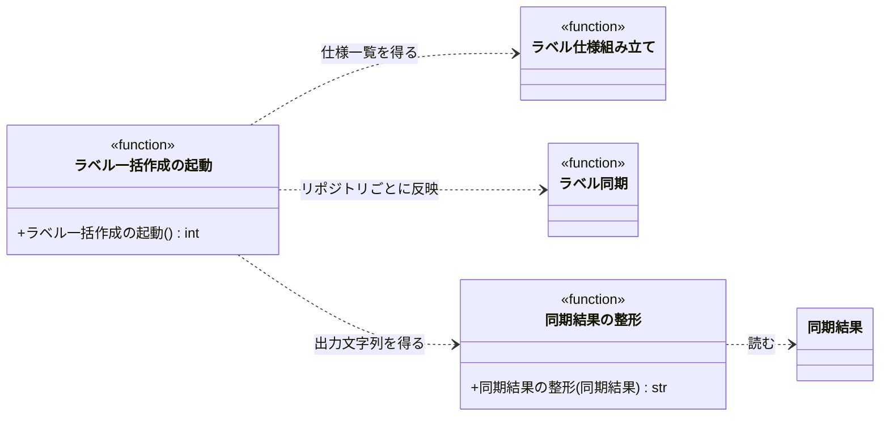

# モジュール構成: セットアップ / 起動

`起動` 分類（セットアップ側）に属する構成要素詳細。
ラベル一括作成 CLI のエントリポイントで、設定読込・対象リポジトリの解決・[ラベル同期](./ラベル同期.py.md#ラベル同期) の配線・結果出力だけを担う。

## 一覧

| ユースケース | 役割 | コンテナ | 種別 | 名前 | 概要 | 補足 |
| --- | --- | --- | --- | --- | --- | --- |
| ラベル一括作成 | エントリポイント | `setup_labels/__main__.py` | 関数 | [`main`](#ラベル一括作成の起動) | 引数解析から結果出力までを順に実行する | `python -m ai_monitor.setup_labels` で呼ばれる |
| ラベル一括作成 | フォーマッタ | `setup_labels/__main__.py` | 関数 | [`format_result`](#同期結果の整形) | 同期結果を標準出力用のテキストにする | - |

## ディレクトリ構成

```
src/ai_monitor/setup_labels/
└── __main__.py    # main / format_result
```

## 構成図



## `setup_labels/__main__.py`
> 種別: ファイル

ラベル一括作成 CLI の composition root。

---

### ラベル一括作成の起動
> 物理名: `main`<br>
> 種別: 関数

コマンドライン引数を解析し、対象リポジトリごとにラベルを同期して結果を出力する。

#### 引数

なし

引数例:

```bash
python -m ai_monitor.setup_labels --repo shuhei1101/ai-monitor --dry-run
```

#### 戻り値

| 型 | 説明 | 補足 |
| --- | --- | --- |
| `int` | プロセスの終了コード | `0` 成功 / `1` 設定エラー / `2` GitHub API エラー |

戻り値例:

```python
0
```

#### 処理

1. `--repo` と `--dry-run` を解析する
2. `Settings` と `LabelStyleSettings` を読み込む
3. 対象プロジェクトを決める
   - `--repo` 指定なしの場合、`projects[]` の全件を対象にする
   - `--repo` が `projects[]` にある場合、その 1 件を対象にする
   - `--repo` が `projects[]` にない場合、登録済みリポジトリ一覧を標準エラーへ出して `1` を返す
     - `[ERROR]` 未登録のリポジトリが指定された（`repo`）
4. [ラベル仕様組み立て](./ラベル同期.py.md#ラベル仕様組み立て) に `LabelStyleSettings` を渡してあるべきラベル一覧を作る
5. 対象リポジトリごとに [ラベル同期](./ラベル同期.py.md#ラベル同期) を呼び、GitHub 操作 3 種を注入して反映する
   - `RequestFailed` が起きた場合、そのリポジトリだけを失敗として扱い、失敗理由を持つ [同期結果](./ラベル同期.py.md#同期結果) に差し替えて次のリポジトリへ進む（1 リポジトリの不具合で全体を止めない）
     - `[ERROR]` ラベルの反映に失敗した（`repo` / `status`）
6. リポジトリごとに [同期結果の整形](#同期結果の整形) の結果を標準出力へ書く
7. 失敗の有無で終了コードを決める
   - 失敗理由を持つ結果が 1 件以上ある場合、`2` を返す
   - 全て成功した場合、`0` を返す

#### 例外

なし

#### 単体テスト

セットアップ:

| セットアップ | 説明 | 補足 |
| --- | --- | --- |
| 設定 | `projects[]` に 2 件を登録した `Settings` を返すようにする | `settings_two_projects` fixture |

| テスト名 | 正常/異常 | 概要 | 条件 | Mock | 期待値 | 補足 |
| --- | --- | --- | --- | --- | --- | --- |
| `test_main` | 正常 | 全プロジェクトを同期する | `--repo` なしで実行 | `Settings` / [ラベル同期](./ラベル同期.py.md#ラベル同期) | 同期が 2 回呼ばれ、標準出力に 2 リポジトリ分のサマリが出て `0` を返す | - |
| `test_main_when_repo_specified` | 正常 | 1 件だけ同期する | `--repo` に登録済みリポジトリを指定 | `Settings` / [ラベル同期](./ラベル同期.py.md#ラベル同期) | 同期が 1 回だけ呼ばれ `0` を返す | 分岐の確認 |
| `test_main_when_dry_run` | 正常 | 空実行を伝播する | `--dry-run` を指定 | `Settings` / [ラベル同期](./ラベル同期.py.md#ラベル同期) | 同期に `dry_run=True` が渡る | 分岐の確認 |
| `test_main_when_repo_not_registered` | 異常 | 未登録リポジトリ | `--repo` に未登録リポジトリを指定 | `Settings` / [ラベル同期](./ラベル同期.py.md#ラベル同期) | 同期が呼ばれず、標準エラーに登録済み一覧が出て `1` を返す | 分岐の確認 |
| `test_main_when_request_failed` | 異常 | 一部リポジトリの失敗 | 1 件目は正常・2 件目は `RequestFailed` を投げる同期を設定 | `Settings` / [ラベル同期](./ラベル同期.py.md#ラベル同期) | 同期が 2 回呼ばれ、標準出力に 1 件目のサマリと 2 件目の失敗が出て `2` を返す | 失敗の切り離しの確認 |

---

### 同期結果の整形
> 物理名: `format_result`<br>
> 種別: 関数

[同期結果](./ラベル同期.py.md#同期結果) を標準出力用の複数行テキストにする。

#### 引数

| 論理名 | 引数名 | 型 | 必須 | デフォルト | 説明 | 補足 |
| --- | --- | --- | --- | --- | --- | --- |
| 同期結果 | `result` | [`SyncResult`](./ラベル同期.py.md#同期結果) | ✅ | - | 1 リポジトリ分の反映内容 | - |

引数例:

```python
format_result(SyncResult(repo="shuhei1101/ai-monitor", created=[...], updated=[], unchanged=[...]))
```

#### 戻り値

| 型 | 説明 | 補足 |
| --- | --- | --- |
| `str` | 件数サマリ行 + 作成 / 更新の名前行、または失敗行 | 末尾に改行を含めない |

戻り値例:

```text
shuhei1101/ai-monitor: 作成 2 / 更新 1 / 変更なし 40
  作成: 確認:reverse-architect, 処理中:reverse-architect
  更新: 議論中
```

#### 処理

1. 失敗理由の有無で出力形を決める
   - 失敗理由がある場合、`{リポジトリ}: 失敗（{失敗理由}）` の 1 行だけを返す
   - 失敗理由がない場合、次のステップへ進む
2. リポジトリ名と 3 分類の件数を 1 行目に組み立てる
3. 作成対象があれば、ラベル名をカンマ区切りにした行を足す
4. 更新対象があれば、ラベル名をカンマ区切りにした行を足す
5. 組み立てた行を改行で連結して返す

#### 例外

なし

#### 単体テスト

| テスト名 | 正常/異常 | 概要 | 条件 | Mock | 期待値 | 補足 |
| --- | --- | --- | --- | --- | --- | --- |
| `test_format_result` | 正常 | 作成と更新の両方を出す | 作成 2 件・更新 1 件・変更なし 40 件 | なし | サマリ行 + 作成行 + 更新行の 3 行になる | - |
| `test_format_result_when_no_change` | 正常 | 差分なし | 作成 0 件・更新 0 件 | なし | サマリ行だけの 1 行になる | 2 分岐の確認 |
| `test_format_result_when_error` | 正常 | 失敗したリポジトリ | 失敗理由に `"403 Forbidden"` を持つ結果 | なし | `失敗（403 Forbidden）` の 1 行だけになる | 分岐の確認 |
