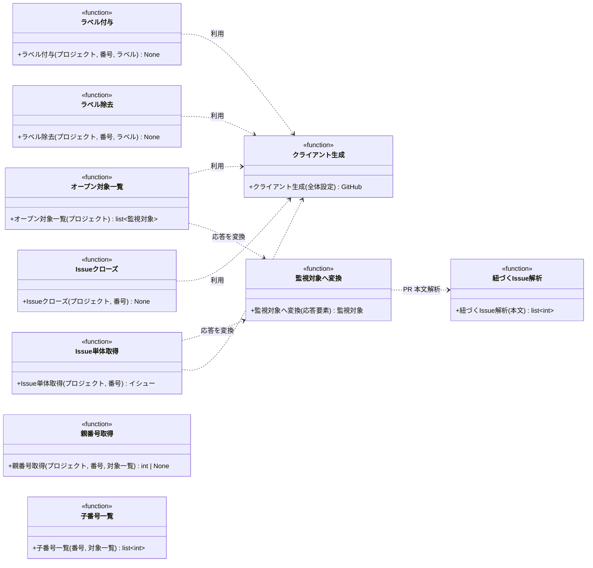
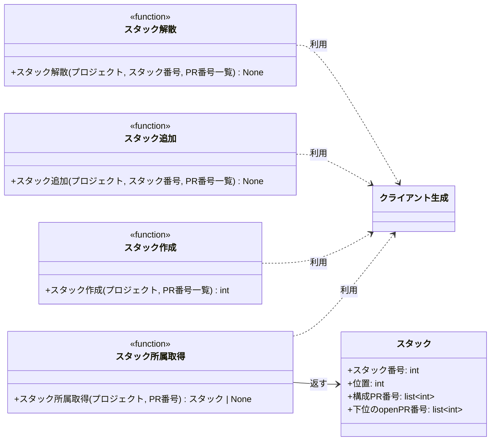

# モジュール構成: モニター / GitHub連携

`GitHub連携` ドメイン（モニター側）に属する構成要素詳細。
モニターが GitHub API（githubkit）を呼ぶ薄い連携層で、取得結果は[イシュー](./エージェント管理.py.md#イシュー) / [プルリクエスト](./エージェント管理.py.md#プルリクエスト)（別分類のドメインモデル）に変換して返す。

- 対応テストファイル: `tests/unit/ai_monitor/integrations/github/test_search.py` / `tests/unit/ai_monitor/integrations/github/test_labels.py` / `tests/unit/ai_monitor/integrations/github/test_issues.py` / `tests/unit/ai_monitor/integrations/github/test_stacks.py`

## 一覧

| ユースケース | 役割 | コンテナ | 種別 | 名前 | 概要 | 補足 |
| --- | --- | --- | --- | --- | --- | --- |
| 共通 | クライアント生成 | `integrations/github/client.py` | 関数 | [`get_client`](#クライアント生成) | 設定の `github_token` から githubkit クライアントを生成・共有 | - |
| 共通 | 対象列挙 | `integrations/github/search.py` | 関数 | [`list_open_targets`](#オープン対象一覧) | open の Issue / PR を全件取得して変換 | ポーリング 1 周期 1 回 |
| 共通 | 変換 | `integrations/github/search.py` | 関数 | [`to_target`](#監視対象へ変換) | API 応答の 1 要素をドメインモデルに変換 | 一覧取得と単体取得の両方が使う |
| 共通 | 内部処理 | `integrations/github/search.py` | 関数 | [`_parse_linked_issue_numbers`](#紐づく-issue-解析) | PR 本文の `## 紐づく Issue` から Issue 番号を抽出 | - |
| 共通 | ラベル操作 | `integrations/github/labels.py` | 関数 | [`add_label`](#ラベル付与) | ラベルを 1 つ付与 | 処理中ラベルの付与に使用 |
| 共通 | ラベル操作 | `integrations/github/labels.py` | 関数 | [`remove_label`](#ラベル除去) | ラベルを 1 つ除去（未付与は無視） | 処理中ラベルの除去に使用 |
| 共通 | クローズ | `integrations/github/issues.py` | 関数 | [`close_issue`](#issue-クローズ) | Issue を completed でクローズ | intake 自動クローズに使用 |
| 共通 | 単体取得 | `integrations/github/issues.py` | 関数 | [`get_issue`](#issue-単体取得) | Issue / PR を 1 件取得して変換 | クローズ確認に使用 |
| 共通 | 親取得 | `integrations/github/issues.py` | 関数 | [`get_parent_number`](#親番号取得) | 自分の base を head に持つ親 PR の番号を返す | 親なしは `None` |
| 共通 | 子取得 | `integrations/github/issues.py` | 関数 | [`list_child_numbers`](#子番号一覧) | base に自分の head を持つ子 PR の番号一覧を取得 | 1 段のみ（再帰はクリーンアップ側） |
| 共通 | ドメインモデル | `integrations/github/stacks.py` | データモデル | [`Stack`](#スタック) | PR のスタック所属（番号・位置・構成・下位の open PR） | frozen dataclass |
| 共通 | スタック取得 | `integrations/github/stacks.py` | 関数 | [`get_stack`](#スタック所属取得) | PR のスタック番号・位置・下位の open PR を GraphQL で取得 | 未所属は `None` |
| 共通 | スタック操作 | `integrations/github/stacks.py` | 関数 | [`create_stack`](#スタック作成) | PR 番号の並びからスタックを作る | REST `POST /stacks` |
| 共通 | スタック操作 | `integrations/github/stacks.py` | 関数 | [`add_to_stack`](#スタック追加) | 既存スタックの上端へ PR を積む | REST `POST /stacks/{n}/add` |
| 共通 | スタック操作 | `integrations/github/stacks.py` | 関数 | [`dissolve_stack`](#スタック解散) | スタックを解散する | REST `POST /stacks/{n}/unstack`。1 件指定でも全体が解散する |

## ディレクトリ構成

```
src/ai_monitor/integrations/github/
├── client.py    # get_client（githubkit クライアントの生成・共有）
├── search.py    # list_open_targets / to_target / _parse_linked_issue_numbers
├── labels.py    # add_label / remove_label
├── issues.py    # close_issue / get_issue / get_parent_number / list_child_numbers
└── stacks.py    # get_stack / create_stack / add_to_stack / dissolve_stack
```

## 構成図

### 対象取得とラベル操作



---

### スタック操作



## `integrations/github/client.py`
> 種別: ファイル

githubkit クライアントの生成・共有を担うファイル。

---

### クライアント生成
> 物理名: `get_client`<br>
> 種別: 関数

githubkit クライアントを生成してモジュール内で共有する。

#### 引数

| 論理名 | 引数名 | 型 | 必須 | デフォルト | 説明 | 補足 |
| --- | --- | --- | --- | --- | --- | --- |
| 全体設定 | `settings` | [`Settings`](./エージェント管理.py.md#全体設定) | ✅ | - | `github_token` の出所 | - |

引数例:

```python
get_client(settings)
```

#### 戻り値

| 型 | 説明 | 補足 |
| --- | --- | --- |
| `GitHub` | githubkit クライアント | 2 回目以降は同一インスタンス |

戻り値例:

```python
GitHub(auth="github_pat_...")
```

#### 処理

1. 初回呼び出し時に `settings.github_token` で `GitHub` クライアントを生成してモジュール内に保持する
2. 2 回目以降は保持済みの同一インスタンスを返す

#### 例外

なし

#### 単体テスト

| テスト名 | 正常/異常 | 概要 | 条件 | Mock | 期待値 | 補足 |
| --- | --- | --- | --- | --- | --- | --- |
| `test_get_client` | 正常 | インスタンスの共有 | 2 回呼び出し | なし | 同一インスタンスが返る | - |

## `integrations/github/search.py`
> 種別: ファイル

open 対象の列挙と PR 本文の解析を担うファイル。
GitHub API を呼ぶ関数は[クライアント生成](#クライアント生成)を共通で通る。

---

### オープン対象一覧
> 物理名: `list_open_targets`<br>
> 種別: 関数

open の Issue / PR を全件取得してドメインモデルで返す（ポーリング 1 周期につき 1 回呼び、全エージェントで共有する）。

#### 引数

| 論理名 | 引数名 | 型 | 必須 | デフォルト | 説明 | 補足 |
| --- | --- | --- | --- | --- | --- | --- |
| プロジェクト | `project` | [`MonitoredProject`](./エージェント管理.py.md#監視対象プロジェクト) | ✅ | - | 取得対象のプロジェクト | - |

引数例:

```python
list_open_targets(project)
```

#### 戻り値

| 型 | 説明 | 補足 |
| --- | --- | --- |
| [`list[MonitorTarget]`](./エージェント管理.py.md#監視対象) | open の全 Issue / PR | ラベル・assignee・本文込み |

戻り値例:

```python
[Issue(number=35, state="open", labels=["layer:epic", "確認:epic-conductor"], assignees=[]), PullRequest(number=52, state="open", labels=["確認:tester"], assignees=[], linked_issue_numbers=[50])]
```

#### 処理

1. `state=open` の Issue / PR 一覧をページネーションで全件取得する（`rest.issues.list`。PR も Issue として返る）
2. 各要素をドメインモデルに変換して返す（[監視対象へ変換](#監視対象へ変換)）

#### 例外

| 例外名 | 発生条件 | メッセージ | 補足 |
| --- | --- | --- | --- |
| `RequestFailed` | API 応答が 4xx / 5xx | HTTP ステータスと本文 | githubkit から伝播 |

#### 単体テスト

| テスト名 | 正常/異常 | 概要 | 条件 | Mock | 期待値 | 補足 |
| --- | --- | --- | --- | --- | --- | --- |
| `test_list_open_targets_when_multi_page` | 正常 | ページ跨ぎの全件取得 | 2 ページ分の open 応答 | githubkit | `state=open` で照会され、ページを跨いだ全件が返る | - |
| `test_list_open_targets_when_pr_mixed` | 正常 | Issue / PR の判別変換 | `pull_request` キーの有無が混在する応答 | githubkit | PR は `PullRequest`（`linked_issue_numbers` 解決済み）・それ以外は `Issue` になる | - |
| `test_list_open_targets_when_pr` | 正常 | PR の変換 | `pull_request` キーを持つ応答 | githubkit | `PullRequest` になり `base_ref` と `linked_issue_numbers` が入る | - |

---

### 監視対象へ変換
> 物理名: `to_target`<br>
> 種別: 関数

GitHub API 応答の 1 要素を[監視対象](./エージェント管理.py.md#監視対象)へ変換する。

一覧取得（[オープン対象一覧](#オープン対象一覧)）と単体取得（[Issue 単体取得](#issue-単体取得)）が同じ変換規則を通るように切り出している。

#### 引数

| 論理名 | 引数名 | 型 | 必須 | デフォルト | 説明 | 補足 |
| --- | --- | --- | --- | --- | --- | --- |
| 応答要素 | `item` | `object` | ✅ | - | githubkit が返した Issue / PR 1 件 | PR も Issue として返る |

引数例:

```python
to_target(item)
```

#### 戻り値

| 型 | 説明 | 補足 |
| --- | --- | --- |
| [`MonitorTarget`](./エージェント管理.py.md#監視対象) | 変換したドメインモデル | Issue か PullRequest のいずれか |

戻り値例:

```python
PullRequest(number=52, state="open", draft=True, labels=["確認:tester"], assignees=[], linked_issue_numbers=[50])
```

#### 処理

1. ラベル名と assignee のログイン名を取り出す
2. 応答の種別で変換先を分ける
   - `pull_request` キーを持つ場合、本文から `linked_issue_numbers` を抽出して[プルリクエスト](./エージェント管理.py.md#プルリクエスト)にする（[紐づく Issue 解析](#紐づく-issue-解析)）
   - 持たない場合、[イシュー](./エージェント管理.py.md#イシュー)にする

#### 例外

なし

#### 単体テスト

なし（同一ファイルの[オープン対象一覧](#オープン対象一覧)の単体テストで実物のまま検証する）

---

### 紐づく Issue 解析
> 物理名: `_parse_linked_issue_numbers`<br>
> 種別: 関数

PR 本文の `## 紐づく Issue` セクションから Issue 番号を抽出する。

#### 引数

| 論理名 | 引数名 | 型 | 必須 | デフォルト | 説明 | 補足 |
| --- | --- | --- | --- | --- | --- | --- |
| 本文 | `body` | `str` | ✅ | - | PR 本文（Markdown） | - |

引数例:

```python
_parse_linked_issue_numbers("## 紐づく Issue\n\n- #50")
```

#### 戻り値

| 型 | 説明 | 補足 |
| --- | --- | --- |
| `list[int]` | 抽出した Issue 番号（出現順） | セクションなしは `[]` |

戻り値例:

```python
[50]
```

#### 処理

1. 本文から `## 紐づく Issue` セクションを取り出す（無い場合は空リストを返す）
2. セクション内の `#N` 参照から Issue 番号を重複なし・出現順で抽出して返す

#### 例外

なし

#### 単体テスト

| テスト名 | 正常/異常 | 概要 | 条件 | Mock | 期待値 | 補足 |
| --- | --- | --- | --- | --- | --- | --- |
| `test_parse_linked_issue_numbers` | 正常 | 番号の抽出 | セクション内に `#50` `#51` | なし | `[50, 51]` | - |
| `test_parse_linked_issue_numbers_when_section_missing` | 正常 | セクションなしは空 | `## 紐づく Issue` の無い本文 | なし | `[]` | - |
| `test_parse_linked_issue_numbers_when_duplicated` | 正常 | 重複の排除 | 同一番号が 2 回現れる本文 | なし | 1 件に畳まれる | - |

## スタック
> 物理名: `Stack`<br>
> 種別: データモデル<br>
> コンテナ: `integrations/github/stacks.py`

PR のスタック所属（`@dataclass(frozen=True, slots=True, kw_only=True)`）。

### プロパティ

| 論理名 | プロパティ名 | 型 | 可視性 | デフォルト | 説明 | 例 | 補足 |
| --- | --- | --- | --- | --- | --- | --- | --- |
| スタック番号 | `number` | `int` | 公開 | - | スタック番号 | `123` | PR / Issue と同じ採番空間を共有する |
| 位置 | `position` | `int` | 公開 | - | 自分のスタック上の位置 | `3` | 底が 1 |
| 構成 PR 番号 | `pull_requests` | `list[int]` | 公開 | `[]` | 下から上の順に並んだ構成 PR 番号 | `[120, 121, 122]` | - |
| 下位の open PR 番号 | `below_open` | `list[int]` | 公開 | `[]` | 自分より下でまだ open な PR 番号 | `[120]` | 空でない間は着手できない |

### メソッド

なし

### 単体テスト

なし

## `integrations/github/stacks.py`

GitHub の Stacked Pull Requests を読み書きする。
`gh stack` CLI は底の PR の base をデフォルトブランチへ書き換えるため使わず、REST / GraphQL を直接呼ぶ。

### スタック所属取得
> 物理名: `get_stack`<br>
> 種別: 関数

PR のスタック所属を GraphQL で取得する。

#### 引数

| 論理名 | 引数名 | 型 | 必須 | デフォルト | 説明 | 補足 |
| --- | --- | --- | --- | --- | --- | --- |
| プロジェクト | `project` | `MonitoredProject` | ✅ | - | 対象リポジトリ | - |
| PR 番号 | `pr_number` | `int` | ✅ | - | 対象 PR 番号 | - |

#### 戻り値

| 型 | 説明 | 補足 |
| --- | --- | --- |
| [`Stack \| None`](#スタック) | スタック番号・自分の位置・構成 PR | 未所属は `None` |

#### 処理

1. `PullRequest.stack`（`number` / `size` / `entries`）と `stackEntry.position` を GraphQL で取る
2. `stack` が `null` なら `None` を返す
3. 自分より `position` が小さい entry のうち open な PR 番号を集めて返す

#### 例外

| 例外名 | 発生条件 | メッセージ | 補足 |
| --- | --- | --- | --- |
| `RequestFailed` | API 応答が 4xx / 5xx | HTTP ステータスと本文 | 呼び出し元の周期を見送る |

#### 単体テスト

| テスト名 | 正常/異常 | 概要 | 条件 | Mock | 期待値 | 補足 |
| --- | --- | --- | --- | --- | --- | --- |
| `test_get_stack` | 正常 | 所属ありの取得 | 3 件のスタックの上端 | githubkit | 番号・位置・下位の open PR が返る | - |
| `test_get_stack_when_not_stacked` | 正常 | 未所属 | `stack` が `null` | githubkit | `None` が返る | - |
| `test_get_stack_when_below_merged` | 正常 | 下位が全て merged | 下位 PR が closed | githubkit | 下位の open PR が空で返る | 起動可能の判定に使う |

---

### スタック作成
> 物理名: `create_stack`<br>
> 種別: 関数

PR 番号の並びからスタックを作る。

#### 引数

| 論理名 | 引数名 | 型 | 必須 | デフォルト | 説明 | 補足 |
| --- | --- | --- | --- | --- | --- | --- |
| プロジェクト | `project` | `MonitoredProject` | ✅ | - | 対象リポジトリ | - |
| PR 番号一覧 | `pull_requests` | `list[int]` | ✅ | - | 下から上の順 | 2 件以上 |

#### 戻り値

| 型 | 説明 | 補足 |
| --- | --- | --- |
| `int` | 作成したスタック番号 | - |

#### 処理

1. `POST /repos/{owner}/{repo}/stacks` に `pull_requests` を渡す
2. 応答の `number` を返す

#### 例外

| 例外名 | 発生条件 | メッセージ | 補足 |
| --- | --- | --- | --- |
| `RequestFailed` | base ref の連鎖が繋がっていない / 既に別スタックに属する PR を含む | HTTP ステータスと本文 | - |

#### 単体テスト

| テスト名 | 正常/異常 | 概要 | 条件 | Mock | 期待値 | 補足 |
| --- | --- | --- | --- | --- | --- | --- |
| `test_create_stack` | 正常 | スタック作成 | 連鎖する 2 件 | githubkit | `POST /stacks` が呼ばれ番号が返る | - |
| `test_create_stack_when_base_broken` | 異常 | 連鎖の不整合 | API が 422 | githubkit | `RequestFailed` | - |

---

### スタック追加
> 物理名: `add_to_stack`<br>
> 種別: 関数

既存スタックの上端へ PR を積む。

#### 引数

| 論理名 | 引数名 | 型 | 必須 | デフォルト | 説明 | 補足 |
| --- | --- | --- | --- | --- | --- | --- |
| プロジェクト | `project` | `MonitoredProject` | ✅ | - | 対象リポジトリ | - |
| スタック番号 | `stack_number` | `int` | ✅ | - | 追加先のスタック | - |
| PR 番号一覧 | `pull_requests` | `list[int]` | ✅ | - | 上端から上へ積む順 | - |

#### 戻り値

| 型 | 説明 | 補足 |
| --- | --- | --- |
| `None` | なし（副作用のみ） | - |

#### 処理

1. `POST /repos/{owner}/{repo}/stacks/{stack_number}/add` に `pull_requests` を渡す

#### 例外

| 例外名 | 発生条件 | メッセージ | 補足 |
| --- | --- | --- | --- |
| `RequestFailed` | base ref が繋がっていない / 既に別スタックに属する PR を含む | HTTP ステータスと本文 | - |

#### 単体テスト

| テスト名 | 正常/異常 | 概要 | 条件 | Mock | 期待値 | 補足 |
| --- | --- | --- | --- | --- | --- | --- |
| `test_add_to_stack` | 正常 | 上端への追加 | 既存スタック + 未所属 PR | githubkit | `/stacks/{n}/add` が呼ばれる | - |

---

### スタック解散
> 物理名: `dissolve_stack`<br>
> 種別: 関数

スタックを解散する。

#### 引数

| 論理名 | 引数名 | 型 | 必須 | デフォルト | 説明 | 補足 |
| --- | --- | --- | --- | --- | --- | --- |
| プロジェクト | `project` | `MonitoredProject` | ✅ | - | 対象リポジトリ | - |
| スタック番号 | `stack_number` | `int` | ✅ | - | 解散するスタック | - |
| PR 番号一覧 | `pull_requests` | `list[int]` | ✅ | - | API が要求する対象 | 何を渡してもスタック全体が解散する |

#### 戻り値

| 型 | 説明 | 補足 |
| --- | --- | --- |
| `None` | なし（副作用のみ） | - |

#### 処理

1. `POST /repos/{owner}/{repo}/stacks/{stack_number}/unstack` に `pull_requests` を渡す

解散しても各 PR の base ref は変わらない。

#### 例外

| 例外名 | 発生条件 | メッセージ | 補足 |
| --- | --- | --- | --- |
| `RequestFailed` | スタックが存在しない / 解散済み | HTTP ステータスと本文 | - |

#### 単体テスト

| テスト名 | 正常/異常 | 概要 | 条件 | Mock | 期待値 | 補足 |
| --- | --- | --- | --- | --- | --- | --- |
| `test_dissolve_stack` | 正常 | 解散 | 既存スタック | githubkit | `/stacks/{n}/unstack` が呼ばれる | - |
| `test_dissolve_stack_when_dissolved` | 異常 | 解散済み | API が 404 | githubkit | `RequestFailed` | - |

---

## `integrations/github/labels.py`
> 種別: ファイル

処理中ラベルの付け外しを担うファイル。
GitHub 系の全関数は[クライアント生成](#クライアント生成)を共通で通る。

---

### ラベル付与
> 物理名: `add_label`<br>
> 種別: 関数

対象へラベルを 1 つ付与する。

#### 引数

| 論理名 | 引数名 | 型 | 必須 | デフォルト | 説明 | 補足 |
| --- | --- | --- | --- | --- | --- | --- |
| プロジェクト | `project` | [`MonitoredProject`](./エージェント管理.py.md#監視対象プロジェクト) | ✅ | - | 対象のプロジェクト | - |
| 番号 | `number` | `int` | ✅ | - | 対象の Issue / PR 番号 | - |
| ラベル | `label` | [`LabelName`](./エージェント管理.py.md#ラベル名) | ✅ | - | 付与するラベル名 | 未定義のラベルは GitHub 側で自動作成されるため、`LabelSettings` 由来のラベルのみ使う（`LabelName` 型で直書きを検出） |

引数例:

```python
add_label(project, 52, "処理中:architect")
```

#### 戻り値

| 型 | 説明 | 補足 |
| --- | --- | --- |
| `None` | なし | - |

#### 処理

1. REST でラベルを付与する（Issue / PR 共通エンドポイント）

#### 例外

| 例外名 | 発生条件 | メッセージ | 補足 |
| --- | --- | --- | --- |
| `RequestFailed` | API 応答が 4xx / 5xx | HTTP ステータスと本文 | githubkit から伝播 |

#### 単体テスト

| テスト名 | 正常/異常 | 概要 | 条件 | Mock | 期待値 | 補足 |
| --- | --- | --- | --- | --- | --- | --- |
| `test_add_label` | 正常 | 付与 API の実行 | ラベル 1 つ | githubkit | 付与 API に `label` が渡る | - |

---

### ラベル除去
> 物理名: `remove_label`<br>
> 種別: 関数

対象からラベルを 1 つ除去する（未付与は無視する冪等操作）。

#### 引数

| 論理名 | 引数名 | 型 | 必須 | デフォルト | 説明 | 補足 |
| --- | --- | --- | --- | --- | --- | --- |
| プロジェクト | `project` | [`MonitoredProject`](./エージェント管理.py.md#監視対象プロジェクト) | ✅ | - | 対象のプロジェクト | - |
| 番号 | `number` | `int` | ✅ | - | 対象の Issue / PR 番号 | - |
| ラベル | `label` | [`LabelName`](./エージェント管理.py.md#ラベル名) | ✅ | - | 除去するラベル名 | - |

引数例:

```python
remove_label(project, 52, "処理中:architect")
```

#### 戻り値

| 型 | 説明 | 補足 |
| --- | --- | --- |
| `None` | なし | - |

#### 処理

1. REST でラベルを除去する
2. 未付与による 404 は無視する（作業完了報告の再送でも壊れない冪等操作にする）
   - `[DEBUG]` 未付与のラベル除去を無視した（`number` / `label`）

#### 例外

| 例外名 | 発生条件 | メッセージ | 補足 |
| --- | --- | --- | --- |
| `RequestFailed` | API 応答が 404 以外の 4xx / 5xx | HTTP ステータスと本文 | githubkit から伝播 |

#### 単体テスト

| テスト名 | 正常/異常 | 概要 | 条件 | Mock | 期待値 | 補足 |
| --- | --- | --- | --- | --- | --- | --- |
| `test_remove_label` | 正常 | 除去 API の実行 | 付与済みラベル | githubkit | 除去 API に `label` が渡る | - |
| `test_remove_label_when_not_attached` | 正常 | 未付与の 404 は無視 | REST が 404 を返す | githubkit | 例外を投げない | 例外表「404 以外」に対応する握り分岐 |

## `integrations/github/issues.py`
> 種別: ファイル

Issue の状態更新を担うファイル。
GitHub 系の全関数は[クライアント生成](#クライアント生成)を共通で通る。

---

### Issue クローズ
> 物理名: `close_issue`<br>
> 種別: 関数

Issue を completed でクローズする。

#### 引数

| 論理名 | 引数名 | 型 | 必須 | デフォルト | 説明 | 補足 |
| --- | --- | --- | --- | --- | --- | --- |
| プロジェクト | `project` | [`MonitoredProject`](./エージェント管理.py.md#監視対象プロジェクト) | ✅ | - | 対象のプロジェクト | - |
| 番号 | `number` | `int` | ✅ | - | 対象の Issue 番号 | - |

引数例:

```python
close_issue(project, 34)
```

#### 戻り値

| 型 | 説明 | 補足 |
| --- | --- | --- |
| `None` | なし | - |

#### 処理

1. REST の更新で `state=closed` + `state_reason=completed` にする

#### 例外

| 例外名 | 発生条件 | メッセージ | 補足 |
| --- | --- | --- | --- |
| `RequestFailed` | API 応答が 4xx / 5xx | HTTP ステータスと本文 | githubkit から伝播 |

#### 単体テスト

| テスト名 | 正常/異常 | 概要 | 条件 | Mock | 期待値 | 補足 |
| --- | --- | --- | --- | --- | --- | --- |
| `test_close_issue` | 正常 | completed クローズ | open の Issue 番号 | githubkit | `state=closed` + `state_reason=completed` で更新 API が呼ばれる | - |

---

### Issue 単体取得
> 物理名: `get_issue`<br>
> 種別: 関数

Issue / PR を 1 件取得してドメインモデルで返す（クローズ状態の確認に使う）。

#### 引数

| 論理名 | 引数名 | 型 | 必須 | デフォルト | 説明 | 補足 |
| --- | --- | --- | --- | --- | --- | --- |
| プロジェクト | `project` | [`MonitoredProject`](./エージェント管理.py.md#監視対象プロジェクト) | ✅ | - | 対象のプロジェクト | - |
| 番号 | `number` | `int` | ✅ | - | 対象の Issue / PR 番号 | - |

引数例:

```python
get_issue(project, 35)
```

#### 戻り値

| 型 | 説明 | 補足 |
| --- | --- | --- |
| [`Issue`](./エージェント管理.py.md#イシュー) | 取得した対象 | PR も Issues エンドポイントで取得する（merged は `closed` になる） |

戻り値例:

```python
Issue(number=35, state="closed", labels=["layer:epic"], assignees=[])
```

#### 処理

1. REST で 1 件取得する（Issues エンドポイント。PR も Issue として取れる）
2. [イシュー](./エージェント管理.py.md#イシュー)に変換して返す

#### 例外

| 例外名 | 発生条件 | メッセージ | 補足 |
| --- | --- | --- | --- |
| `RequestFailed` | API 応答が 4xx / 5xx | HTTP ステータスと本文 | githubkit から伝播 |

#### 単体テスト

| テスト名 | 正常/異常 | 概要 | 条件 | Mock | 期待値 | 補足 |
| --- | --- | --- | --- | --- | --- | --- |
| `test_get_issue` | 正常 | closed 状態の変換 | closed の Issue 応答 | githubkit | `state="closed"` の `Issue` が返る | - |

---

### 親番号取得
> 物理名: `get_parent_number`<br>
> 種別: 関数

自分の base を head に持つ親 PR の番号を返す（親なしは `None`）。

#### 引数

| 論理名 | 引数名 | 型 | 必須 | デフォルト | 説明 | 補足 |
| --- | --- | --- | --- | --- | --- | --- |
| プロジェクト | `project` | [`MonitoredProject`](./エージェント管理.py.md#監視対象プロジェクト) | ✅ | - | 対象のプロジェクト | 呼び出し側の一貫性のために受ける |
| 番号 | `number` | `int` | ✅ | - | 子 PR の番号 | - |
| 対象一覧 | `targets` | [`list[PullRequest]`](./エージェント管理.py.md#プルリクエスト) | ✅ | - | base を辿る元の一覧 | メモリ上で辿るため API を呼ばない |

引数例:

```python
get_parent_number(project, 52, prs)
```

#### 戻り値

| 型 | 説明 | 補足 |
| --- | --- | --- |
| `int \| None` | 親 PR の番号 | 一覧に親が居なければ `None` |

戻り値例:

```python
50
```

#### 処理

1. `targets` から自分の PR を探して base ブランチを読む（見つからない / base が空なら `None`）
2. その base を head に持つ PR を `targets` から探す
3. 見つかればその番号を、見つからなければ `None` を返す

#### 例外

なし（`targets` を辿るだけで API を呼ばない）

#### 単体テスト

| テスト名 | 正常/異常 | 概要 | 条件 | Mock | 期待値 | 補足 |
| --- | --- | --- | --- | --- | --- | --- |
| `test_get_parent_number` | 正常 | 親番号の取得 | base が親の head と一致する PR | なし | 親の番号が返る | - |
| `test_get_parent_number_when_no_parent` | 正常 | 親なしは None | base を head に持つ PR が一覧に不在 | なし | `None`（例外を投げない） | 最上位 PR の分岐 |

---

### 子番号一覧
> 物理名: `list_child_numbers`<br>
> 種別: 関数

base に自分の head を持つ子 PR の番号一覧を返す（1 段のみ。再帰はクリーンアップ側で行う）。

#### 引数

| 論理名 | 引数名 | 型 | 必須 | デフォルト | 説明 | 補足 |
| --- | --- | --- | --- | --- | --- | --- |
| 番号 | `number` | `int` | ✅ | - | 親 PR の番号 | - |
| 対象一覧 | `targets` | [`list[PullRequest]`](./エージェント管理.py.md#プルリクエスト) | ✅ | - | 子を探す元の一覧 | メモリ上で辿るため API を呼ばない |

引数例:

```python
list_child_numbers(35, prs)
```

#### 戻り値

| 型 | 説明 | 補足 |
| --- | --- | --- |
| `list[int]` | 子 PR の番号一覧 | 子なしは `[]` |

戻り値例:

```python
[40, 41]
```

#### 処理

1. `targets` から自分の PR を探して head ブランチを読む（見つからない / head が空なら `[]`）
2. その head を base に持つ PR の番号一覧を返す

#### 例外

なし（`targets` を辿るだけで API を呼ばない）

#### 単体テスト

| テスト名 | 正常/異常 | 概要 | 条件 | Mock | 期待値 | 補足 |
| --- | --- | --- | --- | --- | --- | --- |
| `test_list_child_numbers` | 正常 | 子番号の取得 | head を base に持つ PR 2 件 | なし | `[40, 41]` | - |
| `test_list_child_numbers_when_no_children` | 正常 | 子なしは空リスト | head を base に持つ PR が不在 | なし | `[]` | - |
