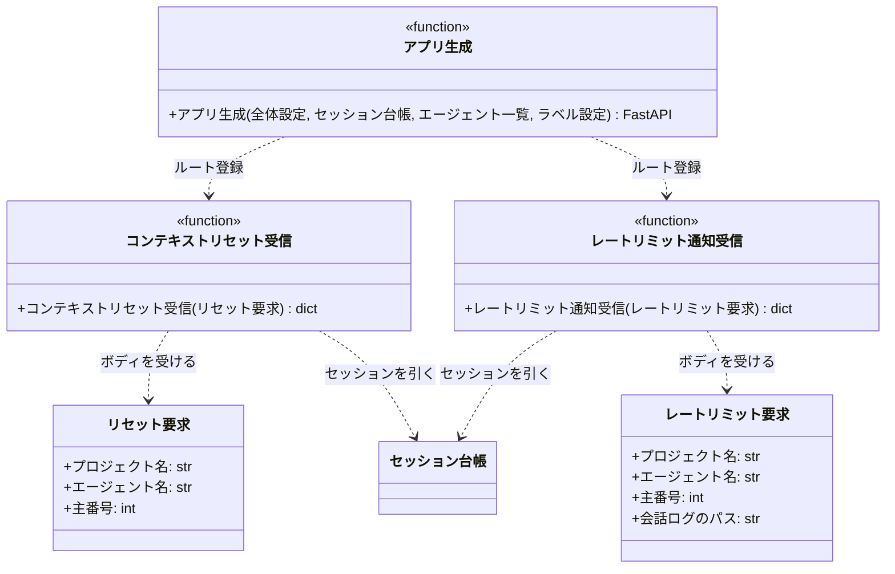

# モジュール構成: モニター / HTTP受信

`HTTP受信` ドメイン（モニター側）に属する構成要素詳細。
モニター本体は FastAPI アプリとして構築し、MCP サーバーのマウントとポーリングループの駆動（lifespan のバックグラウンドスレッド）を 1 プロセスで担う。

エージェントからの連絡は MCP ツールが受ける（[モニター連絡](../MCP/モニター連絡.py.md)）。
MCP は同一プロセスに同居するため、ツールがセッション台帳を直接操作する（プロセスを跨ぐ HTTP 呼び出しを挟まない）。

## 一覧

| ユースケース | 役割 | コンテナ | 種別 | 名前 | 概要 | 補足 |
| --- | --- | --- | --- | --- | --- | --- |
| 共通 | アプリ生成 | `server/app.py` | 関数 | [`create_app`](#アプリ生成) | FastAPI アプリの生成（MCP マウント + lifespan） | composition root から呼ぶ |
| コンテキストリセット | リクエスト DTO | `server/app.py` | データモデル | [`ContextResetRequest`](#リセット要求) | `POST /context_reset` のリクエストボディ | `pydantic.BaseModel` |
| コンテキストリセット | コンテキストリセット受信 | `server/app.py` | 関数 | [`receive_context_reset`](#コンテキストリセット受信) | `POST /context_reset` を受けてセッションを作り直す | MCP のルートマウントより先に登録 |
| レートリミット通知 | リクエスト DTO | `server/app.py` | データモデル | [`RateLimitRequest`](#レートリミット要求) | `POST /rate_limit` のリクエストボディ | `pydantic.BaseModel` |
| レートリミット通知 | レートリミット通知受信 | `server/app.py` | 関数 | [`receive_rate_limit`](#レートリミット通知受信) | `POST /rate_limit` を受けて待機を開始する | 同上 |

## ディレクトリ構成

```
src/ai_monitor/server/
└── app.py    # create_app / ContextResetRequest / RateLimitRequest
```

## 構成図



## リセット要求
> 物理名: `ContextResetRequest`<br>
> 種別: データモデル<br>
> コンテナ: `server/app.py`

`POST /context_reset` のリクエストボディ（`pydantic.BaseModel`）。
送り元は[コンテキストリセット](../フック/コンテキストリセット.py.md)のフックで、値は起動時に渡した環境変数から取る。

### プロパティ

| 論理名 | プロパティ名 | 型 | 可視性 | デフォルト | 説明 | 例 | 補足 |
| --- | --- | --- | --- | --- | --- | --- | --- |
| プロジェクト名 | `project` | `str` | 公開 | - | 監視対象プロジェクト名 | `"sandbox"` | `AI_MONITOR_PROJECT` の値 |
| エージェント名 | `agent_name` | `str` | 公開 | - | 対象エージェント名 | `"subsystem-conductor"` | `AI_MONITOR_AGENT` の値 |
| 主番号 | `number` | `int` | 公開 | - | セッションの主番号 | `170` | `AI_MONITOR_NUMBER` の値 |

### メソッド

なし

### 単体テスト

なし

## レートリミット要求
> 物理名: `RateLimitRequest`<br>
> 種別: データモデル<br>
> コンテナ: `server/app.py`

`POST /rate_limit` のリクエストボディ（`pydantic.BaseModel`）。
[リセット要求](#リセット要求)に会話ログのパスを足した形で、リセット時刻はモニター側がそのログから読む。

### プロパティ

| 論理名 | プロパティ名 | 型 | 可視性 | デフォルト | 説明 | 例 | 補足 |
| --- | --- | --- | --- | --- | --- | --- | --- |
| プロジェクト名 | `project` | `str` | 公開 | - | 監視対象プロジェクト名 | `"sandbox"` | `AI_MONITOR_PROJECT` の値 |
| エージェント名 | `agent_name` | `str` | 公開 | - | 対象エージェント名 | `"epic-conductor"` | `AI_MONITOR_AGENT` の値 |
| 主番号 | `number` | `int` | 公開 | - | セッションの主番号 | `1069` | `AI_MONITOR_NUMBER` の値 |
| 会話ログのパス | `transcript_path` | `str` | 公開 | - | 対象セッションの会話ログ | `"/home/user/.claude/projects/-mnt-c-repo/5a00ce9c.jsonl"` | フックの入力 JSON の値 |

### メソッド

なし

### 単体テスト

なし

## `server/app.py`
> 種別: ファイル

FastAPI アプリの生成を担うファイル。
起動は `main()` が `uvicorn.run`（`127.0.0.1:{settings.port}`）で行う。

---

### アプリ生成
> 物理名: `create_app`<br>
> 種別: 関数

FastAPI アプリを生成し、MCP サーバーのマウントと lifespan（ポーリングループの起動）を配線する。

#### 引数

| 論理名 | 引数名 | 型 | 必須 | デフォルト | 説明 | 補足 |
| --- | --- | --- | --- | --- | --- | --- |
| 全体設定 | `settings` | [`Settings`](./エージェント管理.py.md#全体設定) | ✅ | - | 周期・閾値の出所 | - |
| セッション台帳 | `registry` | [`SessionRegistry`](./エージェント管理.py.md#セッション台帳) | ✅ | - | MCP ツールとポーリングが共有する台帳 | キーワード引数 |
| エージェント一覧 | `agents` | [`list[Agent]`](./エージェント管理.py.md#エージェント定義) | ✅ | - | 処理中ラベルの解決・ポーリングに使う | キーワード引数 |
| ラベル設定 | `label_settings` | [`LabelSettings`](./エージェント管理.py.md#ラベル設定) | ✅ | - | ラベル値の出所 | キーワード引数。MCP と周期駆動へ渡す |

引数例:

```python
create_app(settings, registry=registry, agents=agents, label_settings=labels)
```

#### 戻り値

| 型 | 説明 | 補足 |
| --- | --- | --- |
| `FastAPI` | 生成したアプリ | `main()` が `uvicorn.run` に渡す |

#### 処理

1. MCP サーバーの ASGI アプリを組み立てる（[アプリ組み立て](../MCP/GitHub操作.py.md#アプリ組み立て)）
2. lifespan で MCP のセッション管理を開始し、その内側でポーリングループをバックグラウンドスレッドとして起動する（アプリ終了時にスレッドを停止する）
   - ループは 1 周ごとに次を行う: 自分の最終周回時刻を書く（[周回時刻の記録](./死活監視.py.md#周回時刻の記録)）→ [周期駆動](./エージェント管理.py.md#周期駆動)を 1 回実行 → 監視役の[監視](./死活監視.py.md#監視)を 1 回実行 → `poll_interval_sec` 待つ
   - ループ全体を例外で囲み、抜けた場合は理由をログに残してからプロセスを終了させる
     - `[CRITICAL]` ポーリングループが停止したためプロセスを終了する（例外）
3. FastAPI アプリを生成し、[コンテキストリセット受信](#コンテキストリセット受信)を登録してから MCP の ASGI アプリをルートにマウントする（エージェントの接続先は `/mcp`）。
   マウントより先に登録するのは、ルートマウントが後続の全パスを引き受けるため

#### 例外

なし

#### 単体テスト

| テスト名 | 正常/異常 | 概要 | 条件 | Mock | 期待値 | 補足 |
| --- | --- | --- | --- | --- | --- | --- |
| `test_create_app` | 正常 | MCP のマウント | TestClient で `/mcp` へリクエスト | [周期駆動](./エージェント管理.py.md#周期駆動) | `404` 以外が返る（マウント済み） | lifespan 内で検証（ポーリングは空回し） |
| `test_create_app_when_unknown_path` | 正常 | 未知パスの 404 | 未定義のパスへリクエスト | [周期駆動](./エージェント管理.py.md#周期駆動) | `404` が返る | - |
| `test_create_app_when_cycle_raised` | 正常 | ポーリングループの異常終了 | [周期駆動](./エージェント管理.py.md#周期駆動) が例外を送出 | 周期駆動 / プロセス終了 | 例外がログに残り、プロセス終了が呼ばれる | 無言で消えるのを防ぐ |
| `test_create_app_when_heartbeat` | 正常 | 周回時刻の書き出し | ループを 1 周させる | 周期駆動 / 周回時刻の記録 | 1 周ごとに周回時刻が書かれる | 監視役の鮮度判定の材料 |

#### 補足

- `/mcp` のパスは MCP の ASGI アプリ側が持つ。
  FastAPI 側で `/mcp` にマウントすると末尾スラッシュへのリダイレクトが挟まり、エージェントの POST が届かなくなる
- ポーリングループが死んだときにプロセスごと落とすのは、HTTP だけ生きている状態を作らないため。
  その状態は MCP が応答するのでエージェントは動けるが、新しい仕事が二度と割り当てられず、外からも気づけない

---

### コンテキストリセット受信
> 物理名: `receive_context_reset`<br>
> 種別: 関数

`POST /context_reset` を受け、該当セッションへエージェントドキュメントを再送する。

#### 引数

| 論理名 | 引数名 | 型 | 必須 | デフォルト | 説明 | 補足 |
| --- | --- | --- | --- | --- | --- | --- |
| リセット要求 | `body` | [`ContextResetRequest`](#リセット要求) | ✅ | - | リクエストボディ | FastAPI が JSON から生成する |

引数例:

```python
receive_context_reset(
    ContextResetRequest(project="sandbox", agent_name="subsystem-conductor", number=170)
)
```

#### 戻り値

| 型 | 説明 | 補足 |
| --- | --- | --- |
| `dict` | 受理結果 | `{"ok": True}` |

戻り値例:

```python
{"ok": True}
```

#### 処理

1. `project` / `agent_name` / `number` でセッションを検索する（[検索](./エージェント管理.py.md#検索)）
   - 見つからない場合、`404` を返す
   - `[WARNING]` 台帳に無いセッションからのリセット要求を拒否した（`project` / `agent_name` / `number`）
2. 設定から対象プロジェクトを引く
3. 設定からエージェント定義を引き、セッションを作り直して受理結果を返す（[セッションリセット](./エージェント管理.py.md#セッションリセット)）

#### 例外

| 例外名 | 発生条件 | メッセージ | 補足 |
| --- | --- | --- | --- |
| `HTTPException` | 台帳に該当セッションが無い | `404` | 解放済みセッションからの要求 |

#### 単体テスト

| テスト名 | 正常/異常 | 概要 | 条件 | Mock | 期待値 | 補足 |
| --- | --- | --- | --- | --- | --- | --- |
| `test_receive_context_reset` | 正常 | リセットの委譲 | 台帳に該当セッションあり | [セッションリセット](./エージェント管理.py.md#セッションリセット) | 該当セッション・プロジェクト・エージェントでリセットが 1 回呼ばれ `{"ok": true}` が返る | - |
| `test_receive_context_reset_when_session_missing` | 異常 | セッション不明 | 台帳に該当なし | [セッションリセット](./エージェント管理.py.md#セッションリセット) | `404` が返りリセットが呼ばれない | 例外表「台帳に該当セッションが無い」に対応 |

---

### レートリミット通知受信
> 物理名: `receive_rate_limit`<br>
> 種別: 関数

`POST /rate_limit` を受け、リセット時刻まで待機を開始する。

#### 引数

| 論理名 | 引数名 | 型 | 必須 | デフォルト | 説明 | 補足 |
| --- | --- | --- | --- | --- | --- | --- |
| レートリミット要求 | `body` | [`RateLimitRequest`](#レートリミット要求) | ✅ | - | リクエストボディ | FastAPI が JSON から生成する |

引数例:

```python
receive_rate_limit(
    RateLimitRequest(
        project="sandbox",
        agent_name="epic-conductor",
        number=1069,
        transcript_path="/home/user/.claude/projects/-mnt-c-repo/5a00ce9c.jsonl",
    )
)
```

#### 戻り値

| 型 | 説明 | 補足 |
| --- | --- | --- |
| `dict` | 待機の解除時刻 | `{"resets_at": "..."}` |

戻り値例:

```python
{"resets_at": "2026-07-29T02:30:00+09:00"}
```

#### 処理

1. `project` / `agent_name` / `number` でセッションを検索する（[検索](./エージェント管理.py.md#検索)）
   - 見つからない場合、`404` を返す
   - `[WARNING]` 台帳に無いセッションからのレートリミット通知を拒否した（`project` / `agent_name` / `number`）
2. 会話ログからリセット時刻を読む（[リセット時刻解決](./レートリミット.py.md#リセット時刻解決)）
   - 読めない場合、現在時刻に設定の `rate_limit_fallback_min` を足した時刻を使う
3. 対象セッション名と解除時刻を関門に記録して解除時刻を返す（[待機開始](./レートリミット.py.md#待機開始)）
   - `[INFO]` レートリミットの待機を開始した（セッション名 / 解除時刻）

#### 例外

| 例外名 | 発生条件 | メッセージ | 補足 |
| --- | --- | --- | --- |
| `HTTPException` | 台帳に該当セッションが無い | `404` | 解放済みセッションからの通知 |

#### 単体テスト

| テスト名 | 正常/異常 | 概要 | 条件 | Mock | 期待値 | 補足 |
| --- | --- | --- | --- | --- | --- | --- |
| `test_receive_rate_limit` | 正常 | 待機の開始 | 台帳に該当あり + 会話ログに時刻あり | [リセット時刻解決](./レートリミット.py.md#リセット時刻解決) | 読んだ時刻で待機が開始され `resets_at` が返る | - |
| `test_receive_rate_limit_when_unparsable` | 正常 | 既定の待機時間 | 会話ログから時刻を読めない | [リセット時刻解決](./レートリミット.py.md#リセット時刻解決) | 現在時刻 + `rate_limit_fallback_min` で待機が開始される | - |
| `test_receive_rate_limit_when_session_missing` | 異常 | セッション不明 | 台帳に該当なし | [リセット時刻解決](./レートリミット.py.md#リセット時刻解決) | `404` が返り待機が開始されない | 例外表「台帳に該当セッションが無い」に対応 |
