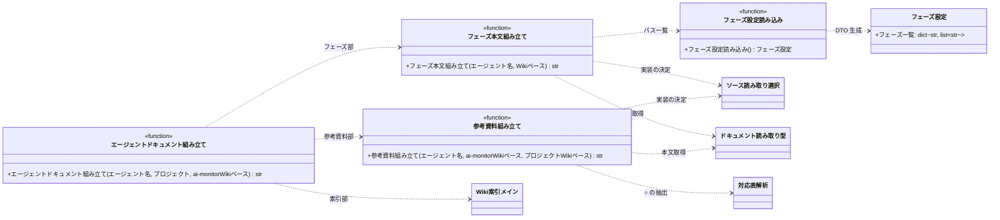

# モジュール構成: モニター / エージェントドキュメント

`エージェントドキュメント` ドメイン（モニター側）に属する構成要素詳細。
エージェントの起動プロンプトに載せるドキュメント（フェーズ + 参考資料 + Wiki 索引）の組み立てを扱う。

## 一覧

| ユースケース | 役割 | コンテナ | 種別 | 名前 | 概要 | 補足 |
| --- | --- | --- | --- | --- | --- | --- |
| 共通 | フェーズ設定 | `features/agents/docs.py` | データモデル | [`PhaseConfig`](#フェーズ設定) | エージェント名 → フェーズページのパス一覧 | YAML の読み取り結果 |
| 共通 | フェーズ設定読み込み | `features/agents/docs.py` | 関数 | [`load_phase_config`](#フェーズ設定読み込み) | `config/agent_phases.yaml` を読む | - |
| エージェント起動検知 | フェーズ本文組み立て | `features/agents/docs.py` | 関数 | [`build_phase_docs`](#フェーズ本文組み立て) | フェーズページを設定順に連結する | - |
| エージェント起動検知 | 参考資料組み立て | `features/agents/docs.py` | 関数 | [`build_reference_docs`](#参考資料組み立て) | 対応表で ○ の付いたドキュメントを連結する | 注入 CLI のパーサを共用 |
| エージェント起動検知 | エージェントドキュメント組み立て | `features/agents/docs.py` | 関数 | [`build_agent_docs`](#エージェントドキュメント組み立て) | フェーズ + 参考資料 + Wiki 索引を 1 本のテキストにする | 起動時とコンパクト再送の共通入口 |

## ディレクトリ構成

```
src/ai_monitor/features/agents/
└── docs.py       # PhaseConfig / load_phase_config / build_phase_docs / build_reference_docs / build_agent_docs

config/
└── agent_phases.yaml   # エージェント名 → フェーズページのパス一覧
```

## 構成図



## フェーズ設定
> 物理名: `PhaseConfig`<br>
> 種別: データモデル<br>
> コンテナ: `features/agents/docs.py`

`config/agent_phases.yaml` の読み取り結果（Pydantic `BaseModel`）。

### プロパティ

| 論理名 | プロパティ名 | 型 | 可視性 | デフォルト | 説明 | 例 | 補足 |
| --- | --- | --- | --- | --- | --- | --- | --- |
| フェーズ一覧 | `phases` | `dict[str, list[str]]` | 公開 | - | エージェント名 → フェーズページのパス一覧 | `{"subsystem-conductor": ["エージェント/subsystem-conductor/README.md", ...]}` | パスは `docs/wiki/` からの相対。並び順が注入順 |

### メソッド

なし

### 単体テスト

なし

## `features/agents/docs.py`
> 種別: ファイル

エージェントの起動プロンプトに載せるドキュメントを組み立てるファイル。

---

### フェーズ設定読み込み
> 物理名: `load_phase_config`<br>
> 種別: 関数

`config/agent_phases.yaml` を読み、エージェント名 → フェーズページのパス一覧を返す。

#### 引数

なし

引数例:

```python
load_phase_config()
```

#### 戻り値

| 型 | 説明 | 補足 |
| --- | --- | --- |
| [`PhaseConfig`](#フェーズ設定) | フェーズ一覧 | - |

戻り値例:

```python
PhaseConfig(phases={"subsystem-conductor": ["エージェント/subsystem-conductor/README.md"]})
```

#### 処理

1. ai-monitor のメインリポジトリ直下の `config/agent_phases.yaml` を読む
2. エージェント名 → パス一覧の辞書に変換して [`PhaseConfig`](#フェーズ設定) で返す

#### 例外

| 例外名 | 発生条件 | メッセージ | 補足 |
| --- | --- | --- | --- |
| `FileNotFoundError` | YAML が存在しない | パス | フォールバックしない（設定漏れを起動時に気づけるようにする） |

#### 単体テスト

| テスト名 | 正常/異常 | 概要 | 条件 | Mock | 期待値 | 補足 |
| --- | --- | --- | --- | --- | --- | --- |
| `test_load_phase_config` | 正常 | YAML の読み取り | 一時 YAML を配置 | なし | エージェント名をキーにパス一覧が返る | - |
| `test_load_phase_config_when_missing` | 異常 | YAML 不在 | ファイルを置かない | なし | `FileNotFoundError` | 例外表「YAML が存在しない」に対応 |

---

### フェーズ本文組み立て
> 物理名: `build_phase_docs`<br>
> 種別: 関数

エージェントのフェーズページを設定順に読み、1 本のテキストに連結する。

#### 引数

| 論理名 | 引数名 | 型 | 必須 | デフォルト | 説明 | 補足 |
| --- | --- | --- | --- | --- | --- | --- |
| エージェント名 | `agent_name` | `str` | ✅ | - | 対象のエージェント名 | YAML のキー |
| Wiki ベース | `wiki_base` | `str` | ✅ | - | フェーズページの読み元 | 設定の `ai_monitor_wiki_base`。raw URL / ローカル絶対パスのどちらでもよい |

引数例:

```python
build_phase_docs("subsystem-conductor", wiki_base="/home/user/repo/ai-monitor/docs/wiki")
```

#### 戻り値

| 型 | 説明 | 補足 |
| --- | --- | --- |
| `str` | フェーズ索引とフェーズページを連結した本文 | 各ページの間は空行で区切る |

戻り値例:

```python
"# subsystem-conductor\n\n## 目次\n...\n\n# 初期処理\n..."
```

#### 処理

1. フェーズ設定を読む（[フェーズ設定読み込み](#フェーズ設定読み込み)）
2. `agent_name` のパス一覧を順に `wiki_base` と連結して場所にする
3. `wiki_base` で取得手段を選ぶ（[ソース読み取り選択](../注入/URLドキュメント.py.md#ソース読み取り選択)）
4. 各場所を読み、front matter を除去した本文を連結して返す（選んだ [`ReadDoc`](../注入/URLドキュメント.py.md#ドキュメント読み取り型)）

#### 例外

| 例外名 | 発生条件 | メッセージ | 補足 |
| --- | --- | --- | --- |
| `KeyError` | YAML に当該エージェントの項目が無い | エージェント名 | 設定漏れを起動時に気づけるようにする |
| `FileNotFoundError` | ローカルのフェーズページが存在しない | パス | 同上 |
| `URLError` | リモートのフェーズページが取得できない | urllib のエラー内容 | 同上 |

#### 単体テスト

| テスト名 | 正常/異常 | 概要 | 条件 | Mock | 期待値 | 補足 |
| --- | --- | --- | --- | --- | --- | --- |
| `test_build_phase_docs` | 正常 | 設定順の連結 | 2 ページを登録した一時 YAML と実ファイル・ローカルのベース | なし | 設定順に本文が連結され front matter を含まない | - |
| `test_build_phase_docs_when_remote_base` | 正常 | リモートベースの取得 | 日本語パスのページを登録した一時 YAML・`https://` のベース | urllib | ベースとパスを連結し非 ASCII を quote した URL でリクエストされ、本文が連結される | ファイルシステムを読まない |
| `test_build_phase_docs_when_agent_missing` | 異常 | エージェント未登録 | YAML に無いエージェント名 | なし | `KeyError` | 例外表「当該エージェントの項目が無い」に対応 |
| `test_build_phase_docs_when_page_missing` | 異常 | ページ不在 | 実在しないパスを登録 | なし | `FileNotFoundError` | 例外表「ローカルのフェーズページが存在しない」に対応 |

---

### 参考資料組み立て
> 物理名: `build_reference_docs`<br>
> 種別: 関数

対応表で当該エージェントに ○ が付いたドキュメントを読み、1 本のテキストに連結する。

参照する対応表は 2 種類。
共通対応表（ai-monitor 側の Wiki）と、プロジェクト固有の対応表（監視対象プロジェクト側の Wiki）。

#### 引数

| 論理名 | 引数名 | 型 | 必須 | デフォルト | 説明 | 補足 |
| --- | --- | --- | --- | --- | --- | --- |
| エージェント名 | `agent_name` | `str` | ✅ | - | 対象のエージェント名 | 対応表の列名 |
| ai-monitor Wiki ベース | `ai_monitor_wiki_base` | `str` | ✅ | - | 共通対応表と共通ルールの読み元 | 設定の `ai_monitor_wiki_base` |
| プロジェクト Wiki ベース | `project_wiki_base` | `str` | ✅ | - | プロジェクト固有の対応表の読み元 | 設定の `projects[].wiki_base` |

引数例:

```python
build_reference_docs(
    "subsystem-conductor",
    ai_monitor_wiki_base="/home/user/repo/ai-monitor/docs/wiki",
    project_wiki_base="/home/user/repo/myapp/docs/wiki",
)
```

#### 戻り値

| 型 | 説明 | 補足 |
| --- | --- | --- |
| `str` | ○ が付いたドキュメントを連結した本文 | 共通 → プロジェクト固有 の順 |

戻り値例:

```python
"# 規約: コメント\n...\n\n# ai-monitor テンプレート: PR 本文 / サブシステム\n..."
```

#### 処理

1. `ai_monitor_wiki_base` から共通対応表を読み、当該エージェントに ○ の付いた場所の一覧を得る（[対応表解析](../注入/エージェントドキュメント.py.md#対応表解析)）
2. `project_wiki_base` からプロジェクト固有の対応表を同様に読む
   - 対応表が存在しないプロジェクトの場合、共通分だけを対象にする
3. 得た場所の本文を順に読み、front matter を除去して連結して返す（場所ごとに [ソース読み取り選択](../注入/URLドキュメント.py.md#ソース読み取り選択)で [`ReadDoc`](../注入/URLドキュメント.py.md#ドキュメント読み取り型) を選ぶ）
   - 対応表の行が絶対 URL を指している場合、ベースがローカルでもその 1 件はネットワーク経由で読む

#### 例外

| 例外名 | 発生条件 | メッセージ | 補足 |
| --- | --- | --- | --- |
| `FileNotFoundError` | ローカルの共通対応表が存在しない | パス | プロジェクト固有の不在は正常系 |
| `URLError` | リモートの共通対応表が取得できない | urllib のエラー内容 | プロジェクト固有の不在は正常系 |

#### 単体テスト

| テスト名 | 正常/異常 | 概要 | 条件 | Mock | 期待値 | 補足 |
| --- | --- | --- | --- | --- | --- | --- |
| `test_build_reference_docs` | 正常 | ○ のドキュメントの連結 | 共通 + プロジェクト固有の対応表を配置・両ベースともローカル | なし | 両方の本文が共通 → プロジェクトの順で連結される | - |
| `test_build_reference_docs_when_remote_base` | 正常 | リモートベースの取得 | 両ベースとも `https://` | urllib | ベースとパスを連結した URL でリクエストされ、本文が連結される | ファイルシステムを読まない |
| `test_build_reference_docs_when_mixed_base` | 正常 | ベースの混在 | ai-monitor 側はローカル・プロジェクト側は `https://` | urllib | ローカル側はファイル・プロジェクト側は HTTP で読まれる | ベース単位で取得手段が分かれる |
| `test_build_reference_docs_when_absolute_url_row` | 正常 | 絶対 URL の行 | ローカルのベースで、対応表の行が絶対 URL を指す | urllib | その行だけ HTTP で読まれる | 場所単位で取得手段が決まる |
| `test_build_reference_docs_when_project_matrix_missing` | 正常 | プロジェクト対応表の不在 | プロジェクト側に対応表を置かない | なし | 共通分だけが返る | - |
| `test_build_reference_docs_when_not_marked` | 正常 | ○ なしのエージェント | 全行が `-` のエージェント名 | なし | 空文字が返る | - |

---

### エージェントドキュメント組み立て
> 物理名: `build_agent_docs`<br>
> 種別: 関数

フェーズ + 参考資料 + Wiki 索引を 1 本のテキストにまとめる。
起動時とコンパクト再送の共通入口。

#### 引数

| 論理名 | 引数名 | 型 | 必須 | デフォルト | 説明 | 補足 |
| --- | --- | --- | --- | --- | --- | --- |
| エージェント名 | `agent_name` | `str` | ✅ | - | 対象のエージェント名 | - |
| 対象プロジェクト | `project` | [`MonitoredProject`](./エージェント管理.py.md#監視対象プロジェクト) | ✅ | - | 参考資料と Wiki 索引の在り処 | `wiki_base` を使う |
| ai-monitor Wiki ベース | `ai_monitor_wiki_base` | `str` | ✅ | - | フェーズと共通参考資料の読み元 | 設定の `ai_monitor_wiki_base` |

引数例:

```python
build_agent_docs(
    "subsystem-conductor",
    project,
    ai_monitor_wiki_base="/home/user/repo/ai-monitor/docs/wiki",
)
```

#### 戻り値

| 型 | 説明 | 補足 |
| --- | --- | --- |
| `str` | 見出し付きで連結したドキュメント | `## フェーズ` / `## 参考資料` の見出しを持つ |

戻り値例:

```python
"## フェーズ\n\n# subsystem-conductor\n...\n\n## 参考資料\n\n# 規約: コメント\n...\n\n| ページ | 概要 |\n..."
```

#### 処理

1. フェーズ本文を組み立てる（[フェーズ本文組み立て](#フェーズ本文組み立て)。`ai_monitor_wiki_base` を渡す）
2. 参考資料を組み立てる（[参考資料組み立て](#参考資料組み立て)。`ai_monitor_wiki_base` と `project.wiki_base` を渡す）
3. 監視対象プロジェクトの Wiki 索引を組み立てる（[Wiki 再帰探索](../注入/Wiki索引.py.md#wiki-再帰探索)。`project.wiki_base` を起点にし、そのベースで選んだ [`ReadDoc`](../注入/URLドキュメント.py.md#ドキュメント読み取り型) を渡す）
4. `## フェーズ` / `## 参考資料` の見出しを付けて連結し、1 本のテキストで返す

#### 例外

| 例外名 | 発生条件 | メッセージ | 補足 |
| --- | --- | --- | --- |
| `KeyError` | YAML に当該エージェントの項目が無い | エージェント名 | [フェーズ本文組み立て](#フェーズ本文組み立て)経由 |
| `FileNotFoundError` | ローカルの設定ファイル / ページ / 共通対応表が存在しない | パス | 同上 |
| `URLError` | リモートのページ / 共通対応表が取得できない | urllib のエラー内容 | 同上 |

#### 単体テスト

| テスト名 | 正常/異常 | 概要 | 条件 | Mock | 期待値 | 補足 |
| --- | --- | --- | --- | --- | --- | --- |
| `test_build_agent_docs` | 正常 | 3 要素の連結 | フェーズ / 対応表 / Wiki を配置・両ベースともローカル | なし | `## フェーズ` と `## 参考資料` の見出しを含み、フェーズ本文・参考資料・索引が順に並ぶ | - |
| `test_build_agent_docs_when_remote_base` | 正常 | リモートベースの取得 | 両ベースとも `https://` | urllib | 3 要素が揃った本文が返り、ファイルシステムを読まない | - |
