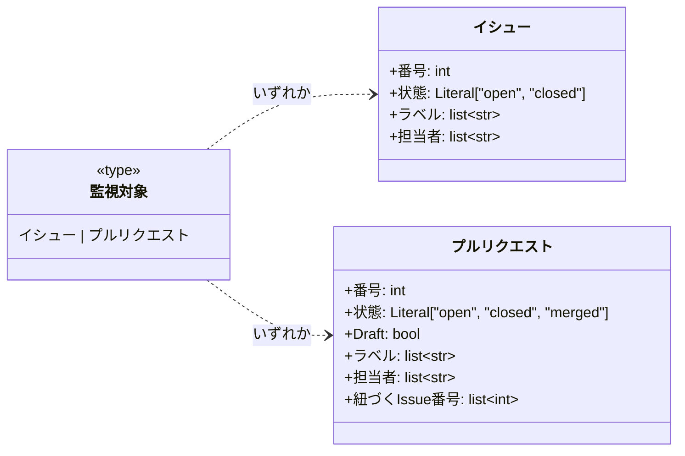
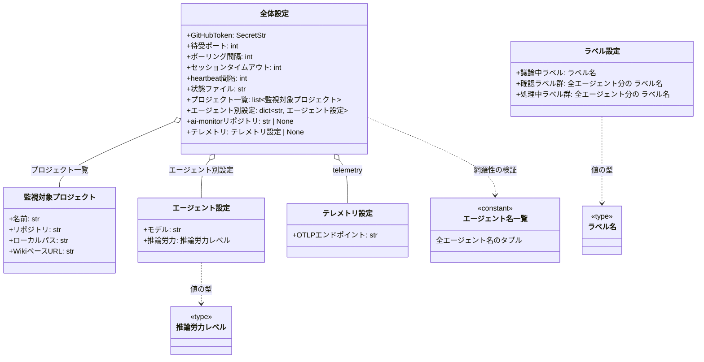
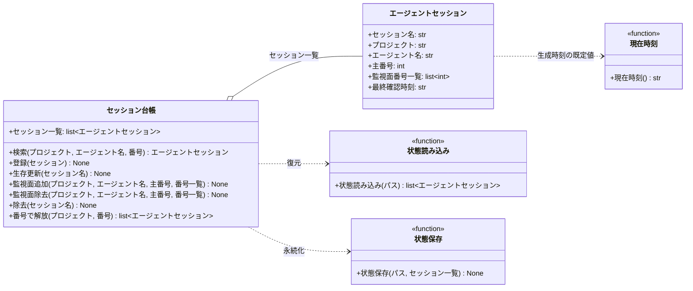
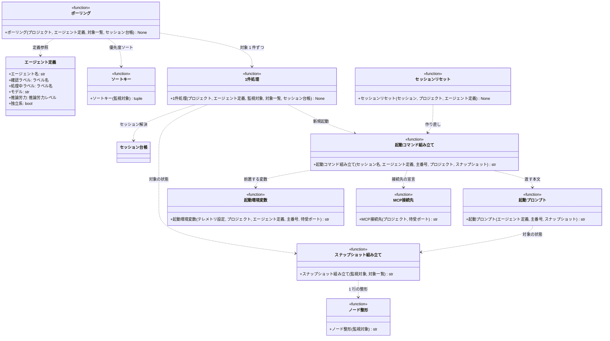
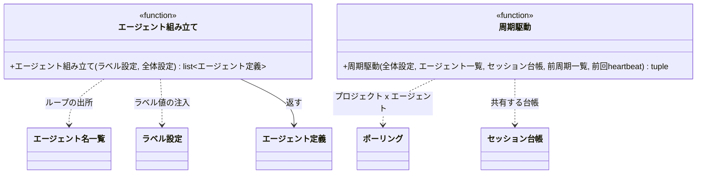

# モジュール構成: モニター / エージェント管理

`エージェント管理` ドメイン（モニター側）に属する構成要素詳細。
エージェント基盤・派生 PR を含む監視面の管理・エージェントセッションの状態管理を扱う。

## 一覧

| ユースケース | 役割 | コンテナ | 種別 | 名前 | 概要 | 補足 |
| --- | --- | --- | --- | --- | --- | --- |
| 共通 | ドメインモデル | `shared/types.py` | データモデル | [`Issue`](#イシュー) | GitHub Issue のスナップショット | frozen dataclass |
| 共通 | ドメインモデル | `shared/types.py` | データモデル | [`PullRequest`](#プルリクエスト) | GitHub PR のスナップショット | frozen dataclass |
| 共通 | 監視対象型 | `shared/types.py` | 型 | [`MonitorTarget`](#監視対象) | `Issue \| PullRequest` のユニオン型エイリアス | PEP 695 `type` |
| 共通 | ラベル名型 | `shared/types.py` | 型 | [`LabelName`](#ラベル名) | `LabelSettings` 由来のラベル文字列を表す `str` の NewType | ラベルの直書きを型エラーにする |
| 共通 | 推論労力型 | `shared/types.py` | 型 | [`EffortLevel`](#推論労力レベル) | `claude --effort` に渡す値のリテラル型 | PEP 695 `type` |
| 共通 | ラベル設定 | `shared/settings.py` | データモデル | [`LabelSettings`](#ラベル設定) | `constants.env` の `AI_MONITOR_LABEL_*` を型安全に読む | `pydantic_settings.BaseSettings` |
| 共通 | 全体設定 | `shared/settings.py` | データモデル | [`Settings`](#全体設定) | `~/.config/ai-monitor/settings.yaml` を型安全に読む | `pydantic_settings.BaseSettings` |
| 共通 | プロジェクト設定 | `shared/settings.py` | データモデル | [`MonitoredProject`](#監視対象プロジェクト) | 監視対象プロジェクト 1 件の設定 | `Settings.projects` の要素 |
| 共通 | エージェント設定 | `shared/settings.py` | データモデル | [`AgentSettings`](#エージェント設定) | エージェント別の起動設定 1 件分（モデル + 推論労力） | `Settings.agents` の値 |
| 共通 | テレメトリ設定 | `shared/settings.py` | データモデル | [`TelemetrySettings`](#テレメトリ設定) | エージェントの telemetry 送出設定 | 未設定なら送出しない |
| 共通 | エージェント名一覧 | `shared/settings.py` | 定数 | [`_AGENT_NAMES`](#エージェント名一覧) | 全エージェント名のタプル | 設定の網羅性検証・build_agents のループの出所 |
| 共通 | エージェント定義 | `features/agents/types.py` | データモデル | [`Agent`](#エージェント定義) | 1 エージェントの静的定義 | frozen dataclass |
| 共通 | ポーリング | `features/agents/service.py` | 関数 | [`poll`](#ポーリング) | プロジェクト × エージェントの対ごとの 1 周期 | - |
| 共通 | 起動コマンド | `features/agents/service.py` | 関数 | [`build_launch_command`](#起動コマンド組み立て) | claude を起動する shell コマンドを組み立てる | 新規起動とリセットの両方から使う |
| 共通 | 起動プロンプト | `features/agents/service.py` | 関数 | [`build_launch_prompt`](#起動プロンプト) | ドキュメント + 対象番号 + スナップショットを 1 本のテキストにする | 新規セッションに渡す |
| 共通 | セッションリセット | `features/agents/service.py` | 関数 | [`reset_session`](#セッションリセット) | tmux セッションを作り直して起動し直す | コンテキスト上限時の復旧 |
| 共通 | 起動環境変数 | `features/agents/service.py` | 関数 | [`build_launch_env`](#起動環境変数) | claude 起動コマンドに前置する環境変数列を組み立てる | プロジェクト名 + テレメトリ |
| 共通 | MCP 接続先 | `features/agents/service.py` | 関数 | [`build_mcp_config`](#mcp接続先) | エージェントへ渡す MCP サーバーの接続先宣言を組み立てる | 対象プロジェクトを名乗るヘッダを載せる |
| 共通 | 内部処理 | `features/agents/service.py` | 関数 | [`_process_one`](#1-件処理) | 対象 1 件のセッション解決と送信 | - |
| 共通 | 内部処理 | `features/agents/service.py` | 関数 | [`_sort_key`](#ソートキー) | 優先度ソートのキーを求める | - |
| 共通 | スナップショット組み立て | `features/agents/service.py` | 関数 | [`build_context_snapshot`](#スナップショット組み立て) | 対象と紐づく open PR の状態をメモリから整形 | 送信ペイロードに毎回添付 |
| 共通 | 内部処理 | `features/agents/service.py` | 関数 | [`_node_line`](#ノード整形) | スナップショットのツリー 1 ノードを 1 行に整形 | - |
| 共通 | 内部処理 | `features/sessions/types.py` | 関数 | [`_now_iso`](#現在時刻) | 生成時刻の既定値に使う ISO 8601 文字列を返す | ローカルタイムゾーン付き |
| 共通 | セッション状態 | `features/sessions/types.py` | データモデル | [`AgentSession`](#エージェントセッション) | 起動中 tmux セッション 1 本の状態 | - |
| 共通 | セッション台帳 | `features/sessions/registry.py` | クラス | [`SessionRegistry`](#セッション台帳) | 起動中セッション一覧の保持・検索 | 長期保持のランタイム状態 |
| 共通 | 状態読み込み | `features/sessions/state_store.py` | 関数 | [`load_sessions`](#状態読み込み) | 設定の `state_path` からセッション一覧を復元 | - |
| 共通 | 状態保存 | `features/sessions/state_store.py` | 関数 | [`save_sessions`](#状態保存) | tmp → rename のアトミック書きで永続化 | - |
| 共通 | 配線 | `main.py` | 関数 | [`build_agents`](#エージェント組み立て) | 全エージェントの `Agent` を組み立てる | composition root |
| 共通 | 周期駆動 | `main.py` | 関数 | [`run_cycle`](#周期駆動) | ポーリング + クリーンアップ + heartbeat の 1 周期を実行する | 前周期一覧はループが引き継ぐ |

## ディレクトリ構成

```
src/ai_monitor/
├── main.py                # composition root（build_agents）
├── shared/
│   ├── types.py           # Issue / PullRequest / MonitorTarget / LabelName / EffortLevel
│   └── settings.py        # Settings / LabelSettings / MonitoredProject / AgentSettings / _AGENT_NAMES
└── features/
    ├── agents/
    │   ├── types.py       # Agent
    │   └── service.py     # poll / build_launch_command / build_launch_prompt / build_context_snapshot
    └── sessions/
        ├── types.py       # AgentSession / _now_iso
        ├── registry.py    # SessionRegistry
        └── state_store.py # load_sessions / save_sessions
```

## 構成図

### ドメインモデル



---

### 設定



---

### セッション台帳



---

### ポーリングと起動



---

### 起動と周期駆動



## イシュー
> 物理名: `Issue`<br>
> 種別: データモデル<br>
> コンテナ: `shared/types.py`

GitHub Issue のスナップショット。
polling 時点の状態を保持する読み取り専用のデータモデル（`@dataclass(frozen=True, slots=True, kw_only=True)`）。

### プロパティ

| 論理名 | プロパティ名 | 型 | 可視性 | デフォルト | 説明 | 例 | 補足 |
| --- | --- | --- | --- | --- | --- | --- | --- |
| 番号 | `number` | `int` | 公開 | - | Issue 番号 | `35` | - |
| 状態 | `state` | `Literal["open", "closed"]` | 公開 | `"open"` | Issue の開閉状態 | `"open"` | - |
| ラベル | `labels` | `list[str]` | 公開 | `[]` | 付与中のラベル名 | `["layer:epic", "確認:epic-conductor"]` | - |
| 担当者 | `assignees` | `list[str]` | 公開 | `[]` | assignee のログイン名 | `["shuhei1101"]` | 空 = エージェント起動可 |

### メソッド

なし

### 単体テスト

なし

### 補足

- githubkit からの取得・変換は [GitHub連携](./GitHub連携.py.md)（別分類）の責務。
  本モデルは変換結果の受け皿

## プルリクエスト
> 物理名: `PullRequest`<br>
> 種別: データモデル<br>
> コンテナ: `shared/types.py`

GitHub PR のスナップショット（frozen dataclass）。
本文 `## 紐づく Issue` から抽出した Issue 番号を持ち、PR → Issue の逆引きの材料になる。

### プロパティ

| 論理名 | プロパティ名 | 型 | 可視性 | デフォルト | 説明 | 例 | 補足 |
| --- | --- | --- | --- | --- | --- | --- | --- |
| 番号 | `number` | `int` | 公開 | - | PR 番号 | `40` | - |
| 状態 | `state` | `Literal["open", "closed", "merged"]` | 公開 | `"open"` | PR の開閉・マージ状態 | `"open"` | - |
| Draft | `draft` | `bool` | 公開 | `true` | Draft PR かどうか | `true` | - |
| ラベル | `labels` | `list[str]` | 公開 | `[]` | 付与中のラベル名 | `["確認:subsystem-conductor"]` | - |
| 担当者 | `assignees` | `list[str]` | 公開 | `[]` | assignee のログイン名 | `[]` | 空 = エージェント起動可 |
| 紐づく Issue 番号 | `linked_issue_numbers` | `list[int]` | 公開 | `[]` | 本文 `## 紐づく Issue` から抽出した Issue 番号 | `[50]` | 1 件のみ運用。起点の Issue を指す |
| base ブランチ | `base_ref` | `str` | 公開 | `""` | マージ先ブランチ名 | `"feat/story/profile/edit"` | 親 PR の特定と最上位判定に使う |

### メソッド

なし

### 単体テスト

なし

## 監視対象
> 物理名: `MonitorTarget`<br>
> 種別: 型<br>
> コンテナ: `shared/types.py`

[`Issue`](#イシュー) | [`PullRequest`](#プルリクエスト) のユニオン型エイリアス（PEP 695 `type`）。
ポーリングが扱う監視対象 1 件を表す。

## ラベル名
> 物理名: `LabelName`<br>
> 種別: 型<br>
> コンテナ: `shared/types.py`

`str` の NewType（`LabelName = NewType("LabelName", str)`）。
[ラベル設定](#ラベル設定)が読み込んだラベル文字列であることを型で追跡し、関数へのラベル文字列の直書きを型チェッカーで検出する。
値の SoT は `constants.env` のまま（本型は出所の追跡のみを担う）。

## 推論労力レベル
> 物理名: `EffortLevel`<br>
> 種別: 型<br>
> コンテナ: `shared/types.py`

`Literal["low", "medium", "high", "xhigh", "max"]` の型エイリアス（PEP 695 `type`）。
`claude --effort` が受け付ける値の列挙で、[エージェント設定](#エージェント設定)と[エージェント定義](#エージェント定義)が同じ列挙を共有する。
列挙外の値は設定の読み込み時にバリデーションエラーになる（CLI 側は不正値を警告して既定へ倒すため、モニター側で弾かないとタイポに気づけない）。

## ラベル設定
> 物理名: `LabelSettings`<br>
> 種別: データモデル<br>
> コンテナ: `shared/settings.py`

`constants.env` の `AI_MONITOR_LABEL_*` を型安全に読む設定クラス（`pydantic_settings.BaseSettings`）。
ラベル値の SoT は `plugins/ai-monitor/constants.env` で、本クラスはその読み取り口。
`os.environ` の直読みはしない。

### プロパティ

| 論理名 | プロパティ名 | 型 | 可視性 | デフォルト | 説明 | 例 | 補足 |
| --- | --- | --- | --- | --- | --- | --- | --- |
| 議論中ラベル | `in_discussion` | [`LabelName`](#ラベル名) | 公開 | - | `AI_MONITOR_LABEL_IN_DISCUSSION` の値 | `"議論中"` | - |
| AI 不具合報告ラベル | `ai_defect_report` | [`LabelName`](#ラベル名) | 公開 | - | `AI_MONITOR_LABEL_AI_DEFECT_REPORT` の値 | `"AI不具合報告"` | [不具合Issue起票](../MCP/GitHub操作.py.md#不具合issue起票)が使う |
| 確認ラベル接頭辞 | `confirm_prefix` | [`LabelName`](#ラベル名) | 公開 | - | `AI_MONITOR_LABEL_CONFIRM_PREFIX` の値 | `"確認:"` | [一括解放](./クリーンアップ.py.md#一括解放)の残存判定が使う |
| intake レイヤーラベル | `layer_intake` | [`LabelName`](#ラベル名) | 公開 | - | `AI_MONITOR_LABEL_LAYER_INTAKE` の値 | `"layer:intake"` | [新規Issue起票](../MCP/GitHub操作.py.md#新規issue起票)が使う |
| epic レイヤーラベル | `layer_epic` | [`LabelName`](#ラベル名) | 公開 | - | `AI_MONITOR_LABEL_LAYER_EPIC` の値 | `"layer:epic"` | epic のクローズ検知が使う |
| 急ぎ優先度ラベル | `priority_urgent` | [`LabelName`](#ラベル名) | 公開 | - | `AI_MONITOR_LABEL_PRIORITY_URGENT` の値 | `"優先度:急ぎ"` | [ソートキー](#ソートキー)が使う |
| いつでも優先度ラベル | `priority_low` | [`LabelName`](#ラベル名) | 公開 | - | `AI_MONITOR_LABEL_PRIORITY_LOW` の値 | `"優先度:いつでも"` | [ソートキー](#ソートキー)が使う |
| intake-issue-triager 確認ラベル | `confirm_intake_issue_triager` | [`LabelName`](#ラベル名) | 公開 | - | `AI_MONITOR_LABEL_CONFIRM_INTAKE_ISSUE_TRIAGER` の値 | `"確認:intake-issue-triager"` | - |
| epic-conductor 確認ラベル | `confirm_epic_conductor` | [`LabelName`](#ラベル名) | 公開 | - | `AI_MONITOR_LABEL_CONFIRM_EPIC_CONDUCTOR` の値 | `"確認:epic-conductor"` | - |
| epic-poc-runner 確認ラベル | `confirm_epic_poc_runner` | [`LabelName`](#ラベル名) | 公開 | - | `AI_MONITOR_LABEL_CONFIRM_EPIC_POC_RUNNER` の値 | `"確認:epic-poc-runner"` | - |
| mock-designer 確認ラベル | `confirm_mock_designer` | [`LabelName`](#ラベル名) | 公開 | - | `AI_MONITOR_LABEL_CONFIRM_MOCK_DESIGNER` の値 | `"確認:mock-designer"` | - |
| complex-scenario-writer 確認ラベル | `confirm_complex_scenario_writer` | [`LabelName`](#ラベル名) | 公開 | - | `AI_MONITOR_LABEL_CONFIRM_COMPLEX_SCENARIO_WRITER` の値 | `"確認:complex-scenario-writer"` | - |
| complex-scenario-tester 確認ラベル | `confirm_complex_scenario_tester` | [`LabelName`](#ラベル名) | 公開 | - | `AI_MONITOR_LABEL_CONFIRM_COMPLEX_SCENARIO_TESTER` の値 | `"確認:complex-scenario-tester"` | - |
| story-conductor 確認ラベル | `confirm_story_conductor` | [`LabelName`](#ラベル名) | 公開 | - | `AI_MONITOR_LABEL_CONFIRM_STORY_CONDUCTOR` の値 | `"確認:story-conductor"` | - |
| single-scenario-writer 確認ラベル | `confirm_single_scenario_writer` | [`LabelName`](#ラベル名) | 公開 | - | `AI_MONITOR_LABEL_CONFIRM_SINGLE_SCENARIO_WRITER` の値 | `"確認:single-scenario-writer"` | - |
| single-scenario-tester 確認ラベル | `confirm_single_scenario_tester` | [`LabelName`](#ラベル名) | 公開 | - | `AI_MONITOR_LABEL_CONFIRM_SINGLE_SCENARIO_TESTER` の値 | `"確認:single-scenario-tester"` | - |
| subsystem-conductor 確認ラベル | `confirm_subsystem_conductor` | [`LabelName`](#ラベル名) | 公開 | - | `AI_MONITOR_LABEL_CONFIRM_SUBSYSTEM_CONDUCTOR` の値 | `"確認:subsystem-conductor"` | - |
| architect 確認ラベル | `confirm_architect` | [`LabelName`](#ラベル名) | 公開 | - | `AI_MONITOR_LABEL_CONFIRM_ARCHITECT` の値 | `"確認:architect"` | - |
| library-poc-runner 確認ラベル | `confirm_library_poc_runner` | [`LabelName`](#ラベル名) | 公開 | - | `AI_MONITOR_LABEL_CONFIRM_LIBRARY_POC_RUNNER` の値 | `"確認:library-poc-runner"` | - |
| tester 確認ラベル | `confirm_tester` | [`LabelName`](#ラベル名) | 公開 | - | `AI_MONITOR_LABEL_CONFIRM_TESTER` の値 | `"確認:tester"` | - |
| implementer 確認ラベル | `confirm_implementer` | [`LabelName`](#ラベル名) | 公開 | - | `AI_MONITOR_LABEL_CONFIRM_IMPLEMENTER` の値 | `"確認:implementer"` | - |
| resetter 確認ラベル | `confirm_resetter` | [`LabelName`](#ラベル名) | 公開 | - | `AI_MONITOR_LABEL_CONFIRM_RESETTER` の値 | `"確認:resetter"` | - |
| questioner 確認ラベル | `confirm_questioner` | [`LabelName`](#ラベル名) | 公開 | - | `AI_MONITOR_LABEL_CONFIRM_QUESTIONER` の値 | `"確認:questioner"` | - |
| intake-issue-triager 処理中ラベル | `processing_intake_issue_triager` | [`LabelName`](#ラベル名) | 公開 | - | `AI_MONITOR_LABEL_PROCESSING_INTAKE_ISSUE_TRIAGER` の値 | `"処理中:intake-issue-triager"` | - |
| epic-conductor 処理中ラベル | `processing_epic_conductor` | [`LabelName`](#ラベル名) | 公開 | - | `AI_MONITOR_LABEL_PROCESSING_EPIC_CONDUCTOR` の値 | `"処理中:epic-conductor"` | - |
| epic-poc-runner 処理中ラベル | `processing_epic_poc_runner` | [`LabelName`](#ラベル名) | 公開 | - | `AI_MONITOR_LABEL_PROCESSING_EPIC_POC_RUNNER` の値 | `"処理中:epic-poc-runner"` | - |
| mock-designer 処理中ラベル | `processing_mock_designer` | [`LabelName`](#ラベル名) | 公開 | - | `AI_MONITOR_LABEL_PROCESSING_MOCK_DESIGNER` の値 | `"処理中:mock-designer"` | - |
| complex-scenario-writer 処理中ラベル | `processing_complex_scenario_writer` | [`LabelName`](#ラベル名) | 公開 | - | `AI_MONITOR_LABEL_PROCESSING_COMPLEX_SCENARIO_WRITER` の値 | `"処理中:complex-scenario-writer"` | - |
| complex-scenario-tester 処理中ラベル | `processing_complex_scenario_tester` | [`LabelName`](#ラベル名) | 公開 | - | `AI_MONITOR_LABEL_PROCESSING_COMPLEX_SCENARIO_TESTER` の値 | `"処理中:complex-scenario-tester"` | - |
| story-conductor 処理中ラベル | `processing_story_conductor` | [`LabelName`](#ラベル名) | 公開 | - | `AI_MONITOR_LABEL_PROCESSING_STORY_CONDUCTOR` の値 | `"処理中:story-conductor"` | - |
| single-scenario-writer 処理中ラベル | `processing_single_scenario_writer` | [`LabelName`](#ラベル名) | 公開 | - | `AI_MONITOR_LABEL_PROCESSING_SINGLE_SCENARIO_WRITER` の値 | `"処理中:single-scenario-writer"` | - |
| single-scenario-tester 処理中ラベル | `processing_single_scenario_tester` | [`LabelName`](#ラベル名) | 公開 | - | `AI_MONITOR_LABEL_PROCESSING_SINGLE_SCENARIO_TESTER` の値 | `"処理中:single-scenario-tester"` | - |
| subsystem-conductor 処理中ラベル | `processing_subsystem_conductor` | [`LabelName`](#ラベル名) | 公開 | - | `AI_MONITOR_LABEL_PROCESSING_SUBSYSTEM_CONDUCTOR` の値 | `"処理中:subsystem-conductor"` | - |
| architect 処理中ラベル | `processing_architect` | [`LabelName`](#ラベル名) | 公開 | - | `AI_MONITOR_LABEL_PROCESSING_ARCHITECT` の値 | `"処理中:architect"` | - |
| library-poc-runner 処理中ラベル | `processing_library_poc_runner` | [`LabelName`](#ラベル名) | 公開 | - | `AI_MONITOR_LABEL_PROCESSING_LIBRARY_POC_RUNNER` の値 | `"処理中:library-poc-runner"` | - |
| tester 処理中ラベル | `processing_tester` | [`LabelName`](#ラベル名) | 公開 | - | `AI_MONITOR_LABEL_PROCESSING_TESTER` の値 | `"処理中:tester"` | - |
| implementer 処理中ラベル | `processing_implementer` | [`LabelName`](#ラベル名) | 公開 | - | `AI_MONITOR_LABEL_PROCESSING_IMPLEMENTER` の値 | `"処理中:implementer"` | - |
| resetter 処理中ラベル | `processing_resetter` | [`LabelName`](#ラベル名) | 公開 | - | `AI_MONITOR_LABEL_PROCESSING_RESETTER` の値 | `"処理中:resetter"` | - |
| questioner 処理中ラベル | `processing_questioner` | [`LabelName`](#ラベル名) | 公開 | - | `AI_MONITOR_LABEL_PROCESSING_QUESTIONER` の値 | `"処理中:questioner"` | - |

### メソッド

なし

### 単体テスト

なし

### 補足

- `SettingsConfigDict(env_file="plugins/ai-monitor/constants.env", env_prefix="AI_MONITOR_LABEL_", extra="ignore")` で読み込む。
  フィールド名 = env キーのプレフィックス以降を小文字化したもので、対応キーが欠落していると生成時にバリデーションエラーになる
- `main.py`（composition root）で 1 度だけインスタンス化し、`build_agents` に渡す（関数内で毎回作らない）

## 全体設定
> 物理名: `Settings`<br>
> 種別: データモデル<br>
> コンテナ: `shared/settings.py`

`~/.config/ai-monitor/settings.yaml` を型安全に読む設定クラス（`pydantic_settings.BaseSettings`）。
環境変数 `AI_MONITOR_ENV`（または起動引数 `--env`）で指定した環境の `settings.{環境}.yaml` を重ねる。
同名の環境変数があれば最後にさらに上書きする。

### プロパティ

| 論理名 | プロパティ名 | 型 | 可視性 | デフォルト | 説明 | 例 | 補足 |
| --- | --- | --- | --- | --- | --- | --- | --- |
| GitHub Token | `github_token` | `SecretStr` | 公開 | - | GitHub API（githubkit）の認証 PAT | - | 秘匿。欠落時は起動エラー |
| 待受ポート | `port` | `int` | 公開 | `8765` | モニターの待受ポート | `8765` | エージェントは `/mcp` へ接続する |
| ポーリング間隔 | `poll_interval_sec` | `int` | 公開 | `15` | GitHub ポーリングの周期（秒） | `15` | - |
| セッションタイムアウト | `session_timeout_min` | `int` | 公開 | `30` | 処理中のまま超過したセッションを kill する閾値（分） | `30` | - |
| heartbeat 間隔 | `heartbeat_interval_sec` | `int` | 公開 | `60` | 生存確認の周期（秒） | `60` | - |
| 状態ファイル | `state_path` | `str` | 公開 | `data/state.yaml` | セッション台帳の永続化先 | `"data/state.yaml"` | - |
| プロジェクト一覧 | `projects` | [`list[MonitoredProject]`](#監視対象プロジェクト) | 公開 | `[]` | 監視対象プロジェクトの一覧 | - | - |
| エージェント別設定 | `agents` | [`dict[str, AgentSettings]`](#エージェント設定) | 公開 | - | エージェント名 → 起動設定 | `{"implementer": AgentSettings(model="sonnet", effort="high"), ...}` | 全エージェント分のエントリ必須。欠落は起動エラー |
| ai-monitor リポジトリ | `ai_monitor_repo` | `str \| None` | 公開 | `None` | 不具合 Issue の起票先リポジトリ（`owner/name`） | `"shuhei1101/ai-monitor"` | `None` なら[不具合Issue起票](../MCP/GitHub操作.py.md#不具合issue起票)が `ValueError` |
| テレメトリ | `telemetry` | [`TelemetrySettings \| None`](#テレメトリ設定) | 公開 | `None` | エージェントの telemetry 送出設定 | `TelemetrySettings(otlp_endpoint="http://localhost:4317")` | `None` なら送出しない |

### メソッド

なし

### 単体テスト

| テスト名 | 正常/異常 | 概要 | 条件 | Mock | 期待値 | 補足 |
| --- | --- | --- | --- | --- | --- | --- |
| `test_settings` | 正常 | yaml からの読み込み | 全キーを書いた settings.yaml | なし | 各プロパティが対応する値になる | - |
| `test_settings_when_env_var_set` | 正常 | 同名環境変数の上書き | yaml の `port` + 同名の環境変数 | なし | 環境変数の値が優先される | - |
| `test_settings_when_env_file_given` | 正常 | 環境差分ファイルの上書き | `AI_MONITOR_ENV=e2e` + `settings.e2e.yaml` に同名キー | なし | 環境差分の値が共通より優先される | - |
| `test_settings_when_token_missing` | 異常 | `github_token` 未設定 | `github_token` を消した settings.yaml | なし | バリデーションエラー | - |
| `test_settings_when_agents_all_set` | 正常 | 全エージェント分の起動設定の読み込み | 全エージェント分の `agents.{name}.model` と `agents.{name}.effort` を書いた settings.yaml | なし | `settings.agents` に全件が入り、各 `AgentSettings` の `model` / `effort` が対応する値になる | - |
| `test_settings_when_agents_missing_entry` | 異常 | エージェントエントリ欠落 | `agents` に 1 エージェント分だけエントリを書かない settings.yaml | なし | バリデーションエラー（欠落エージェント名を含む） | フォールバックなし |
| `test_settings_when_agents_empty_model` | 異常 | モデルが空文字 | `agents.implementer.model: ""` を書いた settings.yaml | なし | バリデーションエラー | 空値でお茶を濁さない |
| `test_settings_when_ai_monitor_repo_unset` | 正常 | 起票先の未設定 | `ai_monitor_repo` を書かない settings.yaml | なし | `settings.ai_monitor_repo` が `None` | 既定は不具合報告を無効化 |
| `test_settings_when_telemetry_unset` | 正常 | テレメトリ未設定 | `telemetry` を書かない settings.yaml | なし | `settings.telemetry` が `None` | 既定は送出しない |
| `test_settings_when_telemetry_set` | 正常 | テレメトリ設定の読み込み | `telemetry.otlp_endpoint` を書いた settings.yaml | なし | `otlp_endpoint` が対応する値になる | - |

### 補足

- `main.py`（composition root）で 1 度だけインスタンス化し、各関数へ partial で配線する（関数内で毎回作らない）
- `agents` の網羅性は `model_validator`（after）で検証する: [`_AGENT_NAMES`](#エージェント名一覧) の全エージェント名が `agents` のキーに揃っているかを確認し、欠落があれば `ValueError`（欠落エージェント名を含むメッセージ）で起動を止める。フォールバック値は持たない

## 監視対象プロジェクト
> 物理名: `MonitoredProject`<br>
> 種別: データモデル<br>
> コンテナ: `shared/settings.py`

監視対象プロジェクト 1 件分の設定（Pydantic `BaseModel`・`Settings.projects` の要素）。
モニターは ai-monitor のクローンから単一プロセスで起動し、`settings.yaml` に登録されたこの一覧の全プロジェクトを監視する。

### プロパティ

| 論理名 | プロパティ名 | 型 | 可視性 | デフォルト | 説明 | 例 | 補足 |
| --- | --- | --- | --- | --- | --- | --- | --- |
| 名前 | `name` | `str` | 公開 | - | tmux セッション名・台帳キーに使うプロジェクト名 | `"aituber"` | `ai-monitor-{name}-{番号}-{エージェント}` |
| リポジトリ | `repo` | `str` | 公開 | - | GitHub リポジトリ（`owner/name`） | `"shuhei1101/aituber"` | GitHub API 呼び出しの対象リポジトリ |
| ローカルパス | `local_path` | `str` | 公開 | - | クローンのルート絶対パス | `"/home/user/repo/aituber"` | tmux セッションの CWD（worktree）解決に使う |
| Wiki ベース URL | `wiki_base` | `str` | 公開 | - | 当該プロジェクトの Wiki raw URL のベース | `"https://raw.githubusercontent.com/shuhei1101/aituber/master/docs/wiki"` | エージェントのセッションには SessionStart フックが `WIKI_BASE` として展開 |

### メソッド

なし

### 単体テスト

なし

## エージェント設定
> 物理名: `AgentSettings`<br>
> 種別: データモデル<br>
> コンテナ: `shared/settings.py`

エージェント別の起動設定 1 件分（`pydantic.BaseModel`）。
`Settings.agents` の値として使い、`claude` 起動時のモデルと推論労力を決める。

### プロパティ

| 論理名 | プロパティ名 | 型 | 可視性 | デフォルト | 説明 | 例 | 補足 |
| --- | --- | --- | --- | --- | --- | --- | --- |
| モデル | `model` | `str` | 公開 | - | 起動時の `claude --model` に渡す値 | `"opus"` / `"sonnet"` | 完全 ID / 短縮名のどちらでも可・空文字は禁止（`min_length=1` で検証） |
| 推論労力 | `effort` | [`EffortLevel`](#推論労力レベル) | 公開 | `"high"` | 起動時の `claude --effort` に渡す値 | `"high"` / `"xhigh"` | 省略時は全エージェント `high`。列挙外は `ValidationError` |

### メソッド

なし

### 単体テスト

| テスト名 | 正常/異常 | 概要 | 条件 | Mock | 期待値 | 補足 |
| --- | --- | --- | --- | --- | --- | --- |
| `test_agent_settings_when_empty` | 異常 | 空文字禁止 | `model=""` で生成 | なし | `ValidationError` | 空値でお茶を濁さない |
| `test_agent_settings_when_effort_omitted` | 正常 | 推論労力の既定 | `effort` を省いて生成 | なし | `effort` が `"high"` になる | 全エージェント共通の出発点 |
| `test_agent_settings_when_effort_invalid` | 異常 | 列挙外の推論労力 | `effort="ultra"` で生成 | なし | `ValidationError` | CLI 側は不正値を警告して既定へ倒すため設定側で弾く |

### 補足

- 将来の拡張余地（permission mode 等）に備えて Pydantic `BaseModel` で持つ
- `model` にフォールバック値は設けない（どのモデルで動かすかはエージェントごとの設計判断であり、設定漏れをデフォルトで補うと不具合に気づけないため）
- `effort` は既定 `high` を持つ（全エージェント共通の出発点があり、変えたいエージェントだけ書けば済むため）

## テレメトリ設定
> 物理名: `TelemetrySettings`<br>
> 種別: データモデル<br>
> コンテナ: `shared/settings.py`

エージェント（tmux 上の Claude Code）が telemetry を送出するための設定（`pydantic.BaseModel`・`Settings.telemetry` の値）。
本設定を持つ環境でだけ送出が有効になるため、E2E 用の `settings.e2e.yaml` にだけ書けば本番の挙動は変わらない。

### プロパティ

| 論理名 | プロパティ名 | 型 | 可視性 | デフォルト | 説明 | 例 | 補足 |
| --- | --- | --- | --- | --- | --- | --- | --- |
| OTLP エンドポイント | `otlp_endpoint` | `str` | 公開 | `http://localhost:4317` | telemetry の送信先 | `"http://localhost:4317"` | 観測基盤の OTel Collector（gRPC） |

### メソッド

なし

### 単体テスト

なし

### 補足

- Claude Code は生成するサブプロセス（Bash / フック / MCP サーバー）へ `OTEL_*` を渡さないため、モニター自身やプラグインの送出設定とは独立している
- 送出する signal と冗長度は [起動環境変数](#起動環境変数) が固定で決める（E2E の調査用途では全て有効にする）

## エージェント名一覧
> 物理名: `_AGENT_NAMES`<br>
> 種別: 定数<br>
> コンテナ: `shared/settings.py`

全エージェント名のタプル（`tuple[str, ...]`）。
[エージェント組み立て](#エージェント組み立て)のループ元 + [Settings](#全体設定) の `agents` 網羅性検証で使う。

### 単体テスト

なし

### 補足

- エージェント追加時はここに 1 行追加する。
  追記時は[全体設定](#全体設定)の網羅性検証が新エージェントを含む形になるため、`settings.yaml` にも同名エントリを追加しないと起動できなくなる（追記漏れを起動エラーで検知できる）

## エージェント定義
> 物理名: `Agent`<br>
> 種別: データモデル<br>
> コンテナ: `features/agents/types.py`

1 エージェントの静的定義（`@dataclass(frozen=True, slots=True, kw_only=True)`）。
全エージェントの差分はこの DTO の値だけで表現し、エージェントごとのクラスは作らない。

### プロパティ

| 論理名 | プロパティ名 | 型 | 可視性 | デフォルト | 説明 | 例 | 補足 |
| --- | --- | --- | --- | --- | --- | --- | --- |
| エージェント名 | `name` | `str` | 公開 | - | エージェント名 = フェーズ設定のキー = セッション名の一部 | `"epic-conductor"` | - |
| 確認ラベル | `confirm_label` | [`LabelName`](#ラベル名) | 公開 | - | 監視する確認ラベル | `"確認:epic-conductor"` | `LabelSettings` から注入 |
| 処理中ラベル | `processing_label` | [`LabelName`](#ラベル名) | 公開 | - | 処理中マークのラベル | `"処理中:epic-conductor"` | `LabelSettings` から注入 |
| モデル | `model` | `str` | 公開 | - | 起動時の `claude --model` に渡す値 | `"opus"` | [Settings](#全体設定) の `agents[name].model` を注入（フォールバックなし・欠落は起動時に検出） |
| 推論労力 | `effort` | [`EffortLevel`](#推論労力レベル) | 公開 | - | 起動時の `claude --effort` に渡す値 | `"high"` | [Settings](#全体設定) の `agents[name].effort` を注入（既定値は設定側が持つ） |
| 独立系 | `standalone` | `bool` | 公開 | `False` | 上位レイヤーを持たず単独で完結するか | `false` | `epic-poc-runner` / `library-poc-runner` / `resetter` / `questioner` で `True` |

### メソッド

なし

### 単体テスト

なし

## エージェントセッション
> 物理名: `AgentSession`<br>
> 種別: データモデル<br>
> コンテナ: `features/sessions/types.py`

起動中 tmux セッション 1 本の状態（dataclass）。
イベント面 → セッションの解決は、主番号と監視面番号一覧に対する `target.number` の照合で行う。
派生 PR（PoC PR・Draft PR）はエージェント自身が監視対象追加でここに登録する。

### プロパティ

| 論理名 | プロパティ名 | 型 | 可視性 | デフォルト | 説明 | 例 | 補足 |
| --- | --- | --- | --- | --- | --- | --- | --- |
| セッション名 | `session_name` | `str` | 公開 | - | tmux セッション名 | `"ai-monitor-myproj-35-epic-conductor"` | `ai-monitor-{project}-{番号}-{エージェント}`（接頭辞 `ai-monitor-` は全セッション固定） |
| プロジェクト | `project` | `str` | 公開 | - | 監視対象プロジェクト名 | `"myproj"` | `MonitoredProject.name`。セッションキーの一部 |
| エージェント名 | `agent_name` | `str` | 公開 | - | 担当エージェント | `"epic-conductor"` | - |
| 主番号 | `primary_number` | `int` | 公開 | - | セッションキーの Issue / PR 番号 | `35` | セッション作成の契機になった対象の番号 |
| 監視面番号一覧 | `watch_numbers` | `list[int]` | 公開 | `[]` | 自セッションの監視面として登録された Issue / PR 番号 | `[40, 60]` | エージェントが作成した派生 PR（監視対象追加で登録） |
| 最終確認時刻 | `last_seen_at` | `str` | 公開 | 生成時刻（[現在時刻](#現在時刻)） | heartbeat / タイムアウト起点（ISO 8601） | `"2026-07-12T17:00:00+09:00"` | - |

### メソッド

なし

### 単体テスト

なし

## `features/sessions/types.py`
> 種別: ファイル

セッション状態の DTO と、その既定値を作るヘルパーを置くファイル。

### 現在時刻
> 物理名: `_now_iso`<br>
> 種別: 関数

現在時刻をローカルタイムゾーン付きの ISO 8601 文字列で返す。

[エージェントセッション](#エージェントセッション)の `last_seen_at` の既定値に使う。

#### 引数

なし

#### 戻り値

| 型 | 説明 | 補足 |
| --- | --- | --- |
| `str` | ローカルタイムゾーン付きの ISO 8601 文字列 | - |

戻り値例:

```python
"2026-07-12T17:00:00+09:00"
```

#### 処理

1. UTC の現在時刻をローカルタイムゾーンへ変換して ISO 8601 文字列で返す

#### 例外

なし

#### 単体テスト

なし（現在時刻をそのまま返すだけで分岐を持たない）

## セッション台帳
> 物理名: `SessionRegistry`<br>
> 種別: クラス<br>
> コンテナ: `features/sessions/registry.py`

起動中エージェントセッション一覧の台帳。
モニタープロセス内で 1 インスタンスを保持する長期ランタイム状態（クラスで持つ唯一の理由）。
変更のたび[状態保存](#状態保存)で永続化する。

台帳はポーリングのスレッドと MCP ツールのワーカースレッド（[スレッド実行](../MCP/GitHub操作.py.md#スレッド実行)）から同時に触られる。
どのメソッドも「一覧を読む → 変更する → 保存する」の 3 手で、途中に他スレッドの変更が挟まると片方の変更が消える（`save_sessions` は tmp → rename でファイル自体は壊れないが、書き出す一覧が古いままになる）。
全メソッドの本体を再入可能ロック（`_lock`）で囲んで直列化し、内部で他メソッドを呼んでも自分のロックで詰まらないようにする。

### プロパティ

| 論理名 | プロパティ名 | 型 | 可視性 | デフォルト | 説明 | 例 | 補足 |
| --- | --- | --- | --- | --- | --- | --- | --- |
| セッション一覧 | `sessions` | [`list[AgentSession]`](#エージェントセッション) | 公開 | `[]` | 起動中の全セッション | - | 起動時に `load_sessions` で復元 |
| 保存先 | `_state_path` | `Path` | 内部 (_) | - | 永続化ファイルのパス | - | コンストラクタ注入（`main.py` が設定の `state_path` を渡す） |
| ロック | `_lock` | `threading.RLock` | 内部 (_) | 生成時に新規 | 全メソッドを直列化する再入可能ロック | - | インスタンスごとに 1 つ持つ |

---

### 検索
> 物理名: `find`<br>
> 種別: メソッド

プロジェクト + エージェント名 + 番号でセッションを検索する（番号は主番号または監視面番号一覧と照合する）。

#### 引数

| 論理名 | 引数名 | 型 | 必須 | デフォルト | 説明 | 補足 |
| --- | --- | --- | --- | --- | --- | --- |
| プロジェクト | `project` | `str` | ✅ | - | 監視対象プロジェクト名 | - |
| エージェント名 | `agent_name` | `str` | ✅ | - | 担当エージェント名 | - |
| 番号 | `number` | `int` | ✅ | - | 照合する Issue / PR 番号 | 主番号または監視面番号一覧との一致で解決 |

引数例:

```python
registry.find("aituber", "epic-conductor", 35)
```

#### 戻り値

| 型 | 説明 | 補足 |
| --- | --- | --- |
| `AgentSession \| None` | 一致するセッション。未登録は `None` | - |

戻り値例:

```python
AgentSession(session_name="ai-monitor-aituber-35-epic-conductor", project="aituber", agent_name="epic-conductor", primary_number=35, last_seen_at="2026-07-18T00:00:00+09:00")
```

#### 処理

1. `sessions` から `project` / `agent_name` が一致し、`number` が主番号または監視面番号一覧に含まれるセッションを探す
2. 検索結果を返す
   - 見つかった場合、そのセッションを返す
   - 見つからない場合、`None` を返す

#### 例外

なし

#### 単体テスト

セットアップ:

| セットアップ | 説明 | 補足 |
| --- | --- | --- |
| 一時 settings.yaml | 一時フォルダに settings.yaml を作成して読み込ませる | fixture 名 `tmp_settings` |

| テスト名 | 正常/異常 | 概要 | 条件 | Mock | 期待値 | 補足 |
| --- | --- | --- | --- | --- | --- | --- |
| `test_find` | 正常 | 主番号での検索 | 別プロジェクトの同番号を含む登録済み 3 件から検索 | なし | 一致する 1 件を返す | - |
| `test_find_when_watch_number` | 正常 | 監視面での検索 | 監視面に 60 を持つセッション + `number=60` | なし | 該当セッションを返す | - |
| `test_find_when_not_registered` | 正常 | 未登録は None | 空の台帳 | なし | `None` | - |

---

### 登録
> 物理名: `register`<br>
> 種別: メソッド

セッションを追加して永続化する。

#### 引数

| 論理名 | 引数名 | 型 | 必須 | デフォルト | 説明 | 補足 |
| --- | --- | --- | --- | --- | --- | --- |
| セッション | `session` | [`AgentSession`](#エージェントセッション) | ✅ | - | 追加するセッション | - |

引数例:

```python
registry.register(session)
```

#### 戻り値

| 型 | 説明 | 補足 |
| --- | --- | --- |
| `None` | なし | - |

#### 処理

1. `sessions` に `session` を追加する
2. 台帳を永続化する（[状態保存](#状態保存)）

#### 例外

なし

#### 単体テスト

| テスト名 | 正常/異常 | 概要 | 条件 | Mock | 期待値 | 補足 |
| --- | --- | --- | --- | --- | --- | --- |
| `test_register` | 正常 | 追加と永続化 | 新規セッション 1 件 | save_sessions | 一覧に追加され `save_sessions` が呼ばれる | - |
| `test_register_when_concurrent` | 正常 | 並行呼び出しの直列化 | 保存の途中で止まるスレッドがある状態で、別スレッドから登録する | save_sessions | 後続の登録は先行の保存が終わるまで進まず、両方のセッションが一覧に残る | ロックが「読む → 変える → 保存する」を割り込ませない |

---

### 生存更新
> 物理名: `touch`<br>
> 種別: メソッド

`last_seen_at` を現在時刻に更新する（タイムアウト判定用）。

#### 引数

| 論理名 | 引数名 | 型 | 必須 | デフォルト | 説明 | 補足 |
| --- | --- | --- | --- | --- | --- | --- |
| セッション名 | `session_name` | `str` | ✅ | - | 対象の tmux セッション名 | - |

引数例:

```python
registry.touch("ai-monitor-aituber-35-epic-conductor")
```

#### 戻り値

| 型 | 説明 | 補足 |
| --- | --- | --- |
| `None` | なし | - |

#### 処理

1. `sessions` から `session_name` が一致するセッションを探す
2. `last_seen_at` を現在時刻へ更新して永続化する（[状態保存](#状態保存)）

#### 例外

なし

#### 単体テスト

| テスト名 | 正常/異常 | 概要 | 条件 | Mock | 期待値 | 補足 |
| --- | --- | --- | --- | --- | --- | --- |
| `test_touch` | 正常 | 生存時刻の更新 | 登録済みセッション | save_sessions | `last_seen_at` が更新され永続化される | - |

---

### 監視面追加
> 物理名: `add_watch`<br>
> 種別: メソッド

セッションの監視面番号一覧に番号を追加して永続化する（エージェントが作成した派生 PR の登録）。

#### 引数

| 論理名 | 引数名 | 型 | 必須 | デフォルト | 説明 | 補足 |
| --- | --- | --- | --- | --- | --- | --- |
| プロジェクト | `project` | `str` | ✅ | - | 監視対象プロジェクト名 | - |
| エージェント名 | `agent_name` | `str` | ✅ | - | 担当エージェント名 | - |
| 主番号 | `primary_number` | `int` | ✅ | - | 対象セッションの主番号 | - |
| 追加番号一覧 | `numbers` | `list[int]` | ✅ | - | 監視面に追加する Issue / PR 番号 | - |

引数例:

```python
registry.add_watch("aituber", "architect", 52, [60, 61])
```

#### 戻り値

| 型 | 説明 | 補足 |
| --- | --- | --- |
| `None` | なし | - |

#### 処理

1. 主番号でセッションを特定する
2. `numbers` のうち未登録の番号を監視面番号一覧に追加する（登録済みの番号は無視する冪等操作）
3. [状態保存](#状態保存)で台帳を永続化する

#### 例外

| 例外名 | 発生条件 | メッセージ | 補足 |
| --- | --- | --- | --- |
| `KeyError` | 主番号に一致するセッションが台帳にない | 対象のセッションキー | 呼び出し元（HTTP 側）が 404 に変換する |

#### 単体テスト

| テスト名 | 正常/異常 | 概要 | 条件 | Mock | 期待値 | 補足 |
| --- | --- | --- | --- | --- | --- | --- |
| `test_add_watch` | 正常 | 追加と永続化 | 登録済みセッション + 新規番号 2 件 | save_sessions | 監視面に追加され `save_sessions` が呼ばれる | - |
| `test_add_watch_when_duplicate_number` | 正常 | 登録済み番号の無視 | 既に監視面にある番号を追加 | save_sessions | 一覧が重複しない | - |
| `test_add_watch_when_session_missing` | 異常 | セッション不明 | 台帳に無い主番号 | save_sessions | `KeyError`・台帳は不変 | 例外表「セッションが台帳にない」に対応 |

---

### 監視面除去
> 物理名: `remove_watch`<br>
> 種別: メソッド

セッションの監視面番号一覧から番号を取り除いて永続化する。

#### 引数

| 論理名 | 引数名 | 型 | 必須 | デフォルト | 説明 | 補足 |
| --- | --- | --- | --- | --- | --- | --- |
| プロジェクト | `project` | `str` | ✅ | - | 監視対象プロジェクト名 | - |
| エージェント名 | `agent_name` | `str` | ✅ | - | 担当エージェント名 | - |
| 主番号 | `primary_number` | `int` | ✅ | - | 対象セッションの主番号 | - |
| 除去番号一覧 | `numbers` | `list[int]` | ✅ | - | 監視面から取り除く Issue / PR 番号 | - |

引数例:

```python
registry.remove_watch("aituber", "architect", 52, [60, 61])
```

#### 戻り値

| 型 | 説明 | 補足 |
| --- | --- | --- |
| `None` | なし | - |

#### 処理

1. 主番号でセッションを特定する
2. `numbers` を監視面番号一覧から取り除く（未登録の番号は無視する冪等操作）
3. [状態保存](#状態保存)で台帳を永続化する

#### 例外

| 例外名 | 発生条件 | メッセージ | 補足 |
| --- | --- | --- | --- |
| `KeyError` | 主番号に一致するセッションが台帳にない | 対象のセッションキー | 呼び出し元（HTTP 側）が 404 に変換する |

#### 単体テスト

| テスト名 | 正常/異常 | 概要 | 条件 | Mock | 期待値 | 補足 |
| --- | --- | --- | --- | --- | --- | --- |
| `test_remove_watch` | 正常 | 除去と永続化 | 監視面に 60, 61 を持つセッションから 60 を除去 | save_sessions | 監視面が `[61]` になり永続化される | - |
| `test_remove_watch_when_number_missing` | 正常 | 未登録番号の無視 | 監視面に無い番号を除去 | save_sessions | 一覧は不変（例外にしない） | - |

---

### 除去
> 物理名: `remove`<br>
> 種別: メソッド

セッションを 1 件だけ台帳から除去して永続化する（タイムアウト回収・実体消失の修復に使う）。

#### 引数

| 論理名 | 引数名 | 型 | 必須 | デフォルト | 説明 | 補足 |
| --- | --- | --- | --- | --- | --- | --- |
| セッション名 | `session_name` | `str` | ✅ | - | 除去する tmux セッション名 | - |

引数例:

```python
registry.remove("ai-monitor-aituber-35-epic-conductor")
```

#### 戻り値

| 型 | 説明 | 補足 |
| --- | --- | --- |
| `None` | なし | - |

#### 処理

1. `sessions` から `session_name` が一致するセッションを取り除く（該当なしは無視する冪等操作）
2. 台帳を永続化する（[状態保存](#状態保存)）

#### 例外

なし

#### 単体テスト

| テスト名 | 正常/異常 | 概要 | 条件 | Mock | 期待値 | 補足 |
| --- | --- | --- | --- | --- | --- | --- |
| `test_remove` | 正常 | 1 件除去と永続化 | 登録済み 2 件から 1 件除去 | save_sessions | 対象だけ除去され永続化される | - |
| `test_remove_when_missing` | 正常 | 該当なしの無視 | 台帳に無いセッション名 | save_sessions | 一覧は不変（例外にしない） | - |

---

### 番号で解放
> 物理名: `release_by_number`<br>
> 種別: メソッド

プロジェクトと主番号が一致する全セッションを台帳から除去して返す（epic 単位の一括解放・PoC PR close 検知時の kill 対象列挙）。

#### 引数

| 論理名 | 引数名 | 型 | 必須 | デフォルト | 説明 | 補足 |
| --- | --- | --- | --- | --- | --- | --- |
| プロジェクト | `project` | `str` | ✅ | - | 監視対象プロジェクト名 | - |
| 主番号 | `number` | `int` | ✅ | - | 解放する主番号 | - |

引数例:

```python
registry.release_by_number("aituber", 35)
```

#### 戻り値

| 型 | 説明 | 補足 |
| --- | --- | --- |
| [`list[AgentSession]`](#エージェントセッション) | 台帳から除去したセッション群 | kill 対象の列挙に使う |

戻り値例:

```python
[AgentSession(session_name="ai-monitor-aituber-35-epic-conductor", ...)]
```

#### 処理

1. `sessions` から `project` と `primary_number` が一致するセッションを抽出して台帳から除去する
2. 永続化して除去したセッション群を返す（[状態保存](#状態保存)・一致なしは空リスト）

#### 例外

なし

#### 単体テスト

| テスト名 | 正常/異常 | 概要 | 条件 | Mock | 期待値 | 補足 |
| --- | --- | --- | --- | --- | --- | --- |
| `test_release_by_number` | 正常 | プロジェクト + 主番号一致の除去 | 別プロジェクトの同番号を含む台帳から主番号 35 で解放 | save_sessions | 対象プロジェクトの分だけ除去 + 除去分を返す + 永続化 | - |
| `test_release_by_number_when_no_match` | 正常 | 一致なしは空リスト | 主番号 99 で解放 | save_sessions | `[]`・台帳は不変 | - |

---

### 補足

- tmux セッションの実体操作（new-session / send-keys / kill）は [tmux連携](./tmux連携.py.md)（別分類）の責務。
  本クラスは状態の台帳のみ
- 実行中セッションの SoT は tmux 自体（`tmux ls`）。
  台帳との不整合は polling 時に tmux 側へ寄せて修復する
- ロックの範囲は本クラスのメソッド 1 回分。
  返した [`AgentSession`](#エージェントセッション) を呼び出し側が書き換える経路は保護しないので、変更は本クラスのメソッド経由で行う

## `features/agents/service.py`
> 種別: ファイル

プロジェクト × エージェントの対ごとのポーリング 1 周期。
周期の open 対象一覧を受け取り、絞り込み → 優先度ソート → セッション解決 → 送信を行う。

---

### ポーリング
> 物理名: `poll`<br>
> 種別: 関数

対象の絞り込みから送信までのポーリング 1 周期を実行する。

#### 引数

| 論理名 | 引数名 | 型 | 必須 | デフォルト | 説明 | 補足 |
| --- | --- | --- | --- | --- | --- | --- |
| プロジェクト | `project` | [`MonitoredProject`](#監視対象プロジェクト) | ✅ | - | 監視対象プロジェクト | - |
| エージェント定義 | `agent` | [`Agent`](#エージェント定義) | ✅ | - | 対象エージェント | - |
| 対象一覧 | `targets` | [`list[MonitorTarget]`](#監視対象) | ✅ | - | 周期の open 対象一覧 | [オープン対象一覧](./GitHub連携.py.md#オープン対象一覧)の結果 |
| セッション台帳 | `registry` | [`SessionRegistry`](#セッション台帳) | ✅ | - | 起動中セッションの台帳 | キーワード引数 |
| テレメトリ設定 | `telemetry` | [`TelemetrySettings \| None`](#テレメトリ設定) | ✅ | - | エージェントの telemetry 送出設定 | キーワード引数。[1 件処理](#1-件処理)へ渡す |
| 待受ポート | `port` | `int` | ✅ | - | モニターの待受ポート | キーワード引数。[1 件処理](#1-件処理)へ渡す |
| ai-monitor Wiki ベース | `ai_monitor_wiki_base` | `str` | ✅ | - | フェーズと共通参考資料の読み元 | キーワード引数。[1 件処理](#1-件処理)へ渡す |
| 急ぎ優先度ラベル | `priority_urgent` | `str` | ✅ | - | 最優先で処理する対象のラベル | キーワード引数。[ラベル設定](#ラベル設定)の値 |
| いつでも優先度ラベル | `priority_low` | `str` | ✅ | - | 後回しにする対象のラベル | キーワード引数。[ラベル設定](#ラベル設定)の値 |
| 関門 | `gate` | [`RateLimitGate`](./レートリミット.py.md#レートリミット関門) | ✅ | - | レートリミットの待機状態 | キーワード引数 |

引数例:

```python
poll(
    project, agent, targets,
    registry=registry, telemetry=settings.telemetry, port=settings.port,
    ai_monitor_wiki_base=settings.ai_monitor_wiki_base,
    priority_urgent=labels.priority_urgent, priority_low=labels.priority_low,
    gate=gate,
)
```

#### 戻り値

| 型 | 説明 | 補足 |
| --- | --- | --- |
| `None` | なし | - |

#### 処理

1. レートリミットの待機中なら、何もせずに戻る（[待機中か](./レートリミット.py.md#待機中か)。起動しても枠を消費して止まるだけのため）
2. `targets` から `agent.confirm_label` 付き + assignee なしの対象を絞り込む
3. `agent.processing_label` が付いた対象を除外する（send-keys 済みで報告待ちのもの）
4. 絞り込み結果が残っていて、当該エージェントがフェーズ設定に未登録の場合、周期を打ち切る（[フェーズ設定読み込み](./エージェントドキュメント.py.md#フェーズ設定読み込み)）
   - `[ERROR]` フェーズページが未登録のため起動を見送った（`project` / `agent_name` / 対象番号一覧）
   - セッション作成・ラベル付与の前に判定するため、起動できないエージェントの tmux セッション・処理中ラベルが残らない
5. 優先度順へソートする（[ソートキー](#ソートキー)）
6. 対象を 1 件ずつ処理する（[1 件処理](#1-件処理)）
   - 着手順の直列化はここでは行わない（確認ラベルが 1 本にだけ付いている状態で表すため、手順 2 の絞り込みで既に効いている）

#### 例外

なし

#### 単体テスト

| テスト名 | 正常/異常 | 概要 | 条件 | Mock | 期待値 | 補足 |
| --- | --- | --- | --- | --- | --- | --- |
| `test_poll_when_mixed_targets` | 正常 | 確認ラベル + assignee なしの絞り込み | ラベル / assignee の有無が混在する `targets` | GitHub API / tmux | 条件一致の対象だけが処理される | - |
| `test_poll_when_new_target` | 正常 | 新規対象にセッション作成 + 起動 | 対象 1 件を含む `targets`・台帳に未登録 | GitHub API / tmux | tmux 新規作成 + 台帳に登録 + 起動プロンプトを送信 | - |
| `test_poll_when_existing_session` | 正常 | 既存セッションへ send-keys | 対象 1 件を含む `targets`・台帳に登録済み | GitHub API / tmux | 既存セッションへ送信・新規作成なし | - |
| `test_poll_when_processing_label` | 正常 | 処理中ラベル付きの対象を除外 | `targets` の対象に処理中ラベルあり | GitHub API / tmux | 送信・ラベル操作なし | - |
| `test_poll_when_priority_labels` | 正常 | 優先度ソート順に処理 | 優先度ラベルの異なる対象 2 件を含む `targets` | GitHub API / tmux | 高優先度 → 低優先度の順で `_process_one` | - |
| `test_poll_when_phases_unregistered` | 正常 | 未登録エージェントの見送り | フェーズ設定に無いエージェント + 条件一致の対象 1 件 | GitHub API / tmux / フェーズ設定読み込み | セッション作成・ラベル付与・送信なし・例外を投げない | 未実装エージェントの確認ラベルで周期が落ちない |
| `test_poll_when_phases_unregistered_and_no_target` | 正常 | 対象なしの未登録エージェント | フェーズ設定に無いエージェント + 条件一致の対象なし | GitHub API / tmux | フェーズ設定を読まない | 毎周期のログ出力を避ける |
| `test_poll_when_rate_limited` | 正常 | レートリミット待機中の見送り | 関門が待機中 + 条件一致の対象 1 件 | GitHub API / tmux | セッション作成・ラベル付与・送信が発生しない | 起動しても枠を消費して止まるだけ |

---

### 起動プロンプト
> 物理名: `build_launch_prompt`<br>
> 種別: 関数

新規セッションに渡す起動プロンプトを組み立てて返す。

役割の宣言・対象番号・コンテキストスナップショットを 1 本のテキストにする（手順書は[起動コマンド組み立て](#起動コマンド組み立て)が追記システムプロンプトで渡す）。

#### 引数

| 論理名 | 引数名 | 型 | 必須 | デフォルト | 説明 | 補足 |
| --- | --- | --- | --- | --- | --- | --- |
| エージェント定義 | `agent` | [`Agent`](#エージェント定義) | ✅ | - | 対象エージェント | 役割の宣言に名前を使う |
| 主番号 | `number` | `int` | ✅ | - | 対象の Issue / PR 番号 | - |
| スナップショット | `snapshot` | `str` | ✅ | - | コンテキストスナップショット | [スナップショット組み立て](#スナップショット組み立て)の戻り値 |

引数例:

```python
build_launch_prompt(agent, 52, snapshot)
```

#### 戻り値

| 型 | 説明 | 補足 |
| --- | --- | --- |
| `str` | 起動プロンプト全文 | 数百文字に収まる |

戻り値例:

```python
"あなたは subsystem-conductor です。\n\n## 入力\n\n- 対象番号: 52\n\n## 対象の状態\n..."
```

#### 処理

1. 役割の宣言・`## 入力`（対象番号）・`## 対象の状態`（スナップショット）の順に連結して返す

#### 例外

なし

#### 単体テスト

| テスト名 | 正常/異常 | 概要 | 条件 | Mock | 期待値 | 補足 |
| --- | --- | --- | --- | --- | --- | --- |
| `test_build_launch_prompt` | 正常 | 起動プロンプトの組み立て | エージェント定義 + 対象番号 + スナップショット | なし | エージェント名・対象番号・スナップショットが含まれ、フェーズ本文は含まれない | - |

---

### 起動コマンド組み立て
> 物理名: `build_launch_command`<br>
> 種別: 関数

claude を起動する shell コマンドを組み立てて返す。

新規起動（[1 件処理](#1-件処理)）とリセット（[セッションリセット](#セッションリセット)）の両方から使う。

#### 引数

| 論理名 | 引数名 | 型 | 必須 | デフォルト | 説明 | 補足 |
| --- | --- | --- | --- | --- | --- | --- |
| セッション名 | `session_name` | `str` | ✅ | - | 送信先のセッション名 | 一時ファイル名にも使う |
| エージェント定義 | `agent` | [`Agent`](#エージェント定義) | ✅ | - | 対象エージェント | モデルと推論労力の指定に使う |
| 主番号 | `number` | `int` | ✅ | - | 対象の Issue / PR 番号 | - |
| 対象プロジェクト | `project` | [`MonitoredProject`](#監視対象プロジェクト) | ✅ | - | 監視対象プロジェクト | - |
| スナップショット | `snapshot` | `str` | ✅ | - | 起動プロンプトに載せる対象の状態 | キーワード引数ではない |
| テレメトリ設定 | `telemetry` | [`TelemetrySettings \| None`](#テレメトリ設定) | ✅ | - | 送出設定 | キーワード引数 |
| 待受ポート | `port` | `int` | ✅ | - | モニターの待受ポート | キーワード引数 |
| ai-monitor Wiki ベース | `ai_monitor_wiki_base` | `str` | ✅ | - | フェーズと共通参考資料の読み元 | キーワード引数 |

引数例:

```python
build_launch_command(
    "ai-monitor-sandbox-52-architect", agent, 52, project, snapshot,
    telemetry=None, port=8765, ai_monitor_wiki_base="/home/user/repo/ai-monitor/docs/wiki",
)
```

#### 戻り値

| 型 | 説明 | 補足 |
| --- | --- | --- |
| `str` | claude を起動する shell コマンド | 環境変数の前置を含む |

戻り値例:

```python
'AI_MONITOR_PROJECT=sandbox ... claude --model opus --effort high --dangerously-skip-permissions --mcp-config \'{"mcpServers":{...}}\' --append-system-prompt-file /tmp/ai-monitor-sandbox-52-architect.docs "$(cat /tmp/ai-monitor-sandbox-52-architect.prompt)"'
```

#### 処理

1. 環境変数の並びを組み立てる（[起動環境変数](#起動環境変数)）
2. エージェントドキュメントを組み立てて（[エージェントドキュメント組み立て](./エージェントドキュメント.py.md#エージェントドキュメント組み立て)）セッション名で決まる一時ファイルへ書き出す
   - 数十万バイトになるため argv には載せない（1 引数の上限 128 KiB を超えると起動が `Argument list too long` で失敗する）
3. 起動プロンプトを組み立てて（[起動プロンプト](#起動プロンプト)）セッション名で決まる一時ファイルへ書き出す
   - コマンド置換で渡す（本文のバッククォート・`$` が再展開されない）
4. MCP の接続先宣言を組み立て（[MCP接続先](#mcp接続先)）、シェル引用して引数に載せる形にする
   - 数百バイトに収まるため一時ファイルを作らず引数に直接載せる
   - プロジェクト名は設定由来の任意の文字列なので、引用符が混ざってもコマンドが壊れないようにする
5. 環境変数 + `claude --model {モデル} --effort {推論労力} --dangerously-skip-permissions --mcp-config '{MCP 接続先}' --append-system-prompt-file {ドキュメントファイル} "$(cat {プロンプトファイル})"` を連結して返す

#### 例外

| 例外名 | 発生条件 | メッセージ | 補足 |
| --- | --- | --- | --- |
| `KeyError` | YAML に当該エージェントの項目が無い | エージェント名 | [エージェントドキュメント組み立て](./エージェントドキュメント.py.md#エージェントドキュメント組み立て)経由 |
| `FileNotFoundError` | 設定ファイル / ページ / 共通対応表が存在しない | パス | 同上 |

#### 単体テスト

| テスト名 | 正常/異常 | 概要 | 条件 | Mock | 期待値 | 補足 |
| --- | --- | --- | --- | --- | --- | --- |
| `test_build_launch_command` | 正常 | 起動コマンドの組み立て | フェーズ / 対応表 / Wiki を配置 | [エージェントドキュメント組み立て](./エージェントドキュメント.py.md#エージェントドキュメント組み立て) | 環境変数で始まり `claude --model` と `--effort` と `--append-system-prompt-file` と一時ファイルのコマンド置換を含み、モデルと推論労力が `agent` の値になり、ドキュメントファイルに手順書が書かれている | - |
| `test_build_launch_command_when_mcp_config` | 正常 | MCP 接続先の埋め込み | `project.name="sandbox"`・`port=8765` | [エージェントドキュメント組み立て](./エージェントドキュメント.py.md#エージェントドキュメント組み立て) | `--mcp-config` の引数が単一引用符で囲まれ、JSON に待受ポートの URL と対象プロジェクトのヘッダが入る | 手動セッションと分ける経路 |
| `test_build_launch_command_when_docs_exceed_arg_limit` | 正常 | 上限超えドキュメントの扱い | 128 KiB を超えるエージェントドキュメント | [エージェントドキュメント組み立て](./エージェントドキュメント.py.md#エージェントドキュメント組み立て) | コマンド長が 128 KiB 未満で、本文はドキュメントファイル側にある | - |

---

### セッションリセット
> 物理名: `reset_session`<br>
> 種別: 関数

tmux セッションを作り直し、起動時と同じプロンプトで claude を立ち上げ直す。

コンテキストが上限に達したときの復旧手段。
稼働中のセッションへ `/clear` をキー送信する方法は取らない（処理中の入力は queue に積まれ、効き方が端末アプリの実装に依存する）。

#### 引数

| 論理名 | 引数名 | 型 | 必須 | デフォルト | 説明 | 補足 |
| --- | --- | --- | --- | --- | --- | --- |
| セッション | `session` | [`AgentSession`](#エージェントセッション) | ✅ | - | 作り直す対象 | 台帳の登録はそのまま使う |
| 対象プロジェクト | `project` | [`MonitoredProject`](#監視対象プロジェクト) | ✅ | - | 監視対象プロジェクト | CWD と Wiki の在り処 |
| エージェント定義 | `agent` | [`Agent`](#エージェント定義) | ✅ | - | 対象エージェント | - |
| テレメトリ設定 | `telemetry` | [`TelemetrySettings \| None`](#テレメトリ設定) | ✅ | - | 送出設定 | キーワード引数 |
| 待受ポート | `port` | `int` | ✅ | - | モニターの待受ポート | キーワード引数 |
| ai-monitor Wiki ベース | `ai_monitor_wiki_base` | `str` | ✅ | - | フェーズと共通参考資料の読み元 | キーワード引数 |

引数例:

```python
reset_session(session, project, agent, telemetry=None, port=8765, ai_monitor_wiki_base="/home/user/repo/ai-monitor/docs/wiki")
```

#### 戻り値

| 型 | 説明 | 補足 |
| --- | --- | --- |
| `None` | なし | - |

#### 処理

1. セッションを kill する（[セッション kill](./tmux連携.py.md#セッション-kill)）
2. 同じ名前でセッションを作り直す（[セッション作成](./tmux連携.py.md#セッション作成)。CWD は `project.local_path`）
3. 起動コマンドを組み立てて送信する（[起動コマンド組み立て](#起動コマンド組み立て)・[キー送信](./tmux連携.py.md#キー送信)）
   - スナップショットにはリセットした旨を載せる（対象の最新状態はエージェントが初期処理で取得し直す）
   - `[INFO]` セッションを作り直した（`project` / `agent_name` / `number` / `session_name`）

#### 例外

| 例外名 | 発生条件 | メッセージ | 補足 |
| --- | --- | --- | --- |
| `CalledProcessError` | tmux が非 0 で終了 | tmux の stderr | セッション不存在 等 |

#### 単体テスト

| テスト名 | 正常/異常 | 概要 | 条件 | Mock | 期待値 | 補足 |
| --- | --- | --- | --- | --- | --- | --- |
| `test_reset_session` | 正常 | セッションの作り直し | 台帳に登録済みのセッション | tmux / [エージェントドキュメント組み立て](./エージェントドキュメント.py.md#エージェントドキュメント組み立て) | kill → 同名で create → 起動コマンドの送信の順に実行される | - |

---

### 起動環境変数
> 物理名: `build_launch_env`<br>
> 種別: 関数

新規セッションの `claude` コマンドに前置する環境変数の並びを組み立てる。

プロジェクト名・エージェント名・主番号・待受ポートは必ず渡す。
セッション内のフックが自分の素性とモニターの宛先を知る唯一の経路で、[コンテキストリセット](../../インターフェース定義/バックエンド/コンテキストリセット.py.md)と[レートリミット通知](../../インターフェース定義/バックエンド/レートリミット通知.py.md)がこれらを body に載せる。
4 つのうち 1 つでも欠けているセッションはモニターの管理外なので、フックは何もせずに終わる。

telemetry は設定を持つ環境でだけ足す。
どの Issue / PR のどのエージェントが出した telemetry かを後から引けるよう、`OTEL_RESOURCE_ATTRIBUTES` に対象の識別子を載せる。

#### 引数

| 論理名 | 引数名 | 型 | 必須 | デフォルト | 説明 | 補足 |
| --- | --- | --- | --- | --- | --- | --- |
| テレメトリ設定 | `telemetry` | [`TelemetrySettings \| None`](#テレメトリ設定) | ✅ | - | 送出設定 | `None` ならフック向けの変数だけ返す |
| プロジェクト | `project` | [`MonitoredProject`](#監視対象プロジェクト) | ✅ | - | 監視対象プロジェクト | `AI_MONITOR_PROJECT` と属性の値 |
| エージェント定義 | `agent` | [`Agent`](#エージェント定義) | ✅ | - | 対象エージェント | `AI_MONITOR_AGENT` と属性 `ai_monitor.agent` の値 |
| 主番号 | `number` | `int` | ✅ | - | 対象の Issue / PR 番号 | `AI_MONITOR_NUMBER` と属性 `ai_monitor.number` の値 |
| 待受ポート | `port` | `int` | ✅ | - | モニターの待受ポート | `AI_MONITOR_PORT` の値。フックの宛先 |

引数例:

```python
build_launch_env(settings.telemetry, project, agent, 131, settings.port)
```

#### 戻り値

| 型 | 説明 | 補足 |
| --- | --- | --- |
| `str` | 環境変数の並び（末尾に半角スペース 1 つ） | 常に `AI_MONITOR_PROJECT` / `AI_MONITOR_AGENT` / `AI_MONITOR_NUMBER` / `AI_MONITOR_PORT` を含む |

戻り値例:

```python
"AI_MONITOR_PROJECT=sandbox AI_MONITOR_AGENT=single-scenario-writer AI_MONITOR_NUMBER=131 AI_MONITOR_PORT=8765 CLAUDE_CODE_ENABLE_TELEMETRY=1 ... OTEL_RESOURCE_ATTRIBUTES=ai_monitor.project=sandbox,ai_monitor.agent=single-scenario-writer,ai_monitor.number=131 "
```

#### 処理

1. フックとの共有変数を並べる
   - `AI_MONITOR_PROJECT` にプロジェクト名・`AI_MONITOR_AGENT` にエージェント名・`AI_MONITOR_NUMBER` に主番号・`AI_MONITOR_PORT` に待受ポート（フックが自分の素性とモニターの宛先を知るのに使う）
2. `telemetry` が `None` の場合、手順 1 だけを連結して返す
3. 送出を有効にする変数を並べる
   - `CLAUDE_CODE_ENABLE_TELEMETRY=1` / `CLAUDE_CODE_ENHANCED_TELEMETRY_BETA=1`（トレースは beta ゲートの内側にある）
   - `OTEL_LOGS_EXPORTER` / `OTEL_TRACES_EXPORTER` / `OTEL_METRICS_EXPORTER` を `otlp` にする
   - `OTEL_EXPORTER_OTLP_PROTOCOL=grpc` と `OTEL_EXPORTER_OTLP_ENDPOINT` に設定値を入れる
4. 記録内容を広げる変数を並べる（`OTEL_LOG_USER_PROMPTS` / `OTEL_LOG_ASSISTANT_RESPONSES` / `OTEL_LOG_TOOL_DETAILS` / `OTEL_LOG_TOOL_CONTENT` を全て `1`）
5. `OTEL_RESOURCE_ATTRIBUTES` に `ai_monitor.project` / `ai_monitor.agent` / `ai_monitor.number` をカンマ区切りで並べる
6. 全体を半角スペース区切りで連結し、末尾にも半角スペースを付けて返す

#### 例外

なし

#### 単体テスト

| テスト名 | 正常/異常 | 概要 | 条件 | Mock | 期待値 | 補足 |
| --- | --- | --- | --- | --- | --- | --- |
| `test_build_launch_env` | 正常 | 環境変数の組み立て | 設定あり | なし | プロジェクト名・有効化・エクスポーター・エンドポイントの各変数が含まれる | - |
| `test_build_launch_env_when_hook_variables` | 正常 | フック向け変数の埋め込み | `agent.name="architect"`・`number=52`・`port=8765` | なし | `AI_MONITOR_AGENT` / `AI_MONITOR_NUMBER` / `AI_MONITOR_PORT` が含まれる | リセット要求の宛先と素性 |
| `test_build_launch_env_when_telemetry_unset` | 正常 | テレメトリなし | `telemetry=None` | なし | `AI_MONITOR_*` の 4 変数だけが返り `OTEL_` を含まない | 本番の既定 |
| `test_build_launch_env_when_resource_attributes` | 正常 | 識別子の埋め込み | `project.name="sandbox"`・`agent.name="single-scenario-writer"`・`number=131` | なし | `OTEL_RESOURCE_ATTRIBUTES` に 3 属性がカンマ区切りで入る | 番号からエージェントの行動を引く起点 |

#### 補足

- `OTEL_RESOURCE_ATTRIBUTES` の値にスペースは使えない。属性名の区切りにアンダースコアを使う

---

### MCP接続先
> 物理名: `build_mcp_config`<br>
> 種別: 関数

エージェントへ渡す MCP サーバーの接続先宣言を JSON 文字列で組み立てる。

宣言をプラグインに同梱せずモニターから渡すのは、対象プロジェクトが決まっているセッションだけにツールを持たせるため（[GitHub操作](../MCP/GitHub操作.py.md)）。
ユーザーが手動で開いたセッションは宣言を受け取らないので、MCP サーバーへ接続しない。

#### 引数

| 論理名 | 引数名 | 型 | 必須 | デフォルト | 説明 | 補足 |
| --- | --- | --- | --- | --- | --- | --- |
| プロジェクト | `project` | [`MonitoredProject`](#監視対象プロジェクト) | ✅ | - | 監視対象プロジェクト | `X-Project` ヘッダの値 |
| 待受ポート | `port` | `int` | ✅ | - | モニターの待受ポート | 接続先 URL に入る |

引数例:

```python
build_mcp_config(project, 8765)
```

#### 戻り値

| 型 | 説明 | 補足 |
| --- | --- | --- |
| `str` | `--mcp-config` に渡す JSON 文字列 | シェル引用はしない（引数へ載せる[起動コマンド組み立て](#起動コマンド組み立て)の責務） |

戻り値例:

```python
'{"mcpServers": {"ai-monitor-tools": {"type": "http", "url": "http://localhost:8765/mcp", "headers": {"X-Project": "sandbox"}, "alwaysLoad": true}}}'
```

#### 処理

1. 接続先 URL を待受ポートから組み立てる
2. 対象プロジェクト名を `X-Project` ヘッダに載せた宣言を JSON 文字列にして返す
   - ツール一覧の確定を待たせる指定（`alwaysLoad`）も入れる

#### 例外

なし

#### 単体テスト

| テスト名 | 正常/異常 | 概要 | 条件 | Mock | 期待値 | 補足 |
| --- | --- | --- | --- | --- | --- | --- |
| `test_build_mcp_config` | 正常 | 宣言の組み立て | `project.name="sandbox"`・`port=8765` | なし | 待受ポートの URL・`X-Project` に対象プロジェクト名・`alwaysLoad` が入る | - |

---


### 1 件処理
> 物理名: `_process_one`<br>
> 種別: 関数

対象 1 件のセッション解決と send-keys 送信を行う。

#### 引数

| 論理名 | 引数名 | 型 | 必須 | デフォルト | 説明 | 補足 |
| --- | --- | --- | --- | --- | --- | --- |
| プロジェクト | `project` | [`MonitoredProject`](#監視対象プロジェクト) | ✅ | - | 監視対象プロジェクト | - |
| エージェント定義 | `agent` | [`Agent`](#エージェント定義) | ✅ | - | 対象エージェント | - |
| 監視対象 | `target` | [`MonitorTarget`](#監視対象) | ✅ | - | 処理する対象 1 件 | - |
| 対象一覧 | `open_targets` | [`list[MonitorTarget]`](#監視対象) | ✅ | - | 周期の open 対象一覧（スナップショットの PR ぶら下げに再利用） | キーワード引数 |
| セッション台帳 | `registry` | [`SessionRegistry`](#セッション台帳) | ✅ | - | 起動中セッションの台帳 | キーワード引数 |
| テレメトリ設定 | `telemetry` | [`TelemetrySettings \| None`](#テレメトリ設定) | ✅ | - | エージェントの telemetry 送出設定 | キーワード引数。新規起動時のみ使う |

引数例:

```python
_process_one(project, agent, target, open_targets=targets, registry=registry, telemetry=telemetry)
```

#### 戻り値

| 型 | 説明 | 補足 |
| --- | --- | --- |
| `None` | なし | - |

#### 処理

1. セッションを解決する（[検索](#検索)。主番号または監視面に `target.number` を含むセッション）
   - 既存がある場合、そのセッションを使う
   - 無い場合、`target.number` を主番号にして `project.local_path` 配下の worktree を CWD に tmux セッションを新規作成し、台帳へ登録する（[セッション作成](./tmux連携.py.md#セッション作成)・[登録](#登録)）
   - `[INFO]` エージェントセッションを新規作成した（`project` / `agent_name` / `number` / `session_name` / `model` / `effort`）
2. 対象に `agent.processing_label` を付与する（[ラベル付与](./GitHub連携.py.md#ラベル付与)。除去はモニターが作業完了報告を受信した時）
3. 送信文を組み立てて send-keys で送信する（[キー送信](./tmux連携.py.md#キー送信)。[スナップショット組み立て](#スナップショット組み立て)の出力を添付）
   - 新規セッションの場合、起動プロンプトを一時ファイルへ書き出し、shell に対して `{起動環境変数}claude --model {agent.model} --effort {agent.effort} --dangerously-skip-permissions "$(cat {一時ファイル})"` を送信文にする（[起動環境変数](#起動環境変数)・[起動プロンプト](#起動プロンプト)）。
     数万文字を send-keys の引数に直接埋めず、コマンド置換で渡す（本文のバッククォート・`$` が再展開されない）
   - 既存セッションの場合、稼働中の claude への入力として再開の定型文を送信文にする（モデル・推論労力・テレメトリは新規起動時のみ効くため、切り替えたい場合はセッションを kill してから再作成する）
   - `[INFO]` エージェントへ送信した（`project` / `agent_name` / `number` / `session_name` / 新規起動か再開か）
4. セッションの生存時刻を更新する（[生存更新](#生存更新)）
   - 待機で古くなった `last_seen_at` を送信の時点に進める（更新しないと、再開直後のセッションを同じ周期の[タイムアウト回収](./クリーンアップ.py.md#タイムアウト回収)が処理中ラベル付きとみなして kill する）

#### 例外

なし

#### 単体テスト

| テスト名 | 正常/異常 | 概要 | 条件 | Mock | 期待値 | 補足 |
| --- | --- | --- | --- | --- | --- | --- |
| `test_process_one` | 正常 | 送信前後の処理中ラベル付け外し | 対象 1 件 | GitHub API / tmux | 送信前に処理中ラベル付与・送信文 = 定型文 + スナップショット | - |
| `test_process_one_when_new_session` | 正常 | 新規セッションの起動コマンド | 台帳に未登録 | GitHub API / tmux | 送信文に `claude --model {agent.model} --effort {agent.effort}` が含まれる | - |
| `test_process_one_when_telemetry_set` | 正常 | 起動環境変数の前置 | 台帳に未登録 + `telemetry` あり | GitHub API / tmux | 送信文が環境変数で始まり、`claude` の前に対象の識別子が入る | - |
| `test_process_one_when_telemetry_unset` | 正常 | テレメトリなしの起動コマンド | 台帳に未登録 + `telemetry=None` | GitHub API / tmux | 送信文が `AI_MONITOR_PROJECT=` で始まり `OTEL_` を含まない | 本番でもプロジェクト名は必ず渡す |
| `test_process_one_when_resumed` | 正常 | 再開送信での生存時刻の更新 | 台帳に登録済みで `last_seen_at` が古いセッション | GitHub API / tmux | 送信後に `last_seen_at` が現在時刻へ進む | 待機明けを同じ周期のタイムアウト回収に kill させない |

---

### ソートキー
> 物理名: `_sort_key`<br>
> 種別: 関数

[ポーリング](#ポーリング)の優先度ソートに渡すソートキーを返す。

#### 引数

| 論理名 | 引数名 | 型 | 必須 | デフォルト | 説明 | 補足 |
| --- | --- | --- | --- | --- | --- | --- |
| 監視対象 | `target` | [`MonitorTarget`](#監視対象) | ✅ | - | ソート対象 | 優先度ラベル参照 |
| ランク表 | `ranks` | `dict[str, int]` | ✅ | - | 優先度ラベル → ランクの対応 | 値の SoT は `constants.env`。[ポーリング](#ポーリング)が[ラベル設定](#ラベル設定)から組み立てる |

引数例:

```python
_sort_key(target, {"優先度:急ぎ": 0, "優先度:いつでも": 2})
```

#### 戻り値

| 型 | 説明 | 補足 |
| --- | --- | --- |
| `tuple[int, int]` | （優先度ランク, 番号） | - |

戻り値例:

```python
(0, 35)
```

#### 処理

1. `target.labels` から優先度ラベルを探してランクに変換する（`優先度:急ぎ` = 0 / ラベルなし = 1 / `優先度:いつでも` = 2）
2. （ランク, `target.number`）のタプルを返す（タプルは辞書順比較されるため、ランク昇順 → 同ランクは番号昇順 = 古い起票順になる）

#### 例外

なし

#### 単体テスト

| テスト名 | 正常/異常 | 概要 | 条件 | Mock | 期待値 | 補足 |
| --- | --- | --- | --- | --- | --- | --- |
| `test_sort_key` | 正常 | 同ランクは番号昇順 | 同ランク・番号違いの対象 2 件 | なし | （ランク, 番号）のタプルで昇順 | - |

---

### スナップショット組み立て
> 物理名: `build_context_snapshot`<br>
> 種別: 関数

対象が属するレイヤーの最上位 PR と、その配下の open PR を、state / ラベル / assignee 付きのツリー文字列に整形する。
メモリのみで組み立て、追加の API 取得はしない（起点の Issue や本文はエージェントが MCP `get_issue_or_pr` でオンデマンド取得する）。
解釈・フェーズ判断は含めない。

#### 引数

| 論理名 | 引数名 | 型 | 必須 | デフォルト | 説明 | 補足 |
| --- | --- | --- | --- | --- | --- | --- |
| 監視対象 | `target` | [`MonitorTarget`](#監視対象) | ✅ | - | スナップショットの起点 | - |
| 対象一覧 | `open_targets` | [`list[MonitorTarget]`](#監視対象) | ✅ | - | 周期の open 対象一覧（唯一のデータ源） | - |

引数例:

```python
build_context_snapshot(target, open_targets)
```

#### 戻り値

| 型 | 説明 | 補足 |
| --- | --- | --- |
| `str` | 整形済みのコンテキストスナップショット | 送信ペイロードに毎回添付 |

戻り値例:

```python
"subsystem #50 [open] labels=[layer:subsystem] assignees=[]\n  └ subsystem #52 [open] labels=[layer:subsystem, 確認:architect] assignees=[]"
```

#### 処理

1. 基準を確定する
   - Issue の場合、そのまま基準にする（base 連鎖を持たないため配下は付かない）
   - PR の場合、`base_ref` を head に持つ PR を `open_targets` から辿り、辿れなくなった PR を基準にする（レイヤーの最上位に着く）
2. `open_targets` の PR から、基準 PR の head ブランチを `base_ref` に持つものを再帰的に集めて配下にぶら下げる（成果物 PR・PoC PR もここで拾われる）
3. 各ノードを 1 行へ整形してツリー文字列にして返す（[ノード整形](#ノード整形)）

#### 例外

なし

#### 単体テスト

| テスト名 | 正常/異常 | 概要 | 条件 | Mock | 期待値 | 補足 |
| --- | --- | --- | --- | --- | --- | --- |
| `test_build_context_snapshot` | 正常 | base 連鎖での配下のぶら下げ | subsystem PR を起点に、`open_targets` へ配下の成果物 PR / PoC PR と無関係の PR を含める | なし | 起点の配下に連鎖する 2 本だけが state / ラベル / assignee 付きで並ぶ | - |
| `test_build_context_snapshot_when_child_target` | 正常 | 子 PR 起点の基準解決 | 成果物 PR を起点に、`base_ref` で繋がる親 PR と兄弟を `open_targets` に含める | なし | 親を基準に、最上位起点と同じツリーになる | - |
| `test_build_context_snapshot_when_parent_not_open` | 正常 | 親 PR が open 一覧に無い | `base_ref` を head に持つ PR が `open_targets` に不在 | なし | その PR を基準にしたツリーになる | - |
| `test_build_context_snapshot_when_issue_target` | 正常 | Issue 起点 | 対象が intake Issue で、それを `## 紐づく Issue` に持つ PR が `open_targets` にある | なし | 対象 1 行だけが返る | Issue は base 連鎖を持たない |

---

### ノード整形
> 物理名: `_node_line`<br>
> 種別: 関数

スナップショットのツリー 1 ノード分を 1 行の文字列に整形する。

#### 引数

| 論理名 | 引数名 | 型 | 必須 | デフォルト | 説明 | 補足 |
| --- | --- | --- | --- | --- | --- | --- |
| 監視対象 | `target` | [`MonitorTarget`](#監視対象) | ✅ | - | 整形する 1 件 | - |

引数例:

```python
_node_line(target)
```

#### 戻り値

| 型 | 説明 | 補足 |
| --- | --- | --- |
| `str` | 種別・番号・state・ラベル・assignee を並べた 1 行 | 末尾の改行は付けない |

戻り値例:

```python
"subsystem #50 [open] labels=['layer:subsystem'] assignees=[]"
```

#### 処理

1. 種別を決める
   - `layer:*` ラベルを持つ場合、その値（`epic` / `story` / `subsystem` 等）を種別にする
   - 持たない場合、`Issue` / `PR` の別を種別にする
2. 種別・番号・state・ラベル・assignee を並べた 1 行を返す

#### 例外

なし

#### 単体テスト

なし（同一ファイルの[スナップショット組み立て](#スナップショット組み立て)の単体テストで実物のまま検証する）

---

### 補足

- GitHub・tmux 操作の実体は [GitHub連携](./GitHub連携.py.md) / [tmux連携](./tmux連携.py.md)（別分類）。
  本ファイルは編成のみ
- 対象一覧はポーリングループが 1 周期につき 1 回[オープン対象一覧](./GitHub連携.py.md#オープン対象一覧)で取得し、全エージェントの `poll` に共有する

## `features/sessions/state_store.py`
> 種別: ファイル

セッション台帳ファイル（設定の `state_path`）への読み書き関数。
tmp ファイル → rename のアトミック書きで永続化する。

---

### 状態読み込み
> 物理名: `load_sessions`<br>
> 種別: 関数

YAML からセッション一覧を復元する。
ファイルなしは空リスト。

#### 引数

| 論理名 | 引数名 | 型 | 必須 | デフォルト | 説明 | 補足 |
| --- | --- | --- | --- | --- | --- | --- |
| パス | `path` | `Path` | ✅ | - | 台帳ファイルのパス（設定の `state_path` を注入） | - |

引数例:

```python
load_sessions(Path(settings.state_path))
```

#### 戻り値

| 型 | 説明 | 補足 |
| --- | --- | --- |
| [`list[AgentSession]`](#エージェントセッション) | 復元したセッション一覧 | ファイルなしは `[]` |

戻り値例:

```python
[AgentSession(session_name="ai-monitor-aituber-35-epic-conductor", ...)]
```

#### 処理

1. `path` の YAML を読み込む（ファイルが無ければ空リストを返す）
2. `AgentSession` に無い項目を読み飛ばす（台帳は実行時の記録なので、項目を減らした版で起動できなくしない）
   - `[WARNING]` 台帳の未知の項目を読み飛ばした（`path` / 項目名の一覧）
3. 各エントリを `AgentSession` に変換して返す
   - `[INFO]` セッション台帳を復元した（`path` / 復元件数）

#### 例外

なし

#### 単体テスト

セットアップ:

| セットアップ | 説明 | 補足 |
| --- | --- | --- |
| 一時フォルダ | 一時フォルダの `state.yaml` パスを渡す | fixture 名 `tmp_state_path` |

| テスト名 | 正常/異常 | 概要 | 条件 | Mock | 期待値 | 補足 |
| --- | --- | --- | --- | --- | --- | --- |
| `test_load_sessions` | 正常 | YAML からの復元 | 2 件保存済みの state.yaml | なし | `AgentSession` 2 件が復元される | - |
| `test_load_sessions_when_file_missing` | 正常 | ファイルなしは空リスト | パスが存在しない | なし | `[]` | - |
| `test_load_sessions_when_unknown_key` | 正常 | 未知の項目の読み飛ばし | 旧版の項目を含む state.yaml | なし | 例外にならず復元され、未知の項目名が警告に出る | 項目を減らした版で起動できなくしない |

---

### 状態保存
> 物理名: `save_sessions`<br>
> 種別: 関数

tmp ファイルに書いて rename する（アトミック書き）。

#### 引数

| 論理名 | 引数名 | 型 | 必須 | デフォルト | 説明 | 補足 |
| --- | --- | --- | --- | --- | --- | --- |
| パス | `path` | `Path` | ✅ | - | 台帳ファイルのパス（設定の `state_path` を注入） | - |
| セッション一覧 | `sessions` | [`list[AgentSession]`](#エージェントセッション) | ✅ | - | 保存するセッション群 | - |

引数例:

```python
save_sessions(Path(settings.state_path), registry.sessions)
```

#### 戻り値

| 型 | 説明 | 補足 |
| --- | --- | --- |
| `None` | なし | - |

#### 処理

1. `sessions` を YAML にして同フォルダの tmp ファイルへ書き込む
2. tmp ファイルを `path` へ rename する（アトミック書き）

#### 例外

なし

#### 単体テスト

セットアップ:

| セットアップ | 説明 | 補足 |
| --- | --- | --- |
| 一時フォルダ | 一時フォルダの `state.yaml` パスを渡す | fixture 名 `tmp_state_path` |

| テスト名 | 正常/異常 | 概要 | 条件 | Mock | 期待値 | 補足 |
| --- | --- | --- | --- | --- | --- | --- |
| `test_save_sessions` | 正常 | 保存 → 読み込みの往復とアトミック書き | 2 件を保存 | なし | `load_sessions` で同一内容が復元される + tmp ファイルが残っていない | rename 方式の検証 |

### 補足

- 永続化するのはセッション台帳（heartbeat の `last_seen_at` 含む）のみ。
  ワークフロー状態の SoT は GitHub 側（ラベル / assignee / 本文）

## `main.py`
> 種別: ファイル

composition root。
設定の読み込みと関数の配線だけを行う。

---

### エージェント組み立て
> 物理名: `build_agents`<br>
> 種別: 関数

全エージェントの[エージェント定義](#エージェント定義)を[ラベル設定](#ラベル設定)と[エージェント設定](#エージェント設定)の値から組み立てる。

#### 引数

| 論理名 | 引数名 | 型 | 必須 | デフォルト | 説明 | 補足 |
| --- | --- | --- | --- | --- | --- | --- |
| ラベル設定 | `labels` | [`LabelSettings`](#ラベル設定) | ✅ | - | 確認 / 処理中ラベルの値の出所 | - |
| エージェント別設定 | `agent_settings` | [`dict[str, AgentSettings]`](#エージェント設定) | ✅ | - | エージェント名 → 起動設定 | [全体設定](#全体設定) の `agents` を渡す。全エージェント分揃っている前提（Settings 側で検証済み） |

引数例:

```python
build_agents(labels, agent_settings=settings.agents)
```

#### 戻り値

| 型 | 説明 | 補足 |
| --- | --- | --- |
| [`list[Agent]`](#エージェント定義) | 全エージェントの定義 | - |

戻り値例:

```python
[Agent(name="epic-conductor", confirm_label="確認:epic-conductor", processing_label="処理中:epic-conductor", model="opus", effort="high"), ...]
```

#### 処理

1. [`_AGENT_NAMES`](#エージェント名一覧) を順に回し、確認 / 処理中ラベルを `labels` から取り出す（独立系 5 種は `standalone=True` にする）
2. `agent_settings[name]` の `model` / `effort` の値をそのまま `Agent` に注入する（フォールバックなし）
3. `Agent` を組み立て、一覧で返す

#### 例外

| 例外名 | 発生条件 | メッセージ | 補足 |
| --- | --- | --- | --- |
| `KeyError` | `agent_settings` にエージェント名のエントリがない | 該当エージェント名 | Settings 側の網羅性検証をすり抜けたケース（辞書を手渡しした場合の保険） |

#### 単体テスト

セットアップ:

| セットアップ | 説明 | 補足 |
| --- | --- | --- |
| テスト用ラベル設定 | 全ラベル値を明示した `LabelSettings` を生成 | fixture 名 `label_settings`（フィールド追加時の修正を 1 箇所に集約） |
| テスト用エージェント設定 | 全エージェント分の `AgentSettings` を明示した辞書を生成 | fixture 名 `agent_settings` |

| テスト名 | 正常/異常 | 概要 | 条件 | Mock | 期待値 | 補足 |
| --- | --- | --- | --- | --- | --- | --- |
| `test_build_agents` | 正常 | 全エージェント分の Agent 生成 | `LabelSettings` の全値・`agent_settings` に全件 | なし | エージェント数分の `Agent` が生成され、確認 / 処理中ラベル・独立系フラグ・`model` / `effort` が対応する値になる | - |
| `test_build_agents_when_missing_entry` | 異常 | 辞書欠落は KeyError | `agent_settings` から 1 件抜いて呼び出し | なし | `KeyError`（欠落エージェント名） | Settings 側の検証をすり抜けた場合の保険 |

---

### 周期駆動
> 物理名: `run_cycle`<br>
> 種別: 関数

ポーリング + クリーンアップ検知 + heartbeat 判定の 1 周期を実行する。
無限ループ・待機は `main()` 側が担い、本関数はテスト可能な 1 周期に閉じる。

#### 引数

| 論理名 | 引数名 | 型 | 必須 | デフォルト | 説明 | 補足 |
| --- | --- | --- | --- | --- | --- | --- |
| 全体設定 | `settings` | [`Settings`](#全体設定) | ✅ | - | 周期・閾値の出所 | - |
| エージェント一覧 | `agents` | [`list[Agent]`](#エージェント定義) | ✅ | - | 全エージェントの定義 | - |
| セッション台帳 | `registry` | [`SessionRegistry`](#セッション台帳) | ✅ | - | 起動中セッションの台帳 | キーワード引数 |
| 前周期一覧 | `prev_targets` | `dict[str, list[MonitorTarget]]` | ✅ | - | プロジェクト名 → 前周期の open 対象一覧 | 一括解放の差分材料。初回は `{}` |
| 前回 heartbeat 時刻 | `last_heartbeat_at` | `str` | ✅ | - | 前回のタイムアウト検知の実行時刻（ISO 8601） | - |
| ラベル設定 | `labels` | [`LabelSettings`](#ラベル設定) | ✅ | - | ラベル値の出所 | キーワード引数。[ポーリング](#ポーリング)と[クリーンアップ](./クリーンアップ.py.md)へ渡す |
| 関門 | `gate` | [`RateLimitGate`](./レートリミット.py.md#レートリミット関門) | ✅ | - | レートリミットの待機状態 | キーワード引数。[ポーリング](#ポーリング)・[タイムアウト回収](./クリーンアップ.py.md#タイムアウト回収)・[再開送信](./レートリミット.py.md#再開送信)へ渡す |

引数例:

```python
run_cycle(
    settings, agents,
    registry=registry, prev_targets={}, last_heartbeat_at="2026-07-20T00:00:00+09:00", labels=labels,
)
```

#### 戻り値

| 型 | 説明 | 補足 |
| --- | --- | --- |
| `tuple[dict[str, list[MonitorTarget]], str]` | （今周期の対象一覧, 次周期に渡す heartbeat 時刻） | `main()` がそのまま次周期へ渡す |

戻り値例:

```python
({"sandbox": [Issue(number=35, ...)]}, "2026-07-20T00:01:00+09:00")
```

#### 処理

1. プロジェクトごとに open 対象一覧を取得する（[オープン対象一覧](./GitHub連携.py.md#オープン対象一覧)。周期 1 回・全エージェントで共有）
2. プロジェクト × エージェントの対ごとにポーリングを実行する（[ポーリング](#ポーリング)）
3. クリーンアップ検知を実行する（[intake 自動クローズ](./クリーンアップ.py.md#intake-自動クローズ)・[一括解放](./クリーンアップ.py.md#一括解放)・[個別解放](./クリーンアップ.py.md#個別解放)）
4. 前回 heartbeat から `heartbeat_interval_sec` 以上経過していれば、[再開送信](./レートリミット.py.md#再開送信) → [タイムアウト回収](./クリーンアップ.py.md#タイムアウト回収) の順に実行し、heartbeat 時刻を更新する
   - 再開送信を先に行う（回収より後だと、待機で古くなった `last_seen_at` を回収が拾って再開直後のセッションを kill する）
5. （今周期の対象一覧, heartbeat 時刻）を返す
   - 手順内で例外が発生したプロジェクトは周期を見送る（他プロジェクトと次周期の実行は継続する）
   - `[ERROR]` プロジェクトの周期を見送った（`project` / 例外）

#### 例外

なし

#### 単体テスト

| テスト名 | 正常/異常 | 概要 | 条件 | Mock | 期待値 | 補足 |
| --- | --- | --- | --- | --- | --- | --- |
| `test_run_cycle` | 正常 | 1 周期の配線 | プロジェクト 1 件 + エージェント 2 件 | GitHub API / tmux | 一覧取得が 1 回で全エージェントの `poll` とクリーンアップ検知に共有される | - |
| `test_run_cycle_when_heartbeat_elapsed` | 正常 | heartbeat 経過時のタイムアウト回収 | 前回 heartbeat から間隔超過 | GitHub API / tmux | タイムアウト回収が実行され heartbeat 時刻が更新される | - |
| `test_run_cycle_when_heartbeat_not_elapsed` | 正常 | heartbeat 未経過はスキップ | 前回 heartbeat から間隔内 | GitHub API / tmux | タイムアウト回収が実行されない | - |
| `test_run_cycle_when_list_error` | 異常 | 一覧取得失敗の周期見送り | 一覧取得が `RequestFailed` | GitHub API / tmux | 例外が伝播せず、送信・ラベル操作が発生しない | - |

---

### 補足

- `LabelSettings()` の生成は本ファイルで 1 度だけ。
  各プロジェクト × Agent の `poll` は `functools.partial` で worker / conductor の関数ペアと `SessionRegistry` を束ねてポーリングループに渡す
- `main()` は 設定読込 → 台帳復元 → `build_agents(labels, agent_settings=settings.agents)` → FastAPI アプリの生成（[アプリ生成](./HTTP受信.py.md#アプリ生成)）→ `uvicorn.run`（`127.0.0.1:{settings.port}`）で起動する。
  ポーリングループはアプリの lifespan がバックグラウンドスレッドで `run_cycle` を `poll_interval_sec` 間隔で回す
