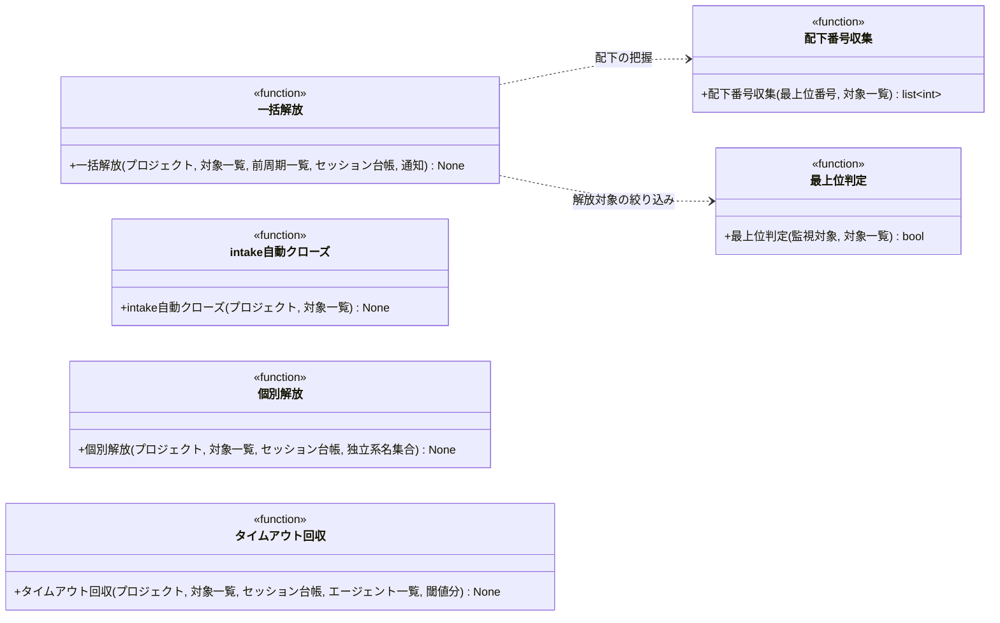

# モジュール構成: モニター / クリーンアップ

`クリーンアップ` ドメイン（モニター側）に属する構成要素詳細。
polling / heartbeat 周期の検知（intake 自動クローズ・一括解放・個別解放・タイムアウト回収）を扱う。
エージェントの外側にある後片付けだけを担い、ラベルの付け替え・完了の伝播はエージェント側の責務のまま。

## 一覧

| ユースケース | 役割 | コンテナ | 種別 | 名前 | 概要 | 補足 |
| --- | --- | --- | --- | --- | --- | --- |
| intake自動クローズ | 検知 | `features/cleanup/service.py` | 関数 | [`close_completed_intakes`](#intake-自動クローズ) | 紐づく PR が全てマージされた intake をクローズする | 前周期との差分で判定する |
| 一括解放 | 検知 | `features/cleanup/service.py` | 関数 | [`release_closed_roots`](#一括解放) | 最上位 Issue の close 検知で配下の全セッションを解放する | - |
| 一括解放 | 内部処理 | `features/cleanup/service.py` | 関数 | [`_is_root`](#最上位判定) | base が `master` の PR かを返す | 上位レイヤーを持たない面 |
| 一括解放 | 内部処理 | `features/cleanup/service.py` | 関数 | [`_collect_family_numbers`](#配下番号収集) | base の連鎖を辿って配下の PR 番号と起点 Issue を再帰収集する | Sub-issue API は使わない |
| 個別解放 | 検知 | `features/cleanup/service.py` | 関数 | [`release_closed_sessions`](#個別解放) | 担当面が closed のセッションを解放しラベルを外す | 全エージェントが対象 |
| タイムアウト検知 | 検知 | `features/cleanup/service.py` | 関数 | [`reap_timed_out_sessions`](#タイムアウト回収) | 処理中のまま超過したセッションを kill + 台帳修復する | - |

## ディレクトリ構成

```
src/ai_monitor/features/cleanup/
└── service.py    # close_completed_intakes / release_closed_roots / release_closed_sessions / reap_timed_out_sessions
```

## 構成図



## `features/cleanup/service.py`
> 種別: ファイル

周期の検知 4 種を担うファイル。
GitHub・tmux 操作の実体は [GitHub連携](./GitHub連携.py.md) / [tmux連携](./tmux連携.py.md)、台帳操作は[セッション台帳](./エージェント管理.py.md#セッション台帳)（いずれも別分類）。

---

### intake 自動クローズ
> 物理名: `close_completed_intakes`<br>
> 種別: 関数

紐づく PR が全てマージされた intake Issue をクローズする。

#### 引数

| 論理名 | 引数名 | 型 | 必須 | デフォルト | 説明 | 補足 |
| --- | --- | --- | --- | --- | --- | --- |
| プロジェクト | `project` | [`MonitoredProject`](./エージェント管理.py.md#監視対象プロジェクト) | ✅ | - | 対象のプロジェクト | - |
| 対象一覧 | `targets` | [`list[MonitorTarget]`](./エージェント管理.py.md#監視対象) | ✅ | - | 周期の open 対象一覧 | - |
| 前周期の対象一覧 | `prev_targets` | [`list[MonitorTarget]`](./エージェント管理.py.md#監視対象) | ✅ | - | 前周期の open 対象一覧 | 紐づく PR が「あった」ことの判定に使う |
| intake レイヤーラベル | `intake_label` | `str` | ✅ | - | intake Issue を見分けるラベル | キーワード引数。[ラベル設定](./エージェント管理.py.md#ラベル設定)の値 |

引数例:

```python
close_completed_intakes(project, targets, prev_targets, intake_label=labels.layer_intake)
```

#### 戻り値

| 型 | 説明 | 補足 |
| --- | --- | --- |
| `None` | なし | - |

#### 処理

1. `targets` から `layer:intake` ラベル付きの Issue を抽出する
2. 各 intake について、その番号を本文の `## 紐づく Issue` に持つ PR を `targets` と `prev_targets` から数える
3. 前周期にはあり、今周期に 1 件も無いものをクローズする（[Issue クローズ](./GitHub連携.py.md#issue-クローズ)）
   - `[INFO]` intake Issue をクローズした（`project` / `number` / 前周期の紐づく PR 件数）
   - 前周期にも今周期にも無いものは対象外（まだ PR が作られていない intake）

#### 例外

なし（クローズ失敗の `RequestFailed` は呼び出し元の周期見送りに委ねる）

#### 単体テスト

| テスト名 | 正常/異常 | 概要 | 条件 | Mock | 期待値 | 補足 |
| --- | --- | --- | --- | --- | --- | --- |
| `test_close_completed_intakes` | 正常 | 全 PR マージ後のクローズ | 前周期に紐づく PR が 2 件・今周期に 0 件 | GitHub API | 該当 intake だけがクローズされる | - |
| `test_close_completed_intakes_when_pr_open` | 正常 | 未マージの見送り | 今周期に紐づく PR が 1 件残る | GitHub API | クローズが呼ばれない | - |
| `test_close_completed_intakes_when_no_pr` | 正常 | PR 未作成の対象外 | 前周期にも今周期にも紐づく PR が無い | GitHub API | クローズが呼ばれない | 分解前の intake |

---

### 一括解放
> 物理名: `release_closed_roots`<br>
> 種別: 関数

前周期との差分で最上位 PR のクローズを検知し、配下の全セッション（起点 Issue 含む）を一括解放する。

#### 引数

| 論理名 | 引数名 | 型 | 必須 | デフォルト | 説明 | 補足 |
| --- | --- | --- | --- | --- | --- | --- |
| プロジェクト | `project` | [`MonitoredProject`](./エージェント管理.py.md#監視対象プロジェクト) | ✅ | - | 対象のプロジェクト | - |
| 対象一覧 | `targets` | [`list[MonitorTarget]`](./エージェント管理.py.md#監視対象) | ✅ | - | 今周期の open 対象一覧 | - |
| 前周期一覧 | `prev_targets` | [`list[MonitorTarget]`](./エージェント管理.py.md#監視対象) | ✅ | - | 前周期の open 対象一覧 | 初回は `[]`（差分なし扱い） |
| セッション台帳 | `registry` | [`SessionRegistry`](./エージェント管理.py.md#セッション台帳) | ✅ | - | 起動中セッションの台帳 | キーワード引数 |
| 確認ラベル接頭辞 | `confirm_prefix` | `str` | ✅ | - | 残存判定に使う確認ラベルの接頭辞 | キーワード引数。[ラベル設定](./エージェント管理.py.md#ラベル設定)の値 |
| 通知 | `notify` | [`NotifyFn`](./通知.py.md#契機通知型) | ✅ | - | 完了の契機通知 | キーワード引数 |

引数例:

```python
release_closed_roots(
    project, targets, prev_targets,
    registry=registry, confirm_prefix=labels.confirm_prefix, notify=notify,
)
```

#### 戻り値

| 型 | 説明 | 補足 |
| --- | --- | --- |
| `None` | なし | - |

#### 処理

1. `prev_targets` に居て `targets` に居ない PR をクローズ候補にする
2. 候補を単体取得し、closed を確認する（[Issue 単体取得](./GitHub連携.py.md#issue-単体取得)。open ならスキップ）
   - `[DEBUG]` 一覧から消えたが open のため見送った（`project` / `number`）
3. 最上位でない面は解放しない（[最上位判定](#最上位判定)。上位レイヤーの close まで配下を常駐させる）
   - `[INFO]` 上位レイヤーが残っているため解放を見送った（`project` / `number`）
   - `[INFO]` 最上位面のクローズを検知した（`project` / `number`）
4. 配下 + 起点 Issue の番号を収集する（[配下番号収集](#配下番号収集)）
5. `targets` のうち収集番号の面と、収集番号に紐づく PR（`linked_issue_numbers` 照合）に `確認:*` が残っていれば解放しない（次周期で再判定）
   - `[INFO]` 確認ラベルが残っているため解放を見送った（`project` / `number` / 残存している番号）
6. 収集番号ごとに台帳からセッションを解放し、tmux セッションを kill する（[番号で解放](./エージェント管理.py.md#番号で解放)・[セッション kill](./tmux連携.py.md#セッション-kill)）
   - `[INFO]` 配下のセッションを解放した（`project` / `number` / 解放したセッション名の一覧）
7. 完了を契機通知で送る（[契機通知型](./通知.py.md#契機通知型)）

#### 例外

なし（取得失敗の `RequestFailed` は呼び出し元の周期見送りに委ねる）

#### 単体テスト

| テスト名 | 正常/異常 | 概要 | 条件 | Mock | 期待値 | 補足 |
| --- | --- | --- | --- | --- | --- | --- |
| `test_release_closed_roots` | 正常 | 配下の一括解放 | 前周期に居た PR が今周期に無く、単体取得は closed・base が `master`・配下に `確認:*` なし | GitHub API / tmux | 配下 + 起点 Issue の全セッションが解放され kill される | - |
| `test_release_closed_roots_when_parent_remains` | 正常 | 上位レイヤーが残る面の見送り | base が system ブランチ（上位レイヤーを持つ） | GitHub API / tmux | 解放・kill・契機通知が発生しない | 最上位判定の分岐 |
| `test_release_closed_roots_when_confirm_remains` | 正常 | 確認ラベル残存の見送り | 配下の PR に `確認:*` が残存 | GitHub API / tmux | 解放・kill が発生しない | - |
| `test_release_closed_roots_when_still_open` | 正常 | open のままの見送り | 一覧から消えたが単体取得は open | GitHub API / tmux | 解放・kill が発生しない | 一覧の取りこぼし |
| `test_release_closed_roots_when_no_diff` | 正常 | 差分なしの見送り | 前周期と今周期が同一 | GitHub API / tmux | 単体取得も発生しない | - |

---

### 最上位判定
> 物理名: `_is_root`<br>
> 種別: 関数

base が `master` の PR（= 上位レイヤーを持たない）かを返す。

#### 引数

| 論理名 | 引数名 | 型 | 必須 | デフォルト | 説明 | 補足 |
| --- | --- | --- | --- | --- | --- | --- |
| 監視対象 | `target` | [`MonitorTarget`](./エージェント管理.py.md#監視対象) | ✅ | - | 判定する面 | - |
| 対象一覧 | `targets` | [`list[MonitorTarget]`](./エージェント管理.py.md#監視対象) | ✅ | - | base を引く元の一覧 | 前周期の一覧を渡す（クローズ済みの面は今周期に居ない） |

引数例:

```python
_is_root(closed, prev_targets)
```

#### 戻り値

| 型 | 説明 | 補足 |
| --- | --- | --- |
| `bool` | 最上位なら `True` | base が `master` |

戻り値例:

```python
True
```

#### 処理

1. `targets` から同じ番号の PR を探して base ブランチを読む
   - 見つからない / base が空の場合、base を引けないので最上位として `True` を返す（配下の解放判定は確認ラベルで守られる）
2. base が `master`（リポジトリのデフォルトブランチ）なら最上位として `True` を返す
3. それ以外は親レイヤーの PR が存在するため `False` を返す

#### 例外

なし（`targets` を辿るだけで API を呼ばない）

#### 単体テスト

| テスト名 | 正常/異常 | 概要 | 条件 | Mock | 期待値 | 補足 |
| --- | --- | --- | --- | --- | --- | --- |
| `test_is_root` | 正常 | base が master | base が `master` | なし | `True` を返す | - |
| `test_is_root_when_upper_layer` | 正常 | base が親レイヤー | base が system ブランチ | なし | `False` を返す | 分岐の確認 |

---

### 配下番号収集
> 物理名: `_collect_family_numbers`<br>
> 種別: 関数

base の連鎖を辿って最上位配下の全 PR 番号と起点の Issue 番号を収集する。

#### 引数

| 論理名 | 引数名 | 型 | 必須 | デフォルト | 説明 | 補足 |
| --- | --- | --- | --- | --- | --- | --- |
| 最上位番号 | `root_number` | `int` | ✅ | - | 起点の最上位 PR 番号 | - |
| 対象一覧 | `targets` | [`list[MonitorTarget]`](./エージェント管理.py.md#監視対象) | ✅ | - | base を辿る元の一覧 | base の連鎖をメモリ上で辿るため追加の API を呼ばない |

引数例:

```python
_collect_family_numbers(35, prev_targets)
```

#### 戻り値

| 型 | 説明 | 補足 |
| --- | --- | --- |
| `list[int]` | 最上位自身 + 全子孫 PR + 起点 Issue の番号 | 起点 Issue が無い場合は自身 + 子孫のみ |

戻り値例:

```python
[35, 40, 50, 30]
```

#### 処理

1. 最上位 PR の head ブランチを base に持つ PR を `targets` から探し、見つかるたびに同じ手順を繰り返して子孫を集める（[子番号一覧](./GitHub連携.py.md#子番号一覧)）
2. 最上位 PR の `linked_issue_numbers` から起点の Issue 番号を読んで加える（無ければ加えない）
3. 自身を含めた番号一覧を返す

`targets` は周期の頭で 1 回だけ取得した対象一覧なので、連鎖を辿っても追加の API 呼び出しは発生しない。

#### 例外

なし（`targets` を辿るだけで API を呼ばない）

#### 単体テスト

| テスト名 | 正常/異常 | 概要 | 条件 | Mock | 期待値 | 補足 |
| --- | --- | --- | --- | --- | --- | --- |
| `test_collect_family_numbers` | 正常 | 2 段の再帰と起点の合算 | epic → story → subsystem の base 連鎖 + `## 紐づく Issue` あり | なし | 全番号が重複なしで返る | API 呼び出しが発生しない |
| `test_collect_family_numbers_when_no_linked_issue` | 正常 | 起点 Issue なし | `## 紐づく Issue` が無い | なし | 自身 + 子孫のみ返る | - |
| `test_collect_family_numbers_when_artifact_pr` | 正常 | 成果物 PR も収集 | レイヤー PR の下に成果物 PR がぶら下がる | なし | 成果物 PR の番号も含まれる | 解放漏れを防ぐ |

---

### 個別解放
> 物理名: `release_closed_sessions`<br>
> 種別: 関数

担当面が close / merge された全エージェントのセッションを解放し、対象に残った確認 / 処理中ラベルを除去する。
検知の起点が台帳なので、モニターの停止中に close された対象も再起動後の周期で拾える。

#### 引数

| 論理名 | 引数名 | 型 | 必須 | デフォルト | 説明 | 補足 |
| --- | --- | --- | --- | --- | --- | --- |
| プロジェクト | `project` | [`MonitoredProject`](./エージェント管理.py.md#監視対象プロジェクト) | ✅ | - | 対象のプロジェクト | - |
| 対象一覧 | `targets` | [`list[MonitorTarget]`](./エージェント管理.py.md#監視対象) | ✅ | - | 今周期の open 対象一覧 | - |
| セッション台帳 | `registry` | [`SessionRegistry`](./エージェント管理.py.md#セッション台帳) | ✅ | - | 起動中セッションの台帳 | キーワード引数 |
| エージェント一覧 | `agents` | [`list[Agent]`](./エージェント管理.py.md#エージェント) | ✅ | - | 確認 / 処理中ラベルの解決に使う | キーワード引数 |

引数例:

```python
release_closed_sessions(project, targets, registry=registry, agents=agents)
```

#### 戻り値

| 型 | 説明 | 補足 |
| --- | --- | --- |
| `None` | なし | - |

#### 処理

1. 台帳から対象プロジェクトのセッションを抽出する
2. 主番号が `targets` に無いセッションを候補にし、単体取得で closed を確認する（[Issue 単体取得](./GitHub連携.py.md#issue-単体取得)。open ならスキップ）
   - `[DEBUG]` 一覧から消えたが open のため見送った（`project` / `number`）
3. 該当セッションを台帳から除去し、tmux セッションを kill する（[除去](./エージェント管理.py.md#除去)・[セッション kill](./tmux連携.py.md#セッション-kill)）
4. 対象から担当エージェントの確認 / 処理中ラベルを除去する（[ラベル除去](./GitHub連携.py.md#ラベル除去)）
   - 残すと reopen 時に不要な起動を招くため、解放と同じ周期で外す
   - `[INFO]` closed 対象のセッションを解放した（`project` / `agent_name` / `number`）

#### 例外

なし（取得失敗の `RequestFailed` は呼び出し元の周期見送りに委ねる）

#### 単体テスト

| テスト名 | 正常/異常 | 概要 | 条件 | Mock | 期待値 | 補足 |
| --- | --- | --- | --- | --- | --- | --- |
| `test_release_closed_sessions` | 正常 | close 確認後の解放 | 主番号が一覧に無く単体取得は closed | GitHub API / tmux | 台帳から除去され kill され、確認 / 処理中ラベルが除去される | ワークフロー系も対象 |
| `test_release_closed_sessions_when_still_open` | 正常 | open のままの見送り | 主番号が一覧に無いが単体取得は open | GitHub API / tmux | 解放・kill・ラベル除去が発生しない | 一覧の取りこぼし |
| `test_release_closed_sessions_when_label_missing` | 正常 | ラベルが無い場合 | closed だが確認 / 処理中ラベルが付いていない | GitHub API / tmux | 解放は行われ、ラベル除去でエラーにならない | 冪等 |

---

### タイムアウト回収
> 物理名: `reap_timed_out_sessions`<br>
> 種別: 関数

処理中のまま `session_timeout_min` を超過したセッションを kill して回収する。
あわせて tmux に実体が無いセッションの台帳を修復する。

#### 引数

| 論理名 | 引数名 | 型 | 必須 | デフォルト | 説明 | 補足 |
| --- | --- | --- | --- | --- | --- | --- |
| プロジェクト | `project` | [`MonitoredProject`](./エージェント管理.py.md#監視対象プロジェクト) | ✅ | - | 対象のプロジェクト | - |
| 対象一覧 | `targets` | [`list[MonitorTarget]`](./エージェント管理.py.md#監視対象) | ✅ | - | 今周期の open 対象一覧 | 処理中ラベルの照合に使う |
| セッション台帳 | `registry` | [`SessionRegistry`](./エージェント管理.py.md#セッション台帳) | ✅ | - | 起動中セッションの台帳 | キーワード引数 |
| エージェント一覧 | `agents` | [`list[Agent]`](./エージェント管理.py.md#エージェント定義) | ✅ | - | 処理中ラベルの解決に使う | エージェント名 → `processing_label` |
| 閾値分 | `timeout_min` | `int` | ✅ | - | タイムアウト閾値（分） | 設定の `session_timeout_min` |
| 関門 | `gate` | [`RateLimitGate`](./レートリミット.py.md#レートリミット関門) | ✅ | - | レートリミットの待機状態 | キーワード引数 |

引数例:

```python
reap_timed_out_sessions(project, targets, registry=registry, agents=agents, timeout_min=30)
```

#### 戻り値

| 型 | 説明 | 補足 |
| --- | --- | --- |
| `None` | なし | - |

#### 処理

1. プロジェクトの各セッションの tmux 実体を確認し、無いものは台帳から除去する（[生存確認](./tmux連携.py.md#生存確認)・[除去](./エージェント管理.py.md#除去)）
   - `[WARNING]` tmux 実体が無いセッションを台帳から除去した（`project` / `session_name`）
2. レートリミットの待機中なら、以降の回収を行わずに戻る（[待機中か](./レートリミット.py.md#待機中か)。止まっているのはハングではないため kill しない）
3. `last_seen_at` が `timeout_min` を超過したセッションを抽出する
4. 主番号の対象に `処理中:{エージェント}` が付いているものだけを対象にする（待機中は対象外）
5. 処理中ラベルを除去 → tmux セッションを kill → 台帳から除去する（[ラベル除去](./GitHub連携.py.md#ラベル除去)・[セッション kill](./tmux連携.py.md#セッション-kill)・[除去](./エージェント管理.py.md#除去)。ラベル除去に失敗したセッションは見送り、次周期で再試行する）
   - `[WARNING]` タイムアウトしたセッションを kill した（`project` / `session_name` / `last_seen_at` からの経過分）
   - `[WARNING]` 処理中ラベルの除去に失敗したため回収を見送った（`project` / `number` / 例外）

#### 例外

なし

#### 単体テスト

| テスト名 | 正常/異常 | 概要 | 条件 | Mock | 期待値 | 補足 |
| --- | --- | --- | --- | --- | --- | --- |
| `test_reap_timed_out_sessions` | 正常 | 超過セッションの回収 | 超過 + 処理中ラベルありのセッション | GitHub API / tmux | ラベル除去 → kill → 台帳除去の順で実行される | - |
| `test_reap_timed_out_sessions_when_waiting` | 正常 | 待機中の対象外 | 超過しているが処理中ラベルなし | GitHub API / tmux | kill・台帳変更・ラベル操作が発生しない | - |
| `test_reap_timed_out_sessions_when_session_gone` | 正常 | 実体消失の台帳修復 | tmux の生存確認が偽 | GitHub API / tmux | 台帳から除去のみ行われる | - |
| `test_reap_timed_out_sessions_when_label_error` | 異常 | ラベル除去失敗の見送り | ラベル除去が `RequestFailed` | GitHub API / tmux | kill・台帳除去が行われない（次周期で再試行） | - |
| `test_reap_timed_out_sessions_when_rate_limited` | 正常 | レートリミット待機中の見送り | 関門が待機中 + 超過 + 処理中ラベルありのセッション | GitHub API / tmux | ラベル除去・kill・台帳除去が行われない | 止まっているのはハングではない |
