# モジュール構成: モニター / クリーンアップ

`クリーンアップ` ドメイン（モニター側）に属する構成要素詳細。
polling / heartbeat 周期の検知（intake 自動クローズ・一括解放・個別解放・タイムアウト回収）を扱う。
エージェントの外側にある後片付けだけを担い、ラベルの付け替え・完了の伝播はエージェント側の責務のまま。

## 一覧

| ユースケース | 役割 | コンテナ | 種別 | 名前 | 概要 | 補足 |
| --- | --- | --- | --- | --- | --- | --- |
| intake自動クローズ | 検知 | `features/cleanup/service.py` | 関数 | [`close_completed_intakes`](#intake-自動クローズ) | 全 Sub-issue closed の intake をクローズする | - |
| 一括解放 | 検知 | `features/cleanup/service.py` | 関数 | [`release_closed_roots`](#一括解放) | 最上位 Issue の close 検知で配下の全セッションを解放する | - |
| 一括解放 | 内部処理 | `features/cleanup/service.py` | 関数 | [`_is_root`](#最上位判定) | 報告先の conductor を持つ親がないかを返す | 親なし or 親が `layer:intake` |
| 一括解放 | 内部処理 | `features/cleanup/service.py` | 関数 | [`_collect_family_numbers`](#配下番号収集) | 最上位配下 + 親 intake の Issue 番号を再帰収集する | - |
| 個別解放 | 検知 | `features/cleanup/service.py` | 関数 | [`release_closed_standalone`](#個別解放) | 独立系セッションを担当面の close 検知で解放する | - |
| タイムアウト検知 | 検知 | `features/cleanup/service.py` | 関数 | [`reap_timed_out_sessions`](#タイムアウト回収) | 処理中のまま超過したセッションを kill + 台帳修復する | - |

## ディレクトリ構成

```
src/ai_monitor/features/cleanup/
└── service.py    # close_completed_intakes / release_closed_roots / release_closed_standalone / reap_timed_out_sessions
```

## 構成図

```mermaid
classDiagram
  direction LR
  一括解放 ..> 配下番号収集 : 配下の把握
  一括解放 ..> 最上位判定 : 解放対象の絞り込み

  class intake自動クローズ {
    <<function>>
    +intake自動クローズ(プロジェクト, 対象一覧) None
  }
  class 一括解放 {
    <<function>>
    +一括解放(プロジェクト, 対象一覧, 前周期一覧, セッション台帳) None
  }
  class 配下番号収集 {
    <<function>>
    +配下番号収集(プロジェクト, epic番号) list~int~
  }
  class 最上位判定 {
    <<function>>
    +最上位判定(プロジェクト, 番号, intakeラベル) bool
  }
  class 個別解放 {
    <<function>>
    +個別解放(プロジェクト, 対象一覧, セッション台帳, 独立系名集合) None
  }
  class タイムアウト回収 {
    <<function>>
    +タイムアウト回収(プロジェクト, 対象一覧, セッション台帳, エージェント一覧, 閾値分) None
  }

  click intake自動クローズ href "#intake-自動クローズ"
  click 一括解放 href "#一括解放"
  click 配下番号収集 href "#配下番号収集"
  click 最上位判定 href "#最上位判定"
  click 個別解放 href "#個別解放"
  click タイムアウト回収 href "#タイムアウト回収"
```



## `features/cleanup/service.py`
> 種別: ファイル

周期の検知 4 種を担うファイル。
GitHub・tmux 操作の実体は [GitHub連携](./GitHub連携.py.md) / [tmux連携](./tmux連携.py.md)、台帳操作は[セッション台帳](./エージェント管理.py.md#セッション台帳)（いずれも別分類）。

---

### intake 自動クローズ
> 物理名: `close_completed_intakes`<br>
> 種別: 関数

全 Sub-issue closed の intake Issue をクローズする。

#### 引数

| 論理名 | 引数名 | 型 | 必須 | デフォルト | 説明 | 補足 |
| --- | --- | --- | --- | --- | --- | --- |
| プロジェクト | `project` | [`MonitoredProject`](./エージェント管理.py.md#監視対象プロジェクト) | ✅ | - | 対象のプロジェクト | - |
| 対象一覧 | `targets` | [`list[MonitorTarget]`](./エージェント管理.py.md#監視対象) | ✅ | - | 周期の open 対象一覧 | - |
| intake レイヤーラベル | `intake_label` | `str` | ✅ | - | intake Issue を見分けるラベル | キーワード引数。[ラベル設定](./エージェント管理.py.md#ラベル設定)の値 |

引数例:

```python
close_completed_intakes(project, targets, intake_label=labels.layer_intake)
```

#### 戻り値

| 型 | 説明 | 補足 |
| --- | --- | --- |
| `None` | なし | - |

#### 処理

1. `targets` から `layer:intake` ラベル付きの Issue を抽出する
2. `sub_issues_total > 0` かつ `sub_issues_completed == sub_issues_total` のものをクローズする（[Issue クローズ](./GitHub連携.py.md#issue-クローズ)）
   - `[INFO]` intake Issue をクローズした（`project` / `number` / Sub-issue 件数）

#### 例外

なし（クローズ失敗の `RequestFailed` は呼び出し元の周期見送りに委ねる）

#### 単体テスト

| テスト名 | 正常/異常 | 概要 | 条件 | Mock | 期待値 | 補足 |
| --- | --- | --- | --- | --- | --- | --- |
| `test_close_completed_intakes` | 正常 | 全子 closed のクローズ | `total=2, completed=2` の intake + 対象外の Issue が混在 | GitHub API | 該当 intake だけがクローズされる | - |
| `test_close_completed_intakes_when_incomplete` | 正常 | 未完了の見送り | `total=2, completed=1` の intake | GitHub API | クローズが呼ばれない | - |
| `test_close_completed_intakes_when_no_children` | 正常 | Sub-issue なしの対象外 | `total=0` の intake | GitHub API | クローズが呼ばれない | - |

---

### 一括解放
> 物理名: `release_closed_roots`<br>
> 種別: 関数

前周期との差分で epic のクローズを検知し、配下の全セッション（intake 含む）を一括解放する。

#### 引数

| 論理名 | 引数名 | 型 | 必須 | デフォルト | 説明 | 補足 |
| --- | --- | --- | --- | --- | --- | --- |
| プロジェクト | `project` | [`MonitoredProject`](./エージェント管理.py.md#監視対象プロジェクト) | ✅ | - | 対象のプロジェクト | - |
| 対象一覧 | `targets` | [`list[MonitorTarget]`](./エージェント管理.py.md#監視対象) | ✅ | - | 今周期の open 対象一覧 | - |
| 前周期一覧 | `prev_targets` | [`list[MonitorTarget]`](./エージェント管理.py.md#監視対象) | ✅ | - | 前周期の open 対象一覧 | 初回は `[]`（差分なし扱い） |
| セッション台帳 | `registry` | [`SessionRegistry`](./エージェント管理.py.md#セッション台帳) | ✅ | - | 起動中セッションの台帳 | キーワード引数 |
| epic レイヤーラベル | `epic_label` | `str` | ✅ | - | epic Issue を見分けるラベル | キーワード引数。[ラベル設定](./エージェント管理.py.md#ラベル設定)の値 |
| 確認ラベル接頭辞 | `confirm_prefix` | `str` | ✅ | - | 残存判定に使う確認ラベルの接頭辞 | キーワード引数。[ラベル設定](./エージェント管理.py.md#ラベル設定)の値 |

引数例:

```python
release_closed_roots(
    project, targets, prev_targets,
    registry=registry, epic_label=labels.layer_epic, confirm_prefix=labels.confirm_prefix,
)
```

#### 戻り値

| 型 | 説明 | 補足 |
| --- | --- | --- |
| `None` | なし | - |

#### 処理

1. `prev_targets` に居て `targets` に居ない `layer:epic` の Issue をクローズ候補にする
2. 候補を単体取得し、closed を確認する（[Issue 単体取得](./GitHub連携.py.md#issue-単体取得)。open ならスキップ）
   - `[INFO]` epic のクローズを検知した（`project` / `epic_number`）
   - `[DEBUG]` 一覧から消えたが open のため見送った（`project` / `epic_number`）
3. 配下 + 親 intake の番号を収集する（[配下番号収集](#配下番号収集)）
4. `targets` のうち収集番号の Issue と、収集番号に紐づく PR（`linked_issue_numbers` 照合）に `確認:*` が残っていれば解放しない（次周期で再判定）
   - `[INFO]` 確認ラベルが残っているため解放を見送った（`project` / `epic_number` / 残存している番号）
5. 収集番号ごとに台帳からセッションを解放し、tmux セッションを kill する（[番号で解放](./エージェント管理.py.md#番号で解放)・[セッション kill](./tmux連携.py.md#セッション-kill)）
   - `[INFO]` epic 配下のセッションを解放した（`project` / `epic_number` / 解放したセッション名の一覧）

#### 例外

なし（取得失敗の `RequestFailed` は呼び出し元の周期見送りに委ねる）

#### 単体テスト

| テスト名 | 正常/異常 | 概要 | 条件 | Mock | 期待値 | 補足 |
| --- | --- | --- | --- | --- | --- | --- |
| `test_release_closed_roots` | 正常 | 配下の一括解放 | 前周期に居た Issue が今周期に無く、単体取得は closed・親が `layer:intake`・配下に `確認:*` なし | GitHub API / tmux | 配下 + intake の全セッションが解放され kill される | - |
| `test_release_closed_roots_when_parent_remains` | 正常 | 上位レイヤーが残る Issue の見送り | 親が `layer:system`（報告先の conductor を持つ） | GitHub API / tmux | 解放・kill が発生せず、配下の再帰取得も行わない | 最上位判定の分岐 |
| `test_release_closed_roots_when_confirm_remains` | 正常 | 確認ラベル残存の見送り | 配下の subsystem に `確認:*` が残存 | GitHub API / tmux | 解放・kill が発生しない | - |
| `test_release_closed_roots_when_still_open` | 正常 | open のままの見送り | 一覧から消えたが単体取得は open | GitHub API / tmux | 解放・kill が発生しない | 一覧の取りこぼし |
| `test_release_closed_roots_when_no_diff` | 正常 | 差分なしの見送り | 前周期と今周期が同一 | GitHub API / tmux | 単体取得も発生しない | - |

---

### 最上位判定
> 物理名: `_is_root`<br>
> 種別: 関数

報告先の conductor を持つ親がない（= 最上位）かを返す。

#### 引数

| 論理名 | 引数名 | 型 | 必須 | デフォルト | 説明 | 補足 |
| --- | --- | --- | --- | --- | --- | --- |
| プロジェクト | `project` | [`MonitoredProject`](./エージェント管理.py.md#監視対象プロジェクト) | ✅ | - | 対象のプロジェクト | - |
| 番号 | `number` | `int` | ✅ | - | 判定する Issue 番号 | - |
| intake ラベル | `intake_label` | `str` | ✅ | - | `layer:intake` のラベル値 | キーワード引数 |

引数例:

```python
_is_root(project, 35, intake_label="layer:intake")
```

#### 戻り値

| 型 | 説明 | 補足 |
| --- | --- | --- |
| `bool` | 最上位なら `True` | 親なし、または親が `layer:intake` |

戻り値例:

```python
True
```

#### 処理

1. 親 Issue 番号を取得する（[親 Issue 番号取得](./GitHub連携.py.md#親-issue-番号取得)）
2. 親の有無で判定する
   - 親が `None` の場合、最上位として `True` を返す
   - 親がある場合、親を単体取得して `layer:intake` を持つかを返す（intake は起票専用で報告先の conductor を持たないため最上位として扱う）

#### 例外

なし（取得失敗の `RequestFailed` は呼び出し元の周期見送りに委ねる）

#### 単体テスト

| テスト名 | 正常/異常 | 概要 | 条件 | Mock | 期待値 | 補足 |
| --- | --- | --- | --- | --- | --- | --- |
| `test_is_root` | 正常 | 親なし | 親 Issue 番号取得が `None` を返す | GitHub API | `True` を返し、単体取得を呼ばない | - |
| `test_is_root_when_parent_is_intake` | 正常 | 親が intake | 親が `layer:intake` | GitHub API | `True` を返す | 分岐の確認 |
| `test_is_root_when_parent_is_upper_layer` | 正常 | 親が上位レイヤー | 親が `layer:system` | GitHub API | `False` を返す | 分岐の確認 |

---

### 配下番号収集
> 物理名: `_collect_family_numbers`<br>
> 種別: 関数

最上位配下（Sub-issue ツリーの全子孫）と親 intake の Issue 番号を収集する。

#### 引数

| 論理名 | 引数名 | 型 | 必須 | デフォルト | 説明 | 補足 |
| --- | --- | --- | --- | --- | --- | --- |
| プロジェクト | `project` | [`MonitoredProject`](./エージェント管理.py.md#監視対象プロジェクト) | ✅ | - | 対象のプロジェクト | - |
| 最上位番号 | `root_number` | `int` | ✅ | - | 起点の最上位 Issue 番号 | - |

引数例:

```python
_collect_family_numbers(project, 35)
```

#### 戻り値

| 型 | 説明 | 補足 |
| --- | --- | --- |
| `list[int]` | 最上位自身 + 全子孫 + 親 intake の番号 | 親なしは自身 + 子孫のみ |

戻り値例:

```python
[35, 40, 50, 30]
```

#### 処理

1. 最上位番号を起点に Sub-issue の子番号を再帰取得して集める（[Sub-issue 番号一覧](./GitHub連携.py.md#sub-issue-番号一覧)）
2. 親 Issue 番号（intake）を取得して加える（[親 Issue 番号取得](./GitHub連携.py.md#親-issue-番号取得)。`None` は加えない）
3. 自身を含めた番号一覧を返す

#### 例外

なし（取得失敗の `RequestFailed` は呼び出し元へ伝播する）

#### 単体テスト

| テスト名 | 正常/異常 | 概要 | 条件 | Mock | 期待値 | 補足 |
| --- | --- | --- | --- | --- | --- | --- |
| `test_collect_family_numbers` | 正常 | 2 段の再帰と親の合算 | epic → story → subsystem の 2 段 + 親 intake | GitHub API | 全番号が重複なしで返る | - |
| `test_collect_family_numbers_when_no_parent` | 正常 | 親なし epic | 親取得が `None` | GitHub API | epic + 子孫のみ返る | - |

---

### 個別解放
> 物理名: `release_closed_standalone`<br>
> 種別: 関数

独立系エージェントのセッションを、担当面の close / merge 検知で解放する。

#### 引数

| 論理名 | 引数名 | 型 | 必須 | デフォルト | 説明 | 補足 |
| --- | --- | --- | --- | --- | --- | --- |
| プロジェクト | `project` | [`MonitoredProject`](./エージェント管理.py.md#監視対象プロジェクト) | ✅ | - | 対象のプロジェクト | - |
| 対象一覧 | `targets` | [`list[MonitorTarget]`](./エージェント管理.py.md#監視対象) | ✅ | - | 今周期の open 対象一覧 | - |
| セッション台帳 | `registry` | [`SessionRegistry`](./エージェント管理.py.md#セッション台帳) | ✅ | - | 起動中セッションの台帳 | キーワード引数 |
| 独立系名集合 | `standalone_names` | `set[str]` | ✅ | - | 個別解放の対象エージェント名 | `Agent.standalone` が `True` の名前（`build_agents` 由来） |

引数例:

```python
release_closed_standalone(project, targets, registry=registry, standalone_names={"library-poc-runner", "questioner"})
```

#### 戻り値

| 型 | 説明 | 補足 |
| --- | --- | --- |
| `None` | なし | - |

#### 処理

1. 台帳から `standalone_names` に該当するプロジェクトのセッションを抽出する
2. 主番号が `targets` に無いセッションを候補にし、単体取得で closed を確認する（[Issue 単体取得](./GitHub連携.py.md#issue-単体取得)。open ならスキップ）
   - `[DEBUG]` 一覧から消えたが open のため見送った（`project` / `number`）
3. 該当セッションを台帳から除去し、tmux セッションを kill する（[除去](./エージェント管理.py.md#除去)・[セッション kill](./tmux連携.py.md#セッション-kill)）
   - `[INFO]` 独立系セッションを解放した（`project` / `agent_name` / `number`）

#### 例外

なし（取得失敗の `RequestFailed` は呼び出し元の周期見送りに委ねる）

#### 単体テスト

| テスト名 | 正常/異常 | 概要 | 条件 | Mock | 期待値 | 補足 |
| --- | --- | --- | --- | --- | --- | --- |
| `test_release_closed_standalone` | 正常 | close 確認後の解放 | 主番号が一覧に無く単体取得は closed | GitHub API / tmux | 台帳から除去され kill される | - |
| `test_release_closed_standalone_when_still_open` | 正常 | open のままの見送り | 主番号が一覧に無いが単体取得は open | GitHub API / tmux | 解放・kill が発生しない | 一覧の取りこぼし |
| `test_release_closed_standalone_when_workflow_agent` | 正常 | ワークフロー系の対象外 | 独立系でないセッションの主番号が一覧に無い | GitHub API / tmux | 単体取得も発生しない | 一括解放まで常駐 |

---

### タイムアウト回収
> 物理名: `reap_timed_out_sessions`<br>
> 種別: 関数

処理中のまま `session_timeout_min` を超過したセッションを kill して回収する。
あわせて tmux に実体が無いセッションの台帳を修復する。

#### 引数

| 論理名 | 引数名 | 型 | 必須 | デフォルト | 説明 | 補足 |
| --- | --- | --- | --- | --- | --- | --- |
| プロジェクト | `project` | [`MonitoredProject`](./エージェント管理.py.md#監視対象プロジェクト) | ✅ | - | 対象のプロジェクト | - |
| 対象一覧 | `targets` | [`list[MonitorTarget]`](./エージェント管理.py.md#監視対象) | ✅ | - | 今周期の open 対象一覧 | 処理中ラベルの照合に使う |
| セッション台帳 | `registry` | [`SessionRegistry`](./エージェント管理.py.md#セッション台帳) | ✅ | - | 起動中セッションの台帳 | キーワード引数 |
| エージェント一覧 | `agents` | [`list[Agent]`](./エージェント管理.py.md#エージェント定義) | ✅ | - | 処理中ラベルの解決に使う | エージェント名 → `processing_label` |
| 閾値分 | `timeout_min` | `int` | ✅ | - | タイムアウト閾値（分） | 設定の `session_timeout_min` |
| 関門 | `gate` | [`RateLimitGate`](./レートリミット.py.md#レートリミット関門) | ✅ | - | レートリミットの待機状態 | キーワード引数 |

引数例:

```python
reap_timed_out_sessions(project, targets, registry=registry, agents=agents, timeout_min=30)
```

#### 戻り値

| 型 | 説明 | 補足 |
| --- | --- | --- |
| `None` | なし | - |

#### 処理

1. プロジェクトの各セッションの tmux 実体を確認し、無いものは台帳から除去する（[生存確認](./tmux連携.py.md#生存確認)・[除去](./エージェント管理.py.md#除去)）
   - `[WARNING]` tmux 実体が無いセッションを台帳から除去した（`project` / `session_name`）
2. レートリミットの待機中なら、以降の回収を行わずに戻る（[待機中か](./レートリミット.py.md#待機中か)。止まっているのはハングではないため kill しない）
3. `last_seen_at` が `timeout_min` を超過したセッションを抽出する
4. 主番号の対象に `処理中:{エージェント}` が付いているものだけを対象にする（待機中は対象外）
5. 処理中ラベルを除去 → tmux セッションを kill → 台帳から除去する（[ラベル除去](./GitHub連携.py.md#ラベル除去)・[セッション kill](./tmux連携.py.md#セッション-kill)・[除去](./エージェント管理.py.md#除去)。ラベル除去に失敗したセッションは見送り、次周期で再試行する）
   - `[WARNING]` タイムアウトしたセッションを kill した（`project` / `session_name` / `last_seen_at` からの経過分）
   - `[WARNING]` 処理中ラベルの除去に失敗したため回収を見送った（`project` / `number` / 例外）

#### 例外

なし

#### 単体テスト

| テスト名 | 正常/異常 | 概要 | 条件 | Mock | 期待値 | 補足 |
| --- | --- | --- | --- | --- | --- | --- |
| `test_reap_timed_out_sessions` | 正常 | 超過セッションの回収 | 超過 + 処理中ラベルありのセッション | GitHub API / tmux | ラベル除去 → kill → 台帳除去の順で実行される | - |
| `test_reap_timed_out_sessions_when_waiting` | 正常 | 待機中の対象外 | 超過しているが処理中ラベルなし | GitHub API / tmux | kill・台帳変更・ラベル操作が発生しない | - |
| `test_reap_timed_out_sessions_when_session_gone` | 正常 | 実体消失の台帳修復 | tmux の生存確認が偽 | GitHub API / tmux | 台帳から除去のみ行われる | - |
| `test_reap_timed_out_sessions_when_label_error` | 異常 | ラベル除去失敗の見送り | ラベル除去が `RequestFailed` | GitHub API / tmux | kill・台帳除去が行われない（次周期で再試行） | - |
| `test_reap_timed_out_sessions_when_rate_limited` | 正常 | レートリミット待機中の見送り | 関門が待機中 + 超過 + 処理中ラベルありのセッション | GitHub API / tmux | ラベル除去・kill・台帳除去が行われない | 止まっているのはハングではない |
