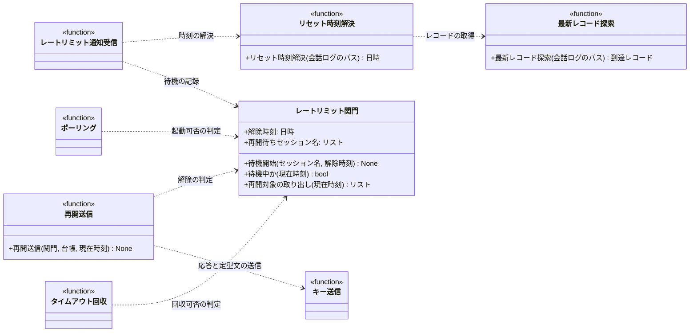

# モジュール構成: モニター / レートリミット

`レートリミット` ドメイン（モニター側）に属する構成要素詳細。
Claude の利用上限に達している間、新規セッションの起動とタイムアウト回収を止め、リセット後に止まったセッションを再開させる。

到達の検知は Claude Code の `StopFailure` フックが行い、[レートリミット通知](../../インターフェース定義/バックエンド/レートリミット通知.py.md)が受ける。
上限はアカウント単位なので、状態はプロジェクト横断で 1 つだけ持つ。

## 一覧

| ユースケース | 役割 | コンテナ | 種別 | 名前 | 概要 | 補足 |
| --- | --- | --- | --- | --- | --- | --- |
| 共通 | 状態保持 | `features/rate_limit/gate.py` | クラス | [`RateLimitGate`](#レートリミット関門) | 解除時刻と再開待ちセッションの保持 | 長期保持のランタイム状態 |
| 共通 | リセット時刻の解決 | `features/rate_limit/service.py` | 関数 | [`resolve_reset_at`](#リセット時刻解決) | 会話ログの最新レコードからリセット時刻を読む | 解析できなければ `None` |
| 共通 | 内部処理 | `features/rate_limit/service.py` | 関数 | [`_find_latest_record`](#最新レコード探索) | 会話ログを末尾から辿って最新の到達レコードを返す | 1 ファイルに複数記録される |
| 共通 | 再開送信 | `features/rate_limit/service.py` | 関数 | [`resume_blocked_sessions`](#再開送信) | 解除後に止まっているセッションへ再開を送る | heartbeat 周期から呼ぶ |

## ディレクトリ構成

```
src/ai_monitor/features/rate_limit/
├── gate.py       # RateLimitGate
└── service.py    # resolve_reset_at / resume_blocked_sessions
```

## 構成図



## レートリミット関門
> 物理名: `RateLimitGate`<br>
> 種別: クラス<br>
> コンテナ: `features/rate_limit/gate.py`

利用上限の待機状態を保持する。
モニタープロセス内で 1 インスタンスを保持する長期ランタイム状態（クラスで持つ唯一の理由）。

HTTP のワーカースレッドとポーリングのスレッドから同時に触られるため、全メソッドを再入可能ロックで直列化する（[セッション台帳](./エージェント管理.py.md#セッション台帳)と同じ理由）。

### プロパティ

| 論理名 | プロパティ名 | 型 | 可視性 | デフォルト | 説明 | 例 | 補足 |
| --- | --- | --- | --- | --- | --- | --- | --- |
| 解除時刻 | `_resets_at` | `datetime \| None` | 内部 (_) | `None` | 待機を解除する時刻 | - | `None` は待機していない状態 |
| 再開待ちセッション名 | `_blocked` | `list[str]` | 内部 (_) | `[]` | 上限に当たって止まった tmux セッション名 | `["ai-monitor-sandbox-1069-epic-conductor"]` | 解除時に再開を送る対象 |
| ロック | `_lock` | `threading.RLock` | 内部 (_) | 生成時に新規 | 全メソッドを直列化する再入可能ロック | - | インスタンスごとに 1 つ持つ |

---

### 待機開始
> 物理名: `block`<br>
> 種別: メソッド

対象セッションを再開待ちに積み、解除時刻を記録する。

#### 引数

| 論理名 | 引数名 | 型 | 必須 | デフォルト | 説明 | 補足 |
| --- | --- | --- | --- | --- | --- | --- |
| セッション名 | `session_name` | `str` | ✅ | - | 上限に当たった tmux セッション名 | - |
| 解除時刻 | `resets_at` | `datetime` | ✅ | - | 待機を解除する時刻 | - |

引数例:

```python
gate.block("ai-monitor-sandbox-1069-epic-conductor", datetime(2026, 7, 29, 2, 30))
```

#### 戻り値

| 型 | 説明 | 補足 |
| --- | --- | --- |
| `None` | なし | - |

#### 処理

1. 解除時刻を記録する
   - 既に記録済みで、そちらのほうが後ならその値を残す（複数セッションの通知で最も遅い時刻に揃える）
2. 未登録なら再開待ちにセッション名を積む（登録済みは無視する冪等操作）

#### 例外

なし

#### 単体テスト

| テスト名 | 正常/異常 | 概要 | 条件 | Mock | 期待値 | 補足 |
| --- | --- | --- | --- | --- | --- | --- |
| `test_block` | 正常 | 待機の記録 | 未待機の関門に 1 件 | なし | 解除時刻と対象が記録される | - |
| `test_block_when_later_time_given` | 正常 | より遅い時刻の採用 | 記録済みより後の時刻で 2 件目 | なし | 遅いほうの時刻が残る | - |
| `test_block_when_earlier_time_given` | 正常 | より早い時刻の無視 | 記録済みより前の時刻で 2 件目 | なし | 記録済みの時刻が残る | - |
| `test_block_when_duplicate_session` | 正常 | 同一セッションの重複 | 同じセッション名で 2 回 | なし | 再開待ちが重複しない | - |

---

### 待機中か
> 物理名: `is_blocked`<br>
> 種別: メソッド

現在時刻が解除時刻より前かを返す。

#### 引数

| 論理名 | 引数名 | 型 | 必須 | デフォルト | 説明 | 補足 |
| --- | --- | --- | --- | --- | --- | --- |
| 現在時刻 | `now` | `datetime` | ✅ | - | 判定の基準時刻 | 呼び出し元が渡す（テストで固定するため） |

引数例:

```python
gate.is_blocked(datetime.now(timezone.utc).astimezone())
```

#### 戻り値

| 型 | 説明 | 補足 |
| --- | --- | --- |
| `bool` | 待機中なら `True` | 未待機・解除済みは `False` |

#### 処理

1. 解除時刻が未記録なら `False` を返す
2. 現在時刻が解除時刻より前なら `True`、そうでなければ `False` を返す

#### 例外

なし

#### 単体テスト

| テスト名 | 正常/異常 | 概要 | 条件 | Mock | 期待値 | 補足 |
| --- | --- | --- | --- | --- | --- | --- |
| `test_is_blocked` | 正常 | 待機中の判定 | 解除時刻が現在より後 | なし | `True` | - |
| `test_is_blocked_when_passed` | 正常 | 解除済みの判定 | 解除時刻が現在より前 | なし | `False` | - |
| `test_is_blocked_when_not_blocked` | 正常 | 未待機の判定 | 解除時刻が未記録 | なし | `False` | - |

---

### 再開対象の取り出し
> 物理名: `take_resumable`<br>
> 種別: メソッド

解除済みなら再開待ちのセッション名を取り出し、待機状態を消す。

#### 引数

| 論理名 | 引数名 | 型 | 必須 | デフォルト | 説明 | 補足 |
| --- | --- | --- | --- | --- | --- | --- |
| 現在時刻 | `now` | `datetime` | ✅ | - | 判定の基準時刻 | - |

引数例:

```python
gate.take_resumable(datetime.now(timezone.utc).astimezone())
```

#### 戻り値

| 型 | 説明 | 補足 |
| --- | --- | --- |
| `list[str]` | 再開対象の tmux セッション名 | 待機中・未待機はどちらも空リスト |

戻り値例:

```python
["ai-monitor-sandbox-1069-epic-conductor"]
```

#### 処理

1. 待機中（[待機中か](#待機中か)）なら空リストを返す
2. 解除時刻が未記録なら空リストを返す
3. 再開待ちの一覧を取り出し、解除時刻と一覧を消してから返す（同じ対象を二度送らない）

#### 例外

なし

#### 単体テスト

| テスト名 | 正常/異常 | 概要 | 条件 | Mock | 期待値 | 補足 |
| --- | --- | --- | --- | --- | --- | --- |
| `test_take_resumable` | 正常 | 解除後の取り出し | 解除時刻が現在より前 + 対象 2 件 | なし | 2 件を返し、状態が消える | - |
| `test_take_resumable_when_blocked` | 正常 | 待機中は取り出さない | 解除時刻が現在より後 | なし | 空リスト・状態は残る | - |
| `test_take_resumable_when_twice` | 正常 | 二度目は空 | 解除後に 2 回呼ぶ | なし | 2 回目は空リスト | 同じ対象へ二重送信しない |

---

### 補足

- 待機の判定は全プロジェクト共通。
  上限はアカウント単位のため、通知元のプロジェクトで絞らない
- 状態はメモリだけで持ち、ファイルへ永続化しない（[セッション台帳](./エージェント管理.py.md#セッション台帳)と違い `state_path` に書かない）。
  待機は長くても数時間で解ける一時的な状態で、モニターが生きている間だけ持てば足りるため
- 待機中にモニターが再起動した場合は待機状態が消える。
  止まっているセッションは再開されないまま残るが、[タイムアウト回収](./クリーンアップ.py.md#タイムアウト回収)が `session_timeout_min` の超過で kill し、次のポーリングが作り直す（コールドスタート復元）。
  会話コンテキストは失われるものの、復帰そのものは既存の経路で担保される

## `features/rate_limit/service.py`
> 種別: ファイル

会話ログの解析と再開送信を担う関数ファイル。

---

### リセット時刻解決
> 物理名: `resolve_reset_at`<br>
> 種別: 関数

会話ログの最新の到達レコードから、上限のリセット時刻を読む。

Claude Code は上限に達すると `You've hit your session limit · resets 2:30am (Asia/Tokyo)` の書式で会話ログにレコードを残す。
時刻は 12 時間表記で、括弧内にタイムゾーン名が入る。

#### 引数

| 論理名 | 引数名 | 型 | 必須 | デフォルト | 説明 | 補足 |
| --- | --- | --- | --- | --- | --- | --- |
| 会話ログのパス | `transcript_path` | `Path` | ✅ | - | 対象セッションの会話ログ | フック入力の `transcript_path` |
| 現在時刻 | `now` | `datetime` | ✅ | - | 日付の補完に使う基準時刻 | 本文には時刻しか入らないため |

引数例:

```python
resolve_reset_at(Path("~/.claude/projects/-mnt-c-repo/5a00ce9c.jsonl"), now)
```

#### 戻り値

| 型 | 説明 | 補足 |
| --- | --- | --- |
| `datetime \| None` | リセット時刻。読めなければ `None` | 呼び出し元が既定の待機時間に切り替える |

戻り値例:

```python
datetime(2026, 7, 29, 2, 30, tzinfo=ZoneInfo("Asia/Tokyo"))
```

#### 処理

1. 会話ログから最新の到達レコードを取る（[最新レコード探索](#最新レコード探索)）
   - レコードが無ければ `None` を返す
2. 本文からリセット時刻とタイムゾーン名を取り出す
   - 書式が合わなければ `None` を返す
   - `[WARNING]` リセット時刻を読めなかった（`transcript_path` / 本文）
3. 現在時刻を基準に日付を補完して返す（時刻が現在より前なら翌日として扱う）

#### 例外

| 例外名 | 発生条件 | メッセージ | 補足 |
| --- | --- | --- | --- |
| `FileNotFoundError` | 会話ログが存在しない | 対象のパス | フックが渡したパスが不正な状態なので握りつぶさない |

#### 単体テスト

セットアップ:

| セットアップ | 説明 | 補足 |
| --- | --- | --- |
| 一時会話ログ | 一時ファイルに jsonl を書いて読み込ませる | fixture 名 `tmp_transcript` |

| テスト名 | 正常/異常 | 概要 | 条件 | Mock | 期待値 | 補足 |
| --- | --- | --- | --- | --- | --- | --- |
| `test_resolve_reset_at` | 正常 | 時刻の解決 | 本文に `resets 2:30am (Asia/Tokyo)` | なし | 当日または翌日の 2:30 を返す | - |
| `test_resolve_reset_at_when_next_day` | 正常 | 翌日への補完 | 現在時刻がリセット時刻より後 | なし | 翌日の日付になる | - |
| `test_resolve_reset_at_when_no_record` | 正常 | レコード不在 | 到達レコードが無い会話ログ | なし | `None` | - |
| `test_resolve_reset_at_when_unparsable` | 正常 | 書式不一致 | 本文に時刻が無い | なし | `None`・警告ログが出る | 既定の待機時間へ切り替える経路 |
| `test_resolve_reset_at_when_missing_file` | 異常 | ログ不在 | 存在しないパス | なし | `FileNotFoundError` | 例外表「会話ログが存在しない」に対応 |

---

### 最新レコード探索
> 物理名: `_find_latest_record`<br>
> 種別: 関数

会話ログを末尾から辿り、最初に見つかった到達レコードを返す。

1 ファイルに複数回記録されるため、最後のものを採る。

#### 引数

| 論理名 | 引数名 | 型 | 必須 | デフォルト | 説明 | 補足 |
| --- | --- | --- | --- | --- | --- | --- |
| 会話ログのパス | `transcript_path` | `Path` | ✅ | - | 対象セッションの会話ログ | - |

引数例:

```python
_find_latest_record(Path("~/.claude/projects/-mnt-c-repo/5a00ce9c.jsonl"))
```

#### 戻り値

| 型 | 説明 | 補足 |
| --- | --- | --- |
| `dict \| None` | 到達レコード。無ければ `None` | `error` が `rate_limit` の行 |

戻り値例:

```python
{"timestamp": "2026-07-28T14:20:03.570Z", "error": "rate_limit", "message": {"content": [{"text": "You've hit your session limit · resets 2:30am (Asia/Tokyo)"}]}}
```

#### 処理

1. 会話ログを行単位で読み、末尾から順に JSON として解釈する
   - `error` が `rate_limit` の行が見つかればそれを返す
   - JSON として読めない行は飛ばす（書き込み途中の行があり得る）
2. 見つからなければ `None` を返す

#### 例外

| 例外名 | 発生条件 | メッセージ | 補足 |
| --- | --- | --- | --- |
| `FileNotFoundError` | 会話ログが存在しない | 対象のパス | 呼び出し元へそのまま伝播する |

#### 単体テスト

| テスト名 | 正常/異常 | 概要 | 条件 | Mock | 期待値 | 補足 |
| --- | --- | --- | --- | --- | --- | --- |
| `test_find_latest_record` | 正常 | 最新レコードの取得 | 到達レコードが 2 件ある会話ログ | なし | 後ろのレコードを返す | - |
| `test_find_latest_record_when_absent` | 正常 | レコード不在 | 到達レコードが無い会話ログ | なし | `None` | - |
| `test_find_latest_record_when_broken_line` | 正常 | 壊れた行の読み飛ばし | 末尾に不完全な JSON がある | なし | その手前のレコードを返す | 書き込み途中の行 |

---

### 再開送信
> 物理名: `resume_blocked_sessions`<br>
> 種別: 関数

待機が解除されていれば、止まっているセッションへ `Enter` と再開の定型文を送る。

上限に当たったセッションは確認ダイアログ（`What do you want to do?` / 既定選択は `Stop and wait for limit to reset`）で入力待ちになっている。
`Enter` を 1 回送れば既定選択が確定して閉じるので、選択肢を移動するキーは送らない。
ダイアログが閉じてもターンは再開されずアイドルになるため、続けて定型文を送る。

kill と再作成は行わない（会話コンテキストを保つ）。

#### 引数

| 論理名 | 引数名 | 型 | 必須 | デフォルト | 説明 | 補足 |
| --- | --- | --- | --- | --- | --- | --- |
| 関門 | `gate` | [`RateLimitGate`](#レートリミット関門) | ✅ | - | 待機状態の保持先 | - |
| セッション台帳 | `registry` | [`SessionRegistry`](./エージェント管理.py.md#セッション台帳) | ✅ | - | 生存時刻の更新先 | キーワード引数 |
| 現在時刻 | `now` | `datetime` | ✅ | - | 解除判定の基準時刻 | キーワード引数 |

引数例:

```python
resume_blocked_sessions(gate, registry=registry, now=datetime.now(timezone.utc).astimezone())
```

#### 戻り値

| 型 | 説明 | 補足 |
| --- | --- | --- |
| `list[str]` | 再開を送ったセッション名 | 待機中は空リスト |

戻り値例:

```python
["ai-monitor-sandbox-1069-epic-conductor"]
```

#### 処理

1. 関門から再開対象を取り出す（[再開対象の取り出し](#再開対象の取り出し)）
   - 空なら何もせず空リストを返す
2. 対象ごとに `Enter` → 再開の定型文 の順で送る（[キー送信](./tmux連携.py.md#キー送信)）
   - tmux にセッションが無い対象は飛ばす（[生存確認](./tmux連携.py.md#生存確認)）
   - `[INFO]` レートリミットから再開した（セッション名）
3. 送った対象の生存時刻を更新する（[生存更新](./エージェント管理.py.md#生存更新)）
   - 待機していた分だけ `last_seen_at` が古くなっており、更新しないと同じ周期の[タイムアウト回収](./クリーンアップ.py.md#タイムアウト回収)が再開直後のセッションを kill する
4. 送った対象の一覧を返す

#### 例外

なし

#### 単体テスト

| テスト名 | 正常/異常 | 概要 | 条件 | Mock | 期待値 | 補足 |
| --- | --- | --- | --- | --- | --- | --- |
| `test_resume_blocked_sessions` | 正常 | 解除後の再開送信 | 解除済み + 対象 1 件 | tmux | 応答と定型文が順に送られ、生存時刻が更新される | - |
| `test_resume_blocked_sessions_when_blocked` | 正常 | 待機中は送らない | 解除時刻が現在より後 | tmux | 送信が発生しない・空リスト | - |
| `test_resume_blocked_sessions_when_session_gone` | 正常 | 実体消失の読み飛ばし | tmux に対象が無い | tmux | その対象へ送信せず、生存時刻も更新しない | 解放済みセッション |

### 補足

- 再開の定型文はエージェント起動検知の再開送信と同じものを使う（中断した手順の続きを最新状態から判定させる）
