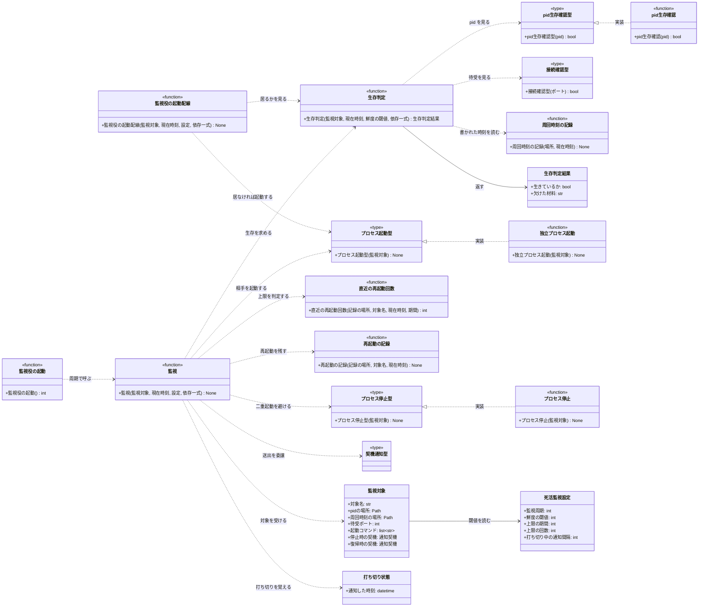

# モジュール構成: モニター / 死活監視

`死活監視` ドメイン（モニター側）に属する構成要素詳細。
モニターと監視役が相手の生存を確認し、停止していれば再起動して通知する。

## 一覧

| ユースケース | 役割 | コンテナ | 種別 | 名前 | 概要 | 補足 |
| --- | --- | --- | --- | --- | --- | --- |
| 共通 | 設定 | `shared/settings.py` | データモデル | [`WatchdogSettings`](#死活監視設定) | 周期・鮮度の閾値・再起動の上限 | `settings.yaml` の `watchdog` |
| 共通 | 監視対象 | `features/watchdog/types.py` | データモデル | [`WatchTarget`](#監視対象) | 相手 1 つ分の識別子と生存材料の在りか | モニター用と監視役用を 1 つずつ作る |
| 共通 | 判定結果 | `features/watchdog/types.py` | データモデル | [`Liveness`](#生存判定結果) | 生存の可否と、欠けた材料 | 通知の本文に理由を載せるため |
| 共通 | 打ち切り状態 | `features/watchdog/types.py` | データモデル | [`Suspension`](#打ち切り状態) | 打ち切り中であることと、最後に通知した時刻 | 監視するプロセス内にだけ持つ（永続化しない） |
| 共通 | 生存確認型（DI） | `features/watchdog/types.py` | 関数型 | [`IsPidAliveFn`](#pid生存確認型) | pid の生存を返す関数のシグネチャ | テストで差し替える |
| 共通 | 接続確認型（DI） | `features/watchdog/types.py` | 関数型 | [`CanConnectFn`](#接続確認型) | 待受ポートへ繋がるかを返す関数のシグネチャ | 同上 |
| 共通 | 起動型（DI） | `features/watchdog/types.py` | 関数型 | [`StartProcessFn`](#プロセス起動型) | 相手を起動する関数のシグネチャ | 同上 |
| 共通 | 停止型（DI） | `features/watchdog/types.py` | 関数型 | [`StopProcessFn`](#プロセス停止型) | 相手を停止する関数のシグネチャ | 周回が止まった相手の二重起動を避ける |
| 死活検知 | 生存判定 | `features/watchdog/service.py` | 関数 | [`check_liveness`](#生存判定) | 3 材料から生存の可否を求める | 1 つでも欠ければ停止 |
| 死活検知 | 監視 | `features/watchdog/service.py` | 関数 | [`supervise`](#監視) | 1 周期分の検知 → 再起動 → 通知 | 両方向で共用する |
| 死活検知 | 記録の読み | `features/watchdog/restarts.py` | 関数 | [`count_recent_restarts`](#直近の再起動回数) | 期間内の再起動回数を数える | 相手ごとに数える |
| 死活検知 | 記録の書き | `features/watchdog/restarts.py` | 関数 | [`record_restart`](#再起動の記録) | 再起動を 1 件追記する | 再起動をまたいで残す |
| 死活検知 | 周回時刻の書き | `features/watchdog/heartbeat.py` | 関数 | [`touch_heartbeat`](#周回時刻の記録) | 最終周回時刻を書き出す | 両プロセスがループ 1 周ごとに呼ぶ |
| 死活検知 | 実体操作 | `integrations/process/ops.py` | 関数 | [`is_pid_alive`](#pid生存確認) | pid の生存を OS へ問い合わせる | - |
| 死活検知 | 実体操作 | `integrations/process/ops.py` | 関数 | [`start_detached`](#独立プロセス起動) | 親の終了に巻き込まれない子を起動して pid を書く | 起動コマンドは監視対象が持つ |
| 死活検知 | 実体操作 | `integrations/process/ops.py` | 関数 | [`terminate`](#プロセス停止) | pid へ終了シグナルを送る | - |
| 監視役の起動 | エントリポイント | `watchdog/__main__.py` | 関数 | [`main`](#監視役の起動) | 監視役プロセスの composition root | `python -m ai_monitor.watchdog` |
| 監視役の起動 | 配線 | `main.py` | 関数 | [`ensure_watchdog_started`](#監視役の起動配線) | モニター起動時に監視役が居なければ起動する | 起動直後の誤検知通知を避ける |

## ディレクトリ構成

```
src/ai_monitor/
├── features/watchdog/
│   ├── types.py       # WatchTarget / Liveness / Suspension / 関数型 4 種
│   ├── service.py     # check_liveness / supervise
│   ├── restarts.py    # count_recent_restarts / record_restart
│   └── heartbeat.py   # touch_heartbeat
├── integrations/process/
│   └── ops.py         # is_pid_alive / start_detached / terminate
├── watchdog/
│   └── __main__.py    # 監視役プロセスのエントリポイント
└── main.py            # composition root（ensure_watchdog_started）
```

## 構成図



## 死活監視設定
> 物理名: `WatchdogSettings`<br>
> 種別: データモデル<br>
> コンテナ: `shared/settings.py`

死活監視の周期と閾値。
`settings.yaml` の `watchdog` に対応し、省略時は既定値で動く。

### プロパティ

| 論理名 | プロパティ名 | 型 | 可視性 | デフォルト | 説明 | 例 | 補足 |
| --- | --- | --- | --- | --- | --- | --- | --- |
| 有効化 | `enabled` | `bool` | 公開 | `True` | 監視役を起動して相互監視するか | `True` | `False` なら composition root が監視役を起動せず、周期の監視も配線しない |
| 監視周期 | `interval_sec` | `int` | 公開 | `15` | 相手の生存を確認する間隔（秒） | `15` | 両プロセスで同じ値を使う |
| 鮮度の閾値 | `liveness_timeout_sec` | `int` | 公開 | `120` | 最終周回時刻がこの秒数より古ければ停止とみなす | `120` | ポーリング周期より十分長くとる |
| 上限の期間 | `restart_window_min` | `int` | 公開 | `60` | 再起動回数を数える期間（分） | `60` | - |
| 上限の回数 | `restart_max` | `int` | 公開 | `3` | 期間内に許す再起動の回数 | `3` | 超えたら再起動せず通知のみ |
| 打ち切り中の通知間隔 | `suspended_notify_interval_min` | `int` | 公開 | `60` | 打ち切り中に同じ内容を再通知する間隔（分） | `60` | 打ち切りに入った最初は即時に送り、以降はこの間隔を空ける |
| 記録の場所 | `restarts_path` | `str` | 公開 | `data/restarts.yaml` | 再起動の記録の永続化先 | `"data/restarts.yaml"` | セッション台帳とは別ファイル |

### メソッド

なし

### 単体テスト

なし

## 監視対象
> 物理名: `WatchTarget`<br>
> 種別: データモデル<br>
> コンテナ: `features/watchdog/types.py`

監視する相手 1 つ分の識別子と、生存材料の在りか。
モニター用と監視役用を composition root で 1 つずつ作る。

### プロパティ

| 論理名 | プロパティ名 | 型 | 可視性 | デフォルト | 説明 | 例 | 補足 |
| --- | --- | --- | --- | --- | --- | --- | --- |
| 対象名 | `name` | `str` | 公開 | - | 記録とログで使う識別子 | `"monitor"` | 再起動回数を数えるキー |
| pid の場所 | `pid_path` | `Path` | 公開 | - | 相手が書いた pid ファイル | `Path("data/monitor.pid")` | - |
| 周回時刻の場所 | `heartbeat_path` | `Path` | 公開 | - | 相手が書いた最終周回時刻のファイル | `Path("data/monitor.heartbeat")` | - |
| 待受ポート | `port` | `int \| None` | 公開 | `None` | 応答確認に使うポート | `8765` | `None` なら接続確認をしない（監視役が対象のとき） |
| 起動コマンド | `start_command` | `list[str]` | 公開 | - | 相手を起動する argv | `["uv", "run", "python", "-m", "ai_monitor"]` | - |
| 停止時の契機 | `down_event` | [`NotifyEvent`](./通知.py.md#通知契機) | 公開 | - | 停止を知らせる契機 | `"monitor_down"` | 対象で変わる |
| 復帰時の契機 | `recovered_event` | [`NotifyEvent`](./通知.py.md#通知契機) | 公開 | - | 打ち切り中の相手が戻ったことを知らせる契機 | `"monitor_recovered"` | 対象で変わる |

### メソッド

なし

### 単体テスト

なし

## 生存判定結果
> 物理名: `Liveness`<br>
> 種別: データモデル<br>
> コンテナ: `features/watchdog/types.py`

生存の可否と、欠けた材料。
通知の本文に理由を載せるため、判定の根拠を持ち回る。

### プロパティ

| 論理名 | プロパティ名 | 型 | 可視性 | デフォルト | 説明 | 例 | 補足 |
| --- | --- | --- | --- | --- | --- | --- | --- |
| 生きているか | `alive` | `bool` | 公開 | - | 全ての材料が揃ったか | `False` | 1 つでも欠ければ `False` |
| 欠けた材料 | `missing` | `str` | 公開 | `""` | 最初に欠けた材料の説明 | `"最終周回時刻が 180 秒前"` | 生存時は空文字 |
| 周回が止まったか | `stale` | `bool` | 公開 | `False` | 鮮度だけが欠けたか | `True` | 起動前に停止が要るかの判断に使う |

### メソッド

なし

### 単体テスト

なし

## 打ち切り状態
> 物理名: `Suspension`<br>
> 種別: データモデル<br>
> コンテナ: `features/watchdog/types.py`

再起動を打ち切った相手について、最後に通知した時刻を持つ。
[監視](#監視)が対象名をキーにした辞書で受け取り、打ち切りに入った周期で追加して復帰した周期で取り除く。

監視するプロセスのメモリにだけ置き、ファイルへは書かない。
プロセスが再起動すると失われるが、そのとき打ち切りの事実も引き継がないので齟齬は起きない。

### プロパティ

| 論理名 | プロパティ名 | 型 | 可視性 | デフォルト | 説明 | 例 | 補足 |
| --- | --- | --- | --- | --- | --- | --- | --- |
| 通知した時刻 | `notified_at` | `datetime` | 公開 | - | 打ち切りを最後に通知した時刻 | `datetime(2026, 8, 2, 15, 26, 44)` | 次の再通知まで間隔が空いたかの判定に使う |

### メソッド

なし

### 単体テスト

なし

## `features/watchdog/types.py`
> 種別: ファイル

監視の依存を差し替えるための関数型を置く。
実体は `integrations/process/ops.py` にあり、テストでは Mock 関数を注入する。

---

### pid生存確認型
> 物理名: `IsPidAliveFn`<br>
> 種別: 関数型

pid が生きているかを返す関数のシグネチャ。

#### 引数

| 論理名 | 引数名 | 型 | 必須 | デフォルト | 説明 | 補足 |
| --- | --- | --- | --- | --- | --- | --- |
| プロセス ID | `pid` | `int` | ✅ | - | 確認する pid | - |

#### 戻り値

| 型 | 説明 | 補足 |
| --- | --- | --- |
| `bool` | 生きていれば真 | - |

#### 実装

| 実装 | 補足 |
| --- | --- |
| [pid生存確認](#pid生存確認) | 本番の実装 |

---

### 接続確認型
> 物理名: `CanConnectFn`<br>
> 種別: 関数型

待受ポートへ繋がるかを返す関数のシグネチャ。

#### 引数

| 論理名 | 引数名 | 型 | 必須 | デフォルト | 説明 | 補足 |
| --- | --- | --- | --- | --- | --- | --- |
| ポート | `port` | `int` | ✅ | - | 確認するポート | - |

#### 戻り値

| 型 | 説明 | 補足 |
| --- | --- | --- |
| `bool` | 繋がれば真 | - |

#### 実装

| 実装 | 補足 |
| --- | --- |
| `can_connect` | `integrations/process/ops.py`。短いタイムアウトで TCP 接続を試す |

---

### プロセス起動型
> 物理名: `StartProcessFn`<br>
> 種別: 関数型

相手を起動する関数のシグネチャ。

#### 引数

| 論理名 | 引数名 | 型 | 必須 | デフォルト | 説明 | 補足 |
| --- | --- | --- | --- | --- | --- | --- |
| 監視対象 | `target` | [`WatchTarget`](#監視対象) | ✅ | - | 起動する相手 | 起動コマンドと pid の場所を持つ |

#### 戻り値

| 型 | 説明 | 補足 |
| --- | --- | --- |
| `None` | なし | 副作用のみ |

#### 実装

| 実装 | 補足 |
| --- | --- |
| [独立プロセス起動](#独立プロセス起動) | 本番の実装 |

---

### プロセス停止型
> 物理名: `StopProcessFn`<br>
> 種別: 関数型

相手を停止する関数のシグネチャ。

#### 引数

| 論理名 | 引数名 | 型 | 必須 | デフォルト | 説明 | 補足 |
| --- | --- | --- | --- | --- | --- | --- |
| 監視対象 | `target` | [`WatchTarget`](#監視対象) | ✅ | - | 停止する相手 | pid の場所を持つ |

#### 戻り値

| 型 | 説明 | 補足 |
| --- | --- | --- |
| `None` | なし | 副作用のみ |

#### 実装

| 実装 | 補足 |
| --- | --- |
| [プロセス停止](#プロセス停止) | 本番の実装 |

## `features/watchdog/service.py`
> 種別: ファイル

生存判定と、1 周期分の監視。
両方向（監視役 → モニター / モニター → 監視役）で同じ関数を使う。

---

### 生存判定
> 物理名: `check_liveness`<br>
> 種別: 関数

3 つの材料から生存の可否を求める。

#### 引数

| 論理名 | 引数名 | 型 | 必須 | デフォルト | 説明 | 補足 |
| --- | --- | --- | --- | --- | --- | --- |
| 監視対象 | `target` | [`WatchTarget`](#監視対象) | ✅ | - | 確認する相手 | - |
| 現在時刻 | `now` | `datetime` | ✅ | - | 鮮度の基準 | キーワード引数 |
| 鮮度の閾値 | `timeout_sec` | `int` | ✅ | - | 何秒前までを新しいとみなすか | キーワード引数 |
| pid 生存確認 | `is_pid_alive` | [`IsPidAliveFn`](#pid生存確認型) | ✅ | - | pid の生存を返す関数 | キーワード引数 |
| 接続確認 | `can_connect` | [`CanConnectFn`](#接続確認型) | ✅ | - | 待受へ繋がるかを返す関数 | キーワード引数 |

引数例:

```python
check_liveness(monitor_target, now=now, timeout_sec=120, is_pid_alive=is_pid_alive, can_connect=can_connect)
```

#### 戻り値

| 型 | 説明 | 補足 |
| --- | --- | --- |
| [`Liveness`](#生存判定結果) | 生存の可否と欠けた材料 | - |

戻り値例:

```python
Liveness(alive=False, missing="最終周回時刻が 180 秒前", stale=True)
```

#### 処理

1. pid ファイルを読む
   - ファイルが無い、または中身が pid として読めない場合、停止として返す
2. pid の生存を確認する
   - 生きていない場合、停止として返す
3. 待受ポートが設定されていれば接続を確認する
   - 繋がらない場合、停止として返す
4. 最終周回時刻を読み、`now` との差が閾値を超えていれば停止として返す（`stale` を真にする）
   - ファイルが無い、または時刻として読めない場合も停止として扱う
5. 全て揃っていれば生存として返す

#### 例外

なし

#### 単体テスト

| テスト名 | 正常/異常 | 概要 | 条件 | Mock | 期待値 | 補足 |
| --- | --- | --- | --- | --- | --- | --- |
| `test_check_liveness` | 正常 | 全材料が揃った生存 | pid 生存・接続可・周回時刻が閾値内 | pid 生存確認 / 接続確認 | `alive` が真 | - |
| `test_check_liveness_when_pid_missing` | 正常 | pid ファイルが無い | pid ファイルを作らない | pid 生存確認 / 接続確認 | `alive` が偽・接続確認が呼ばれない | 早期に打ち切る |
| `test_check_liveness_when_pid_dead` | 正常 | pid が死んでいる | pid 生存確認が偽を返す | pid 生存確認 / 接続確認 | `alive` が偽・`stale` が偽 | - |
| `test_check_liveness_when_port_closed` | 正常 | 待受が応答しない | 接続確認が偽を返す | pid 生存確認 / 接続確認 | `alive` が偽・`stale` が偽 | - |
| `test_check_liveness_when_stale` | 正常 | 周回時刻が古い | 周回時刻が閾値より前 | pid 生存確認 / 接続確認 | `alive` が偽・`stale` が真 | 停止してから起動する分岐に使う |
| `test_check_liveness_when_no_port` | 正常 | 待受ポートを持たない相手 | `port` が `None` | pid 生存確認 / 接続確認 | 接続確認が呼ばれず生存と判定 | 監視役を見るとき |

---

### 監視
> 物理名: `supervise`<br>
> 種別: 関数

1 周期分の検知・再起動・通知を行う。

#### 引数

| 論理名 | 引数名 | 型 | 必須 | デフォルト | 説明 | 補足 |
| --- | --- | --- | --- | --- | --- | --- |
| 監視対象 | `target` | [`WatchTarget`](#監視対象) | ✅ | - | 監視する相手 | - |
| 現在時刻 | `now` | `datetime` | ✅ | - | 判定と記録の基準 | キーワード引数 |
| 設定 | `settings` | [`WatchdogSettings`](#死活監視設定) | ✅ | - | 閾値と上限 | キーワード引数 |
| 生存判定 | `check` | `Callable` | ✅ | - | [生存判定](#生存判定)を束ねた関数 | キーワード引数 |
| 起動 | `start` | [`StartProcessFn`](#プロセス起動型) | ✅ | - | 相手を起動する関数 | キーワード引数 |
| 停止 | `stop` | [`StopProcessFn`](#プロセス停止型) | ✅ | - | 相手を停止する関数 | キーワード引数 |
| 契機通知 | `notify` | [`NotifyFn`](./通知.py.md#契機通知型) | ✅ | - | 通知を送る関数 | キーワード引数 |
| 打ち切り状態の台帳 | `suspensions` | [`dict[str, Suspension]`](#打ち切り状態) | ✅ | - | 対象名から引く打ち切り状態 | キーワード引数。呼び出し側がプロセスの生存期間だけ保持し、本関数が出し入れする |

引数例:

```python
supervise(monitor_target, now=now, settings=watchdog_settings, check=check, start=start, stop=stop, notify=notify, suspensions=suspensions)
```

#### 戻り値

| 型 | 説明 | 補足 |
| --- | --- | --- |
| `None` | なし | 副作用のみ |

戻り値例:

なし

#### 処理

1. 相手の生存を求める（[生存判定](#生存判定)）
2. 生存している場合、打ち切り状態の有無で分けて終える
   - 台帳に打ち切り状態がある場合、復帰の契機で通知して台帳から取り除く
     - `[WARNING]` 打ち切っていた相手が復帰した（`target`）
   - 打ち切り状態が無い場合、何もしない
3. 期間内の再起動回数を数える（[直近の再起動回数](#直近の再起動回数)）
4. 上限に達している場合、再起動せず通知の要否だけを判断して終える
   - 台帳に打ち切り状態が無い場合、打ち切りを通知して現在時刻で台帳に登録する
     - `[WARNING]` 再起動の上限に達したため打ち切った（`target` / 期間 / 上限 / 欠けた材料）
   - 前回の通知から通知間隔を過ぎている場合、打ち切りが続いていることを通知して通知時刻を現在時刻に更新する
     - `[WARNING]` 打ち切りが続いている（`target` / 前回の通知からの経過 / 欠けた材料）
   - 通知間隔の内側の場合、通知を送らない（生存の確認は次の周期も続ける）
5. 再起動を 1 件記録する（[再起動の記録](#再起動の記録)）
   - 起動に失敗しても上限の勘定に入れるため、起動より前に記録する
6. 周回だけが止まっている場合、先に相手を停止する
   - pid が生きたまま起動すると二重に立ち上がるため
7. 相手を起動する
   - 起動が例外を送出した場合、その旨を通知して終える（監視は続ける）
   - `[ERROR]` 相手の起動に失敗した（`target` / 例外）
8. 停止と再起動を通知する
   - 送出に失敗しても監視を続ける（通知は副次的な経路）
   - `[WARNING]` 相手が停止したため再起動した（`target` / 欠けた材料 / 期間内の再起動回数）

#### 例外

なし

#### 単体テスト

| テスト名 | 正常/異常 | 概要 | 条件 | Mock | 期待値 | 補足 |
| --- | --- | --- | --- | --- | --- | --- |
| `test_supervise` | 正常 | 停止の検知から再起動と通知まで | 生存判定が停止を返す + 記録が上限未満 | 生存判定 / 起動 / 停止 / 契機通知 | 起動が 1 回・記録が 1 件・対象の契機で通知 | - |
| `test_supervise_when_alive` | 正常 | 生存時は何もしない | 生存判定が生存を返す + 台帳に打ち切り状態なし | 生存判定 / 起動 / 停止 / 契機通知 | 起動・記録・通知のいずれも呼ばれない | - |
| `test_supervise_when_stale` | 正常 | 周回だけが止まっている | 生存判定が `stale` を真で返す | 生存判定 / 起動 / 停止 / 契機通知 | 停止が起動より前に呼ばれる | 二重起動の抑止 |
| `test_supervise_when_limit_exceeded` | 正常 | 再起動の上限超過 | 記録が上限回数ぶん存在 + 台帳に打ち切り状態なし | 生存判定 / 起動 / 停止 / 契機通知 | 起動が呼ばれず記録も増えない・通知が 1 回送られ、台帳に現在時刻の打ち切り状態が入る | 打ち切りに入る周期 |
| `test_supervise_when_suspended_within_interval` | 正常 | 打ち切り中で通知間隔の内側 | 記録が上限回数ぶん存在 + 台帳の通知時刻が間隔の内側 | 生存判定 / 起動 / 停止 / 契機通知 | 起動も通知も呼ばれず、台帳の通知時刻が変わらない | 生存判定は呼ばれる（監視を止めない） |
| `test_supervise_when_suspended_interval_passed` | 正常 | 打ち切り中で通知間隔を過ぎた | 記録が上限回数ぶん存在 + 台帳の通知時刻が間隔より前 | 生存判定 / 起動 / 停止 / 契機通知 | 通知が 1 回送られ、台帳の通知時刻が現在時刻に更新される | 起動は呼ばれない |
| `test_supervise_when_recovered` | 正常 | 打ち切り中の相手が復帰 | 台帳に打ち切り状態あり + 生存判定が生存を返す | 生存判定 / 起動 / 停止 / 契機通知 | 対象の復帰の契機で通知され、台帳から打ち切り状態が消える | 起動・記録は呼ばれない |
| `test_supervise_when_start_failed` | 正常 | 起動そのものが失敗 | 起動が例外を送出 | 生存判定 / 起動 / 停止 / 契機通知 | 例外が伝播せず通知が送られ、記録は 1 件残る | 失敗も上限の勘定に入れる |
| `test_supervise_when_notify_failed` | 正常 | 通知の送出に失敗 | 契機通知が失敗を返す | 生存判定 / 起動 / 停止 / 契機通知 | 起動は完了し例外も伝播しない | 通知は副次的な経路 |

## `features/watchdog/restarts.py`
> 種別: ファイル

再起動の記録の読み書き。
再起動をまたいで数える必要があるため、メモリではなくファイルに持つ。

---

### 直近の再起動回数
> 物理名: `count_recent_restarts`<br>
> 種別: 関数

指定期間内に記録された、対象ごとの再起動回数を返す。

#### 引数

| 論理名 | 引数名 | 型 | 必須 | デフォルト | 説明 | 補足 |
| --- | --- | --- | --- | --- | --- | --- |
| 記録の場所 | `path` | `Path` | ✅ | - | 記録ファイル | - |
| 対象名 | `name` | `str` | ✅ | - | 数える相手 | 相手ごとに別勘定 |
| 現在時刻 | `now` | `datetime` | ✅ | - | 期間の起点 | キーワード引数 |
| 期間 | `window_min` | `int` | ✅ | - | 何分前までを数えるか | キーワード引数 |

引数例:

```python
count_recent_restarts(Path("data/restarts.yaml"), "monitor", now=now, window_min=60)
```

#### 戻り値

| 型 | 説明 | 補足 |
| --- | --- | --- |
| `int` | 期間内の再起動回数 | ファイルが無ければ 0 |

戻り値例:

```python
2
```

#### 処理

1. 記録ファイルを読む
   - ファイルが無い、または読めない場合、0 を返す（記録の欠損で監視を止めない）
2. 対象名が一致し、記録時刻が `now` から `window_min` 以内のものを数えて返す

#### 例外

なし

#### 単体テスト

| テスト名 | 正常/異常 | 概要 | 条件 | Mock | 期待値 | 補足 |
| --- | --- | --- | --- | --- | --- | --- |
| `test_count_recent_restarts` | 正常 | 期間内の件数を数える | 期間内 2 件 + 期間外 1 件 | なし（一時ファイルを実操作） | 2 を返す | 期間外を除く |
| `test_count_recent_restarts_when_other_target` | 正常 | 相手ごとの別勘定 | 別の対象名の記録が混在 | なし（一時ファイルを実操作） | 自分の分だけ数える | - |
| `test_count_recent_restarts_when_file_missing` | 正常 | 記録ファイルが無い | ファイルを作らない | なし（一時ファイルを実操作） | 0 を返す | 監視を止めない |
| `test_count_recent_restarts_when_broken` | 正常 | 記録が壊れている | 解析できない内容を書く | なし（一時ファイルを実操作） | 0 を返す | 同上 |

---

### 再起動の記録
> 物理名: `record_restart`<br>
> 種別: 関数

再起動を 1 件追記する。

#### 引数

| 論理名 | 引数名 | 型 | 必須 | デフォルト | 説明 | 補足 |
| --- | --- | --- | --- | --- | --- | --- |
| 記録の場所 | `path` | `Path` | ✅ | - | 記録ファイル | 無ければ作る |
| 対象名 | `name` | `str` | ✅ | - | 再起動した相手 | - |
| 現在時刻 | `now` | `datetime` | ✅ | - | 記録する時刻 | キーワード引数 |

引数例:

```python
record_restart(Path("data/restarts.yaml"), "monitor", now=now)
```

#### 戻り値

| 型 | 説明 | 補足 |
| --- | --- | --- |
| `None` | なし | 副作用のみ |

戻り値例:

なし

#### 処理

1. 既存の記録を読む（読めなければ空として扱う）
2. 対象名と時刻の組を 1 件足す
3. 期間の判定に使わなくなった古い記録を落とす（ファイルが無限に伸びないようにする）
4. 一時ファイルへ書いてから rename で置き換える（書き込み中の記録を読ませない）

#### 例外

なし

#### 単体テスト

| テスト名 | 正常/異常 | 概要 | 条件 | Mock | 期待値 | 補足 |
| --- | --- | --- | --- | --- | --- | --- |
| `test_record_restart` | 正常 | 1 件の追記 | 既存の記録が 1 件 | なし（一時ファイルを実操作） | 2 件になり、対象名と時刻が読み戻せる | - |
| `test_record_restart_when_file_missing` | 正常 | ファイルが無い状態からの記録 | ファイルを作らない | なし（一時ファイルを実操作） | ファイルが作られ 1 件入る | - |
| `test_record_restart_when_expired` | 正常 | 古い記録の削除 | 期間外の記録を混ぜる | なし（一時ファイルを実操作） | 期間外の記録が残らない | 無限に伸びない |

## `features/watchdog/heartbeat.py`
> 種別: ファイル

最終周回時刻の書き出し。
モニターのポーリングループと監視役の監視ループが、1 周ごとに呼ぶ。

---

### 周回時刻の記録
> 物理名: `touch_heartbeat`<br>
> 種別: 関数

最終周回時刻を書き出す。

#### 引数

| 論理名 | 引数名 | 型 | 必須 | デフォルト | 説明 | 補足 |
| --- | --- | --- | --- | --- | --- | --- |
| 場所 | `path` | `Path` | ✅ | - | 書き出し先 | 無ければ作る |
| 現在時刻 | `now` | `datetime` | ✅ | - | 書き出す時刻 | キーワード引数 |

引数例:

```python
touch_heartbeat(Path("data/monitor.heartbeat"), now=now)
```

#### 戻り値

| 型 | 説明 | 補足 |
| --- | --- | --- |
| `None` | なし | 副作用のみ |

戻り値例:

なし

#### 処理

1. 親ディレクトリが無ければ作る
2. 一時ファイルへ ISO8601 の時刻を書いてから rename で置き換える

#### 例外

なし

#### 単体テスト

| テスト名 | 正常/異常 | 概要 | 条件 | Mock | 期待値 | 補足 |
| --- | --- | --- | --- | --- | --- | --- |
| `test_touch_heartbeat` | 正常 | 時刻の書き出し | 一時ディレクトリを渡す | なし（一時ファイルを実操作） | 書いた時刻が読み戻せる | - |

## `integrations/process/ops.py`
> 種別: ファイル

プロセスの実体操作。
OS へ問い合わせる薄い層で、業務判断は持たない。

---

### pid生存確認
> 物理名: `is_pid_alive`<br>
> 種別: 関数<br>
> 継承元: [`IsPidAliveFn`](#pid生存確認型)

pid が生きているかを OS へ問い合わせる。

#### 引数

| 論理名 | 引数名 | 型 | 必須 | デフォルト | 説明 | 補足 |
| --- | --- | --- | --- | --- | --- | --- |
| プロセス ID | `pid` | `int` | ✅ | - | 確認する pid | - |

引数例:

```python
is_pid_alive(20193)
```

#### 戻り値

| 型 | 説明 | 補足 |
| --- | --- | --- |
| `bool` | 生きていれば真 | - |

戻り値例:

```python
True
```

#### 処理

1. シグナル 0 を送って存在を確かめる
   - プロセスが無い場合、偽を返す
   - 権限が無い場合、存在はするので真を返す
2. ゾンビ状態かを確かめ、ゾンビなら偽を返す
   - 終了済みで親に回収されていない子は pid が残るため、シグナル 0 だけだと動いている扱いになる
   - 判定材料を持たない環境では動いている扱いにする

#### 例外

なし

#### 単体テスト

| テスト名 | 正常/異常 | 概要 | 条件 | Mock | 期待値 | 補足 |
| --- | --- | --- | --- | --- | --- | --- |
| `test_is_pid_alive` | 正常 | 自プロセスの pid | 自分の pid を渡す | なし（実プロセスを確認） | 真を返す | - |
| `test_is_pid_alive_when_dead` | 正常 | 終了済みの pid | 終了したプロセスの pid を渡す | なし（実プロセスを確認） | 偽を返す | 回収前のゾンビも偽にする |

---

### 独立プロセス起動
> 物理名: `start_detached`<br>
> 種別: 関数<br>
> 継承元: [`StartProcessFn`](#プロセス起動型)

親の終了に巻き込まれない子プロセスを起動し、pid を書き出す。

#### 引数

| 論理名 | 引数名 | 型 | 必須 | デフォルト | 説明 | 補足 |
| --- | --- | --- | --- | --- | --- | --- |
| 監視対象 | `target` | [`WatchTarget`](#監視対象) | ✅ | - | 起動する相手 | 起動コマンドと pid の場所を持つ |

引数例:

```python
start_detached(monitor_target)
```

#### 戻り値

| 型 | 説明 | 補足 |
| --- | --- | --- |
| `None` | なし | 副作用のみ |

戻り値例:

なし

#### 処理

1. 起動コマンドを新しいセッションで起動する
   - 親と同じプロセスグループに入れると、親の終了で道連れになるため分ける
2. 標準出力と標準エラーをログファイルへ追記で開く
   - 上書きにすると、再起動のたびに落ちた理由の記録が消えるため
3. 起動した pid を pid ファイルへ書く
4. 起動時刻で最終周回時刻を埋める（[周回時刻の記録](#周回時刻の記録)）
   - 相手が最初の周回を書くまでの間、鮮度の閾値ぶんの猶予を与える。
     埋めないと、起動した直後の相手を「周回が止まっている」と誤検知して落とし直す

#### 例外

| 例外名 | 発生条件 | メッセージ | 補足 |
| --- | --- | --- | --- |
| `OSError` | 実行ファイルが見つからない・権限が無い 等 | OS のメッセージ | [監視](#監視)が受けて通知に載せる |

#### 単体テスト

| テスト名 | 正常/異常 | 概要 | 条件 | Mock | 期待値 | 補足 |
| --- | --- | --- | --- | --- | --- | --- |
| `test_start_detached` | 正常 | 起動と pid / 周回時刻の書き出し | すぐ終了するコマンドを渡す | なし（実プロセスを起動） | pid と最終周回時刻の両方が書かれている | 起動直後の誤検知を防ぐ |
| `test_start_detached_when_command_missing` | 異常 | 実行できないコマンド | 存在しないコマンドを渡す | なし（実プロセスを起動） | `OSError` を送出 | 例外表「実行ファイルが見つからない」に対応 |

---

### プロセス停止
> 物理名: `terminate`<br>
> 種別: 関数<br>
> 継承元: [`StopProcessFn`](#プロセス停止型)

pid ファイルの pid へ終了シグナルを送る。

#### 引数

| 論理名 | 引数名 | 型 | 必須 | デフォルト | 説明 | 補足 |
| --- | --- | --- | --- | --- | --- | --- |
| 監視対象 | `target` | [`WatchTarget`](#監視対象) | ✅ | - | 停止する相手 | pid の場所を持つ |

引数例:

```python
terminate(monitor_target)
```

#### 戻り値

| 型 | 説明 | 補足 |
| --- | --- | --- |
| `None` | なし | 副作用のみ |

戻り値例:

なし

#### 処理

1. pid ファイルを読む
   - 読めない場合、何もしない
2. 終了シグナルを送る
   - 既に終了している場合、何もしない

#### 例外

なし

#### 単体テスト

| テスト名 | 正常/異常 | 概要 | 条件 | Mock | 期待値 | 補足 |
| --- | --- | --- | --- | --- | --- | --- |
| `test_terminate` | 正常 | 起動中のプロセスの停止 | 待機するコマンドを起動して pid を書く | なし（実プロセスを起動） | プロセスが終了する | - |
| `test_terminate_when_pid_missing` | 正常 | pid ファイルが無い | ファイルを作らない | なし（実プロセスを起動） | 例外を送出せず何もしない | - |

## `watchdog/__main__.py`
> 種別: ファイル

監視役プロセスの composition root。

---

### 監視役の起動
> 物理名: `main`<br>
> 種別: 関数

設定を読み、モニターを対象にした[監視](#監視)を周期で実行する。

#### 引数

なし

#### 戻り値

| 型 | 説明 | 補足 |
| --- | --- | --- |
| `int` | 終了コード | 通常は戻らない（周期実行を続ける） |

戻り値例:

```python
0
```

#### 処理

1. 設定と観測基盤を初期化する
2. 自分の pid を pid ファイルへ書く
3. モニターを対象にした[監視対象](#監視対象)を組み立てる
4. [打ち切り状態](#打ち切り状態)の台帳を空の辞書で用意する
   - プロセスが生きている間だけ持つ状態なので、周期の外で 1 つ作って毎周期同じものを渡す
5. 周期で次を繰り返す
   - 自分の最終周回時刻を書く（[周回時刻の記録](#周回時刻の記録)）
   - モニターの[監視](#監視)を 1 回実行する（台帳を渡す）
   - 例外が出ても周期を止めず、ログに残して次の周期へ進む
   - `[ERROR]` 監視の周期を見送った（例外）

#### 例外

なし

#### 単体テスト

| テスト名 | 正常/異常 | 概要 | 条件 | Mock | 期待値 | 補足 |
| --- | --- | --- | --- | --- | --- | --- |
| `test_main` | 正常 | 1 周期の実行 | 1 周で止まるように周期関数を差し替える | 設定 / 監視 / 周回時刻の記録 | pid が書かれ、監視が 1 回呼ばれ、打ち切り状態の台帳が渡る | - |
| `test_main_when_multiple_cycles` | 正常 | 複数周期で台帳が引き継がれる | 2 周で止まるように周期関数を差し替える | 設定 / 監視 / 周回時刻の記録 | 2 回の監視に同じ台帳が渡る | 打ち切り状態が周期をまたいで残る |
| `test_main_when_cycle_failed` | 正常 | 周期内の例外 | 監視が例外を送出 | 設定 / 監視 / 周回時刻の記録 | 例外が伝播せず次の周期へ進む | 監視役が落ちない |

### 補足

- 監視役はモニターの子プロセスにしない。
  親が死んだときに道連れになると、今回の障害でどちらも消える
- 監視役は GitHub にも MCP にも触らない。
  依存が少ないほど落ちる確率が下がり、監視役としての価値が保たれる

## `main.py`
> 種別: ファイル

モニターの composition root のうち、監視役の起動に関わる部分（全体の配線は[エージェント管理](./エージェント管理.py.md)）。

---

### 監視役の起動配線
> 物理名: `ensure_watchdog_started`<br>
> 種別: 関数

モニターの起動時に、監視役が動いていなければ起動する。

#### 引数

| 論理名 | 引数名 | 型 | 必須 | デフォルト | 説明 | 補足 |
| --- | --- | --- | --- | --- | --- | --- |
| 監視対象 | `target` | [`WatchTarget`](#監視対象) | ✅ | - | 監視役を指す対象 | - |
| 現在時刻 | `now` | `datetime` | ✅ | - | 生存判定の基準 | キーワード引数 |
| 設定 | `settings` | [`WatchdogSettings`](#死活監視設定) | ✅ | - | 鮮度の閾値 | キーワード引数 |
| 生存判定 | `check` | `Callable` | ✅ | - | [生存判定](#生存判定)を束ねた関数 | キーワード引数 |
| 起動 | `start` | [`StartProcessFn`](#プロセス起動型) | ✅ | - | 監視役を起動する関数 | キーワード引数 |

引数例:

```python
ensure_watchdog_started(watchdog_target, now=now, settings=watchdog_settings, check=check, start=start)
```

#### 戻り値

| 型 | 説明 | 補足 |
| --- | --- | --- |
| `None` | なし | 副作用のみ |

戻り値例:

なし

#### 処理

1. [死活監視設定](#死活監視設定)の `enabled` が偽の場合、何もしない
2. 監視役の生存を求める（[生存判定](#生存判定)）
   - 生存していれば何もしない（監視役に再起動されたモニターは、既に動いている監視役に相乗りする）
3. 監視役を起動する
   - `[INFO]` 監視役を起動した（起動コマンド）
   - 起動に失敗した場合、理由をログに残してモニターの起動は続ける（監視役が居なくてもワークフローは回る）
   - `[ERROR]` 監視役の起動に失敗した（例外）

#### 例外

なし

#### 単体テスト

| テスト名 | 正常/異常 | 概要 | 条件 | Mock | 期待値 | 補足 |
| --- | --- | --- | --- | --- | --- | --- |
| `test_ensure_watchdog_started` | 正常 | 監視役が居ない | 生存判定が停止を返す | 生存判定 / 起動 | 起動が 1 回呼ばれる | - |
| `test_ensure_watchdog_started_when_alive` | 正常 | 監視役が既に動いている | 生存判定が生存を返す | 生存判定 / 起動 | 起動が呼ばれない | 再起動されたモニターは相乗りする |
| `test_ensure_watchdog_started_when_failed` | 正常 | 起動に失敗 | 起動が例外を送出 | 生存判定 / 起動 | 例外が伝播しない | モニターの起動を止めない |

### 補足

- 起動時は通知も記録もしない。
  正常な起動でも監視役は必ず居ないため、[監視](#監視)を通すと毎回 `watchdog_down` の誤検知通知が出る
- 監視役が起動できなくてもモニターは動かす。
  監視が無い状態にはなるが、ワークフロー自体は回るため止める理由がない
- モニター側も[打ち切り状態](#打ち切り状態)の台帳を composition root で 1 つ作り、周期で呼ぶ[監視](#監視)へ毎回同じものを渡す。
  監視役側（[監視役の起動](#監視役の起動)）と同じ持ち方で、どちらのプロセスも自分が見ている相手のぶんだけを持つ
