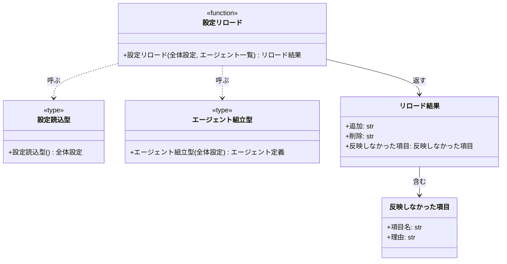

# モジュール構成: モニター / 設定リロード

`設定リロード` ドメイン（モニター側）に属する構成要素詳細。
稼働中に保持している `Settings` の中身を書き換え、ポーリングと MCP の参照を同時に差し替える。

- 対応テストファイル: `tests/unit/ai_monitor/features/config/test_service.py`

## 一覧

| ユースケース | 役割 | コンテナ | 種別 | 名前 | 概要 | 補足 |
| --- | --- | --- | --- | --- | --- | --- |
| 共通 | 反映しない項目の定数 | `features/config/service.py` | 定数 | `FIXED_FIELDS` | 実行中に変えられない設定項目と理由の対応 | `port` / `state_path` |
| 設定リロード | 結果 DTO | `features/config/types.py` | データモデル | [`ReloadResult`](#リロード結果) | 増減した監視対象と反映しなかった項目 | `pydantic.BaseModel` |
| 設定リロード | 反映しなかった項目 DTO | `features/config/types.py` | データモデル | [`IgnoredItem`](#反映しなかった項目) | 項目名と反映しない理由 | 同上 |
| 設定リロード | 設定読込型（DI） | `features/config/types.py` | 関数型 | [`ReadSettings`](#設定読込型) | 設定ファイルを読み直す関数のシグネチャ | テストで差し替える |
| 設定リロード | エージェント組立型（DI） | `features/config/types.py` | 関数型 | [`BuildAgents`](#エージェント組立型) | 設定からエージェント定義を作る関数のシグネチャ | 実体は composition root |
| 設定リロード | 設定リロード | `features/config/service.py` | 関数 | [`reload_settings`](#設定リロード) | 設定を読み直して中身を書き換え、増減と無視した項目を返す | 読込失敗は呼び出し側へ伝播 |

## ディレクトリ構成

```
src/ai_monitor/features/config/
├── __init__.py
├── types.py      # ReloadResult / IgnoredItem / ReadSettings / BuildAgents
└── service.py    # reload_settings / FIXED_FIELDS
```

## 構成図



## 反映しなかった項目
> 物理名: `IgnoredItem`<br>
> 種別: データモデル<br>
> コンテナ: `features/config/types.py`

再読込で反映しなかった設定項目 1 件（Pydantic `BaseModel`）。

### プロパティ

| 論理名 | プロパティ名 | 型 | 可視性 | デフォルト | 説明 | 例 | 補足 |
| --- | --- | --- | --- | --- | --- | --- | --- |
| 項目名 | `item` | `str` | 公開 | - | 反映しなかった設定項目名 | `"port"` | `Settings` のフィールド名 |
| 理由 | `reason` | `str` | 公開 | - | 反映しない理由 | `"待受ポートは実行中に変えられません（再起動が必要です）"` | ユーザーがそのまま読む文 |

### メソッド

なし

### 単体テスト

なし

## リロード結果
> 物理名: `ReloadResult`<br>
> 種別: データモデル<br>
> コンテナ: `features/config/types.py`

再読込の反映結果（Pydantic `BaseModel`）。

### プロパティ

| 論理名 | プロパティ名 | 型 | 可視性 | デフォルト | 説明 | 例 | 補足 |
| --- | --- | --- | --- | --- | --- | --- | --- |
| 追加 | `added` | `list[str]` | 公開 | `[]` | 追加された監視対象プロジェクト名 | `["sandbox"]` | 設定ファイルの並び順 |
| 削除 | `removed` | `list[str]` | 公開 | `[]` | 削除された監視対象プロジェクト名 | `[]` | 差し替え前の並び順 |
| 反映しなかった項目 | `ignored` | [`list[IgnoredItem]`](#反映しなかった項目) | 公開 | `[]` | 実行中に変えられない項目のうち値が変わっていたもの | - | 変更がなければ空 |

### メソッド

なし

### 単体テスト

なし

## `features/config/types.py`
> 種別: ファイル

設定リロードの DTO と、差し替え可能にしておく依存の関数型を置くファイル。

---

### 設定読込型
> 物理名: `ReadSettings`<br>
> 種別: 関数型

設定ファイルを読み直して全体設定を返す関数のシグネチャ。

#### 引数

なし

#### 戻り値

| 型 | 説明 | 補足 |
| --- | --- | --- |
| [`Settings`](./エージェント管理.py.md#全体設定) | 読み直した全体設定 | 読めない場合は例外を投げる |

#### 実装

| 実装 | 補足 |
| --- | --- |
| `Settings`（`shared/settings.py`） | 本番はクラスの生成そのものを渡す |

---

### エージェント組立型
> 物理名: `BuildAgents`<br>
> 種別: 関数型

全体設定からエージェント定義一式を組み立てる関数のシグネチャ。

#### 引数

| 論理名 | 引数名 | 型 | 必須 | デフォルト | 説明 | 補足 |
| --- | --- | --- | --- | --- | --- | --- |
| 全体設定 | `settings` | [`Settings`](./エージェント管理.py.md#全体設定) | ✅ | - | 読み直した設定 | `agents` のモデル設定を使う |

#### 戻り値

| 型 | 説明 | 補足 |
| --- | --- | --- |
| [`list[Agent]`](./エージェント管理.py.md#エージェント定義) | 組み立てたエージェント定義 | - |

#### 実装

| 実装 | 補足 |
| --- | --- |
| [エージェント組立](./エージェント管理.py.md#エージェント組立) | composition root が `labels` を束ねて渡す |

## `features/config/service.py`
> 種別: ファイル

設定を読み直して稼働中の値を書き換えるファイル。

---

### 設定リロード
> 物理名: `reload_settings`<br>
> 種別: 関数

設定ファイルを読み直し、反映できる項目だけを稼働中の設定に書き戻して増減を返す。

#### 引数

| 論理名 | 引数名 | 型 | 必須 | デフォルト | 説明 | 補足 |
| --- | --- | --- | --- | --- | --- | --- |
| 全体設定 | `settings` | [`Settings`](./エージェント管理.py.md#全体設定) | ✅ | - | 稼働中の設定（この中身を書き換える） | ポーリングと MCP が参照している実体 |
| エージェント一覧 | `agents` | [`list[Agent]`](./エージェント管理.py.md#エージェント定義) | ✅ | - | 稼働中のエージェント定義（この中身を入れ替える） | 同上 |
| 設定読込 | `read_settings` | [`ReadSettings`](#設定読込型) | ✅ | - | 設定ファイルを読み直す関数 | キーワード引数 |
| エージェント組立 | `build_agents` | [`BuildAgents`](#エージェント組立型) | ✅ | - | 設定からエージェント定義を作る関数 | キーワード引数 |

引数例:

```python
reload_settings(settings, agents, read_settings=Settings, build_agents=partial(build_agents, labels))
```

#### 戻り値

| 型 | 説明 | 補足 |
| --- | --- | --- |
| [`ReloadResult`](#リロード結果) | 増減した監視対象と反映しなかった項目 | - |

戻り値例:

```python
ReloadResult(added=["sandbox"], removed=[], ignored=[IgnoredItem(item="port", reason="待受ポートは...")])
```

#### 処理

1. 設定ファイルを読み直す（[設定読込型](#設定読込型)）
   - 読めない場合、例外をそのまま呼び出し側へ伝播する（稼働中の設定は書き換えない）
2. `FIXED_FIELDS` の各項目について、読み直した値が稼働中の値と違うかを見て反映しなかった項目を作る
3. 監視対象プロジェクト名を突き合わせて追加分と削除分を出す
4. `FIXED_FIELDS` 以外のフィールドを稼働中の設定へ 1 つずつ書き戻す
   - `[INFO]` 設定を再読込した（追加したプロジェクト / 削除したプロジェクト / 反映しなかった項目）
5. 読み直した設定でエージェント定義を作り直し、稼働中のリストの中身を入れ替える（[エージェント組立型](#エージェント組立型)）
6. `ReloadResult` を返す

#### 例外

なし

#### 単体テスト

| テスト名 | 正常/異常 | 概要 | 条件 | Mock | 期待値 | 補足 |
| --- | --- | --- | --- | --- | --- | --- |
| `test_reload_settings` | 正常 | 監視対象の追加 | 読込結果のプロジェクトが 1 件増えている | なし | `added` に増えた名前が入り、稼働中の設定の `projects` が 2 件になる | - |
| `test_reload_settings_when_removed` | 正常 | 監視対象の削除 | 読込結果のプロジェクトが 1 件減っている | なし | `removed` に減った名前が入り、稼働中の設定の `projects` が 1 件になる | - |
| `test_reload_settings_when_unchanged` | 正常 | 増減なし | 読込結果が稼働中と同じ | なし | `added` / `removed` / `ignored` が全て空 | - |
| `test_reload_settings_when_fixed_changed` | 正常 | 変えられない項目の変更 | 読込結果の `port` と `state_path` が違う | なし | `ignored` に 2 項目が入り、稼働中の設定の `port` / `state_path` が変わらない | - |
| `test_reload_settings_when_agents_rebuilt` | 正常 | エージェント定義の作り直し | 読込結果の `agents` のモデルが違う | なし | 稼働中のリストの中身が新しいモデルの定義に入れ替わる（リストの同一性は保たれる） | - |
| `test_reload_settings_when_read_fails` | 異常 | 読込失敗 | `read_settings` が例外を投げる | なし | 例外がそのまま伝播し、稼働中の設定が変わらない | - |
