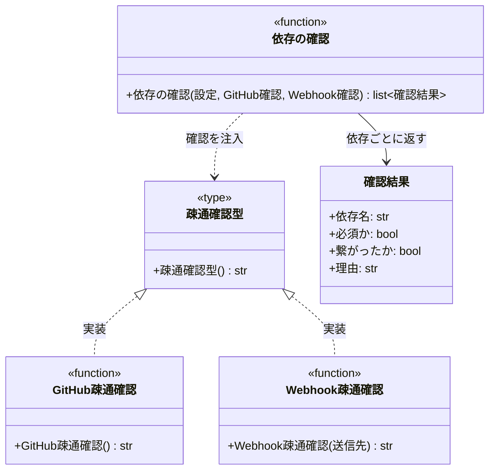

# モジュール構成: モニター / 起動チェック

`起動チェック` ドメイン（モニター側）に属する構成要素詳細。
起動時に外部 API へ疎通し、繋がらない依存を 1 箇所で明らかにする（[起動時接続チェック](../../インターフェース定義/バックエンド/起動時接続チェック.py.md)）。

## 一覧

| ユースケース | 役割 | コンテナ | 種別 | 名前 | 概要 | 補足 |
| --- | --- | --- | --- | --- | --- | --- |
| 共通 | 確認結果 | `features/health/types.py` | データモデル | [`CheckResult`](#確認結果) | 1 依存の確認結果 | 必須かどうかも持つ |
| 共通 | 疎通確認型（DI） | `features/health/types.py` | 関数型 | [`CheckFn`](#疎通確認型) | 依存へ疎通する関数のシグネチャ | テストで stub に差し替える |
| 起動時接続チェック | クライアント | `integrations/github/client.py` | 関数 | [`check_github`](#github疎通確認) | 認証ユーザーを取得して権限を確かめる | 読み取りのみ |
| 起動時接続チェック | クライアント | `integrations/webhook/client.py` | 関数 | [`check_webhook`](#webhook疎通確認) | 送信先へ到達できるかを確かめる | 実メッセージは送らない |
| 起動時接続チェック | サービス | `features/health/service.py` | 関数 | [`check_dependencies`](#依存の確認) | 全依存を順に確認して結果を返す | 必須の失敗で打ち切る |

## ディレクトリ構成

```
src/ai_monitor/
├── features/health/
│   ├── types.py     # CheckResult / CheckFn
│   └── service.py   # check_dependencies
└── integrations/
    ├── github/client.py    # check_github
    └── webhook/client.py   # check_webhook
```

## 構成図



## 確認結果
> 物理名: `CheckResult`<br>
> 種別: データモデル<br>
> コンテナ: `features/health/types.py`

1 つの依存に対する疎通確認の結果。
必須かどうかを持つことで、呼び出し側は結果一覧を見るだけで起動の可否を決められる。

### プロパティ

| 論理名 | プロパティ名 | 型 | 可視性 | デフォルト | 説明 | 例 | 補足 |
| --- | --- | --- | --- | --- | --- | --- | --- |
| 依存名 | `name` | `str` | 公開 | - | 確認した依存の表示名 | `"GitHub API"` | ログに出す |
| 必須か | `required` | `bool` | 公開 | - | 繋がらないと起動できないか | `True` | GitHub API のみ `True` |
| 繋がったか | `ok` | `bool` | 公開 | - | 疎通に成功したか | `True` | - |
| 理由 | `reason` | `str` | 公開 | `""` | 失敗理由 | `"401 Unauthorized"` | 成功時は空文字 |

### メソッド

なし

### 単体テスト

なし

## `features/health/types.py`
> 種別: ファイル

起動チェックの型定義。

---

### 疎通確認型
> 物理名: `CheckFn`<br>
> 種別: 関数型

依存へ疎通する関数のシグネチャ。
確認手段は依存ごとに違うので、引数は取らず失敗理由だけを返す形に揃える（送信先などの情報は呼び出し側が束ねる）。

#### 引数

なし

#### 戻り値

| 型 | 説明 | 補足 |
| --- | --- | --- |
| `str` | 失敗理由 | 成功時は空文字 |

#### 実装

| 実装 | 補足 |
| --- | --- |
| [GitHub疎通確認](#github疎通確認) | 必須依存の確認 |
| [Webhook疎通確認](#webhook疎通確認) | 送信先を束ねた形で本型を満たす |

## `integrations/github/client.py`
> 種別: ファイル

GitHub API との境界層（本ページでは疎通確認のみを扱う。他の関数は [GitHub連携](./GitHub連携.py.md)）。

---

### GitHub疎通確認
> 物理名: `check_github`<br>
> 種別: 関数<br>
> 継承元: [`CheckFn`](#疎通確認型)

認証ユーザーを取得して、トークンが有効かを確かめる。

#### 引数

なし

#### 戻り値

| 型 | 説明 | 補足 |
| --- | --- | --- |
| `str` | 失敗理由 | 成功時は空文字 |

戻り値例:

```python
""
```

#### 処理

1. タイムアウト付きで認証ユーザーを取得する
   - 取得できた場合、空文字を返す
     - `[INFO]` GitHub API へ疎通した（ログイン名）
   - 応答が異常な場合、応答コードを理由にして返す
   - 通信に失敗した場合、例外の内容を理由にして返す

#### 例外

なし

#### 単体テスト

| テスト名 | 正常/異常 | 概要 | 条件 | Mock | 期待値 | 補足 |
| --- | --- | --- | --- | --- | --- | --- |
| `test_check_github` | 正常 | 疎通成功 | 認証ユーザーを返す | githubkit | 空文字を返す | - |
| `test_check_github_when_unauthorized` | 正常 | トークン失効 | 401 を返す | githubkit | 理由に応答コードが入る | 例外にしない |
| `test_check_github_when_transport_error` | 正常 | 通信失敗 | 例外を送出 | githubkit | 理由に例外の内容が入る | - |

#### 疎通テスト

| テスト名 | 対象 API | 概要 | 確認内容 | 補足 |
| --- | --- | --- | --- | --- |
| `test_ext_check_github` | GitHub API | 実 API で認証確認 | PAT / `GET /user` / 200 | 料金なし・副作用なし |

## `integrations/webhook/client.py`
> 種別: ファイル

Webhook との境界層（送出は [通知](./通知.py.md)）。

---

### Webhook疎通確認
> 物理名: `check_webhook`<br>
> 種別: 関数

送信先へ到達できるかを確かめる。
起動のたびにチャットが鳴らないよう、メッセージは送らない。

#### 引数

| 論理名 | 引数名 | 型 | 必須 | デフォルト | 説明 | 補足 |
| --- | --- | --- | --- | --- | --- | --- |
| 送信先 | `webhook_url` | `str` | ✅ | - | Webhook の URL | - |

引数例:

```python
check_webhook("https://discord.com/api/webhooks/...")
```

#### 戻り値

| 型 | 説明 | 補足 |
| --- | --- | --- |
| `str` | 失敗理由 | 成功時は空文字 |

戻り値例:

```python
""
```

#### 処理

1. タイムアウト付きで送信先の URL へ本文なしの疎通要求を出す
   - 到達できた場合、空文字を返す
     - `[INFO]` 送信先へ疎通した（識別名）
   - 応答が異常な場合、応答コードを理由にして返す
   - 通信に失敗した場合、例外の内容を理由にして返す

#### 例外

なし

#### 単体テスト

| テスト名 | 正常/異常 | 概要 | 条件 | Mock | 期待値 | 補足 |
| --- | --- | --- | --- | --- | --- | --- |
| `test_check_webhook` | 正常 | 疎通成功 | 200 を返す | httpx | 空文字を返し、本文を送っていない | 実メッセージを送らないことの確認 |
| `test_check_webhook_when_not_found` | 正常 | URL 誤り | 404 を返す | httpx | 理由に応答コードが入る | - |
| `test_check_webhook_when_transport_error` | 正常 | 通信失敗 | 例外を送出 | httpx | 理由に例外の内容が入る | - |

#### 疎通テスト

| テスト名 | 対象 API | 概要 | 確認内容 | 補足 |
| --- | --- | --- | --- | --- |
| `test_ext_check_webhook_when_discord` | Discord Webhook | 実 URL へ疎通確認 | URL / 到達可否 | 副作用なし（投稿しない） |

## `features/health/service.py`
> 種別: ファイル

依存の確認をまとめるファイル。

---

### 依存の確認
> 物理名: `check_dependencies`<br>
> 種別: 関数

設定に書かれた依存を順に確認し、結果の一覧を返す。
必須依存が失敗した時点で打ち切り、補助依存の確認は行わない。

#### 引数

| 論理名 | 引数名 | 型 | 必須 | デフォルト | 説明 | 補足 |
| --- | --- | --- | --- | --- | --- | --- |
| 通知設定一覧 | `notifies` | [`list[NotifySettings]`](./通知.py.md#通知設定) | ✅ | - | 通知の送信先設定 | `enabled` が `True` のものだけ確認する |
| GitHub 確認 | `check_github_fn` | [`CheckFn`](#疎通確認型) | ✅ | - | GitHub API の確認関数 | キーワード引数で注入 |
| Webhook 確認 | `check_webhook_fn` | `Callable[[str], str]` | ✅ | - | 送信先の確認関数 | キーワード引数で注入 |

引数例:

```python
results = check_dependencies(settings.notifies, check_github_fn=check_github, check_webhook_fn=check_webhook)
```

#### 戻り値

| 型 | 説明 | 補足 |
| --- | --- | --- |
| [`list[CheckResult]`](#確認結果) | 依存ごとの確認結果 | 確認した順に並ぶ |

戻り値例:

```python
[CheckResult(name="GitHub API", required=True, ok=True, reason="")]
```

#### 処理

1. GitHub API を確認して結果を積む
   - 失敗した場合、ここで打ち切って結果を返す（必須依存が繋がらない時点で以降の確認に意味がない）
     - `[ERROR]` 必須依存へ繋がらなかった（依存名 / 理由）
2. 通知設定のうち `enabled` が `True` のものを順に確認して結果を積む
   - 失敗した場合も後続の送信先を確認し続ける（補助依存なので 1 件の失敗で打ち切らない）
     - `[WARNING]` 送信先へ繋がらなかった（識別名 / 理由）

#### 例外

なし

#### 単体テスト

| テスト名 | 正常/異常 | 概要 | 条件 | Mock | 期待値 | 補足 |
| --- | --- | --- | --- | --- | --- | --- |
| `test_check_dependencies` | 正常 | 全て疎通 | 全確認関数が空文字を返す | 確認関数 | 全結果が `ok=True` | - |
| `test_check_dependencies_when_github_fails` | 正常 | 必須が失敗 | GitHub 確認が理由を返す | 確認関数 | 結果が 1 件だけで `required=True` / `ok=False`・送信先の確認が呼ばれない | 打ち切りの確認 |
| `test_check_dependencies_when_webhook_fails` | 正常 | 補助が失敗 | 1 件目の送信先確認が理由を返す | 確認関数 | 2 件目も確認され、結果に両方が入る | 後続を止めない |
| `test_check_dependencies_when_disabled` | 正常 | 無効な送信先 | `enabled=False` の設定を含む | 確認関数 | 無効な送信先の確認が呼ばれない | 分岐の確認 |
| `test_check_dependencies_when_no_notifies` | 正常 | 送信先なし | 空リスト | 確認関数 | GitHub の結果だけが返る | - |

### 補足

- 起動を止めるかどうかは呼び出し側（composition root）が結果一覧を見て決める。
  本ファイルは判定材料を返すだけで、`sys.exit` も例外送出も行わない
- 確認は読み取り専用の操作に限る。
  通知の送信先へ実メッセージを送らないのは、起動のたびにチャットが鳴るのを避けるため
- GitHub API の確認は認証ユーザーの取得までで、監視対象リポジトリごとの権限は確認しない。
  リポジトリ数に比例して起動が遅くなるため、権限不足はポーリング時の失敗で気づく形にする
