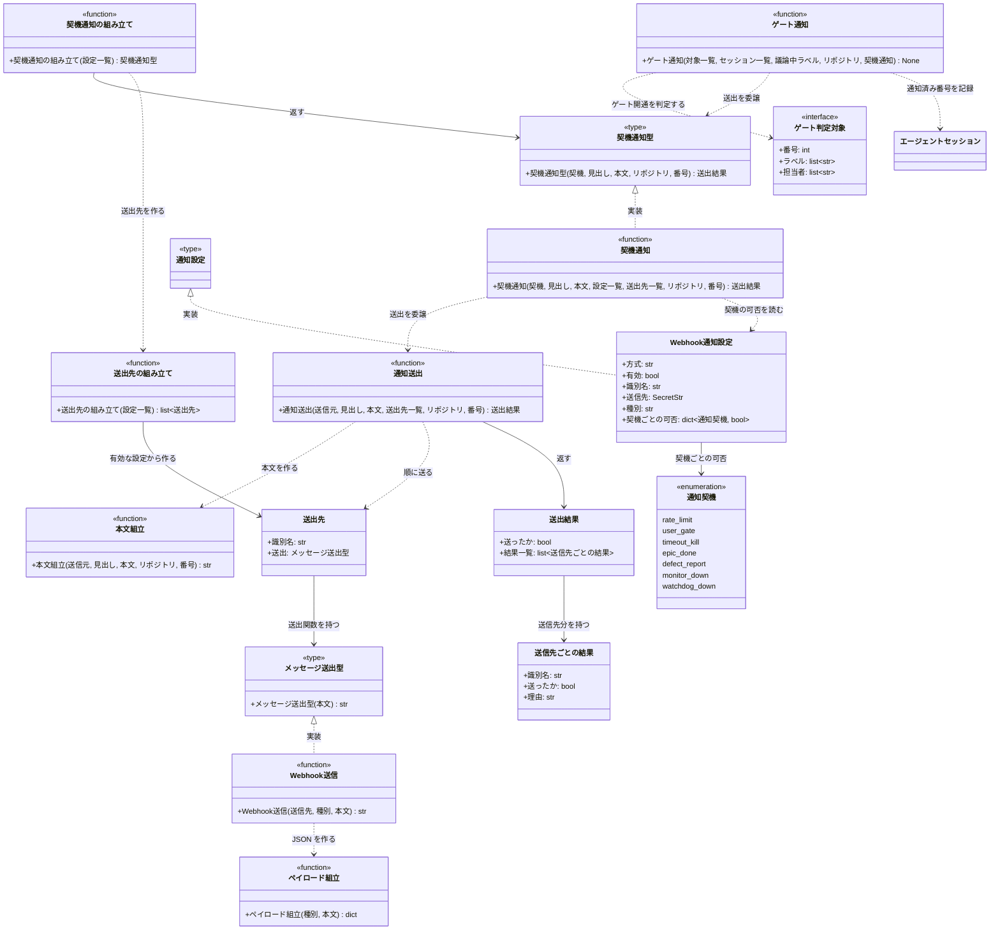

# モジュール構成: モニター / 通知

`通知` ドメイン（モニター側）に属する構成要素詳細。
判断待ちや異常を Webhook（Discord / Slack）へ送り、GitHub を見ていない時間帯でも拾えるようにする。

## 一覧

| ユースケース | 役割 | コンテナ | 種別 | 名前 | 概要 | 補足 |
| --- | --- | --- | --- | --- | --- | --- |
| 共通 | 設定 | `shared/settings.py` | データモデル | [`WebhookNotifySettings`](#webhook通知設定) | Webhook 方式 1 件分の送信先と送出可否 | `type: webhook` の設定 |
| 共通 | 設定の判別ユニオン | `shared/settings.py` | 関数型 | [`NotifySettings`](#通知設定) | 送出方式ごとの設定を `type` で判別する | 方式を増やすときはここに足す |
| 共通 | 列挙 | `features/notify/types.py` | Enum | [`NotifyEvent`](#通知契機) | モニターが送る契機の列挙 | 設定の `events` のキー |
| 共通 | 送出先 | `features/notify/types.py` | データモデル | [`SendTarget`](#送出先) | 識別名と送出関数の組 | 設定 1 件から 1 つ作る |
| 共通 | 送出型（DI） | `features/notify/types.py` | 関数型 | [`SendMessage`](#メッセージ送出型) | 本文を受けて送る関数のシグネチャ | 送信先は組み立て時に束ねる |
| 共通 | 設定読み型（DI） | `features/notify/types.py` | 関数型 | [`ReadNotifySettings`](#通知設定読み型) | 通知設定を読む関数のシグネチャ | 送出のたびに呼ぶ |
| 共通 | 契機通知型（DI） | `features/notify/types.py` | 関数型 | [`NotifyFn`](#契機通知型) | 検知側が呼ぶ通知関数のシグネチャ | 設定と送出先は composition root で束ねる |
| 共通 | 送信先ごとの結果 | `features/notify/types.py` | データモデル | [`TargetResult`](#送信先ごとの結果) | 1 送信先の成否と理由 | 原因が送信先ごとに違うため個別に持つ |
| 共通 | 送出結果 | `features/notify/types.py` | データモデル | [`SendResult`](#送出結果) | 全体の成否と送信先ごとの結果 | MCP ツールの戻り値にもなる |
| 通知送出 | クライアント | `integrations/webhook/client.py` | 関数 | [`post_webhook`](#webhook送信) | Webhook へ 1 回 POST する | リトライしない |
| 通知送出 | ペイロード組立 | `integrations/webhook/client.py` | 関数 | [`build_payload`](#ペイロード組立) | 種別ごとの JSON を作る | Discord は `content` / Slack は `text` |
| 通知送出 | 送出先の組み立て | `features/notify/service.py` | 関数 | [`build_targets`](#送出先の組み立て) | 有効な設定から送出先の一覧を作る | `enabled: false` は除く |
| 通知送出 | サービス | `features/notify/service.py` | 関数 | [`send_notification`](#通知送出) | 全送出先へ同じ本文を送る | 途中で失敗しても後続へ送り続ける |
| 通知送出 | 本文組立 | `features/notify/service.py` | 関数 | [`build_message`](#本文組立) | 見出し・本文・リンクを 1 本にする | 上限で末尾を切る |
| 契機の通知 | サービス | `features/notify/service.py` | 関数 | [`notify_event`](#契機通知) | 契機ごとの定型文を送る | 契機が無効な送信先は除く |
| 契機の通知 | 契機通知の組み立て | `features/notify/service.py` | 関数 | [`build_notifier`](#契機通知の組み立て) | 送出のたびに設定を解決する通知関数を返す | composition root で 1 回だけ呼ぶ |
| 契機の通知 | 設定の読み直し | `features/notify/service.py` | 関数 | [`build_settings_reader`](#設定の読み直し) | 呼ぶたびに設定を読み直す関数を返す | 読めなければ直前の設定を使う |
| ゲート通知 | ゲート判定の契約 | `features/notify/gates.py` | インタフェース | [`_Gateable`](#ゲート判定対象) | ゲート判定に使う監視対象の最小形 | 構造的型付け（`Protocol`） |
| ゲート通知 | サービス | `features/notify/gates.py` | 関数 | [`notify_open_gates`](#ゲート通知) | ユーザーの番になった対象をセッションごとに 1 度だけ通知する | 通知済み番号はセッション台帳が持つ |

## ディレクトリ構成

```
src/ai_monitor/
├── features/notify/
│   ├── types.py     # NotifyEvent / SendMessage / SendResult
│   ├── service.py   # send_notification / build_message / notify_event
│   └── gates.py     # notify_open_gates（ユーザー確認ゲートの開通検知）
└── integrations/webhook/
    └── client.py    # post_webhook / build_payload
```

## 構成図



## Webhook通知設定
> 物理名: `WebhookNotifySettings`<br>
> 種別: データモデル<br>
> コンテナ: `shared/settings.py`

Webhook 方式の送信先 1 件分の設定。
設定の `notifies[]` の 1 要素に対応し、複数登録できる。

### プロパティ

| 論理名 | プロパティ名 | 型 | 可視性 | デフォルト | 説明 | 例 | 補足 |
| --- | --- | --- | --- | --- | --- | --- | --- |
| 方式 | `type` | `Literal["webhook"]` | 公開 | `"webhook"` | 送出方式の判別子 | `"webhook"` | [通知設定](#通知設定) の判別に使う |
| 有効 | `enabled` | `bool` | 公開 | `True` | この送信先を使うか | `True` | 設定を消さずに一時停止する |
| 識別名 | `name` | `str \| None` | 公開 | `None` | ログと結果で使う表示名 | `"社内 Slack"` | 未設定なら `{type}:{kind}` を使う |
| 送信先 | `webhook_url` | `SecretStr` | 公開 | - | Webhook の URL | `"https://discord.com/api/webhooks/..."` | 秘匿値。ログに出さないため `SecretStr` で持つ |
| 種別 | `kind` | `Literal["discord", "slack"]` | 公開 | - | 送信先サービス | `"discord"` | ペイロードのキーが変わる |
| 契機ごとの可否 | `events` | [`dict[NotifyEvent, bool]`](#通知契機) | 公開 | `{}` | 契機ごとに送るかどうか | `{"timeout_kill": False}` | 書かれていない契機は送る扱い |

### メソッド

なし

### 単体テスト

なし

### 補足

- `events` に無いキーを送る扱いにするのは、契機が増えたときに既存の設定が黙って無効化されないようにするため
- MCP ツール経由の送出は `events` の対象外（エージェントが送ると決めたものは `enabled` な全送信先へ届く）

## `shared/settings.py`
> 種別: ファイル

通知の送出方式を判別可能ユニオンで持つ型定義（設定全体の定義は [設定](../../設定/モニター.md)）。

---

### 通知設定
> 物理名: `NotifySettings`<br>
> 種別: 関数型

送出方式ごとの設定を `type` で判別するユニオン。
方式を増やすときは設定クラスを追加して本型のユニオンに足し、[送出先の組み立て](#送出先の組み立て) に分岐を 1 つ加える。

#### 引数

なし

#### 戻り値

なし

#### 実装

| 実装 | 補足 |
| --- | --- |
| [Webhook通知設定](#webhook通知設定) | `type: webhook`。Discord / Slack はどちらも Incoming Webhook なので本実装が扱う |

## 通知契機
> 物理名: `NotifyEvent`<br>
> 種別: Enum<br>
> コンテナ: `features/notify/types.py`

ユーザーが気づくべき出来事の契機。
モニターが自分で検知するものと、MCP ツールが処理の中で送るものがある。

### 値一覧

| 値 | 論理名 | 送る条件 | 送出元 | 文面に載せる値 | 補足 |
| --- | --- | --- | --- | --- | --- |
| `rate_limit` | レートリミット到達 | Claude の利用上限に達して待機に入った | [HTTP受信](./HTTP受信.py.md)の上限到達エンドポイント | 対象セッション / リセット時刻 | - |
| `user_gate` | ユーザー確認ゲート | `議論中` + assignee が付いてユーザーの番になった | [ゲート通知](#ゲート通知)（[周期駆動](./エージェント管理.py.md#周期駆動)が毎周期呼ぶ） | 対象番号 / 担当エージェント | 同じ番号では 1 度だけ送る（通知済み番号は[エージェントセッション](./エージェント管理.py.md#エージェントセッション)が持つ） |
| `timeout_kill` | セッションのタイムアウト kill | 処理中のまま上限を超えたセッションを kill した | [クリーンアップ](./クリーンアップ.py.md#タイムアウト回収) | kill したセッション / 超過時間 | ハングの検知 |
| `epic_done` | epic 完了 | epic が close して配下のセッションを一括解放した | [クリーンアップ](./クリーンアップ.py.md#一括解放) | 完了した Issue 番号 / 解放したセッション数 | 完了の区切り |
| `defect_report` | 不具合報告 | エージェントが手順どおり進められない事象を起票した | [不具合Issue起票](../MCP/GitHub操作.py.md#不具合issue起票) | 報告元のプロジェクト / 番号 / エージェント | 承認待ちの Issue が溜まらないよう即座に知らせる |
| `monitor_down` | モニターの停止 | 監視役がモニターの停止を検知した | [監視](./死活監視.py.md#監視)（監視役プロセス） | 欠けた材料 / 再起動したか / 期間内の再起動回数 | 再起動を打ち切ったときも同じ契機で送る |
| `watchdog_down` | 監視役の停止 | モニターが監視役の停止を検知した | [監視](./死活監視.py.md#監視)（モニタープロセス） | 欠けた材料 / 再起動したか / 期間内の再起動回数 | モニターのポーリングは止めない |

送信先ごとにどの契機を送るかは[Webhook通知設定](#webhook通知設定)の `events` で決める。
同じ送信先を複数登録して契機を振り分けると、通知の面を分けられる。

### メソッド

なし

### 単体テスト

なし

## `features/notify/types.py`
> 種別: ファイル

通知ドメインの型定義。

---

### メッセージ送出型
> 物理名: `SendMessage`<br>
> 種別: 関数型

組み立て済みの本文を送る関数のシグネチャ。
送信先の情報は [送出先の組み立て](#送出先の組み立て) が束ねるため、本型は本文だけを受ける。
テストでは stub に差し替える。

#### 引数

| 論理名 | 引数名 | 型 | 必須 | デフォルト | 説明 | 補足 |
| --- | --- | --- | --- | --- | --- | --- |
| 本文 | `text` | `str` | ✅ | - | 送る本文 | 組み立て済み |

#### 戻り値

| 型 | 説明 | 補足 |
| --- | --- | --- |
| `str` | 失敗理由 | 成功時は空文字 |

#### 実装

| 実装 | 補足 |
| --- | --- |
| [Webhook送信](#webhook送信) | 送信先と種別を束ねた形で本型を満たす |

---

### 契機通知型
> 物理名: `NotifyFn`<br>
> 種別: 関数型

契機を検知した側（レートリミット / エージェント管理 / クリーンアップ）が呼ぶ通知関数のシグネチャ。
設定と送出先は [契機通知の組み立て](#契機通知の組み立て) が束ねるため、検知側は契機・文面・対象だけを渡す。

#### 引数

| 論理名 | 引数名 | 型 | 必須 | デフォルト | 説明 | 補足 |
| --- | --- | --- | --- | --- | --- | --- |
| 契機 | `event` | [`NotifyEvent`](#通知契機) | ✅ | - | 検知した契機 | - |
| 見出し | `title` | `str` | ✅ | - | 1 行の見出し | 検知側が組み立てる |
| 本文 | `body` | `str` | ✅ | - | 本文 | 同上 |
| リポジトリ | `repo` | `str \| None` | - | `None` | 対象リポジトリ（`owner/name`） | キーワード引数。`number` と揃って初めて本文末尾にリンクが付く |
| 番号 | `number` | `int \| None` | - | `None` | 対象の Issue / PR 番号 | キーワード引数。通知から対象へ 1 クリックで飛べるようにする |

#### 戻り値

| 型 | 説明 | 補足 |
| --- | --- | --- |
| [`SendResult`](#送出結果) | 送ったかと理由 | 検知側は結果を捨ててよい（通知は補助手段） |

#### 実装

| 実装 | 補足 |
| --- | --- |
| [契機通知](#契機通知) | 設定と送出関数を束ねた形で本型を満たす |

## 送出先
> 物理名: `SendTarget`<br>
> 種別: データモデル<br>
> コンテナ: `features/notify/types.py`

送出先 1 件分の識別名と送出関数の組。
設定 1 件から [送出先の組み立て](#送出先の組み立て) が作り、送出時は本モデルの一覧を順に回す。

### プロパティ

| 論理名 | プロパティ名 | 型 | 可視性 | デフォルト | 説明 | 例 | 補足 |
| --- | --- | --- | --- | --- | --- | --- | --- |
| 識別名 | `name` | `str` | 公開 | - | 結果とログで使う表示名 | `"webhook:discord"` | 設定の `name`（未設定なら `{type}:{kind}`） |
| 送出 | `send` | [`SendMessage`](#メッセージ送出型) | 公開 | - | 本文を受けて送る関数 | - | 送信先の情報は束ね済み |

### メソッド

なし

### 単体テスト

なし

## 送信先ごとの結果
> 物理名: `TargetResult`<br>
> 種別: データモデル<br>
> コンテナ: `features/notify/types.py`

1 つの送信先に対する送出の成否と理由。
送信先ごとに失敗の原因が違う（片方は接続エラー・もう片方は 4xx など）ため、理由を個別に持つ。

### プロパティ

| 論理名 | プロパティ名 | 型 | 可視性 | デフォルト | 説明 | 例 | 補足 |
| --- | --- | --- | --- | --- | --- | --- | --- |
| 識別名 | `target` | `str` | 公開 | - | 送信先の表示名 | `"社内 Slack"` | 設定の `name`（未設定なら `{type}:{kind}`） |
| 送ったか | `sent` | `bool` | 公開 | - | この送信先へ送れたか | `True` | - |
| 理由 | `reason` | `str` | 公開 | `""` | 失敗理由 | `"ConnectError: 接続できない"` | 成功時は空文字 |

### メソッド

なし

### 単体テスト

なし

## 送出結果
> 物理名: `SendResult`<br>
> 種別: データモデル<br>
> コンテナ: `features/notify/types.py`

全体の成否と、送信先ごとの結果一覧。
MCP ツール [通知送出](../../インターフェース定義/バックエンド/通知送出.py.md) の戻り値にもそのまま使う。

### プロパティ

| 論理名 | プロパティ名 | 型 | 可視性 | デフォルト | 説明 | 例 | 補足 |
| --- | --- | --- | --- | --- | --- | --- | --- |
| 送ったか | `sent` | `bool` | 公開 | - | 1 件以上へ送れたか | `True` | 呼び出し側はこれだけ見て次へ進んでよい |
| 結果一覧 | `results` | [`list[TargetResult]`](#送信先ごとの結果) | 公開 | `[]` | 送信先ごとの結果 | - | 有効な送信先が無い場合は空リスト |

### メソッド

なし

### 単体テスト

なし

## `integrations/webhook/client.py`
> 種別: ファイル

Webhook（Discord / Slack）へ HTTP で送る境界層。

---

### ペイロード組立
> 物理名: `build_payload`<br>
> 種別: 関数

送信先サービスに合わせた JSON を作る。

#### 引数

| 論理名 | 引数名 | 型 | 必須 | デフォルト | 説明 | 補足 |
| --- | --- | --- | --- | --- | --- | --- |
| 種別 | `kind` | `Literal["discord", "slack"]` | ✅ | - | 送信先サービス | - |
| 本文 | `text` | `str` | ✅ | - | 送る本文 | - |

引数例:

```python
build_payload("discord", "> from: @architect\n判断をお願いします")
```

#### 戻り値

| 型 | 説明 | 補足 |
| --- | --- | --- |
| `dict[str, str]` | POST するリクエストボディ | - |

戻り値例:

```python
{"content": "> from: @architect\n判断をお願いします"}
```

#### 処理

1. 種別ごとの本文キーを決める
   - `discord` の場合、`content` に本文を入れて返す
   - `slack` の場合、`text` に本文を入れて返す

#### 例外

なし

#### 単体テスト

| テスト名 | 正常/異常 | 概要 | 条件 | Mock | 期待値 | 補足 |
| --- | --- | --- | --- | --- | --- | --- |
| `test_build_payload_when_discord` | 正常 | Discord のキー | `kind="discord"` | なし | `content` キーに本文が入る | - |
| `test_build_payload_when_slack` | 正常 | Slack のキー | `kind="slack"` | なし | `text` キーに本文が入る | - |

---

### Webhook送信
> 物理名: `post_webhook`<br>
> 種別: 関数<br>
> 継承元: [`SendMessage`](#メッセージ送出型)

Webhook へ 1 回だけ POST する。

#### 引数

| 論理名 | 引数名 | 型 | 必須 | デフォルト | 説明 | 補足 |
| --- | --- | --- | --- | --- | --- | --- |
| 送信先 | `webhook_url` | `str` | ✅ | - | Webhook の URL | - |
| 種別 | `kind` | `Literal["discord", "slack"]` | ✅ | - | 送信先サービス | - |
| 本文 | `text` | `str` | ✅ | - | 送る本文 | - |

引数例:

```python
post_webhook("https://discord.com/api/webhooks/...", "discord", "判断をお願いします")
```

#### 戻り値

| 型 | 説明 | 補足 |
| --- | --- | --- |
| `str` | 失敗理由 | 成功時は空文字 |

戻り値例:

```python
""
```

#### 処理

1. ペイロードを組み立てる（[ペイロード組立](#ペイロード組立)）
2. タイムアウト 10 秒で POST する
   - 応答が 2xx の場合、空文字を返す
     - `[INFO]` Webhook へ通知を送った（`kind` / 本文の文字数）
   - 応答が 2xx 以外の場合、応答コードを理由にして返す
     - `[WARNING]` Webhook が失敗応答を返した（`kind` / `status_code`）
   - 通信に失敗した場合、例外の内容を理由にして返す（送出は補助手段なので送出側へ例外を伝播させない）
     - `[WARNING]` Webhook への送信に失敗した（`kind` / 例外の型名）

#### 例外

なし

#### 単体テスト

| テスト名 | 正常/異常 | 概要 | 条件 | Mock | 期待値 | 補足 |
| --- | --- | --- | --- | --- | --- | --- |
| `test_post_webhook` | 正常 | 送信成功 | 204 を返す | httpx | 空文字を返し、POST が 1 回 | ペイロードのキーも検証 |
| `test_post_webhook_when_error_status` | 正常 | 失敗応答 | 429 を返す | httpx | 理由に応答コードが入る・再送しない | 例外にしない |
| `test_post_webhook_when_transport_error` | 正常 | 通信失敗 | httpx が例外を送出 | httpx | 理由に例外の内容が入る | 呼び出し側を止めない |

#### 疎通テスト

| テスト名 | 対象 API | 概要 | 確認内容 | 補足 |
| --- | --- | --- | --- | --- |
| `test_ext_post_webhook_when_discord` | Discord Webhook | Discord へ実投稿 | URL / `content` キー / 204 | 副作用: 実チャンネルへ投稿 |
| `test_ext_post_webhook_when_slack` | Slack Webhook | Slack へ実投稿 | URL / `text` キー / 200 | 副作用: 実チャンネルへ投稿 |

## `features/notify/service.py`
> 種別: ファイル

送出の判断と本文の組み立てを担うファイル。

---

### 本文組立
> 物理名: `build_message`<br>
> 種別: 関数

送信元・見出し・本文・対象リンクを 1 本のテキストにする。

#### 引数

| 論理名 | 引数名 | 型 | 必須 | デフォルト | 説明 | 補足 |
| --- | --- | --- | --- | --- | --- | --- |
| 送信元 | `sender` | `str` | ✅ | - | エージェント名 or `monitor` | 先頭に付ける |
| 見出し | `title` | `str` | ✅ | - | 1 行の見出し | - |
| 本文 | `body` | `str` | ✅ | - | 本文 | - |
| リポジトリ | `repo` | `str \| None` | - | `None` | `owner/name` | 番号があるときだけ使う |
| 番号 | `number` | `int \| None` | - | `None` | Issue / PR 番号 | 指定時に末尾へリンクを付ける |

引数例:

```python
build_message("architect", "判断をお願いします", "候補 3 件の PoC が成立しました", repo="owner/name", number=1069)
```

#### 戻り値

| 型 | 説明 | 補足 |
| --- | --- | --- |
| `str` | 送信する本文 | 2000 文字以内 |

戻り値例:

```python
"**[architect] 判断をお願いします**\n候補 3 件の PoC が成立しました\nhttps://github.com/owner/name/issues/1069"
```

#### 処理

1. 送信元と見出しを 1 行目に組み立てる
2. 本文を続ける
3. 番号とリポジトリが揃っている場合、対象へのリンクを末尾に足す
4. 合計が上限を超える場合、末尾を切って返す

#### 例外

なし

#### 単体テスト

| テスト名 | 正常/異常 | 概要 | 条件 | Mock | 期待値 | 補足 |
| --- | --- | --- | --- | --- | --- | --- |
| `test_build_message` | 正常 | 番号なし | `number=None` | なし | 送信元と見出しが 1 行目に入りリンクは付かない | - |
| `test_build_message_when_number` | 正常 | 番号あり | `repo` と `number` を指定 | なし | 末尾に対象へのリンクが付く | - |
| `test_build_message_when_over_limit` | 正常 | 上限超過 | 本文を上限より長くする | なし | 2000 文字以内に切り詰められる | - |

---

### 送出先の組み立て
> 物理名: `build_targets`<br>
> 種別: 関数

有効な設定から送出先の一覧を作る。
方式ごとの差は本関数で吸収し、以降は識別名と送出関数の組だけを扱う。

#### 引数

| 論理名 | 引数名 | 型 | 必須 | デフォルト | 説明 | 補足 |
| --- | --- | --- | --- | --- | --- | --- |
| 設定一覧 | `settings_list` | [`list[NotifySettings]`](#通知設定) | ✅ | - | 通知設定の一覧 | 設定の `notifies[]` |

引数例:

```python
targets = build_targets(settings.notifies)
```

#### 戻り値

| 型 | 説明 | 補足 |
| --- | --- | --- |
| [`list[SendTarget]`](#送出先) | 有効な送出先の一覧 | 設定の並び順を保つ。有効が 0 件なら空リスト |

戻り値例:

```python
[SendTarget(name="webhook:discord", send=partial(post_webhook, "https://...", "discord"))]
```

#### 処理

1. 設定を順に見て、`enabled` が `False` のものを除く
2. 残った設定ごとに送出先を作る
   - `webhook` の場合、送信先と種別を束ねた [Webhook送信](#webhook送信) を持つ送出先を作る
   - 上記以外の場合、網羅漏れとして型検査で弾く（実行時には到達しない）
3. 識別名は設定の `name` を使い、未設定なら `{type}:{kind}` にする

#### 例外

なし

#### 単体テスト

| テスト名 | 正常/異常 | 概要 | 条件 | Mock | 期待値 | 補足 |
| --- | --- | --- | --- | --- | --- | --- |
| `test_build_targets` | 正常 | 複数の有効な設定 | Discord と Slack を 1 件ずつ | httpx | 設定の並び順で 2 件返り、各送出関数が対応する送信先へ POST する | - |
| `test_build_targets_when_disabled` | 正常 | 無効な設定を含む | 1 件目が `enabled=False` | なし | 有効な 1 件だけが返る | 分岐の確認 |
| `test_build_targets_when_named` | 正常 | 識別名あり / なし | 片方に `name` を設定 | なし | 設定した名前と `{type}:{kind}` の既定名が入る | - |

---

### 通知送出
> 物理名: `send_notification`<br>
> 種別: 関数

全ての送出先へ同じ本文を送る。

#### 引数

| 論理名 | 引数名 | 型 | 必須 | デフォルト | 説明 | 補足 |
| --- | --- | --- | --- | --- | --- | --- |
| 送信元 | `sender` | `str` | ✅ | - | エージェント名 or `monitor` | - |
| 見出し | `title` | `str` | ✅ | - | 1 行の見出し | - |
| 本文 | `body` | `str` | ✅ | - | 本文 | - |
| 送出先一覧 | `targets` | [`list[SendTarget]`](#送出先) | ✅ | - | 送出先の一覧 | キーワード引数で注入。空リストなら送らない |
| リポジトリ | `repo` | `str \| None` | - | `None` | `owner/name` | - |
| 番号 | `number` | `int \| None` | - | `None` | Issue / PR 番号 | - |

引数例:

```python
send_notification("architect", "判断をお願いします", "候補が成立しました", targets=targets, repo="owner/name", number=1069)
```

#### 戻り値

| 型 | 説明 | 補足 |
| --- | --- | --- |
| [`SendResult`](#送出結果) | 全体の成否と送信先ごとの結果 | - |

戻り値例:

```python
SendResult(sent=True, results=[TargetResult(target="webhook:discord", sent=True, reason="")])
```

#### 処理

1. 送出先が 0 件の場合、空の結果一覧を付けて送らなかったことを返す
   - `[DEBUG]` 有効な送出先が無いため送信しなかった（`sender`）
2. 本文を組み立てる（[本文組立](#本文組立)）
3. 送出先を設定の並び順に 1 件ずつ送り、結果を積む（失敗しても後続へ送り続ける）
   - `[WARNING]` 送信先への送出に失敗した（`target` / 理由）
4. 1 件以上成功したかを全体の成否にして返す

#### 例外

なし

#### 単体テスト

| テスト名 | 正常/異常 | 概要 | 条件 | Mock | 期待値 | 補足 |
| --- | --- | --- | --- | --- | --- | --- |
| `test_send_notification` | 正常 | 全送出先へ送信 | 成功する送出先 2 件 | 送出関数 | `sent=True`・両方に同じ本文が渡り、結果が並び順で 2 件 | - |
| `test_send_notification_when_no_targets` | 正常 | 送出先なし | 空リスト | 送出関数 | `sent=False`・結果が空・送出が呼ばれない | 分岐の確認 |
| `test_send_notification_when_partially_fails` | 正常 | 一部が失敗 | 1 件目が理由を返し 2 件目は成功 | 送出関数 | `sent=True`・1 件目の結果に理由が入り 2 件目も送られる | 後続を止めない |
| `test_send_notification_when_all_fail` | 正常 | 全て失敗 | 全ての送出先が理由を返す | 送出関数 | `sent=False`・結果に送信先ごとの理由が入る | 例外にしない |

---

### 契機通知
> 物理名: `notify_event`<br>
> 種別: 関数

モニターが検知した契機を定型文で送る。

#### 引数

| 論理名 | 引数名 | 型 | 必須 | デフォルト | 説明 | 補足 |
| --- | --- | --- | --- | --- | --- | --- |
| 契機 | `event` | [`NotifyEvent`](#通知契機) | ✅ | - | 検知した契機 | - |
| 見出し | `title` | `str` | ✅ | - | 1 行の見出し | 契機ごとに呼び出し側が作る |
| 本文 | `body` | `str` | ✅ | - | 本文 | 同上 |
| 設定一覧 | `settings_list` | [`list[NotifySettings]`](#通知設定) | ✅ | - | 通知設定の一覧 | 契機ごとの可否の判定に使う |
| 送出先一覧 | `targets` | [`list[SendTarget]`](#送出先) | ✅ | - | 送出先の一覧 | キーワード引数で注入。設定一覧と同じ並び順 |
| リポジトリ | `repo` | `str \| None` | - | `None` | `owner/name` | - |
| 番号 | `number` | `int \| None` | - | `None` | Issue / PR 番号 | - |

引数例:

```python
notify_event("rate_limit", "利用上限に達しました", "2:30 まで待機します", settings.notifies, targets=targets)
```

#### 戻り値

| 型 | 説明 | 補足 |
| --- | --- | --- |
| [`SendResult`](#送出結果) | 全体の成否と送信先ごとの結果 | - |

戻り値例:

```python
SendResult(sent=True, results=[TargetResult(target="webhook:discord", sent=True, reason="")])
```

#### 処理

1. 設定一覧と送出先一覧を突き合わせ、当該契機が有効な送出先だけに絞る
   - 設定の `events` に契機のキーが無い場合は有効として扱う
2. 絞った結果が 0 件の場合、空の結果一覧を付けて送らなかったことを返す
   - `[DEBUG]` 当該契機を送る送出先が無いため送信しなかった（`event`）
3. 送信元を `monitor` にして送る（[通知送出](#通知送出)）

#### 例外

なし

#### 単体テスト

| テスト名 | 正常/異常 | 概要 | 条件 | Mock | 期待値 | 補足 |
| --- | --- | --- | --- | --- | --- | --- |
| `test_notify_event` | 正常 | 契機が有効 | 全送出先で当該契機が `true` | 送出関数 | `sent=True`・全送出先へ届き、送信元が `monitor` | - |
| `test_notify_event_when_partially_disabled` | 正常 | 一部で契機が無効 | 1 件目だけ当該契機が `false` | 送出関数 | 2 件目にだけ届き、結果も 1 件だけ | 送信先ごとの可否 |
| `test_notify_event_when_all_disabled` | 正常 | 全てで契機が無効 | 全送出先で当該契機が `false` | 送出関数 | `sent=False`・送出が呼ばれない | 分岐の確認 |
| `test_notify_event_when_event_not_listed` | 正常 | 契機の記載なし | `events` に当該契機のキーが無い | 送出関数 | 送られる（既定は有効） | 契機追加時に既存設定が黙って無効化されないことの確認 |

---

### 契機通知の組み立て
> 物理名: `build_notifier`<br>
> 種別: 関数

設定一覧から送出先を作り、契機通知の関数を組み立てて返す。
composition root で 1 回だけ呼び、以降は検知側へ [`NotifyFn`](#契機通知型) として渡す。

#### 引数

| 論理名 | 引数名 | 型 | 必須 | デフォルト | 説明 | 補足 |
| --- | --- | --- | --- | --- | --- | --- |
| 設定一覧 | `settings_list` | [`list[NotifySettings]`](#通知設定) | ✅ | - | 通知設定の一覧 | 設定の `notifies[]` |

引数例:

```python
notify = build_notifier(settings.notifies)
```

#### 戻り値

| 型 | 説明 | 補足 |
| --- | --- | --- |
| [`NotifyFn`](#契機通知型) | 契機と文面だけを受ける通知関数 | 設定と送出先は束ね済み |

戻り値例:

```python
partial(notify_event, settings_list=[...], targets=[...])
```

#### 処理

1. 送出先を組み立てる（[送出先の組み立て](#送出先の組み立て)）
2. 設定一覧と送出先一覧を束ねた [契機通知](#契機通知) を返す

#### 例外

なし

#### 単体テスト

| テスト名 | 正常/異常 | 概要 | 条件 | Mock | 期待値 | 補足 |
| --- | --- | --- | --- | --- | --- | --- |
| `test_build_notifier` | 正常 | 設定あり | 有効な設定 1 件 | httpx | 返った関数に契機と文面を渡すと POST される | - |
| `test_build_notifier_when_empty` | 正常 | 設定なし | 空リスト | httpx | 返った関数を呼んでも POST されず `sent=False` | 分岐の確認 |

### 補足

- 契機ごとの見出し・本文は検知した側が組み立てる。
  本ファイルは送るかどうかの判断と送出だけを持つ
- 検知側は [`NotifyFn`](#契機通知型) を注入で受け取る。
  設定と送出先の解決は composition root が [契機通知の組み立て](#契機通知の組み立て) で 1 回だけ行う
- 送出は補助手段なので、1 件も送れなくても検知側の処理は続く（戻り値を捨ててよい）
- 契機ごとの送る条件・送出元・文面に載せる値は[通知契機](#通知契機)の値一覧が持つ

## ゲート判定対象
> 物理名: `_Gateable`<br>
> 種別: インタフェース<br>
> コンテナ: `features/notify/gates.py`

ゲート開通の判定に使う監視対象の最小形（`typing.Protocol`）。
[ゲート通知](#ゲート通知)は Issue と PR を同じ形で扱うので、両者が共通で持つ 3 つの属性だけを契約にする。

### プロパティ

| 論理名 | プロパティ名 | 型 | 可視性 | デフォルト | 説明 | 例 | 補足 |
| --- | --- | --- | --- | --- | --- | --- | --- |
| 番号 | `number` | `int` | 公開 | - | Issue / PR 番号 | `35` | 通知本文と通知済み記録のキー |
| ラベル | `labels` | `list[str]` | 公開 | - | 付与中のラベル名 | `["議論中"]` | 議論中ラベルの有無を見る |
| 担当者 | `assignees` | `list[str]` | 公開 | - | assignee のログイン名 | `["shuhei1101"]` | 空でなければユーザーの番 |

### メソッド

なし

### 実装

| 実装 | 補足 |
| --- | --- |
| [`Issue`](./エージェント管理.py.md#イシュー) | 構造的に満たす（継承宣言はしない） |
| [`PullRequest`](./エージェント管理.py.md#プルリクエスト) | 構造的に満たす（継承宣言はしない） |

### 単体テスト

なし

## `features/notify/gates.py`
> 種別: ファイル

ユーザー確認ゲートの開通を検知して、重複しないように通知するファイル。

### ゲート通知
> 物理名: `notify_open_gates`<br>
> 種別: 関数

ユーザーの番になった対象を、セッションごとに 1 度だけ通知する。

ゲートは開いたまま毎周期観測されるため、通知済みの番号を[エージェントセッション](./エージェント管理.py.md#エージェントセッション)に持って重複を防ぐ。
ゲートが閉じたら記録を落とし、次に開いたときは再び通知する。

#### 引数

| 論理名 | 引数名 | 型 | 必須 | デフォルト | 説明 | 補足 |
| --- | --- | --- | --- | --- | --- | --- |
| 対象一覧 | `targets` | [`list[_Gateable]`](#ゲート判定対象) | ✅ | - | 周期の open 対象一覧 | [オープン対象一覧](./GitHub連携.py.md#オープン対象一覧)の結果 |
| セッション一覧 | `sessions` | [`list[AgentSession]`](./エージェント管理.py.md#エージェントセッション) | ✅ | - | 当該プロジェクトの起動中セッション | 通知済み番号をこの中に記録する |
| 議論中ラベル | `discussion_label` | `str` | ✅ | - | ゲート開通の判定に使うラベル | キーワード引数。[ラベル設定](./エージェント管理.py.md#ラベル設定)の値 |
| リポジトリ | `repo` | `str` | ✅ | - | 対象リポジトリ（`owner/name`） | キーワード引数。通知に対象へのリンクを載せるために使う |
| 契機通知 | `notify` | [`NotifyFn`](#契機通知型) | ✅ | - | 契機ごとの通知関数 | キーワード引数 |

引数例:

```python
notify_open_gates(
    targets, sessions, discussion_label=labels.in_discussion, repo=project.repo, notify=notify
)
```

#### 戻り値

| 型 | 説明 | 補足 |
| --- | --- | --- |
| `None` | なし | セッションの通知済み番号を破壊的に更新する |

#### 処理

1. `targets` から 議論中ラベルあり + assignee ありの番号を集める（ユーザーの番になっている対象）
2. セッションごとに、閉じたゲートの通知済み記録を落とす（次に開いたときへ再通知できるようにする）
3. 自セッションの監視面（主番号 + 監視面番号一覧）のうち未通知の番号を昇順に通知して、通知済みへ加える
   - 通知には `repo` と対象番号を渡す（受け取った側が対象へ直接飛べるようにする）
   - `[INFO]` ユーザー確認ゲートを通知した（`project` / `agent_name` / `number`）

#### 例外

なし

#### 単体テスト

セットアップ:

| セットアップ | 説明 | 補足 |
| --- | --- | --- |
| 通知関数 | 呼び出し引数を記録する spy 関数 | fixture 名 `notifier` |
| セッション | 主番号と監視面番号を持つ起動中セッション 1 件 | fixture 名 `session` |

| テスト名 | 正常/異常 | 概要 | 条件 | Mock | 期待値 | 補足 |
| --- | --- | --- | --- | --- | --- | --- |
| `test_notify_open_gates` | 正常 | ゲート開通の通知 | 議論中 + assignee 付きの監視面の対象 1 件 | 通知関数 | `user_gate` で 1 回通知され、リポジトリと対象番号が渡り、通知済み番号に加わる | - |
| `test_notify_open_gates_when_already_notified` | 正常 | 通知済みの抑止 | 通知済み番号に載っている対象 | 通知関数 | 通知されない | 分岐の確認 |
| `test_notify_open_gates_when_gate_closed` | 正常 | 閉じたゲートの記録落とし | 通知済みだが議論中 / assignee が外れた対象 | 通知関数 | 通知されず、通知済み番号から外れる | 再開通で再通知できる状態に戻す |
| `test_notify_open_gates_when_not_watched` | 正常 | 監視面外の除外 | 主番号にも監視面にも無い番号のゲート | 通知関数 | 通知されない | 分岐の確認 |

## 通知設定読み型
> 物理名: `ReadNotifySettings`<br>
> 種別: 関数型<br>
> コンテナ: `features/notify/types.py`

通知設定を読む関数のシグネチャ。
[契機通知の組み立て](#契機通知の組み立て) が送出のたびに呼ぶため、設定ファイルの編集が再起動なしで反映される。

### 引数

なし

### 戻り値

| 型 | 説明 | 補足 |
| --- | --- | --- |
| [`list[NotifySettings]`](#通知設定) | その時点の通知設定 | - |

### 実装

| 実装 | 補足 |
| --- | --- |
| [設定の読み直し](#設定の読み直し) | 本番の実装（読めなければ直前の設定を返す） |

## 設定の読み直し
> 物理名: `build_settings_reader`<br>
> 種別: 関数<br>
> コンテナ: `features/notify/service.py`

呼ぶたびに通知設定を読み直す関数を返す。

Webhook の宛先や契機の振り分けを変えるたびにモニターを再起動するのは運用上つらいので、送出のたびに設定を解決する。
編集途中の記述ミスで通知が止まらないよう、読めなければ直前に読めた設定を使う。

### 引数

| 論理名 | 引数名 | 型 | 必須 | デフォルト | 説明 | 補足 |
| --- | --- | --- | --- | --- | --- | --- |
| 設定の読み | `read` | [`ReadNotifySettings`](#通知設定読み型) | ✅ | - | 設定を読む関数 | composition root が `Settings().notifies` を渡す |

引数例:

```python
build_settings_reader(lambda: Settings().notifies)
```

### 戻り値

| 型 | 説明 | 補足 |
| --- | --- | --- |
| [`ReadNotifySettings`](#通知設定読み型) | 読み直し付きの読み関数 | - |

戻り値例:

```python
read()  # -> [WebhookNotifySettings(...), ...]
```

### 処理

1. 初回の読み込みを行い、結果を保持する
   - ここで失敗した場合は握らず伝播させる（起動時に気づけるようにする）
2. 呼ばれるたびに読み直し、成功したら保持している値を差し替える
3. 読み直しに失敗した場合、保持している値をそのまま返す
   - `[WARNING]` 通知設定を読み直せなかった（例外）

### 例外

なし

### 単体テスト

| テスト名 | 正常/異常 | 概要 | 条件 | Mock | 期待値 | 補足 |
| --- | --- | --- | --- | --- | --- | --- |
| `test_build_settings_reader` | 正常 | 呼ぶたびに読み直す | 呼ぶたびに違う値を返す読み関数 | 設定の読み | 2 回目に更新後の値が返る | 再起動なしで反映される |
| `test_build_settings_reader_when_read_failed` | 正常 | 読み直しの失敗 | 2 回目以降が例外を送出する読み関数 | 設定の読み | 直前の設定が返り、例外が伝播しない | 編集途中で送出が止まらない |
