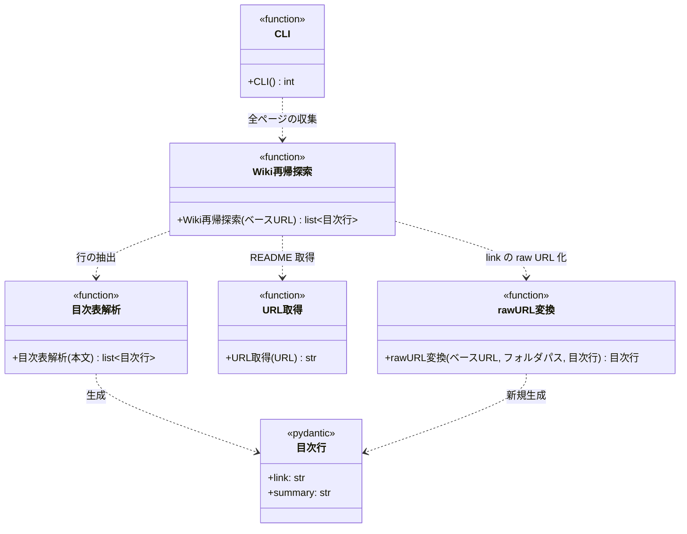

# モジュール構成: 注入 / Wiki索引

`Wiki索引` ドメイン（注入側）に属する構成要素詳細。
SKILL.md の動的コンテキスト注入から呼ばれ、監視対象プロジェクトの Wiki を再帰的に辿って README `## 目次` 表から作った「ページ（raw URL）/ 概要」の 2 列表を標準出力に展開する。

## 一覧

| ユースケース | 役割 | コンテナ | 種別 | 名前 | 概要 | 補足 |
| --- | --- | --- | --- | --- | --- | --- |
| Wiki索引注入 | URL 取得 | `inject/fetch.py` | 関数 | [`fetch_url`](./URLドキュメント.py.md#url-取得) | URL からテキストを取得する | URLドキュメント / エージェントドキュメント注入と共有 |
| Wiki索引注入 | 目次行 DTO | `inject/models.py` | データモデル | [`IndexRow`](#目次行) | 目次表 1 行（相対パス or raw URL + 概要） | Pydantic `BaseModel`。不変・生成後は書き換えない |
| Wiki索引注入 | 目次表解析 | `inject/build_wiki_index.py` | 関数 | [`parse_index_table`](#目次表解析) | README 本文から `## 目次` の「ページ / 概要」表の各行を抽出する | - |
| Wiki索引注入 | raw URL 変換 | `inject/build_wiki_index.py` | 関数 | [`to_raw_url_row`](#raw-url-変換) | `IndexRow` を受けて `link` を raw URL 化した**新しい** `IndexRow` を返す純粋関数 | 元のインスタンスは書き換えない |
| Wiki索引注入 | Wiki 再帰探索 | `inject/build_wiki_index.py` | 関数 | [`walk_wiki`](#wiki-再帰探索) | ルート README から目次表を辿って全 md ページを平坦化する（raw URL 変換は `to_raw_url_row` に委譲） | - |
| Wiki索引注入 | CLI | `inject/build_wiki_index.py` | 関数 | [`main`](#cli) | プロジェクト Wiki の全 md ページを 2 列表で標準出力に展開する | - |

## ディレクトリ構成

```
plugins/ai-monitor/inject/
├── fetch.py                # fetch_url（他の注入 CLI と共有）
├── models.py               # IndexRow
└── build_wiki_index.py     # parse_index_table / walk_wiki / main
```

## 構成図



## `inject/build_wiki_index.py`
> 種別: ファイル

プロジェクト Wiki の README を再帰的に辿ってフラット索引を標準出力に展開する CLI スクリプト。

---

### 目次表解析
> 物理名: `parse_index_table`<br>
> 種別: 関数

README 本文から `## 目次` セクションの「ページ / 概要」表の各行を抽出する。

#### 引数

| 論理名 | 引数名 | 型 | 必須 | デフォルト | 説明 | 補足 |
| --- | --- | --- | --- | --- | --- | --- |
| 本文 | `text` | `str` | ✅ | - | README ページの Markdown 本文 | - |

引数例:

```python
parse_index_table(text)
```

#### 戻り値

| 型 | 説明 | 補足 |
| --- | --- | --- |
| [`list[IndexRow]`](#目次行) | 目次表の各行（登場順） | `IndexRow.link` の末尾が `/` ならサブディレクトリ、`.md` なら md ページ |

戻り値例:

```python
[
    IndexRow(link="./シナリオ/", summary="シナリオ索引"),
    IndexRow(link="./画面構成.md", summary="画面構成の一覧"),
]
```

#### 処理

1. 本文から `## 目次` 見出しの次にある表を抽出する（見出しが無い or 「ページ」「概要」列が無い場合は `ValueError`）
2. ヘッダー行から「ページ」列と「概要」列のインデックスを特定する（他の列があってもよい）
3. 各データ行の「ページ」セルからリンク `[表示](./xxx)` の URL 部分と「概要」セルを取り出して返す

#### 例外

| 例外名 | 発生条件 | メッセージ | 補足 |
| --- | --- | --- | --- |
| `ValueError` | `## 目次` セクションが無い or 表に「ページ」「概要」列が無い | `目次見出しなし` / `ページ／概要列なし` | 呼び出し元（`walk_wiki`）で捕捉してそのフォルダ配下をスキップする（意図的な非公開運用） |

#### 単体テスト

| テスト名 | 正常/異常 | 概要 | 条件 | Mock | 期待値 | 補足 |
| --- | --- | --- | --- | --- | --- | --- |
| `test_parse_index_table` | 正常 | 目次表の抽出 | サブディレクトリと md ページが混在する目次表 | なし | 登場順の (リンク, 概要) タプル配列 | - |
| `test_parse_index_table_when_extra_columns` | 正常 | 他の列が混じっていても取れる | ページ / 概要に加えて補足など別列を持つ目次表 | なし | ページと概要だけが登場順で取れる（例外なし） | - |
| `test_parse_index_table_when_no_toc_heading` | 異常 | 目次見出しなし | `## 目次` 見出しの無い本文 | なし | `ValueError`（`目次見出しなし`） | - |
| `test_parse_index_table_when_missing_columns` | 異常 | 表に必須列がない | 「ページ」or「概要」列を欠いた表 | なし | `ValueError`（`ページ／概要列なし`） | - |

---

### Wiki 再帰探索
> 物理名: `walk_wiki`<br>
> 種別: 関数

ルート README から目次表を辿って全 md ページのエントリを平坦化する。

#### 引数

| 論理名 | 引数名 | 型 | 必須 | デフォルト | 説明 | 補足 |
| --- | --- | --- | --- | --- | --- | --- |
| ベース URL | `base_url` | `str` | ✅ | - | プロジェクト Wiki の raw URL ベース（末尾スラッシュなし） | - |

引数例:

```python
walk_wiki("https://raw.githubusercontent.com/o/p/master/docs/wiki")
```

#### 戻り値

| 型 | 説明 | 補足 |
| --- | --- | --- |
| [`list[IndexRow]`](#目次行) | 索引エントリ（深さ優先・親 → 子の順） | `IndexRow.link` は `{base_url}/{相対パス}` を連結した raw URL |

戻り値例:

```python
[
    IndexRow(link="https://.../docs/wiki/設計図/シナリオ/README.md", summary="全シナリオの索引"),
    IndexRow(link="https://.../docs/wiki/設計図/シナリオ/単一ユースケース/実装.md", summary="実装フェーズの正常系 + 異常系"),
]
```

#### 処理

1. `{base_url}/README.md` を取得する（[URL 取得](./URLドキュメント.py.md#url-取得)）
2. [目次表解析](#目次表解析) で表を行に展開する（`ValueError` を捕捉した場合はそのフォルダ配下を空として返す = 意図的な非公開運用）
3. 各行を分類する
   - `./xxx/`（末尾スラッシュ）: サブディレクトリとして再帰的に本関数を呼ぶ
   - `./xxx.md`: [raw URL 変換](#raw-url-変換) を呼んで raw URL 化された新しい `IndexRow` を得て戻り値に追加する（元の `IndexRow` は書き換えない）
4. 深さ優先・親 → 子の順で平坦化した配列を返す

#### 例外

| 例外名 | 発生条件 | メッセージ | 補足 |
| --- | --- | --- | --- |
| `URLError` | README の取得失敗 | urllib のエラー内容 | `fetch_url` から伝播（ネットワーク断・404 は明示的に失敗させる） |

#### 単体テスト

| テスト名 | 正常/異常 | 概要 | 条件 | Mock | 期待値 | 補足 |
| --- | --- | --- | --- | --- | --- | --- |
| `test_walk_wiki` | 正常 | 再帰的な平坦化 | ルート → サブディレクトリ 2 階層の README を持つ Wiki | urllib | 深さ優先・親 → 子順の (raw URL, 概要) 配列 | - |
| `test_walk_wiki_when_format_violation` | 正常 | 書式違反フォルダのサイレントスキップ | サブディレクトリ README に `## 目次` が無い | urllib | そのフォルダ配下だけが結果から抜け、他のフォルダは通常通り含まれる | 意図的な非公開運用 |
| `test_walk_wiki_when_fetch_failed` | 異常 | 途中の README 取得失敗 | サブディレクトリ README が 404 | urllib | `URLError` が伝播 | - |

---

### CLI
> 物理名: `main`<br>
> 種別: 関数

プロジェクト Wiki の全 md ページを「ページ / 概要」2 列表で標準出力に展開する。

#### 引数

なし（環境変数 `WIKI_BASE` を読む）

引数例:

```python
main()
```

#### 戻り値

| 型 | 説明 | 補足 |
| --- | --- | --- |
| `int` | 終了コード | `0` = 正常 / `1` = 環境変数未設定・取得失敗・書式違反 |

戻り値例:

```python
0
```

#### 処理

1. 環境変数 `WIKI_BASE` を読む（未設定なら stderr にメッセージを出して `1` を返す）
2. [Wiki 再帰探索](#wiki-再帰探索) を呼んで [`IndexRow`](#目次行) 配列を得る（`URLError` は stderr に対象 URL + 原因を出して `1` を返す。書式違反は `walk_wiki` で吸収済み）
3. `| ページ | 概要 |` のヘッダー + 区切り行 + 各 `IndexRow` の `| {link} | {summary} |` を 1 枚の md テーブルとして標準出力に出して `0` を返す

#### 例外

なし（内部の `URLError` は捕捉して stderr + 戻り値 `1` に変換する）

#### 単体テスト

| テスト名 | 正常/異常 | 概要 | 条件 | Mock | 期待値 | 補足 |
| --- | --- | --- | --- | --- | --- | --- |
| `test_main` | 正常 | 全エントリの表形式出力 | ルート + サブディレクトリの README を持つ Wiki を `WIKI_BASE` に設定して実行 | urllib | 標準出力に「\| ページ \| 概要 \|」の md テーブル 1 枚が出て戻り値 `0` | - |
| `test_main_when_wiki_base_missing` | 異常 | `WIKI_BASE` 未設定 | 環境変数を消して実行 | urllib | stderr にメッセージ + 戻り値 `1`・HTTP は呼ばれない | - |
| `test_main_when_fetch_failed` | 異常 | 途中の README 取得失敗 | サブディレクトリ README が 404 | urllib | stderr に対象 URL + 原因 + 戻り値 `1`・標準出力に部分結果なし | - |

## 目次行
> 物理名: `IndexRow`<br>
> 種別: データモデル<br>
> コンテナ: `inject/models.py`

Wiki 索引の 1 行を表す DTO（Pydantic `BaseModel`）。
[目次表解析](#目次表解析) の戻り値要素で、[Wiki 再帰探索](#wiki-再帰探索) 通過後は `link` が raw URL に置き換わる。

### プロパティ

| 論理名 | プロパティ名 | 型 | 可視性 | デフォルト | 説明 | 例 | 補足 |
| --- | --- | --- | --- | --- | --- | --- | --- |
| リンク | `link` | `str` | 公開 | - | 目次表「ページ」列の Markdown リンクの URL 部分 | `"./シナリオ/"` / `"https://raw.githubusercontent.com/o/p/master/docs/wiki/設計図/シナリオ/README.md"` | 目次表解析直後は README からの相対パス（末尾が `/` ならサブディレクトリ、`.md` なら md ページ）。walk_wiki 通過後は raw URL |
| 概要 | `summary` | `str` | 公開 | - | 目次表「概要」列 | `"シナリオ索引"` | 空文字もあり得る |

### メソッド

なし

### 単体テスト

なし
