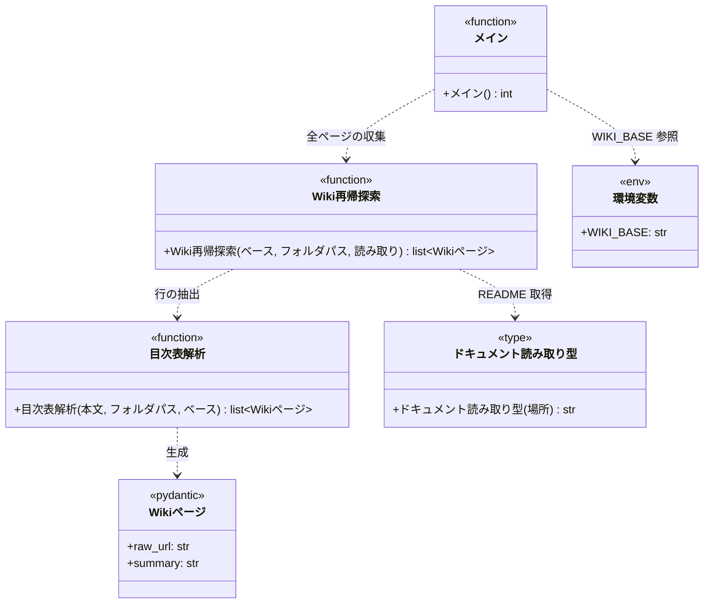

# モジュール構成: 注入 / Wiki索引

`Wiki索引` ドメイン（注入側）に属する構成要素詳細。
監視対象プロジェクトの Wiki を再帰的に辿り、README `## 目次` 表から「ページ / 概要」の 2 列表を作る。
ベースは引数で受け取り、raw URL とローカルパスのどちらでも辿れる（モニターの[エージェントドキュメント](../モニター/エージェントドキュメント.py.md)がローカルベースで呼ぶ）。

## 一覧

| ユースケース | 役割 | コンテナ | 種別 | 名前 | 概要 | 補足 |
| --- | --- | --- | --- | --- | --- | --- |
| Wiki索引注入 | URL 取得 | `inject/fetch.py` | 関数 | [`fetch_url`](./URLドキュメント.py.md#url-取得) | URL からテキストを取得する | URLドキュメント / エージェントドキュメント注入と共有 |
| Wiki索引注入 | Wiki ページ DTO | `inject/build_wiki_index.py` | データモデル | [`WikiPage`](#wiki-ページ) | 索引 1 件（raw URL + 概要） | Pydantic `BaseModel`（`frozen=True`）。[メイン](#メイン) 出力の各行に対応 |
| Wiki索引注入 | 目次表解析 | `inject/build_wiki_index.py` | 関数 | [`parse_index_table`](#目次表解析) | README 本文の `## 目次` 表を解析し、各リンクを解決した [`WikiPage`](#wiki-ページ) 配列を返す | ベースは引数で受ける（raw URL / ローカルパス）。サブディレクトリのリンクは `README.md` に補完 |
| Wiki索引注入 | Wiki 再帰探索 | `inject/build_wiki_index.py` | 関数 | [`walk_wiki`](#wiki-再帰探索) | ルート README から目次表を辿って全 md ページを平坦化する | サブディレクトリ判定は [`WikiPage.raw_url`](#wiki-ページ) 末尾で行う |
| Wiki索引注入 | メイン | `inject/build_wiki_index.py` | 関数 | [`main`](#メイン) | プロジェクト Wiki の全 md ページを 2 列表で標準出力に展開する | - |

## ディレクトリ構成

```
plugins/ai-monitor/inject/
└── build_wiki_index.py     # WikiPage / parse_index_table / walk_wiki / main
```

`WikiPage` は Wiki 索引ドメイン専用 DTO のため、独立した `models.py` に切り出さず `build_wiki_index.py` 内に置く（他 CLI と共有しない）。

## 構成図


```mermaid
classDiagram
  メイン ..> Wiki再帰探索 : 全ページの収集
  Wiki再帰探索 ..> 目次表解析 : 行の抽出
  Wiki再帰探索 ..> ドキュメント読み取り型 : README 取得
  メイン ..> 環境変数 : WIKI_BASE 参照
  目次表解析 ..> Wikiページ : 生成

  class メイン {
    <<function>>
    +メイン() int
  }
  class Wiki再帰探索 {
    <<function>>
    +Wiki再帰探索(ベース, フォルダパス, 読み取り) list~Wikiページ~
  }
  class 目次表解析 {
    <<function>>
    +目次表解析(本文, フォルダパス, ベース) list~Wikiページ~
  }
  class 環境変数 {
    <<env>>
    +WIKI_BASE: str
  }
  class ドキュメント読み取り型 {
    <<type>>
    +ドキュメント読み取り型(場所) str
  }
  class Wikiページ {
    <<pydantic>>
    +raw_url: str
    +summary: str
  }

  click メイン href "#メイン"
  click Wiki再帰探索 href "#wiki-再帰探索"
  click 目次表解析 href "#目次表解析"
  click ドキュメント読み取り型 href "./URLドキュメント.py.md#ドキュメント読み取り型"
  click Wikiページ href "#wiki-ページ"
```

## `inject/build_wiki_index.py`
> 種別: ファイル

プロジェクト Wiki の README を再帰的に辿ってフラット索引を標準出力に展開する CLI スクリプト。

---

### 目次表解析
> 物理名: `parse_index_table`<br>
> 種別: 関数

README 本文の `## 目次` 表を解析し、各リンクを解決した [`WikiPage`](#wiki-ページ) 配列で返す。

#### 引数

| 論理名 | 引数名 | 型 | 必須 | デフォルト | 説明 | 補足 |
| --- | --- | --- | --- | --- | --- | --- |
| 本文 | `text` | `str` | ✅ | - | README ページの Markdown 本文 | - |
| フォルダパス | `folder_path` | `str` | ✅ | - | 当該 README が置かれているフォルダの Wiki ルートからの相対パス | ルート直下なら `""` |
| ベース | `base` | `str` | ✅ | - | Wiki ルートの raw URL またはローカル絶対パス | 末尾スラッシュは有無どちらでもよい |

引数例:

```python
parse_index_table(text, "設計図", "/home/user/repo/ai-monitor-e2e/docs/wiki")
```

#### 戻り値

| 型 | 説明 | 補足 |
| --- | --- | --- |
| [`list[WikiPage]`](#wiki-ページ) | 目次表の各行（登場順） | サブディレクトリの行は `raw_url` が `/README.md` で終わる（[`walk_wiki`](#wiki-再帰探索) の再帰判定に使う） |

戻り値例:

```python
[
    WikiPage(raw_url="https://.../docs/wiki/設計図/シナリオ/README.md", summary="シナリオ索引"),
    WikiPage(raw_url="https://.../docs/wiki/設計図/画面構成.md", summary="画面構成の一覧"),
]
```

#### 処理

1. 引数 `base` の末尾スラッシュがあれば落とす
2. 本文からコードブロック（``` で囲まれた範囲）を取り除く（書式の記述例に含まれる `## 目次` を索引と誤認しないため）
3. 本文から `## 目次` 見出しの次にある表を抽出する（見出しが無い or 「ページ」「概要」列が無い場合は `ValueError`）
4. ヘッダー行から「ページ」列と「概要」列のインデックスを特定する（他の列があってもよい）
5. 各データ行を先頭から順にループし、各行の [`WikiPage`](#wiki-ページ) を組み立てて戻り値配列に追加する
   1. 「ページ」セルの Markdown リンク `[表示](./xxx)` から URL 部分（ファイル名）を取り出し、先頭の `./` を落とす
   2. 末尾が `/`（サブディレクトリ）なら末尾に `README.md` を補完する
   3. 引数 `folder_path` を前置して Wiki ルート相対のパスを組み立てる（`folder_path` が空なら前置なし）
   4. `{base}/{Wiki ルート相対パス}` を連結して `raw_url` を作り、「概要」セルを `summary` にした [`WikiPage`](#wiki-ページ) を戻り値配列に追加する
6. 戻り値配列を返す

#### 例外

| 例外名 | 発生条件 | メッセージ | 補足 |
| --- | --- | --- | --- |
| `ValueError` | `## 目次` セクションが無い or 表に「ページ」「概要」列が無い | `目次見出しなし` / `ページ／概要列なし` | 呼び出し元（[`walk_wiki`](#wiki-再帰探索)）で捕捉してそのフォルダ配下をスキップする（意図的な非公開運用） |

#### 単体テスト

| テスト名 | 正常/異常 | 概要 | 条件 | Mock | 期待値 | 補足 |
| --- | --- | --- | --- | --- | --- | --- |
| `test_parse_index_table` | 正常 | サブディレクトリ + md ページの混在 | `folder_path="設計図"` + サブディレクトリと md が混在する目次表 | なし | サブディレクトリ行は `raw_url` が `/設計図/xxx/README.md`、md 行は `/設計図/xxx.md`、両方 [`WikiPage`](#wiki-ページ) | - |
| `test_parse_index_table_when_root` | 正常 | ルート直下（folder_path=`""`）の解析 | folder_path=`""` を渡す | なし | `raw_url` が `{base}/xxx` の形（folder_path 前置なし） | - |
| `test_parse_index_table_when_local_base` | 正常 | ローカルパスのベース | `base` にローカル絶対パスを渡す | なし | `raw_url` がローカルパスとして連結される | モニターからの呼び出し |
| `test_parse_index_table_when_extra_columns` | 正常 | 他の列が混じっていても取れる | ページ / 概要に加えて補足など別列を持つ目次表 | なし | ページと概要だけが登場順で取れる（例外なし） | - |
| `test_parse_index_table_when_fenced_example` | 正常 | コードブロック内の記述例を無視する | 実際の目次表の後ろに ``` で囲んだ `## 目次` の記述例がある本文 | なし | 実際の目次表の行だけが返る | 書式定義ページの README を索引に載せるため |
| `test_parse_index_table_when_no_toc_heading` | 異常 | 目次見出しなし | `## 目次` 見出しの無い本文 | なし | `ValueError`（`目次見出しなし`） | - |
| `test_parse_index_table_when_missing_columns` | 異常 | 表に必須列がない | 「ページ」or「概要」列を欠いた表 | なし | `ValueError`（`ページ／概要列なし`） | - |

---

### Wiki 再帰探索
> 物理名: `walk_wiki`<br>
> 種別: 関数

ルート README から目次表を辿って全 md ページのエントリを平坦化する。
サブディレクトリ判定は [`WikiPage.raw_url`](#wiki-ページ) の末尾が `/README.md` かどうかで行う。

#### 引数

| 論理名 | 引数名 | 型 | 必須 | デフォルト | 説明 | 補足 |
| --- | --- | --- | --- | --- | --- | --- |
| ベース | `base` | `str` | ✅ | - | Wiki ルートの raw URL またはローカル絶対パス | 再帰呼び出しでそのまま引き継ぐ |
| フォルダパス | `folder_path` | `str` | - | `""` | 現在辿っているフォルダの Wiki ルートからの相対パス | 再帰呼び出しで積み上がる。初回は省略（ルート直下） |

引数例:

```python
walk_wiki("/home/user/repo/ai-monitor-e2e/docs/wiki")
```

#### 戻り値

| 型 | 説明 | 補足 |
| --- | --- | --- |
| [`list[WikiPage]`](#wiki-ページ) | 索引エントリ（深さ優先・親 → 子の順） | - |

戻り値例:

```python
[
    WikiPage(raw_url="https://.../docs/wiki/設計図/シナリオ/README.md", summary="全シナリオの索引"),
    WikiPage(raw_url="https://.../docs/wiki/設計図/シナリオ/単一ユースケース/実装.md", summary="実装フェーズの正常系 + 異常系"),
]
```

#### 処理

1. 引数 `base` の末尾スラッシュがあれば落とす
2. `{base}/{folder_path}/README.md` を取得する（`folder_path` が空ならルート直下・引数で受けた [`ReadDoc`](./URLドキュメント.py.md#ドキュメント読み取り型)）。`URLError` / `FileNotFoundError` を捕捉した場合はそのフォルダ配下を空として返す（Wiki 整備途中の状態を吸収）
3. [目次表解析](#目次表解析) に本文と `folder_path` と `base` を渡して [`WikiPage`](#wiki-ページ) 配列を得る（`ValueError` を捕捉した場合はそのフォルダ配下を空として返す = 意図的な非公開運用）
4. 空の戻り値配列を用意し、得た [`WikiPage`](#wiki-ページ) 配列を先頭から順に**本関数がループ**して分類しながら戻り値配列に追加する
   1. まず [`WikiPage`](#wiki-ページ) をそのまま戻り値配列に追加する
   2. `raw_url` が `/README.md` で終わる場合はサブディレクトリと判定し、`{base}/` と末尾 `/README.md` を落として `folder_path` を計算し、本関数を再帰的に呼んで返ってきた配列を戻り値配列の末尾に連結する（親 → 子の順）
5. 深さ優先・親 → 子の順に平坦化された戻り値配列を返す

#### 例外

なし

#### 単体テスト

| テスト名 | 正常/異常 | 概要 | 条件 | Mock | 期待値 | 補足 |
| --- | --- | --- | --- | --- | --- | --- |
| `test_walk_wiki` | 正常 | 再帰的な平坦化 | ルート → サブディレクトリ 2 階層の README を持つ Wiki | なし（一時ディレクトリに Wiki を作成） | 深さ優先・親 → 子順の [`WikiPage`](#wiki-ページ) 配列（サブディレクトリの README は `raw_url` が `/README.md` で終わる） | - |
| `test_walk_wiki_when_format_violation` | 正常 | 書式違反フォルダのサイレントスキップ | サブディレクトリ README に `## 目次` が無い | なし（一時ディレクトリに Wiki を作成） | そのフォルダ配下だけが結果から抜け、他のフォルダは通常通り含まれる | 意図的な非公開運用 |
| `test_walk_wiki_when_fetch_failed` | 正常 | 取得失敗フォルダのサイレントスキップ | サブディレクトリ README が 404 | なし（一時ディレクトリに Wiki を作成） | そのフォルダ配下だけが結果から抜け、他のフォルダは通常通り含まれる（`URLError` は伝播しない）| Wiki 整備途中の吸収 |
| `test_walk_wiki_when_root_missing` | 正常 | ルート README 取得失敗 | ルート README が 404 | なし（一時ディレクトリに Wiki を作成） | 空配列を返す（`URLError` は伝播しない）| Wiki 整備途中の吸収 |

---

### メイン
> 物理名: `main`<br>
> 種別: 関数

プロジェクト Wiki の全 md ページを「ページ / 概要」2 列表で標準出力に展開する。

#### 引数

なし（環境変数 `WIKI_BASE` を読む）

引数例:

```python
main()
```

#### 戻り値

| 型 | 説明 | 補足 |
| --- | --- | --- |
| `int` | 終了コード | `0` = 正常 / `1` = 環境変数未設定 |

戻り値例:

```python
0
```

#### 処理

1. 環境変数 `WIKI_BASE` を読む（未設定なら stderr にメッセージを出して `1` を返す）
2. 読んだ値をベースとして [Wiki 再帰探索](#wiki-再帰探索) を呼び、[`WikiPage`](#wiki-ページ) 配列を得る（書式違反 / 取得失敗はいずれも [`walk_wiki`](#wiki-再帰探索) で吸収済み）
3. `**Wiki索引:**` のラベル行 + 空行 + `| ページ | 概要 |` のヘッダー + 区切り行 + 各 [`WikiPage`](#wiki-ページ) の `| {raw_url} | {summary} |` を 1 枚の md テーブルとして標準出力に出して `0` を返す

#### 例外

なし

#### 単体テスト

| テスト名 | 正常/異常 | 概要 | 条件 | Mock | 期待値 | 補足 |
| --- | --- | --- | --- | --- | --- | --- |
| `test_main` | 正常 | 全エントリの表形式出力 | ルート + サブディレクトリの README を持つ Wiki を `WIKI_BASE` に設定して実行 | なし（一時ディレクトリに Wiki を作成） | 標準出力に `**Wiki索引:**` ラベル + 空行 + 「\| ページ \| 概要 \|」の md テーブル 1 枚が出て戻り値 `0` | - |
| `test_main_when_wiki_base_missing` | 異常 | `WIKI_BASE` 未設定 | 環境変数を消して実行 | monkeypatch.delenv | stderr にメッセージ + 戻り値 `1`・HTTP は呼ばれない | - |
| `test_main_when_root_missing` | 正常 | ルート README 取得失敗 | ルート README が 404 | なし（一時ディレクトリに Wiki を作成） | 標準出力に `**Wiki索引:**` ラベル + 空行 + ヘッダー行のみの空テーブルが出て戻り値 `0` | Wiki 整備途中の吸収 |

## Wiki ページ
> 物理名: `WikiPage`<br>
> 種別: データモデル<br>
> コンテナ: `inject/build_wiki_index.py`

Wiki 索引 1 件を表す DTO（Pydantic `BaseModel`・`frozen=True`）。
[目次表解析](#目次表解析) が生成し、[Wiki 再帰探索](#wiki-再帰探索) の戻り値要素となる。[メイン](#メイン) が「ページ / 概要」2 列表の各行として出力する。

### プロパティ

| 論理名 | プロパティ名 | 型 | 可視性 | デフォルト | 説明 | 例 | 補足 |
| --- | --- | --- | --- | --- | --- | --- | --- |
| raw URL | `raw_url` | `str` | 公開 | - | ページの raw URL | `"https://raw.githubusercontent.com/o/p/master/docs/wiki/設計図/シナリオ/README.md"` | エージェントが Bash / WebFetch で直接読める形式。末尾が `/README.md` の場合は Wiki のサブディレクトリ索引（[`walk_wiki`](#wiki-再帰探索) の再帰対象）| |
| 概要 | `summary` | `str` | 公開 | - | 目次表「概要」列 | `"シナリオ索引"` | - |

### メソッド

なし

### 単体テスト

なし
