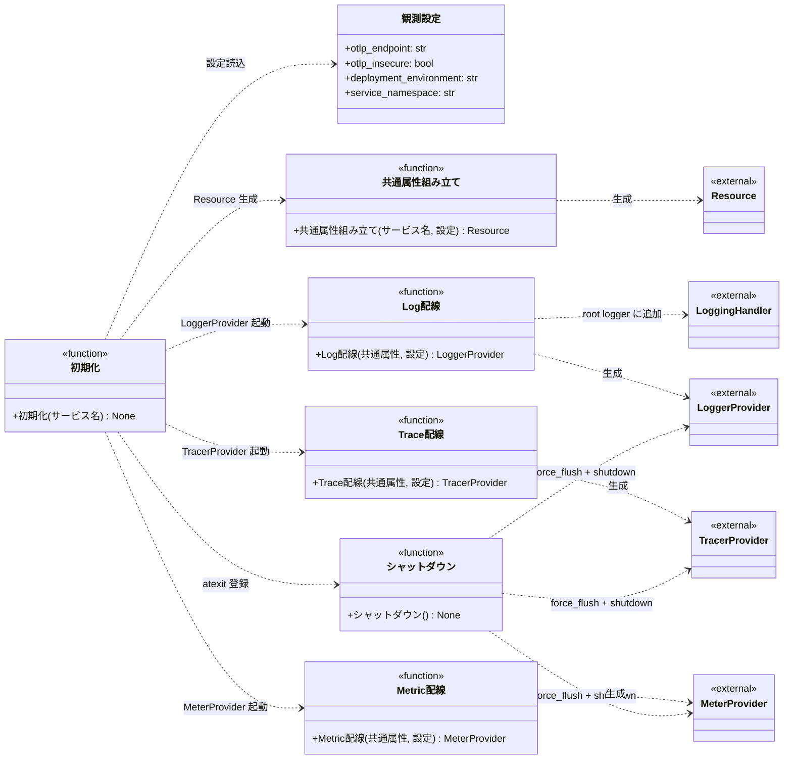

# モジュール構成: 観測 / OTel初期化

`OTel初期化` ドメイン（観測側）に属する構成要素詳細。
常駐プロセスの composition root から起動時に 1 回だけ呼ばれ、[OpenTelemetry Python SDK](../../../外部ライブラリ/opentelemetry.md) の Log / Trace / Metric 各 Provider を OTel Collector（OTLP gRPC 4317）向けに配線する。

## 一覧

| ユースケース | 役割 | コンテナ | 種別 | 名前 | 概要 | 補足 |
| --- | --- | --- | --- | --- | --- | --- |
| 共通 | 設定 | `observability/settings.py` | データモデル | [`ObservabilitySettings`](#観測設定) | OTLP 送信先・環境名を型安全に読む Pydantic Settings | 環境変数 `AI_MONITOR_OTEL_*` から読む |
| 共通 | 初期化 | `observability/otel.py` | 関数 | [`configure`](#初期化) | Resource / 3 Provider を組み立て `logging` の root にハンドラを追加する | プロセス起動時に 1 回呼ぶ |
| 共通 | シャットダウン | `observability/otel.py` | 関数 | [`shutdown`](#シャットダウン) | 3 Provider の `force_flush` + `shutdown` を呼ぶ | [`configure`](#初期化) が `atexit` に登録する |
| 共通 | 内部処理 | `observability/otel.py` | 関数 | [`_build_resource`](#共通属性組み立て) | `service.name` / `service.namespace` / `deployment.environment` を持つ [`Resource`](../../../外部ライブラリ/opentelemetry.md#resource) を作る | - |
| 共通 | 内部処理 | `observability/otel.py` | 関数 | [`_configure_logs`](#log-配線) | [`LoggerProvider`](../../../外部ライブラリ/opentelemetry.md#loggerprovider) + [`BatchLogRecordProcessor`](../../../外部ライブラリ/opentelemetry.md#batchlogrecordprocessor) + [`OTLPLogExporter`](../../../外部ライブラリ/opentelemetry.md#otlplogexporter) を配線し `logging` の root にハンドラを追加する | - |
| 共通 | 内部処理 | `observability/otel.py` | 関数 | [`_configure_traces`](#trace-配線) | [`TracerProvider`](../../../外部ライブラリ/opentelemetry.md#tracerprovider) + [`BatchSpanProcessor`](../../../外部ライブラリ/opentelemetry.md#batchspanprocessor) + [`OTLPSpanExporter`](../../../外部ライブラリ/opentelemetry.md#otlpspanexporter) を配線する | 現状 Collector 側で破棄。将来 Tempo に差し替える |
| 共通 | 内部処理 | `observability/otel.py` | 関数 | [`_configure_metrics`](#metric-配線) | [`MeterProvider`](../../../外部ライブラリ/opentelemetry.md#meterprovider) + [`PeriodicExportingMetricReader`](../../../外部ライブラリ/opentelemetry.md#periodicexportingmetricreader) + [`OTLPMetricExporter`](../../../外部ライブラリ/opentelemetry.md#otlpmetricexporter) を配線する | 現状 Collector 側で破棄。将来 Prometheus に差し替える |

## ディレクトリ構成

```
src/ai_monitor/observability/
├── __init__.py       # configure / shutdown を公開
├── otel.py           # configure / shutdown / _build_resource / _configure_logs / _configure_traces / _configure_metrics
└── settings.py       # ObservabilitySettings
```

呼び出し元はモニターの composition root だけで、`configure("monitor")` を 1 回呼ぶ。

## 構成図



## 観測設定
> 物理名: `ObservabilitySettings`<br>
> 種別: データモデル<br>
> コンテナ: `observability/settings.py`

OTLP 送信先・環境名を環境変数から型安全に読む Pydantic Settings（`pydantic_settings.BaseSettings`・`env_prefix="AI_MONITOR_OTEL_"`）。
[`configure`](#初期化) の内部で 1 回だけインスタンス化される。

### プロパティ

| 論理名 | プロパティ名 | 型 | 可視性 | デフォルト | 説明 | 例 | 補足 |
| --- | --- | --- | --- | --- | --- | --- | --- |
| OTLP エンドポイント | `otlp_endpoint` | `str` | 公開 | `"http://localhost:4317"` | Collector の OTLP gRPC 受付 URL | `"http://otel-collector:4317"` | 環境変数 `AI_MONITOR_OTEL_OTLP_ENDPOINT`。同一ホストの otel-collector を既定 |
| TLS 無効 | `otlp_insecure` | `bool` | 公開 | `True` | TLS を無効化するか | `True` | 環境変数 `AI_MONITOR_OTEL_OTLP_INSECURE`。ローカル Compose 内は `True` |
| 環境名 | `deployment_environment` | `Literal["dev", "staging", "prod"]` | 公開 | `"dev"` | `deployment.environment` Resource 属性の値 | `"prod"` | 環境変数 `AI_MONITOR_OTEL_DEPLOYMENT_ENVIRONMENT`。Grafana Loki のフィルタキーになる |
| サービス空間 | `service_namespace` | `str` | 公開 | `"ai-monitor"` | `service.namespace` Resource 属性の値 | `"ai-monitor"` | 環境変数 `AI_MONITOR_OTEL_SERVICE_NAMESPACE`。監視対象プロジェクトが増えても本値は固定 |

### メソッド

なし

### 単体テスト

なし

## `observability/otel.py`
> 種別: ファイル

OpenTelemetry SDK の Provider（Logs / Traces / Metrics）を配線する初期化 / 停止関数ファイル。

---

### 初期化
> 物理名: `configure`<br>
> 種別: 関数

常駐プロセスの composition root（[エージェント組み立て](../モニター/エージェント管理.py.md#エージェント組み立て) の直前）で 1 回だけ呼ぶ。
[`ObservabilitySettings`](#観測設定) を読み、[共通属性組み立て](#共通属性組み立て) → [Log 配線](#log-配線) → [Trace 配線](#trace-配線) → [Metric 配線](#metric-配線) を順に実行し、[シャットダウン](#シャットダウン) を `atexit` に登録する。

#### 引数

| 論理名 | 引数名 | 型 | 必須 | デフォルト | 説明 | 補足 |
| --- | --- | --- | --- | --- | --- | --- |
| サービス名 | `service_name` | `str` | ✅ | - | Resource の `service.name` に載せるプロセス識別名 | 例: `"monitor"` / `"github-mcp"`。Grafana Loki の Stream Selector の主キー |

引数例:

```python
configure("monitor")
```

#### 戻り値

| 型 | 説明 | 補足 |
| --- | --- | --- |
| `None` | なし | 副作用: グローバルな Provider の差し替え + `logging` の root ハンドラ追加 + `atexit` 登録 |

#### 処理

1. [`ObservabilitySettings`](#観測設定) をインスタンス化して設定値を得る
2. [共通属性組み立て](#共通属性組み立て) に `service_name` と設定を渡して [`Resource`](../../../外部ライブラリ/opentelemetry.md#resource) を得る
3. [Log 配線](#log-配線) に共通属性と設定を渡して LoggerProvider を起動する
4. [Trace 配線](#trace-配線) に共通属性と設定を渡して TracerProvider を起動する
5. [Metric 配線](#metric-配線) に共通属性と設定を渡して MeterProvider を起動する
6. [シャットダウン](#シャットダウン) を `atexit.register` に登録する

#### 例外

なし

#### 単体テスト

セットアップ:

| セットアップ | 説明 | 補足 |
| --- | --- | --- |
| 環境変数 `AI_MONITOR_OTEL_OTLP_ENDPOINT` / `AI_MONITOR_OTEL_OTLP_INSECURE` / `AI_MONITOR_OTEL_DEPLOYMENT_ENVIRONMENT` の設定 | 各テストで monkeypatch.setenv で最小値を投入し、テスト終了時に自動 unset | `otel_stub` fixture でグローバル Provider を初期化する |
| Mock（本ファイルの全テスト共通） | 3 種の OTLP Exporter・バッチ Processor / MetricReader・`atexit.register` をスタブに差し替え | プロセス外への送信と送出スレッドを発生させない |

| テスト名 | 正常/異常 | 概要 | 条件 | Mock | 期待値 | 補足 |
| --- | --- | --- | --- | --- | --- | --- |
| `test_configure` | 正常 | 3 Provider 起動 + root ハンドラ追加 + atexit 登録 | `service_name="monitor"` で呼び出し | `atexit.register` / `set_logger_provider` / `trace.set_tracer_provider` / `metrics.set_meter_provider` | 各 setter が Provider を受けて呼ばれ・root logger の handlers に `LoggingHandler` が 1 つ増え・`atexit.register` が [シャットダウン](#シャットダウン) を受けて呼ばれる | Provider は SDK 提供物をそのまま組む |
| `test_configure_when_reads_env` | 正常 | 設定を環境変数から読む | `AI_MONITOR_OTEL_OTLP_ENDPOINT=http://collector:4317` / `AI_MONITOR_OTEL_DEPLOYMENT_ENVIRONMENT=prod` を投入して呼ぶ | monkeypatch.setenv | 起動した [`OTLPLogExporter`](../../../外部ライブラリ/opentelemetry.md#otlplogexporter) の `endpoint` に環境変数の値が渡り、[`Resource`](../../../外部ライブラリ/opentelemetry.md#resource) の `deployment.environment` が `"prod"` | 分岐は無い（環境変数の反映確認） |

---

### シャットダウン
> 物理名: `shutdown`<br>
> 種別: 関数

3 Provider に対して `force_flush` + `shutdown` を順に呼ぶ。
[`configure`](#初期化) が `atexit` に登録するため、通常のプロセス終了時に自動実行される。
明示的なシャットダウン（テスト後の後片付け・シグナルハンドラ 等）から直接呼ぶことも可能。

#### 引数

なし

引数例:

```python
shutdown()
```

#### 戻り値

| 型 | 説明 | 補足 |
| --- | --- | --- |
| `None` | なし | 副作用: バッファ済み telemetry の Collector への送出 + Provider 内リソースの解放 |

#### 処理

1. [Log 配線](#log-配線) が保持した LoggerProvider の `force_flush()` → `shutdown()` を呼ぶ（未生成なら何もしない）
2. [Trace 配線](#trace-配線) が保持した TracerProvider の `force_flush()` → `shutdown()` を呼ぶ（未生成なら何もしない）
3. [Metric 配線](#metric-配線) が保持した MeterProvider の `force_flush()` → `shutdown()` を呼ぶ（未生成なら何もしない）

#### 例外

なし

#### 単体テスト

| テスト名 | 正常/異常 | 概要 | 条件 | Mock | 期待値 | 補足 |
| --- | --- | --- | --- | --- | --- | --- |
| `test_shutdown` | 正常 | 3 Provider に対する flush + shutdown | [`configure`](#初期化) を呼んだ後に本関数を呼ぶ | `set_logger_provider` / `trace.set_tracer_provider` / `metrics.set_meter_provider` に差し込むスタブ Provider | 各 Provider の `force_flush` / `shutdown` が 1 回ずつ呼ばれる | - |
| `test_shutdown_when_uninitialized` | 正常 | Provider 未初期化でも例外を投げない | [`configure`](#初期化) を呼ばずに本関数を呼ぶ | なし | 例外なく戻る | プロセス起動失敗時の `atexit` からの呼び出しを想定 |

---

### 共通属性組み立て
> 物理名: `_build_resource`<br>
> 種別: 関数

引数のサービス名と [`ObservabilitySettings`](#観測設定) から [`Resource`](../../../外部ライブラリ/opentelemetry.md#resource) を作る内部ヘルパー。

#### 引数

| 論理名 | 引数名 | 型 | 必須 | デフォルト | 説明 | 補足 |
| --- | --- | --- | --- | --- | --- | --- |
| サービス名 | `service_name` | `str` | ✅ | - | `service.name` に載せる値 | [`configure`](#初期化) の引数がそのまま渡る |
| 設定 | `settings` | [`ObservabilitySettings`](#観測設定) | ✅ | - | `service.namespace` / `deployment.environment` の値の出所 | - |

引数例:

```python
_build_resource("monitor", ObservabilitySettings())
```

#### 戻り値

| 型 | 説明 | 補足 |
| --- | --- | --- |
| [`Resource`](../../../外部ライブラリ/opentelemetry.md#resource) | 共通属性を持つ Resource | Log / Trace / Metric の 3 Provider に共有される |

戻り値例:

```python
Resource(attributes={
    "service.name": "monitor",
    "service.namespace": "ai-monitor",
    "deployment.environment": "dev",
})
```

#### 処理

1. `service.name` / `service.namespace` / `deployment.environment` を持つ属性辞書を組み立てる
2. [`Resource.create()`](../../../外部ライブラリ/opentelemetry.md#resource) に属性辞書を渡して戻り値を返す

#### 例外

なし

#### 単体テスト

| テスト名 | 正常/異常 | 概要 | 条件 | Mock | 期待値 | 補足 |
| --- | --- | --- | --- | --- | --- | --- |
| `test_build_resource` | 正常 | 3 属性を持つ Resource 生成 | `service_name="github-mcp"` + `service_namespace="ai-monitor"` + `deployment_environment="prod"` の設定 | なし | 戻り値の `attributes` が `{service.name: "github-mcp", service.namespace: "ai-monitor", deployment.environment: "prod"}` を含む | - |

---

### Log 配線
> 物理名: `_configure_logs`<br>
> 種別: 関数

[`LoggerProvider`](../../../外部ライブラリ/opentelemetry.md#loggerprovider) + [`BatchLogRecordProcessor`](../../../外部ライブラリ/opentelemetry.md#batchlogrecordprocessor) + [`OTLPLogExporter`](../../../外部ライブラリ/opentelemetry.md#otlplogexporter) を配線し、Python 標準 `logging` の root logger に [`LoggingHandler`](../../../外部ライブラリ/opentelemetry.md#logginghandler) を追加する。

#### 引数

| 論理名 | 引数名 | 型 | 必須 | デフォルト | 説明 | 補足 |
| --- | --- | --- | --- | --- | --- | --- |
| 共通属性 | `resource` | [`Resource`](../../../外部ライブラリ/opentelemetry.md#resource) | ✅ | - | LoggerProvider に渡す Resource | [共通属性組み立て](#共通属性組み立て) の戻り値 |
| 設定 | `settings` | [`ObservabilitySettings`](#観測設定) | ✅ | - | Exporter の endpoint / insecure の値の出所 | - |

引数例:

```python
_configure_logs(resource, ObservabilitySettings())
```

#### 戻り値

| 型 | 説明 | 補足 |
| --- | --- | --- |
| `None` | なし | 副作用: グローバル LoggerProvider の差し替え + root logger の handlers に `LoggingHandler`（`opentelemetry` 配下を除外するフィルタ付き）を 1 つ追加 + root logger のレベルを INFO に設定 |

#### 処理

1. [`OTLPLogExporter`](../../../外部ライブラリ/opentelemetry.md#otlplogexporter) を設定の `otlp_endpoint` / `otlp_insecure` で組み立てる
2. [`BatchLogRecordProcessor`](../../../外部ライブラリ/opentelemetry.md#batchlogrecordprocessor) に Exporter を渡して組み立てる
3. [`LoggerProvider`](../../../外部ライブラリ/opentelemetry.md#loggerprovider) を Resource から組み立て、Processor を `add_log_record_processor` で登録する
4. `set_logger_provider(provider)` でグローバル Provider に登録する
5. [`LoggingHandler`](../../../外部ライブラリ/opentelemetry.md#logginghandler) を `level=logging.INFO` + `logger_provider=provider` で組み立てる
6. `opentelemetry` 配下のロガーのレコードを転送対象から外すフィルタをハンドラに追加する（送信失敗時に SDK 自身が出すログを再び送信しようとする再帰を避ける）
7. ハンドラを `logging.getLogger()` の root に `addHandler` し、root logger のレベルを `logging.INFO` に設定する

#### 例外

なし

#### 単体テスト

| テスト名 | 正常/異常 | 概要 | 条件 | Mock | 期待値 | 補足 |
| --- | --- | --- | --- | --- | --- | --- |
| `test_configure_logs` | 正常 | LoggerProvider 起動 + root ハンドラ追加 | 有効な Resource + 設定を渡す | `set_logger_provider` | `set_logger_provider` が LoggerProvider を受けて呼ばれ・root logger の handlers に `LoggingHandler` が 1 つ増え・root logger のレベルが `INFO` になる | - |
| `test_configure_logs_when_endpoint_overridden` | 正常 | Exporter が設定の endpoint を受ける | `otlp_endpoint="http://collector:4317"` の設定を渡す | `set_logger_provider` + `OTLPLogExporter` の `__init__` をスパイ | `OTLPLogExporter.__init__` の `endpoint` 引数が `"http://collector:4317"` | 環境変数からの反映は [`configure`](#初期化) 側の責任なのでここでは設定オブジェクト経由で確認 |
| `test_configure_logs_when_sdk_logger` | 正常 | SDK 自身のログを転送対象から外す | `opentelemetry.exporter.otlp.proto.grpc.exporter` 名義のレコードを流す | `set_logger_provider` | 追加したハンドラのフィルタがそのレコードを落とし、業務ロガーのレコードは通す | - |

---

### Trace 配線
> 物理名: `_configure_traces`<br>
> 種別: 関数

[`TracerProvider`](../../../外部ライブラリ/opentelemetry.md#tracerprovider) + [`BatchSpanProcessor`](../../../外部ライブラリ/opentelemetry.md#batchspanprocessor) + [`OTLPSpanExporter`](../../../外部ライブラリ/opentelemetry.md#otlpspanexporter) を配線する。
現状 Collector 側は debug exporter に流して破棄する構成のため実効性は無いが、将来 Tempo を追加した際に SDK 側の変更ゼロで有効化できるよう pipeline を用意しておく。

#### 引数

| 論理名 | 引数名 | 型 | 必須 | デフォルト | 説明 | 補足 |
| --- | --- | --- | --- | --- | --- | --- |
| 共通属性 | `resource` | [`Resource`](../../../外部ライブラリ/opentelemetry.md#resource) | ✅ | - | TracerProvider に渡す Resource | [共通属性組み立て](#共通属性組み立て) の戻り値 |
| 設定 | `settings` | [`ObservabilitySettings`](#観測設定) | ✅ | - | Exporter の endpoint / insecure の値の出所 | - |

引数例:

```python
_configure_traces(resource, ObservabilitySettings())
```

#### 戻り値

| 型 | 説明 | 補足 |
| --- | --- | --- |
| `None` | なし | 副作用: グローバル TracerProvider の差し替え |

#### 処理

1. [`OTLPSpanExporter`](../../../外部ライブラリ/opentelemetry.md#otlpspanexporter) を設定の `otlp_endpoint` / `otlp_insecure` で組み立てる
2. [`BatchSpanProcessor`](../../../外部ライブラリ/opentelemetry.md#batchspanprocessor) に Exporter を渡して組み立てる
3. [`TracerProvider`](../../../外部ライブラリ/opentelemetry.md#tracerprovider) を Resource から組み立て、Processor を `add_span_processor` で登録する
4. `trace.set_tracer_provider(provider)` でグローバル Provider に登録する

#### 例外

なし

#### 単体テスト

| テスト名 | 正常/異常 | 概要 | 条件 | Mock | 期待値 | 補足 |
| --- | --- | --- | --- | --- | --- | --- |
| `test_configure_traces` | 正常 | TracerProvider 起動 | 有効な Resource + 設定を渡す | `trace.set_tracer_provider` | `set_tracer_provider` が TracerProvider を受けて呼ばれる | - |
| `test_configure_traces_when_endpoint_overridden` | 正常 | Exporter が設定の endpoint を受ける | `otlp_endpoint="http://collector:4317"` の設定を渡す | `trace.set_tracer_provider` + `OTLPSpanExporter` の `__init__` をスパイ | `OTLPSpanExporter.__init__` の `endpoint` 引数が `"http://collector:4317"` | - |

---

### Metric 配線
> 物理名: `_configure_metrics`<br>
> 種別: 関数

[`MeterProvider`](../../../外部ライブラリ/opentelemetry.md#meterprovider) + [`PeriodicExportingMetricReader`](../../../外部ライブラリ/opentelemetry.md#periodicexportingmetricreader) + [`OTLPMetricExporter`](../../../外部ライブラリ/opentelemetry.md#otlpmetricexporter) を配線する。
現状 Collector 側は debug exporter に流して破棄する構成のため実効性は無いが、将来 Prometheus を追加した際に SDK 側の変更ゼロで有効化できるよう pipeline を用意しておく。

#### 引数

| 論理名 | 引数名 | 型 | 必須 | デフォルト | 説明 | 補足 |
| --- | --- | --- | --- | --- | --- | --- |
| 共通属性 | `resource` | [`Resource`](../../../外部ライブラリ/opentelemetry.md#resource) | ✅ | - | MeterProvider に渡す Resource | [共通属性組み立て](#共通属性組み立て) の戻り値 |
| 設定 | `settings` | [`ObservabilitySettings`](#観測設定) | ✅ | - | Exporter の endpoint / insecure の値の出所 | - |

引数例:

```python
_configure_metrics(resource, ObservabilitySettings())
```

#### 戻り値

| 型 | 説明 | 補足 |
| --- | --- | --- |
| `None` | なし | 副作用: グローバル MeterProvider の差し替え |

#### 処理

1. [`OTLPMetricExporter`](../../../外部ライブラリ/opentelemetry.md#otlpmetricexporter) を設定の `otlp_endpoint` / `otlp_insecure` で組み立てる
2. [`PeriodicExportingMetricReader`](../../../外部ライブラリ/opentelemetry.md#periodicexportingmetricreader) に Exporter を渡して組み立てる
3. [`MeterProvider`](../../../外部ライブラリ/opentelemetry.md#meterprovider) を Resource と `metric_readers=[reader]` から組み立てる
4. `metrics.set_meter_provider(provider)` でグローバル Provider に登録する

#### 例外

なし

#### 単体テスト

| テスト名 | 正常/異常 | 概要 | 条件 | Mock | 期待値 | 補足 |
| --- | --- | --- | --- | --- | --- | --- |
| `test_configure_metrics` | 正常 | MeterProvider 起動 | 有効な Resource + 設定を渡す | `metrics.set_meter_provider` | `set_meter_provider` が MeterProvider を受けて呼ばれる | - |
| `test_configure_metrics_when_endpoint_overridden` | 正常 | Exporter が設定の endpoint を受ける | `otlp_endpoint="http://collector:4317"` の設定を渡す | `metrics.set_meter_provider` + `OTLPMetricExporter` の `__init__` をスパイ | `OTLPMetricExporter.__init__` の `endpoint` 引数が `"http://collector:4317"` | - |

### 補足

- 依存パッケージは `pyproject.toml` で宣言する（`opentelemetry-sdk` / `opentelemetry-exporter-otlp-proto-grpc` / `opentelemetry-instrumentation-logging` / `pydantic-settings`）。
- モニターの composition root（[`main`](../モニター/エージェント管理.py.md#エージェント組み立て) の直前）で `configure("monitor")` を呼ぶ。
  MCP サーバーは同一プロセスで動くため、この 1 回が両方をまかなう。
  `service.namespace="ai-monitor"` は Grafana Loki 側の `{service_namespace="ai-monitor"}` 横断検索に使う。
- Log は Collector の Loki exporter を通って Loki に届く。
  `service.name` / `service.namespace` / `deployment.environment` を Loki の Stream Selector で使いたいので、Collector 側の `resource` processor で `loki.resource.labels` に列挙する（Collector 側のラベル昇格設定は observability リポジトリが持つ）。
- Trace / Metric は Collector の debug exporter に流して破棄する。
  将来 Tempo / Prometheus を追加する際は Collector の `service.pipelines.traces.exporters` / `metrics.exporters` を差し替えるだけで、本モジュール側は変更不要。
- 短命な inject / hook スクリプトは本モジュールを呼ばない。
  `BatchLogRecordProcessor` は 5 秒間隔でフラッシュするため、100ms オーダーで終了する短命プロセスでは初期化コストと flush 待ち（`atexit` から呼ばれる `shutdown` で最大 10 秒待つ）が割に合わない。
  標準出力に流したまま親プロセス（Claude Code / モニター）側で拾う。
